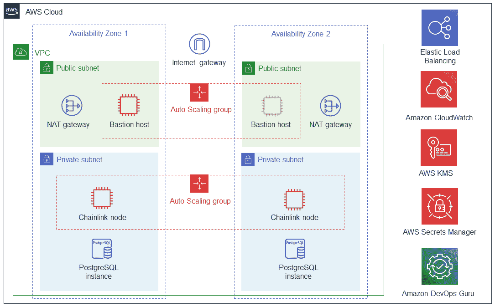

# 数据提供商、企业和开发者现在可以使用新的亚马逊网络服务(AWS) Chainlink Quickstart 向任何区块链出售数据

> 原文：<https://blog.chain.link/announcing-the-aws-chainlink-quickstart/>

作为 Chainlink 节点基础设施持续扩张的一部分，我们很高兴与亚马逊网络服务(AWS)合作，为数据提供商、企业和开发者简化流程。借助新推出的[AWS chain link quick start](https://aws.amazon.com/quickstart/architecture/chainlink-node/)，运营商现在可以通过一键工作流程轻松在 AWS 上部署 Chainlink oracle 节点，并在多个区块链网络上销售真实数据。

通过 AWS Chainlink Quickstart，数据提供商可以在众多公共和私有区块链环境中同时销售其数据和 API，而无需任何区块链经验。此外，DevOps 团队、传统企业、电信公司、个人开发人员和 Dao 可以立即启动自己的 Chainlink 节点，为区块链应用程序或代表数据提供商客户提供 oracle 服务。AWS 独特的工作流程为所有细分市场的数据提供商和节点运营商提供支持，并通过让他们直接访问任何新兴的区块链网络，帮助他们轻松发展其目标市场。

在本文中，我们将介绍数据提供商、企业和 DevOps 团队启动 Chainlink 节点的机会，深入研究通过 AWS Chainlink Quickstart 部署的基础架构，并提供在几分钟内在 AWS 上启动 Chainlink 节点的技术演练。如果你是一名数据提供者，并想了解更多关于通过 AWS 实现区块链的信息，请参考以下文档:[https://AWS-quick start . github . io/quick start-chainlinklabs-chain link-node/](https://aws-quickstart.github.io/quickstart-chainlinklabs-chainlink-node/)

## 为什么数据和 API 对区块链应用至关重要

与互联网从电子邮件到万维网的演变类似，区块链(共享后端计算和数据库基础设施)正在从纯粹支持新形式的分散资金过渡到现在能够实现更多防篡改、可靠和高效的多方业务流程自动化。区块链应用发展的关键驱动力是 [混合智能合约](https://blog.chain.link/hybrid-smart-contracts-explained/)——运行在区块链之上的数据驱动的业务逻辑，可以从非区块链数据提供商和传统系统接收输入并向其发送输出，以及利用高级链外计算实现可扩展性和隐私增强。

几乎所有混合智能合约应用都需要外部数据和 API 来利用现实世界的价值，这使得对混合智能合约基础设施的支持对于所有传统数据和服务提供商来说至关重要。无论是触发 [DeFi 智能合约](https://chain.link/education/defi) 的金融市场数据，自动化区块链供应链的物联网数据，还是解决分散预测市场的电子竞技结果，在不断增长的混合智能合约经济中，数据提供商有大量且不断增长的机会来将他们的 API 货币化。

Chainlink 是一个分散的 oracle 网络，用作防篡改区块链中间件，支持 API 和区块链网络之间的数据传输，以及一个安全框架，确保 API 数据在自动执行高价值应用程序时高度可靠。Chainlink 是应用最广泛的 [区块链甲骨文](https://chain.link/education/blockchain-oracles) 解决方案，提供高质量的金融市场数据支持分散金融(DeFi)的增长空间。许多数据提供商已经在使用 Chainlink 向智能合约应用程序出售数据，例如为参数作物保险提供天气数据，为预测市场提供选举结果，为期权合约提供市场分析，为令牌化的现实世界资产提供豪华汽车基准，等等。此外，越来越多的企业和 DevOps 也在推出 Chainlink 节点，以提供对真实世界数据的智能合约访问。

由于新的 AWS Chainlink Quickstart 消除了所有技术复杂性，现在进入混合智能合同经济更加容易。

## 通往整个区块链的唯一门户

AWS Chainlink Quickstart 是一个特殊的工作流，它为数据提供商提供了一个面向未来的区块链采用策略:一键访问任何新的或现有的区块链，包括公共和私有链。该框架可以快速将任何数据提供商的 API 直接映射到 Chainlink 节点，使他们能够加密签署自己的数据，将其广播到区块链，并直接出售给智能合约。这使得数据提供商可以通过无缝扩展到区块链生态系统中，从他们的 API 中获得额外的收入流，并通过新的数据签名功能提高他们数据的可靠性，这些功能最终证明数据直接来自特定的 API。


<figcaption id="caption-attachment-2793" class="wp-caption-text">The AWS Chainlink Quickstart gives data providers a single gateway to all blockchains.</figcaption>


AWS Chainlink Quickstart 还支持 Chainlink 现有的节点运营商以及加入 Chainlink 生态系统的新企业和开发运维团队快速构建对新 oracle 作业的支持。这种设置对于利用 AWS 中的 API 的节点操作者特别有用，AWS 中已经包含了许多高级数据提供者和 API 服务。对新 API 具有流畅支持的 Chainlink 节点可以将更多的优质数据提供商带入 Chainlink 生态系统，无论是通过启动自己的 Chainlink 节点还是通过现有的节点运营商。

## AWS Chainlink 快速入门架构

[AWS 快速入门](https://aws.amazon.com/quickstart/) 是自动化的参考部署，使用[AWS cloud formation](https://aws.amazon.com/cloudformation/)模板根据 AWS 最佳实践在 AWS 上部署关键技术。 [AWS Chainlink 快速入门参考架构](https://aws.amazon.com/quickstart/architecture/chainlink-node/) 是基于此框架的实现，旨在将部署 Chainlink 节点实例的手动过程减少到几个步骤。结果是一个高度可用和安全的生产 Chainlink 节点环境，只需几分钟即可访问。

使用默认参数部署 AWS Chainlink Quickstart 会在 AWS 云中构建以下 Chainlink 节点环境:

*   跨越两个 [可用性区域](https://aws.amazon.com/about-aws/global-infrastructure/regions_az/) 的高可用性架构。
*   安 [亚马逊虚拟私有云](https://aws.amazon.com/vpc/)【VPC】配置有公有和私有子网。
*   在公共子网:
    *   一个 [互联网网关](https://docs.aws.amazon.com/vpc/latest/userguide/VPC_Internet_Gateway.html) 允许访问互联网。
    *   被管理的 [网络地址转换](https://docs.aws.amazon.com/vpc/latest/userguide/vpc-nat-gateway.html) (NAT)网关允许私有子网中的 Chainlink 节点实例进行出站互联网访问。
    *   一个 [Linux bastion 主机](https://aws.amazon.com/quickstart/architecture/linux-bastion/) 一个 [自动伸缩组](https://docs.aws.amazon.com/autoscaling/ec2/userguide/AutoScalingGroup.html) 允许入站安全 Shell (SSH)访问公共和私有子网中的 [亚马逊弹性计算云](https://aws.amazon.com/ec2/)【EC2】实例。
*   私有子网中:
    *   一个自动缩放组中的两个 [链环节点](https://docs.chain.link/chainlink-nodes/) 。
    *   一个 [亚马逊关系数据库服务](https://aws.amazon.com/rds/) (亚马逊 RDS) PostgreSQL 托管数据库实例。
*   [安全组](https://docs.aws.amazon.com/vpc/latest/userguide/VPC_SecurityGroups.html) 进行细粒度的入站访问控制。
*   [](https://aws.amazon.com/elasticloadbalancing/?whats-new-cards-elb.sort-by=item.additionalFields.postDateTime&whats-new-cards-elb.sort-order=desc)【ELB】弹性负载均衡访问 Chainlink node web 图形用户界面。
*   [亚马逊云观察](https://aws.amazon.com/cloudwatch/)chain link 节点活动的日志记录。
*   [AWS 密钥管理服务](https://aws.amazon.com/kms/) (KMS)针对 AWS 托管密钥和客户托管密钥针对资源。
*   [AWS Secrets Manager](https://aws.amazon.com/secrets-manager/)用于存储和保护 Chainlink 节点凭证。
*   [亚马逊 DevOps 大师](https://aws.amazon.com/devops-guru/) 使用机器学习跟踪 Chainlink 节点栈。



<figcaption id="caption-attachment-2796" class="wp-caption-text">AWS Chainlink Quickstart Infrastructure Overview</figcaption>


## 配置要求

在启动 AWS Chainlink Quickstart 之前，使用模板部署的资源的 [AWS 身份和访问管理](https://aws.amazon.com/iam/) (IAM)权限登录 [AWS 管理控制台](https://aws.amazon.com/console/) 。确保您的 AWS 帐户配置正确，并且能够访问上面列出的所需资源。IAM 中的 *管理员访问* 托管策略提供了足够的权限，尽管您的组织可能会选择使用具有更多限制的自定义策略。

接下来，在您首选的 AWS 地区使用 [亚马逊证书管理器](https://aws.amazon.com/certificate-manager/) 创建一个 [密钥对](https://docs.aws.amazon.com/AWSEC2/latest/UserGuide/ec2-key-pairs.html) 和公共证书。运行区块链客户端或使用第三方客户端来运行您希望 Chainlink 节点支持的区块链网络。在第三方以太坊客户端的情况下，可以使用来自[in fura](https://infura.io/docs/ethereum/wss/introduction.md)或[Fiews](https://docs.fiews.io/docs/getting-started)的 websocket 端点。对于其他以太坊客户端，访问 [运行一个以太坊客户端](https://docs.chain.link/docs/run-an-ethereum-client/) 。

AWS Chainlink quick start 为团队提供了两种部署选项，包括将 chain link 节点部署到新的 VPC 或部署到现有的 VPC。

*   **将链环节点部署成新的 VPC** 。该选项构建了一个新的 AWS 环境，包括 VPC、子网、NAT 网关、安全组、堡垒主机和其他基础设施组件。然后，它将 Chainlink 节点部署到这个新的 VPC 中。
*   **将 Chainlink 节点部署到现有的 VPC** 中。该选项在您现有的 AWS 基础设施中提供一个 Chainlink 节点。确保您的 VPC 在不同的可用性区域中有两个专用子网。这些子网在其路由表中需要 NAT 网关，以允许实例与其他 Chainlink 节点通信，而不会将它们暴露给 internet。

AWS chain link 快速入门为这些选项提供了单独的模板。它还允许您配置 [无类域间路由](https://docs.aws.amazon.com/vpc/latest/userguide/VPC_Subnets.html#:~:text=Classless%20Inter-Domain%20Routing)【CIDR】块、实例类型和链接节点设置。完成这些步骤后，您就可以开始部署过程了。

## 部署步骤

登录到您的 [AWS 帐户](https://console.aws.amazon.com/console/home) 并使用导航栏中的区域选择器选择您想要部署 Chainlink 节点的 AWS 区域。模板默认在 us-east-1 地区启动，但是该参数可以根据需要更改为 [其他地区](https://docs.aws.amazon.com/AWSEC2/latest/UserGuide/using-regions-availability-zones.html#:~:text=for%20a%20resource-,Available%20Regions,-Your%20account%20determines) 。接下来，选择以下选项之一启动[AWS cloud formation](https://aws.amazon.com/cloudformation/)模板。

[将 Chainlink 节点部署到 AWS 上的新 VPC](https://signin.aws.amazon.com/signin?redirect_uri=https%3A%2F%2Fconsole.aws.amazon.com%2Fcloudformation%2Fhome%3Fregion%3Dus-east-1%26state%3DhashArgs%2523%252Fstacks%252Fnew%253FstackName%253Dchainlink-node%2526templateURL%253Dhttps%253A%252F%252Faws-quickstart.s3.us-east-1.amazonaws.com%252Fquickstart-chainlinklabs-chainlink-node%252Ftemplates%252Fquickstart-chainlink-node-entrypoint.template.yaml%26isauthcode%3Dtrue&client_id=arn%3Aaws%3Aiam%3A%3A015428540659%3Auser%2Fcloudformation&forceMobileApp=0&code_challenge=sjmxmfm6uohYtVa3_Yc3mwCB6ljcHumL0eJq8pkuMPI&code_challenge_method=SHA-256)

[将 Chainlink 节点部署到 AWS 上现有的 VPC 中](https://signin.aws.amazon.com/signin?redirect_uri=https%3A%2F%2Fconsole.aws.amazon.com%2Fcloudformation%2Fhome%3Fregion%3Dus-east-1%26state%3DhashArgs%2523%252Fstacks%252Fnew%253FstackName%253Dchainlink-node%2526templateURL%253Dhttps%253A%252F%252Faws-quickstart.s3.us-east-1.amazonaws.com%252Fquickstart-chainlinklabs-chainlink-node%252Ftemplates%252Fquickstart-chainlink-node-workload.template.yaml%26isauthcode%3Dtrue&client_id=arn%3Aaws%3Aiam%3A%3A015428540659%3Auser%2Fcloudformation&forceMobileApp=0&code_challenge=ODqqLJvkpgeN2zQs9HyqfRHPuZAR8AsRyxnVY4J7jIs&code_challenge_method=SHA-256)

在 **创建栈** 页面，保留模板 URL 的默认设置，然后选择 **下一步** 。在 **指定堆栈详细信息** 页面上，根据需要更改堆栈名称，查看模板的参数，并为需要输入的参数提供值。对于所有其他参数，查看默认设置并根据需要进行自定义。除非您正在为自己的部署项目定制快速启动模板，否则请保留标记为 **快速启动 S3 存储桶名称** 、 **快速启动 S3 存储桶区域** 和 **快速启动 S3 密钥前缀** 的参数的默认设置。当您完成查看和定制参数后，选择 **下一个** 。

在 **配置堆栈选项** 页面，您可以 [为您的堆栈中的资源指定标签](https://docs.aws.amazon.com/AWSCloudFormation/latest/UserGuide/aws-properties-resource-tags.html) (键值对)，设置 [高级选项](https://docs.aws.amazon.com/AWSCloudFormation/latest/UserGuide/cfn-console-add-tags.html) ，然后选择 **下一步** 。在 **审核** 页面，审核并确认模板设置。在 **功能** 下，选择两个复选框，确认模板创建 IAM 资源并可能需要自动扩展宏的能力。最后，选择 **创建堆栈** 部署堆栈并监控其状态。当状态为**CREATE _ COMPLETE**时，链环节点部署就绪。要查看创建的资源，请查看堆栈的 **输出** 选项卡中显示的值。

## 部署后步骤

AWS Chainlink quick start 部署流程完成后，您可以通过 web 图形用户界面的两个选项访问 chain link 节点:

1.  如果使用通过 AWS 证书管理器创建的域和 SSL 证书，您可以通过应用程序负载平衡器端点或通过将负载平衡器端点添加到您的域的 DNS 记录来访问 Chainlink 节点 web GUI。
2.  通过在您的 bastion 主机上启用 TCP 端口转发，您能够将 Chainlink node web GUI 端口转发到您的机器。由于 Chainlink 节点是通过 bastion 访问的，因此建议使用 SSH 代理转发。然后用 SSH 代理和 TCP 端口转发连接到您的堡垒。您可以使用以下命令在 [访问 chain link node web GUI http://localhost:6688/](http://localhost:6688/):

```
ssh-add <your_ssh_key>
ssh [[email protected]](/cdn-cgi/l/email-protection)<bastion_host_public_ip> -A -L 6688:localhost:6688
ssh [[email protected]](/cdn-cgi/l/email-protection)<chainlink_node_internal_ip> -L 6688:localhost:6688
```

如果链节节点实例被停止，则新建。环境，。密码还有。需要创建 api 文件来启动 Chainlink 节点。安。可以使用以下命令创建 env 文件:

```
cd /home/ec2-user/.chainlink/ && ./create-env.sh \
${chainNetwork} \
${blockchainNodeUrl} \
${psqlUser} \
$(aws secretsmanager get-secret-value --secret-id DBSecret --query "SecretString" --output text) \
${psqlHostname} \
${psqlPort} \
${psqlDb} 
```

The。可以使用以下命令生成密码文件:

```
cd /home/ec2-user/.chainlink/ && ./create-password.sh \
$(aws secretsmanager get-secret-value --secret-id WalletSecret --query "SecretString" --output text)
```

The。可以使用以下命令生成 api 文件:

```
cd /home/ec2-user/.chainlink/ && ./create-api.sh \
${apiUser} \
$(aws secretsmanager get-secret-value --secret-id ApiSecret --query "SecretString" --output text)
```

如果需要启动 Chainlink 节点 Docker 实例的最新映像，那么可以运行以下命令:

```
latestimage=$(curl -s -S "https://registry.hub.docker.com/v2/repositories/smartcontract/chainlink/tags/" | jq -r '."results"[]["name"]' | head -n 1)
cd /home/ec2-user/.chainlink && docker run -d \
--log-driver=awslogs \
--log-opt awslogs-group=ChainlinkLogs \
--restart unless-stopped \
--name chainlink \
-p 6688:6688 \
-v /home/ec2-user/.chainlink:/chainlink \
--env-file=/home/ec2-user/.chainlink/.env  smartcontract/chainlink:$latestimage local n \
-p /chainlink/.password \
-a /chainlink/.api
```

使用此快速入门模板在 AWS 上部署 Chainlink 节点后，务必遵循最佳安全性和可靠性实践，为 smart contracts 提供可靠的外部数据源。这些方法包括:

*   **故障转移功能** :为了确保停机时间最短，Chainlink 和区块链客户端都需要故障转移功能，这样，如果任何一台服务器中断，服务仍然在线。Amazon EC2 自动缩放组有两个 Chainlink 节点:一个活动 Chainlink 节点和一个备用 Chainlink 节点。来自 Chainlink 和区块链客户端的数据都存储在 PostgreSQL 数据库中，该数据库需要高度可用。
*   **灾难恢复** :为了处理意外情况，需要有正确的流程来确保尽可能少的停机时间。此类事件可能是由于需要重新同步的完全损坏的区块链节点造成的。因此建议执行:
    *   与 Chainlink 节点连接的服务器不同的独立服务器上的受支持区块链的每日快照。
    *   一个区块链客户端启动过程，它拉下链的最新模板并将其同步到最新高度。
*   **主动监控** :问题必须在发生之前或发生时被检测到，这就要求主动监控到位。建议监控的区域包括:
    *   分配给用于支付链上交易费用的节点的钱包地址的最小所需余额。
    *   错误的作业运行。
    *   操作员 UI 端口打开并响应。(通常:6688)
    *   区块链 http 和 websocket 端口要开放并响应。(通常是:8545 & 8546)
    *   区块链客户端磁盘、RAM 和 CPU 使用情况。
*   **配置文件:** 建议删除。环境，。密码还有。api 文件，以防止敏感密码的潜在泄露。

有关最佳实践的更多信息，请访问 AWS 上节点的 [最佳实践](https://docs.chain.link/docs/best-practices-aws/) Chainlink 文档。

## **结论**

Chainlink Labs 很高兴与 AWS 合作，为数据提供商、企业和开发者提供易于集成的节点基础设施，我们也在探索与亚马逊管理的区块链的进一步集成，以简化 Chainlink 节点的部署和管理。这样做可以确保数据提供商可以通过将他们的数据集引入快速新兴的区块链市场来提升其价值，而不必担心任何技术挑战或先前的专业知识。同样，企业和 DevOps 团队可以快速建立新的 Chainlink 节点，并连接到现有的 API，以便提供多链 oracle 服务。最终结果是区块链各地出现了大量的重要数据集，以支持下一波混合智能合同应用。

我们认为数据供应商和 API 提供商有很大的机会使用 Chainlink 来扩展他们的业务模式，并在分散经济和社会系统的未来后端基础设施中发挥重要作用。要了解有关 AWS Chainlink Quickstart 的更多信息，请参考以下文档:[https://AWS . Amazon . com/quick start/architecture/chain link-node/](https://aws.amazon.com/quickstart/architecture/chainlink-node/)

如果你想建立一个电话来深入讨论你的整合， [联系专家](https://chainlinkcommunity.typeform.com/to/OYQO67EF?page=blog) 。您还可以在官方的 Chainlink[Discord](https://discordapp.com/invite/aSK4zew)中提出技术问题，或者关注我们的 [文档](https://docs.chain.link/docs/running-a-chainlink-node) ，了解如何测试和运行 chain link 基础设施。更多信息，请访问 https://chain.link/[](https://chain.link/)。