# Chainlink 在亚洲不断增长的业务

> 原文：<https://blog.chain.link/chainlinks-growing-presence-throughout-asia/>

在过去的几个月里， [Chainlink Labs](https://chainlinklabs.com/) 踏上了穿越中国、韩国、日本和新加坡的多城市之旅，以加速互联智能合同的采用。我们通过增加来自全球的项目集成、数据提供商、节点运营商和开发者，继续扩展和分散 Chainlink 生态系统。我们不仅让新受众了解了去中心化 oracles 的重要性，还通过加入顶级数据提供商，如[币安](https://www.binance.com/en/blog/394373386380349440/Connecting-Binance-Data-to-NextGen-DeFi-Applications-Using-Chainlink-Oracles)、 [Tokenview、](https://medium.com/@420315991/tokenview-chainlink-bring-market-forecast-data-to-smart-contracts-c3e6bae02d80)和 [CoinGecko](https://blog.coingecko.com/coingecko-to-provide-cryptocurrency-market-data-for-chainlink/) ，与新项目如 [Ontology](https://medium.com/ontologynetwork/ontology-partners-with-chainlink-to-bring-data-driven-smart-contracts-to-backend-business-models-9744786691d4) 和 [TomoChain](https://medium.com/tomochain/tomochain-integrates-chainlink-oracles-to-deploy-data-driven-smart-contracts-3e07149a43d5) 进行集成，并整合了几个基于亚洲的节点操作符，扩展了我们在亚洲的业务。此行为 Chainlink 在亚洲智能合约基础设施中的深度整合奠定了基础，并成为 Chainlink 团队和开发人员社区全球扩张的完美蓝图，以满足我们产品的国际需求。

## 新加坡

我们的第一站来到了新加坡，新加坡是亚洲最发达的国家之一，也是区块链兴趣和接受的温床。我们通过参加由 Coindesk 主办的著名区块链会议 Invest: Asia 2019，进一步提高了他们不断增长的 DLT 和企业社区对我们产品的认识。在此次活动中，我们[在主舞台](https://www.youtube.com/watch?v=KTfME0M0og4)上展示了如何将智能合约安全地连接到链外资源，并宣布 Chainlink 将在以太坊主网上推出 7 个新的价格参考数据 Oracle Networks，此外还有已经上线的 ETH/USD 价格参考。

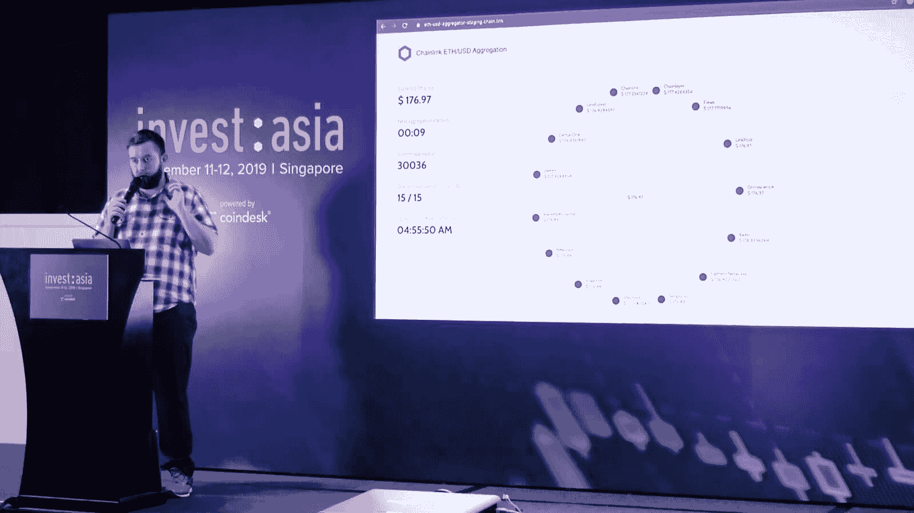

<figcaption id="caption-attachment-516" class="wp-caption-text">Showcasing the full decentralization of our already live ETH/USD Price Reference Data Oracle Network on the mainstage at Invest: Asia 2019</figcaption>

除了 mainstage 演示之外，我们还通过参与一系列采访，详细介绍了 Chainlink 向市场提供的许多现实世界的解决方案。CryptoFinder 进行的一次采访强调了智能合同相对于传统协议的优势，以及如何在现实世界中应用它们。我们还在新加坡 Meetup 与其他区块链项目(包括 Bitgo、Kyber Network、Digix Global、Marlin Protocol 和  RockX)讨论了通过 oracle 支持的链外连接进行智能合约开发的持续发展。

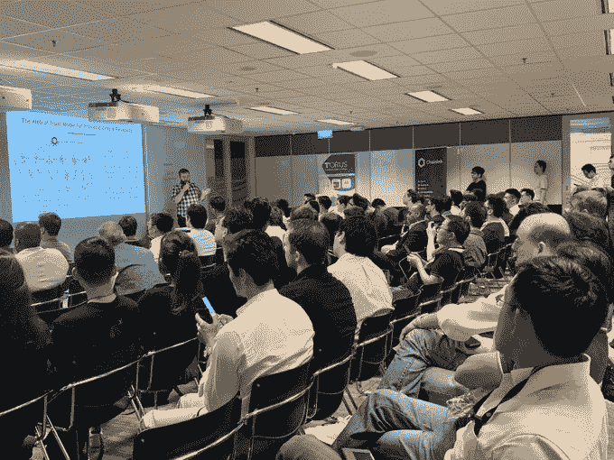

<figcaption id="caption-attachment-517" class="wp-caption-text">Introducing the Web of Trust Model for provable oracle reliability at the Singapore Meetup</figcaption>

## 中国

巡演的下一站是中国，按 GDP 计算，中国是世界第二大经济体。虽然在西方市场看不到，但 Chainlink 已经在中国有了强大的存在，我们有自己的中国团队和不断增长的社区，可以举办聚会，创建/翻译本地化内容，与媒体合作，与中国顶级项目联系，培养开发人员社区等等。

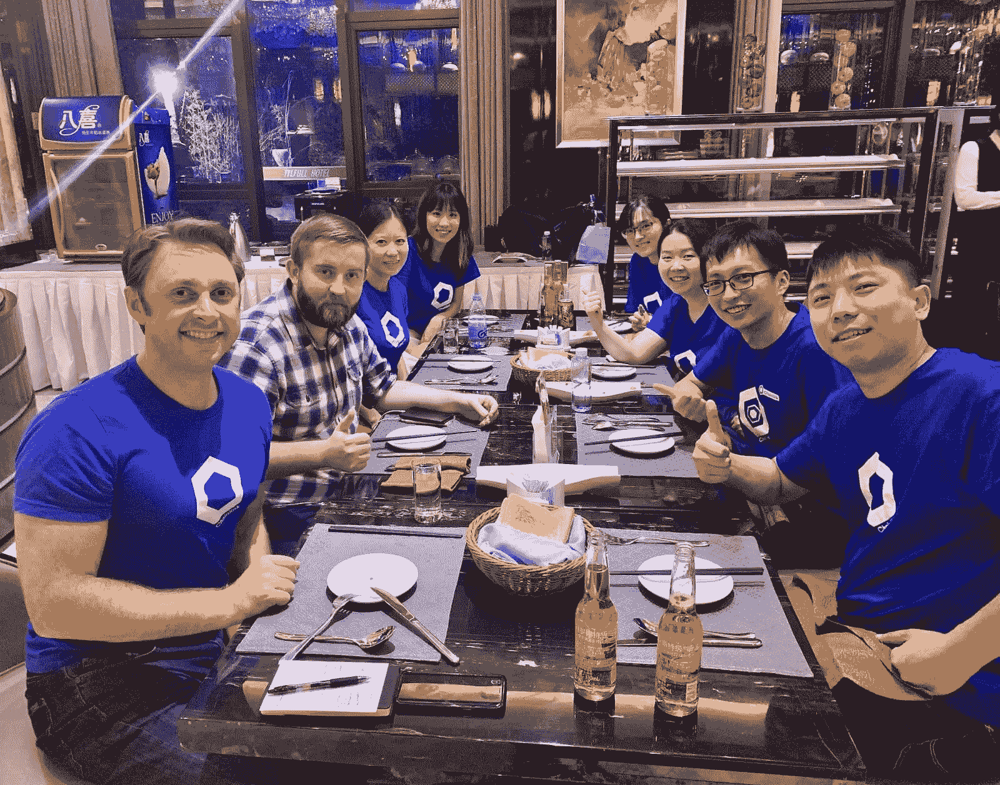

<figcaption id="caption-attachment-518" class="wp-caption-text">Enjoying dinner with the Chinese-based team</figcaption>

在我们逗留的两周时间里，我们参加了中国最大的区块链会议之一，并在三个主要城市举行了聚会。我们的第一个活动是 2019 年上海国际区块链周，Sergey 主持了著名的 [Wanxiang 区块链会议小组讨论](https://www.youtube.com/watch?v=FdiJCvYfVHQ)，其中包括以太坊的 Vitalik Buterin、Cosmos 的 Jae Kwon 和 Oasis Labs 的 Dawn Song。

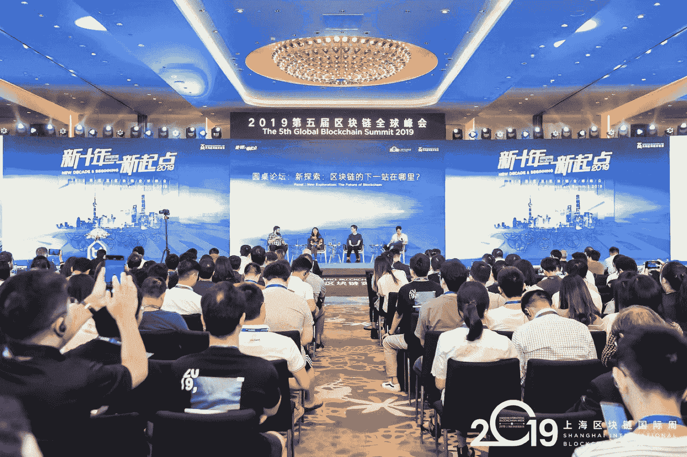

<figcaption id="caption-attachment-519" class="wp-caption-text">Sergey Nazarov hosting a panel discussion at the Wanxiang Blockchain Conference to discuss blockchain adoption, privacy, oracles, and more.</figcaption>

我们还在政府官员、学者和受邀嘉宾的受邀加密舞台上，阐述了 DLT 应用在企业和政府环境中的强大功能。此外，我们的 Adelyn Zhou，[在万向区块链大会上用中文](https://www.youtube.com/watch?v=hzvqbilDWAE&feature=youtu.be)介绍了如何通过数据驱动的智能合约来提高中国经济的效率。

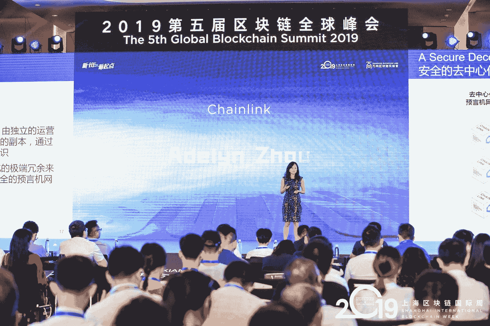

<figcaption id="caption-attachment-520" class="wp-caption-text">Adelyn Zhou talking about creating secure oracles on stage at the Wanxiang Blockchain Conference</figcaption>

在万向小组会议之后，我们在中国举办了三场不同的会议，向新的开发者社区展示为什么以及如何构建[互联智能合约](https://blog.chain.link/hybrid-smart-contracts-explained/)。我们在上海的第一次聚会有来自五个不同区块链项目的首席执行官参加，包括 Findora、Iris network、Kava Labs、Origin Protocol 和 Solana。

<figcaption id="caption-attachment-521" class="wp-caption-text">An intricate discussion at the Shanghai meetup about the challenges of building real-world smart contracts.</figcaption>

在上海之后，我们去了中国的硅谷杭州，与 Harmony Protocol、Nervos Network、imToken 和 Bytom 一起开会。

<figcaption id="caption-attachment-522" class="wp-caption-text">Explaining to the Hangzhou audience how Chainlink enables smart contracts for crop insurance.</figcaption>

最后，我们在中国首都北京结束了我们的旅行，与来自 Conflux 和 Celer Network 的嘉宾进行了会面，并与 HashQuark、Stafi、Wetez 和 stake.fish 进行了小组讨论。

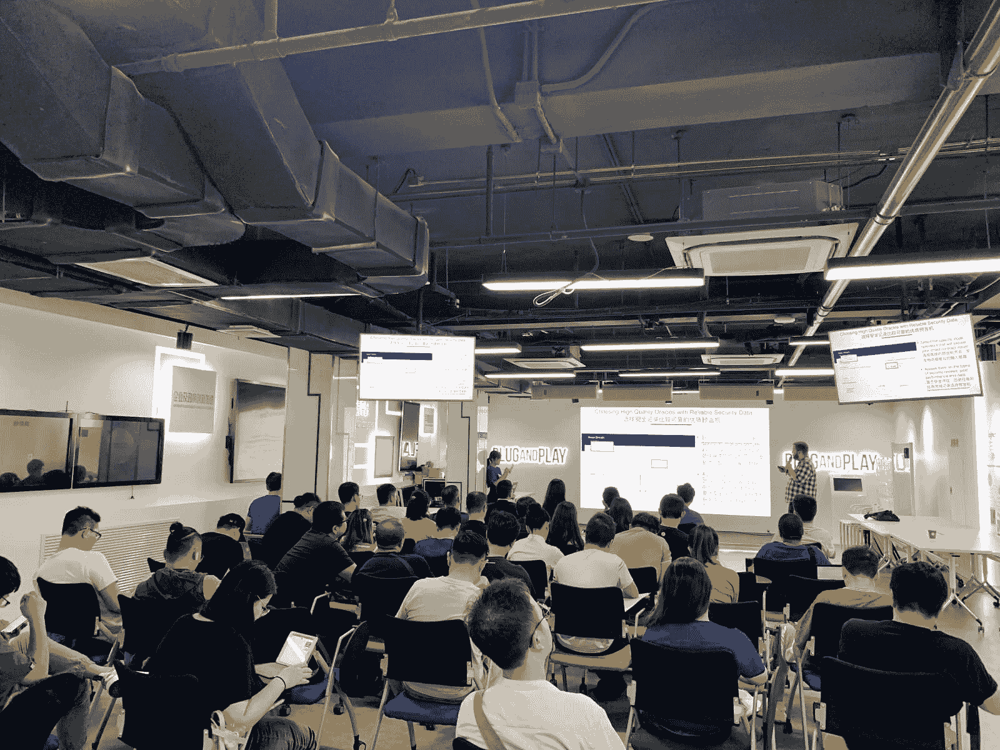

<figcaption id="caption-attachment-523" class="wp-caption-text">At the Beijing Meetup exploring the type of information a querying smart contract may desire before choosing an oracle node operator.</figcaption>

在中国期间，Chainlink 通过 8BTCnews 首次参加了中国媒体的[采访，以当地项目和开发人员能够阅读和理解的母语出版物展示我们的产品开发。](https://www.8btc.com/video/485590)

如果你有兴趣加入我们的中文社区，请阅读[我们概述如何参与的博客文章](https://blog.chain.link/chainlink-chinese-communities/)，查看我们正在进行的[中文资源材料回购](https://github.com/vlyl/awesome-chainlink-cn/blob/master/README.md)，并扫描下面的二维码访问我们的中文微信群。

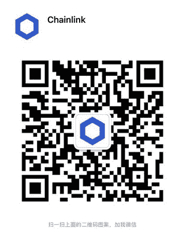

## 韩国

在中国之后，该团队前往韩国，这是一个公认的走在新技术应用前沿的国家。在首都首尔，该团队在韩国区块链周的主要会议 D.Fine 上发表了关于创建完全数据感知和链外智能合同的[演讲。我们还举办了一个繁忙的展位，并接受了大量采访，向当地开发者展示他们如何构建完全连接到流行的韩国后端基础设施的下一代 Dapps。](https://www.youtube.com/watch?v=n-tRK5wdY_0)

在 D.Fine 之后，我们与 Kyber Network、Tezos 和 [stake.fish](https://medium.com/stakefish/stake-fish-is-now-a-chainlink-node-operator-8769c23017c8) 举行了一次会议，讨论区块链生态系统如何能够弥合去中心化、智能合同和现实世界之间的差距。此外，Daniel Kochis 在 2019 年企业以太坊和银行业革命峰会上发表了关于如何在 DeFi 应用中集成安全 oracles 的演讲。

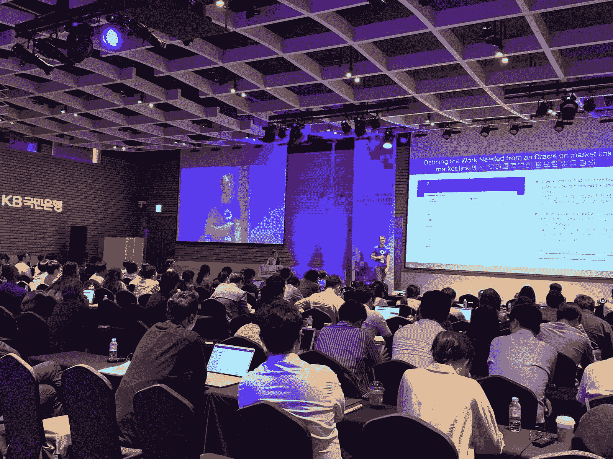

<figcaption id="caption-attachment-525" class="wp-caption-text">Daniel Kochis showcasing how to select oracles on market.link at the Enterprise Ethereum and Revolution in Banking Summit 2019.</figcaption>

由于我们的努力工作，我们最近在韩国成立了一个办事处，由新的韩国社区经理领导，创建韩国内容，组织聚会，并发展我们在该地区的开发者和爱好者社区。如果你想加入韩国社区，看看我们最近的[博客文章](https://blog.chain.link/chainlink-korea-community/)概述了如何参与！

## 日本

我们的最后一站是日本大阪的敌无双 5，这是以太坊基金会主办的世界上最大的以太坊开发者大会。为了启动敌无双周，我们宣布了与英特尔、Hyperledger Avalon 和以太坊企业联盟在[可信计算框架](https://blog.chain.link/driving-demand-for-enterprise-smart-contracts-using-the-trusted-computation-framework-and-attested-oracles-via-chainlink/)上的合作，这是一种为企业智能合同带来隐私和可扩展性的新计算设计。产品经理兼开发爱好者 Johann Eid 在敌无双 5 号举办的特别研讨会上介绍了 Chainlink 在 TCF/Hyperledger Avalon 中的作用。

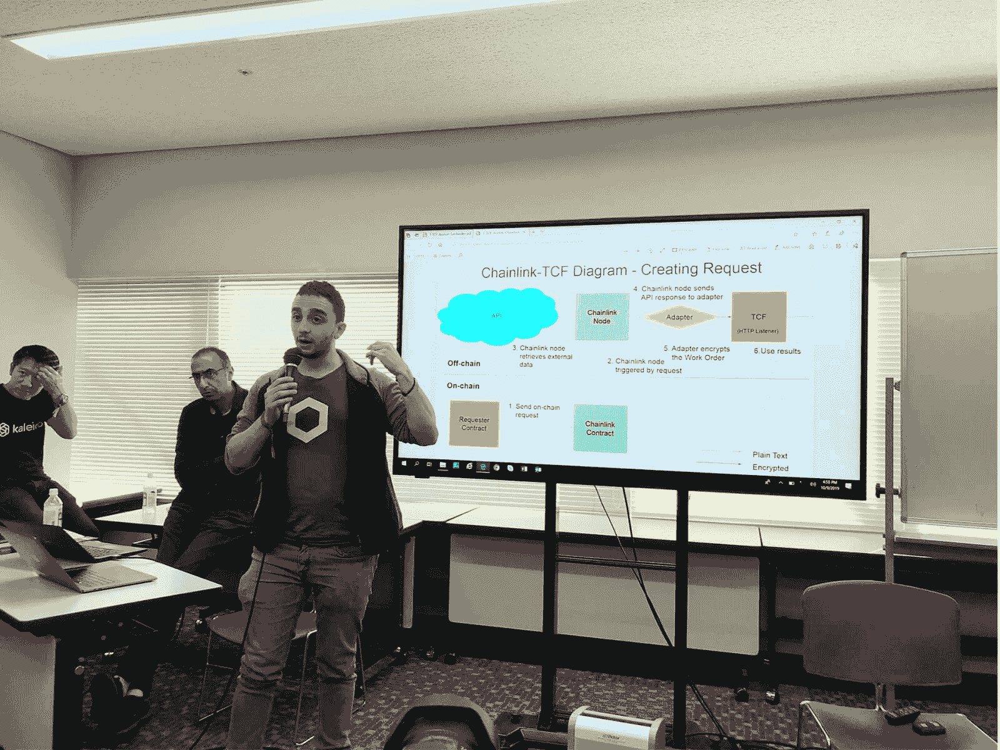

<figcaption id="caption-attachment-526" class="wp-caption-text">Johann Eid outlining how to use Chainlink to create an on-chain request for external data and/or off-chain trusted computation via TCF at the Devcon 5 special workshop.</figcaption>

在整个会议期间，我们设立了一个展台，与敌无双与会者分享我们正在进行的开发。我们还在凯悦酒店(Hyatt Regency)的屋顶上举办了一个欢乐时光，来自世界各地的人们在漫长的一天后聚集在一起，讨论智能合同的未来，同时享受一些提神饮料。

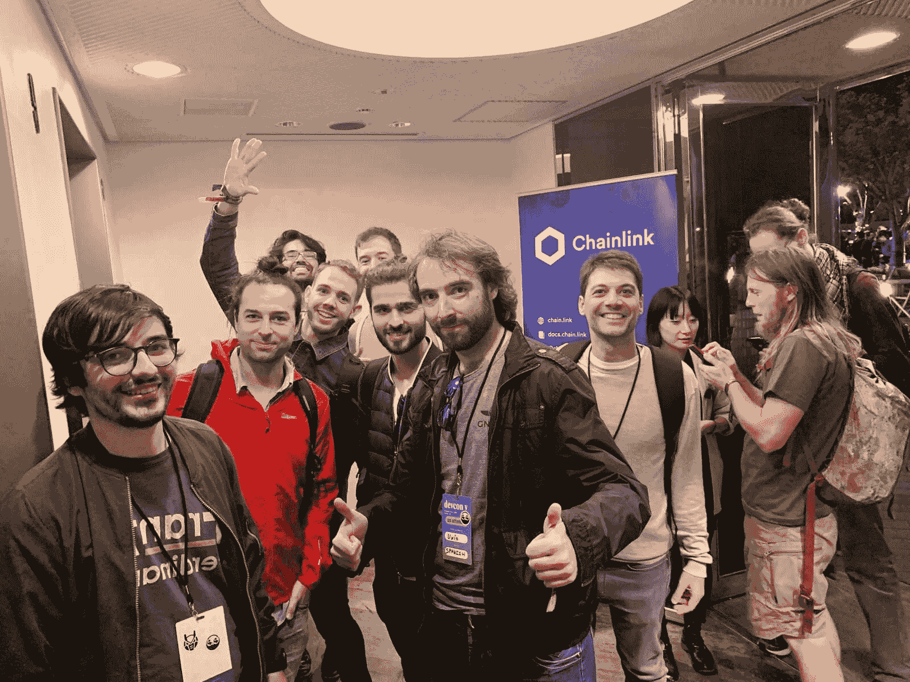

<figcaption id="caption-attachment-527" class="wp-caption-text">Devcon attendees enjoying the Chainlink Happy Hour.</figcaption>

最后，团队[在敌无双 mainstage](https://www.youtube.com/watch?v=eePZhhoNkY4) 上公布了 Oracle Networks 即将在以太坊 Mainnet 上发布的以下资产的新价格参考数据:LINK、BTC、ZRX、USDC、REP 和 BAT。新的价格参考数据 oracle networks 旨在通过让开发人员轻松访问经过最分散安全的 oracle networks 验证的高质量定价数据来发展 DeFi 生态系统。这些新的参考数据集为像 [Compound](https://twitter.com/compoundfinance) 和 [Synthetix](https://twitter.com/synthetix_io) 这样的 DeFi 领导者提供高质量的数据，并可用于所有项目。

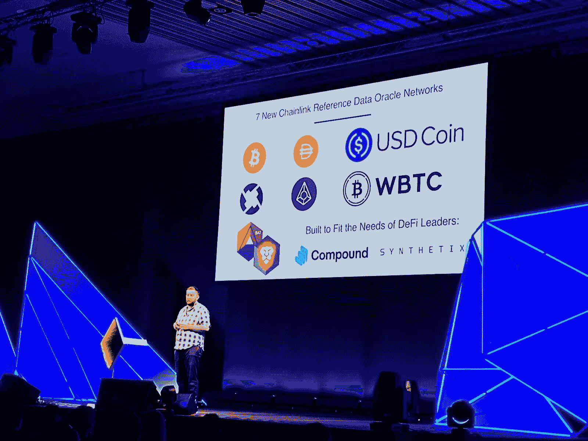

<figcaption id="caption-attachment-528" class="wp-caption-text">Sergey announcing the new Price Reference Data Oracle Networks on the main stage at Devcon 5.</figcaption>

在我们的大亚洲之旅中，很荣幸见到了这么多伟大的开发人员、项目和爱好者，他们对构建互联智能合同深感兴奋，这些合同能够彻底改变为全球经济提供动力的后端基础设施。我们对我们在中国和整个亚洲建立的基础感到非常兴奋，并进一步成为一个真正的全球性产品，在世界所有地区都有本地基础设施、项目集成、团队成员和社区。我们目前正在招聘一名东南亚社区负责人，因此如果有兴趣，[请点击此处申请](https://careers.chain.link/o/community-lead-south-east-asia)！

如果你正在考虑在当地举办一次会议，想要翻译内容，或者你是一名开发人员，想要学习如何建立互联智能合同，请联系我们的 [Discord](https://discord.gg/FGNyjhF) 或 [Telegram](https://t.me/chainlinkofficial) 以了解更多信息。