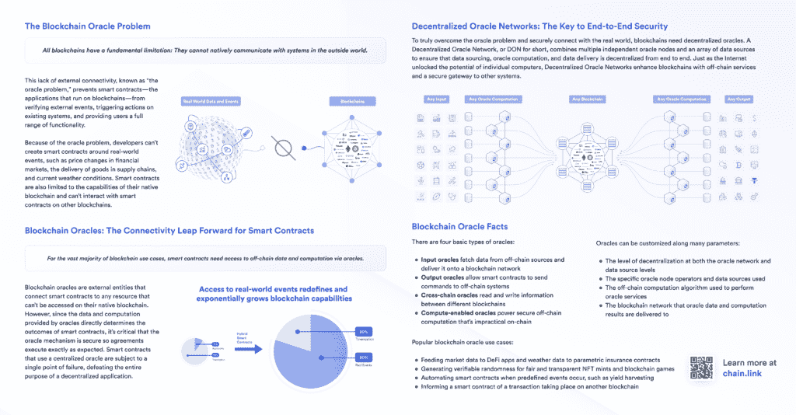
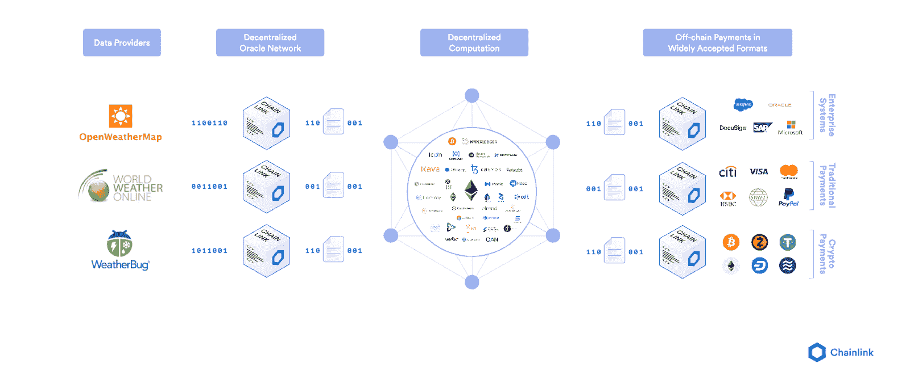
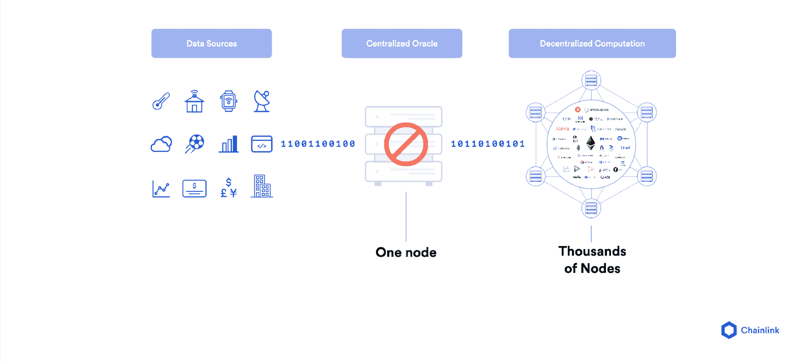
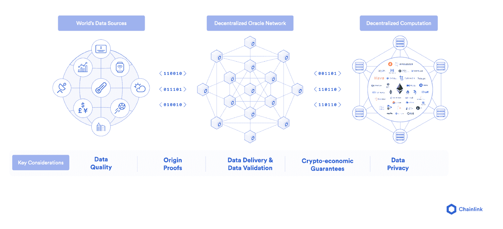
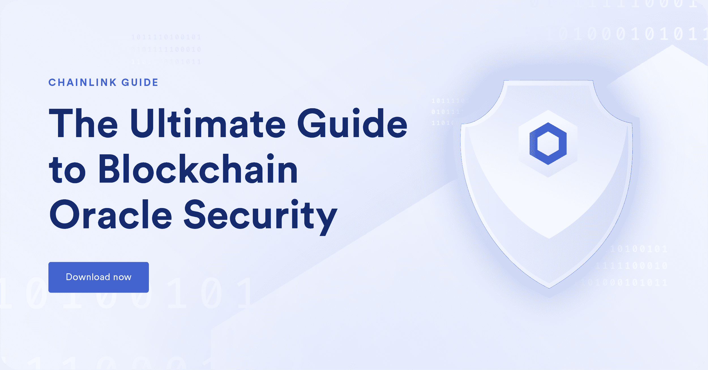

# 区块链甲骨文问题是什么？

> 原文：<https://blog.chain.link/what-is-the-blockchain-oracle-problem/>

如果以太坊等网络上的智能合约要在各种市场和用例中实现大规模采用，区块链甲骨文问题是需要克服的最重要障碍之一。

在[区块链](https://blog.chain.link/what-is-a-blockchain-and-how-can-it-impact-the-world/)运行的智能合约为重新定义独立实体参与合同协议和交换价值的方式提供了巨大的潜力。与智能合约经济分开运行的是规模大得多的非区块链数字经济，由所有联网的在线计算设备组成。数字基础设施的副产品是一个不断扩大的[数据和 API](https://blog.chain.link/understanding-how-data-and-apis-power-next-generation-economies/)库，它提供了对世界如何运转的洞察；例如，呈现社会中热门讨论话题的互联网搜索结果或展示常见交通模式的物联网传感器。

基于区块链的智能合约和传统的数据和 API 经济有巨大的潜力结合成[混合智能合约](https://blog.chain.link/hybrid-smart-contracts-explained/)并形成数据驱动自动化的未来架构，但问题是这两个世界如何连接？这包含了“oracle 问题”的症结所在，也将是本文的重点。

这篇文章分为五个关键部分:

*   甲骨文问题
*   先知的工作
*   为什么区块链像以太坊一样不提供原生 oracle 解决方案
*   集中式 oracle 的安全风险
*   Chainlink，安全可靠的分散式 oracle 网络标准

## 甲骨文问题

oracle 的问题围绕着一个非常简单的限制，即区块链不能作为内置功能从任何外部系统获取数据或向其推送数据。因此，区块链是孤立的网络，类似于没有互联网连接的计算机。区块链的隔离性是使其极其安全可靠的精确属性，因为网络只需要使用已经存储在其分类帐中的数据对一组非常基本的二元(对/错)问题形成共识。这些问题包括:公钥持有人是否用他们相应的私钥签署了交易，公共地址是否有足够的资金来支付其交易，以及交易类型在特定智能合同内是否有效？区块链共识非常狭隘的焦点是为什么智能合约被称为确定性的——它们完全按照书写的内容执行，比传统系统具有更高的确定性。

然而，对于智能合同来说，要实现 90%以上的潜在用例，它们必须连接到外部世界。例如，金融智能合同需要市场信息来确定结算，保险智能合同需要物联网和网络数据来决定保单支付，贸易金融合同需要贸易文件和数字签名来知道何时释放支付，许多智能合同希望在传统支付网络上以法定货币结算。这些信息没有一个是在区块链内部固有产生的，这些传统服务也不能直接获得。

桥接区块链(链上)和外部世界(链下)之间的连接需要一个额外的独立基础设施，称为 oracle。

## 什么是区块链甲骨文？

一个[区块链 oracle](https://chain.link/education/blockchain-oracles) 是一个安全的中间件，方便区块链和任何链外系统之间的通信，包括数据提供商、web APIs、企业后端、云提供商、物联网设备、电子签名、支付系统、其他区块链等等。Oracles 具有几个关键功能:

*   **Listen**–监控区块链网络，检查任何传入的用户或智能合约对链外数据的请求。
*   **提取**–从一个或多个外部系统获取数据，例如托管在第三方 web 服务器上的离线 API。
*   **格式**–将从外部 API 获取的数据格式化为区块链可读格式(输入)和/或使区块链数据与外部 API 兼容(输出)。
*   **验证**–使用数据签名、区块链事务签名、TLS 签名、可信执行环境(TEE)证明或零知识证明的任意组合，生成证明 oracle 服务性能的加密证明。
*   **计算**–为智能合约执行某种类型的安全链外计算，例如从多个 oracle 提交中计算中值，或者为游戏应用程序生成一个[可验证的随机数](https://chain.link/solutions/chainlink-vrf)。
*   **广播**–在区块链上签署并广播一项交易，以便发送数据和任何相应的链上证明，供智能合约使用。
*   **输出(可选)**–在执行智能合同时向外部系统发送数据，例如将支付指令转发到传统支付网络或触发来自网络物理系统的动作。

要执行上述功能，oracle 系统需要同时在区块链系统内外运行。链上组件用于建立区块链连接(监听请求)、广播数据、发送证明、提取区块链数据，并可能在区块链上执行计算。离线组件用于处理请求、检索和格式化外部数据、将区块链数据发送到外部系统，以及执行离线计算以获得更好的可伸缩性、隐私性、安全性和各种其他智能合约增强功能。

## 为什么区块链不能解决甲骨文问题

由于一些特定的设计原则，区块链非常安全可靠。如上所述，区块链只需要使用已经存储在自己账本上的数据，在非常基本的二元问题上形成共识。区块链的分类账被认为是真实的，因为它利用去中心化，使用网络中的所有节点冗余地验证每一条数据。它还使用去中心化来维护其一致性算法(PoW、PoS 等)的完整性。)，确保协议规则仅在网络的相当大部分(例如，51%)同意时才改变。这些特性为计算和数据存储确定性提供了强有力的保证，尤其是在高度分散和抗 Sybil 的网络中。

然而，区块链不太适合回答深入主观领域的问题，或者需要网络中每个节点都不容易访问的外部数据。比如一个简单的问题，比如‘比特币的市场价格是多少？’或者“纽约的天气怎么样？”可能会引出各种不同的答案，这些答案可能会根据他们使用的数据源以及他们从数据源请求数据的时间而有所不同。那么问题就变成了，什么是正确的答案，怎样才能证明它是正确的呢？

在区块链的基础层引入主观性会为一系列安全性、可靠性和治理问题打开潘多拉的盒子，将区块链旨在提供的价值主张置于危险之中。

一个主要问题是如何确保输入到区块链的外部数据是高质量的？即使是对比特币价格的基本数据请求也非常具有挑战性，因为简单地查看一个网站或单个交易所可能不如向专业数据聚合器支付 API 订阅准确或可靠，专业数据聚合器拥有数十年的数据过滤和创建市场覆盖面的经验，并有财务激励来维持高质量的服务。管理和加强区块链节点提交的外链数据的质量是非常困难的，因为任何人都可以伪匿名地运行一个节点并提交答案，即使他们不愿意购买高质量的外链 API。如果强制实施数据质量，区块链的分散化上限将会降低，因为网络上每个新的 oracle 作业的节点运行成本都会增加，从而影响特定区块链上运行的所有其他应用程序的安全性。

另一个主要问题是可伸缩性。每次需要向网络添加新的数据源或必须调整现有的数据聚合方法时，都需要大量的社会治理协调，以使网络中的每个节点都同意并升级他们的软件。治理开销的增加导致摩擦增加，核心区块链特性(如 PoS 和分片)的开发速度变慢，并严重限制了 oracle 的创新。最终，区块链的基础层越复杂，其上运行的所有应用程序面临的攻击面和风险就越大。即使是不使用 oracle 或不涉及对抗性数据请求的应用程序也会陷入交叉火力中，如果整个链因为 Oracle 问题而停止，也可能会被中断。

正是由于这些原因以及更多的原因，oracles 没有集成到任何主要区块链的基础层中，而是作为独立的网络运行。这确保了区块链具有较低的攻击面，并通过保持对共识的单一关注来保持其确定性，而 oracles 具有从复杂和主观的链外世界生成确定性所需的灵活性，而不会创建将所有其他应用程序置于风险中的依赖性和限制。

## 集中式区块链 Oracles 带来了重大风险

智能合同的整个要点是通过合同条款的技术执行来实现确定性，而不是通过人工执行来实现概率执行。为了实现这一目标，区块链不能有任何单点故障，如果要端到端地维护智能合同的确定性，该功能必须扩展到 oracle。如果一个单一的集中式 oracle 可以控制决定合同结果的输入，为什么要让一个价值数百万美元的合同在完全分散的区块链上发挥智能合同的作用呢？

<figcaption id="caption-attachment-814" class="wp-caption-text">一个中央集权的神谕是智能契约的一个中心失败点</figcaption>

无论是运行 oracle 的开发团队自己，还是集中式的第三方服务，这两种场景都给了单个实体过多的权力来通过控制 oracle 来影响合同。虽然集中式 oracle 运营商的运营意图可能是最好的，但他们仍然会遇到当今常见的集中式问题，如停机、DDOS 攻击、黑客攻击和意外故障，所有这些都将用户的资金置于风险之中。

一旦合同价值扩大，即使是最高尚的中央集权实体也可能面临压力，让它们暴露于贿赂、恐吓和监管压力之下，而这只需要一个参与操作的人叛变。这种模式不可扩展，也不符合分散式基础设施是安全可靠自动化的关键驱动力的理念。

为了克服这些缺点，oracles 需要创建与区块链相同的安全性和可靠性保证，尽管考虑到它们之间的许多差异，以不同的方式。

## Chainlink:安全可靠的 Oracles 标准

为了给 oracle 层带来确定性，Chainlink 开发了一个分散式 Oracle networks(DON)网络，每个 DON 都包含服务于特定用例所需的多种安全技术的组合。

*   **开源**–作为一项开源技术，它允许更广泛的区块链社区独立验证 Chainlink 源代码和功能的安全性和可靠性，并为其改进做出贡献。
*   **外部适配器**–允许节点安全地存储 API 密钥并管理帐户登录，使智能合约能够从任何外部系统和 API 检索数据，包括那些受密码/凭证保护的数据。
*   **去中心化**–在节点和数据源级别采用去中心化，确保没有一个节点或数据源是单点故障，为用户提供数据可用、按时交付和抗篡改的有力保证。
*   **数据签名**–让节点对它们提供给智能合约的数据进行加密签名，这允许用户识别哪些节点发送了数据，并查看它们的过去历史以确定它们的性能质量。
*   **服务协议**—在请求智能合同和 oracle 提供商之间使用有约束力的链上协议，概述 oracle 服务的条款和性能的惩罚/奖励，为用户提供对其链外数据请求质量的可执行保证。
*   **信誉系统**—将已签名的链上数据输入信誉系统，允许用户根据各种指标(如成功执行的作业、服务的客户列表、平均响应时间等)做出明智的决策，确定哪些节点是好的，哪些节点不是。
*   **认证服务**–使节点能够通过获得任意数量的认证来提高其安全性和可靠性，可以为用户提供额外的保证，如 KYC、节点的地理位置、基础设施的安全审查等。
*   **高级加密技术和硬件**——为更高级的加密技术(如[零知识证明](https://blog.chain.link/what-is-a-zero-knowledge-proof-zkp/))和硬件(如可信执行环境)提供灵活性，使 oracles 能够执行额外的功能，如证明数据的来源(如特定数据来自特定服务器)、保持数据机密、执行链外计算等。

<figcaption id="caption-attachment-815" class="wp-caption-text">分散式 Oracle 网络(don)允许智能合约安全地连接外部数据和系统。</figcaption>

这些只是 Chainlink 提供的众多功能中的一部分，这些功能为用户提供了一整套保证，以确保高度安全可靠的 oracle 机制。通过在 Chainlink 上构建这些关键功能，任何区块链上的智能合约现在都可以访问链外数据，而不会牺牲其确定性的核心价值，从而为构建数据驱动的自动化的未来提供了坚实的基础。

<figcaption id="caption-attachment-3518" class="wp-caption-text">This guide gives a comprehensive breakdown on how to evaluate blockchain oracle security.</figcaption>

在 [Twitter](https://twitter.com/Smart_Contract) 上关注我们，以获得即将发布的文章通知，加入我们的[电报](https://t.me/chainlinkofficial)或 [Reddit](https://www.reddit.com/r/Chainlink/) 了解 [Chainlink](https://chain.link/) 的一般新闻，或参加我们的[不和](https://discordapp.com/invite/aSK4zew)的技术讨论。此外，请查看其他更高级的文章，如:

*   什么是混合智能合约？
*   [77 个由 Chainlink 实现的用例](https://blog.chain.link/44-ways-to-enhance-your-smart-contract-with-chainlink/)
*   [链式网络如何超越数据传输](https://blog.chain.link/how-the-chainlink-network-goes-beyond-data-delivery/)