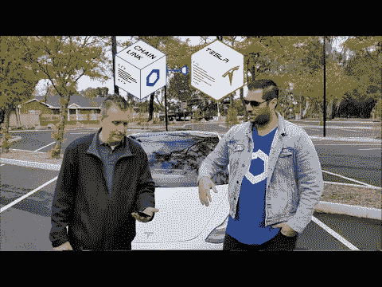
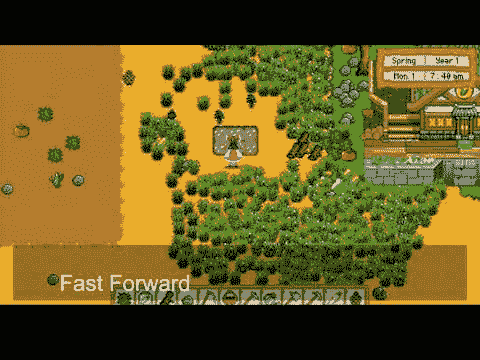
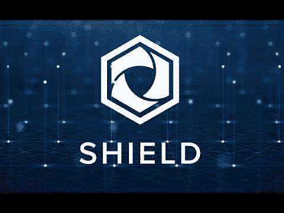
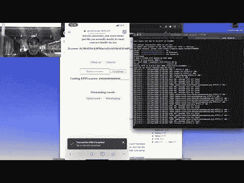

# 祝贺 Chainlink 虚拟黑客马拉松 2020 的获胜者

> 原文：<https://blog.chain.link/congratulations-to-the-winners-of-the-chainlink-virtual-hackathon-2020/>

[Chainlink 虚拟黑客马拉松](https://hack.chain.link/)第一手展示了[智能合约](https://chain.link/education/smart-contracts)开发的巨大发展，现在通过 Chainlink [神谕](https://chain.link/education/blockchain-oracles)的安全链外连接成为可能。开发者的参与人数非常多，有 1，000 多个注册，70 多个项目提交，以及来自 45 多个国家和多个不同区块链的开发者参与。

我们很高兴对最具创新性的项目表示感谢，并颁发超过 60，000 美元的奖金，以构建具有现实世界潜力的普遍连接的智能合同应用程序。提交给黑客马拉松的创造性和多样化的项目增强了我们的信念，即把[区块链](https://blog.chain.link/what-is-a-blockchain-and-how-can-it-impact-the-world/)与大量的链外数据、API 服务和计算连接起来是引发大规模开发和采用智能合同作为数字协议主要形式的主要催化剂。

感谢所有参与者、赞助商和评委，他们向#BuildWithChainlink 的开发者展示了巨大的可能性，从而使虚拟黑客马拉松取得了如此成功。

## **大奖(8000 美元)**

LINK 的 8000 美元大奖由 Harry Papacharissiou、Matt Durkin 和 Dunken Bliths 的点对点特斯拉汽车租赁平台 [**Link My Ride**](https://chainlink-hackathon.devpost.com/submissions/178189-link-my-ride) 获得。Harry 使用 Chainlink 将特斯拉功能丰富的 API 连接到以太坊智能合约，使双方能够指定租赁期限，为租赁者解锁车门，记录租赁时间长度，计算行驶里程，确定剩余电池电量，并自动支付租金。根据 Harry 的说法，这种点对点租赁协议动态可以将超过 30%的收入返还给车主/提供商，否则这些收入将流向一个集中的平台。

 

## **最佳博彩/NFT 项目(4000 美元)**

最佳游戏/[NFT](https://chain.link/education/nfts)LINK 项目奖金 4000 美元，由 Tina Xu、Irvin、John May 和 Cait-L 的 [**FarmTogether**](https://chainlink-hackathon.devpost.com/submissions/177850-farmtogether-a-strategic-yield-farming-role-playing-game) 获得，这是一款无损产量的农业 RPG，利用玩家的游戏表现(种植作物)和 [Chainlink 的](https://chain.link/solutions/chainlink-vrf)来制作游戏中以农场为主题的 NFT，具有不同的土壤肥力、种子类型和农场产量属性。作为游戏的一部分，玩家将 DAI 集中起来，存入货币市场赚取利息，然后玩家可以通过焚烧 NFT 赚取一部分利息，有些作物比其他作物更有价值。

 

## **最佳 DeFi 项目(4000 美元)**

LINK 中的最佳 [DeFi](https://chain.link/education/defi) 项目奖金为 4000 美元，由 Aymeric Bethencourt 颁发给点对点保险市场 [**SHIELD**](https://chainlink-hackathon.devpost.com/submissions/176462-shield) 。SHIELD 是一个由 AMM pools 资助的保险平台，它直接基于 Chainlink oracles 从航班、航运和人寿保险 API 提供的数据生成收益，并在发生索赔时自动支付保险合同。

 

## **最佳公开项目(4000 美元)**

林克的 4000 美元最佳开放项目奖由亚伦·乏色曼和阿拉姆·莫哈达斯的 [**开放图书馆项目**](https://chainlink-hackathon.devpost.com/submissions/177899-the-open-library-project) 获得，该项目使用 Chainlink 将 RFID 扫描仪连接到管理图书馆的智能合同，特别是借阅图书和接收新书。开发人员的目标是用这种新的开源、社区驱动的软件来补充现有的分散式物理网络[小自由图书馆](https://littlefreelibrary.org/)。

 

## **亚军奖(500 美元)**

*排名不分先后*

*   [**Ki。dot**](https://chainlink-hackathon.devpost.com/submissions/177709-ki-dot-a-substrate-blockchain-to-help-in-micro-funding)——Substrate 上的一个小额贷款平台，使用 Chainlink 价格馈送将区块链代币转换为美元贷款，用于像 [Kiva](https://kiva.org/) 这样的外链网站。
*   [**参数化水位保险**](https://chainlink-hackathon.devpost.com/submissions/178435-parametric-water-level-insurance)–一个用于海洋保险业的参数化保险应用程序，使用 Chainlink 检索当前水位数据。
*   [**goldedstar swap**](https://chainlink-hackathon.devpost.com/submissions/178211-goldedstarswap)——一个以太坊-和谐跨链互换 dApp，它使用 [Chainlink 价格馈送](https://chain.link/solutions/defi)将 ETH 或 ERC-20 代币互换为原生和谐代币。
*   [**水果市场**](https://chainlink-hackathon.devpost.com/submissions/176852-fruity-market)–一个水果自动售货机应用程序，支持使用 Chainlink 的 ETH/USD 价格馈送在 ETH 中进行美元计价支付。
*   [**与 Argent Wallet**](https://chainlink-hackathon.devpost.com/submissions/176871-integration-with-argent-wallet) 的集成–一个 Argent Wallet 集成，使用 Chainlink 价格馈送来计算用户确定的传出交易每日限额。
*   [**Chain Draw**](https://chainlink-hackathon.devpost.com/submissions/177772-chain-draw)——一个 Twitter 机器人，它使用 Chainlink VRF 从转发特定推文的用户群中随机选择一个获胜者。
*   [**Intoo TV**](https://chainlink-hackathon.devpost.com/submissions/178530-intoo-tv)——一个点对点直播流媒体平台，使用 Chainlink VRF 生成唯一的二维码，用作访问直播流的门票。
*   [**Dexcrows**](https://chainlink-hackathon.devpost.com/submissions/177835-dexcrows)——一个用于交换 BTC 和 ETH 的分散托管应用程序，它使用 Chainlink oracles 查询 BTC 地址余额，以确保有足够的资金。
*   [**reNFT**](https://chainlink-hackathon.devpost.com/submissions/178548-renft)**——一个利用 Chainlink 价格馈送从 [OpenSea](https://opensea.io/) 获取当前 NFT 市场价格的 NFT 租赁市场。**
***   [**止损&**](https://chainlink-hackathon.devpost.com/submissions/178545-take-stop)——一种止损合约，使用和 Chainlink 价格馈送，当资产价格达到目标水平时自动执行。*   [**Feldmex 差异互换**](https://chainlink-hackathon.devpost.com/submissions/176922-feldmex-variance-swaps)-一个差异互换平台，使用 Chainlink 价格馈送来计算资产对与当前公平市场价格的差异。*   [**Dereit**](https://chainlink-hackathon.devpost.com/submissions/177941-dereit)——一个令牌化的房地产平台，使用 Chainlink 访问房地产的表面积数据。**

 **感谢所有 Chainlink 虚拟黑客马拉松 2020 的参与者！我们期待您继续参与未来的黑客马拉松，因为我们将继续努力重新定义合同在全球的使用方式，以造福个人用户和整个社会。

如果您是一名开发人员，并且希望快速将您的应用程序连接到 [Chainlink Price Feeds](https://docs.chain.link/docs/using-chainlink-reference-contracts) 、 [Chainlink VRF](https://docs.chain.link/docs/chainlink-vrf) 或[访问任何 API](https://docs.chain.link/docs/request-and-receive-data) ，请访问[开发人员文档](https://docs.chain.link/)并加入 [Discord](https://discordapp.com/invite/aSK4zew) 中的技术讨论。如果您想安排一次电话会议来更深入地讨论集成，请联系此处的。
[网站](https://chain.link/) | [推特](https://twitter.com/chainlink)|[Reddit](https://www.reddit.com/r/Chainlink/)|[YouTube](https://www.youtube.com/channel/UCnjkrlqaWEBSnKZQ71gdyFA)|[电报](https://t.me/chainlinkofficial) | [事件](https://blog.chain.link/tag/events/)|[GitHub](https://github.com/smartcontractkit/chainlink)|[DeFi](https://defi.chain.link/)**