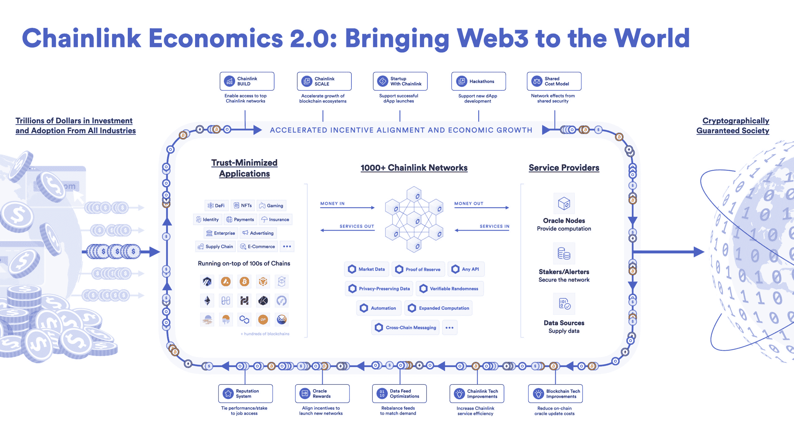
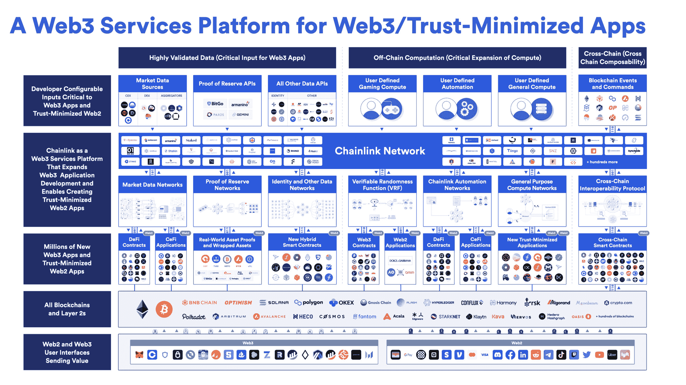

# 规模介绍:第 1 层和第 2 层支持的可持续链式访问

> 原文：<https://blog.chain.link/chainlink-scale-program/>

Chainlink Labs 激动地宣布**chain link****SCALE**—**S**ustainable**C**hainlink**A**access for**L**T22】ayer 1 和 2T24】Enab lement—A

Chainlink SCALE 通过在一段时间内支付 Chainlink oracle networks 的运营成本(如交易气费),允许区块链和二层网络在其本地生态系统中快速跟踪智能合同创新。通过这样做，他们的开发人员可以访问各种重要的 oracle 服务，其中包括针对其生态系统需求的配置，如更新频率更高的数据馈送，以支持更高级、低延迟的智能合同应用。

为了 kickstart Chainlink SCALE，许多链上生态系统(Avalanche、Metis、Moonbeam 和 Moonriver)已确认参与支付某些 oracle 网络运营成本，并进一步研发有助于在其链上释放更多高级 oracle 功能和解决方案的&。

随着 Chainlink SCALE 计划中区块链生态系统的成熟，oracle networks 的运营成本将逐渐过渡到完全由 dApp 用户付费承担。这使得 dApp 生态系统向一个整体的经济模型发展，这个模型对所有参与者来说都是长期可行的:

*   **区块链** 帮助发展他们的 dApp 生态系统，这样他们可以吸引更大的用户群，并支持连锁的长期加密经济安全。
*   **Chainlink** 通过 oracle 服务帮助区块链发展，使他们的 dApp 生态系统能够为创造价值的真实用例提供动力。
*   dApps 有一条跑道来创建基于真正增值服务的可持续收费模式，这样他们最终可以通过用户付费来支持区块链和甲骨文基础设施的全部后端成本。

Chainlink SCALE 是 Chainlink Economics 2.0 这一更为全面的计划的一部分，该计划旨在提高数据安全性和实用性，同时降低 oracle 服务的运营成本，增加支付给 Chainlink 服务提供商的用户费用，并使利益相关者等更广泛的服务提供商能够参与到 Chainlink 生态系统中。要了解更多关于 Chainlink Economics 2.0 和 link 作为生产性资产的演变，请访问[【chain.link/economics】](https://chain.link/economics)。

<figcaption id="caption-attachment-4600" class="wp-caption-text">Chainlink Economics 2.0 is a new era of sustainable growth, cryptoeconomic security, and deeper value capture in the Chainlink Network.</figcaption>

## 链节秤的好处

Chainlink 已经成为各种信任最小化服务的行业标准 oracle 基础设施，到 2022 年为止，交易价值(TVE)达到 6.18 万亿美元，这是一个衡量给定时间段内交易总货币价值的指标。Oracle 驱动的交易是 Web3 中许多早期创新的基础，如[【DeFi 货币市场】](https://blog.chain.link/decentralized-money-markets/)[fair mint NFTs](https://chain.link/use-cases/nfts-and-blockchain-games)和 [参数作物保险](https://chain.link/use-cases/insurance) 。

<figcaption id="caption-attachment-4637" class="wp-caption-text">The Chainlink Network empowers Web3 innovation by enabling hybrid smart contracts supported by increasingly advanced oracle services.</figcaption>

然而，这项由 [混合智能合约](https://blog.chain.link/hybrid-smart-contracts-explained/) 支持的创新，如果要避免各种漏洞，就需要高度安全可靠的 oracle 基础设施。和任何高质量的服务一样，它也是有代价的。oracle networks 最显著的运营成本之一是链上交易。具体来说，节点运营商每次在链上交付 oracle 报告时都会产生费用，通常以链的原生货币支付。

历史上，这些成本一直通过支付给节点运营商的 [【甲骨文奖励】](https://blog.chain.link/sustainably-growing-chainlink/) 以及来自 dApps 的用户费用来支持。然后，随着时间的推移，当 dApp 的盈利能力超过 oracle 网络的运营成本时，oracle 奖励可能会减少或完全取消，因为使用特定 oracle 网络的 dApp 会产生足够的用户费用来支持此类成本。对于激励分散的 oracle 节点生态系统来说，这是一个经过验证的经济模式，Polygon 和 BNB 链上的一些 oracle 网络已经完全由用户付费支持。

Chainlink SCALE(之前称为区块链天然气拨款)是对这种经济模式的补充，其中区块链和第 2 层网络通过承诺其资源支持其生态系统的增长，而 dApps 的用户费用仍需支付，以产生 Chainlink DONs 的长期可持续性。参与的区块链和第二层网络不仅可以通过 Chainlink SCALE 增加开发人员对关键 oracle 服务的访问，还可以通过适合其链的特定需求和使用案例的独特配置来支持 oracle networks。

此外，Chainlink SCALE 旨在降低 Chainlink 节点运营商的运营复杂性，因为在某些情况下，交易费用可以用进行链上交易所需的链本地资产支付。一部分释放出来的资源将被用作 oracle 奖励，然后可以重新用于进一步建立 Chainlink 在更多链上环境、更多使用案例、更多服务产品和更多价值获取机会中的网络效应的计划。

最终，Chainlink SCALE 的目标是为 Web3 的每个参与者——区块链、dApps、甲骨文服务提供商和用户——创造更多经济价值，同时将整个体系转变为更可持续的经济模式。

要了解更多关于 Chainlink 的信息，请访问 [Chainlink 网站](https://chain.link/) ，订阅 [Chainlink 简讯](https://pages.chain.link/subscribe?utm_medium=referral&utm_source=chainlink-blog&utm_content=scale) ，关注官方[Chainlink Twitter](https://twitter.com/chainlink)了解最新 chain link 新闻和公告。

—

*免责声明:本文仅供参考，包含关于未来的陈述，包括预期的计划和功能、开发以及这些计划和功能的推出时间表。这些陈述只是预测，反映了当前对未来事件的信念和期望；它们基于假设，随时都有风险、不确定性和变化，包括在不通知的情况下终止任何已宣布的计划或功能。虽然我们相信这些陈述是基于合理的假设，但我们不能保证任何预期的计划或功能将按规定实施，也不能保证实际结果不会与这些陈述有重大差异。所有声明仅在首次发布之日有效。由于用户反馈或后来的事件，这篇文章中的陈述也可能不反映未来的发展，我们可能不会更新这篇文章作为回应。T3】*