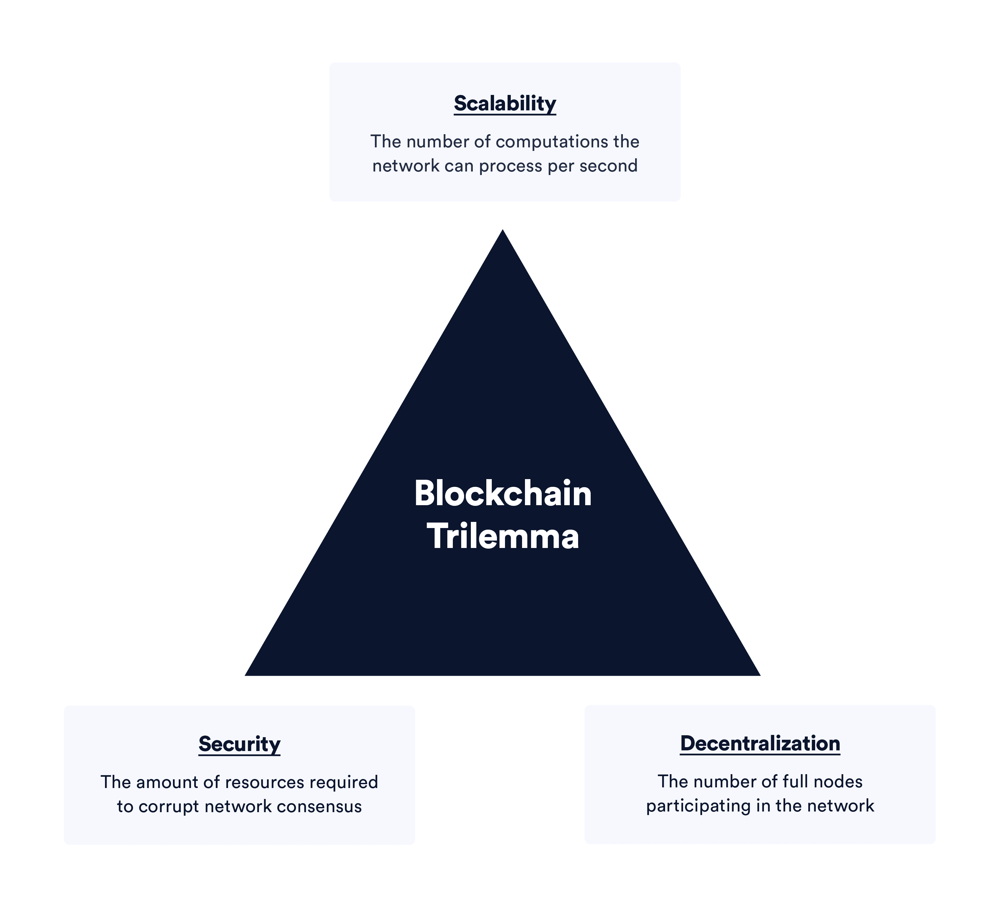
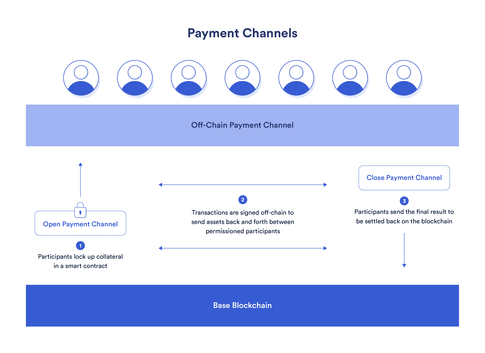
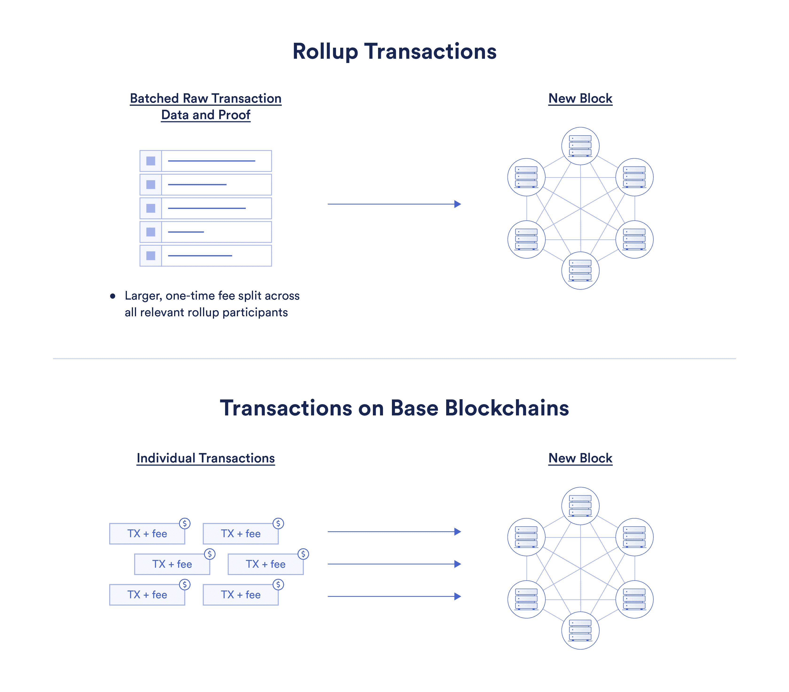
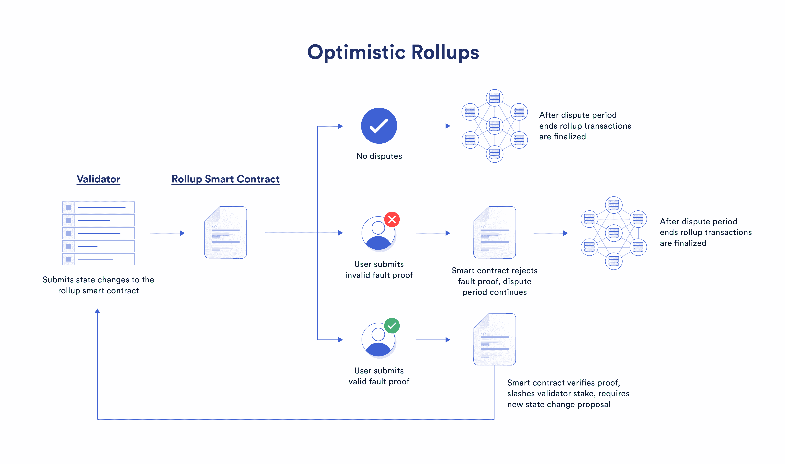
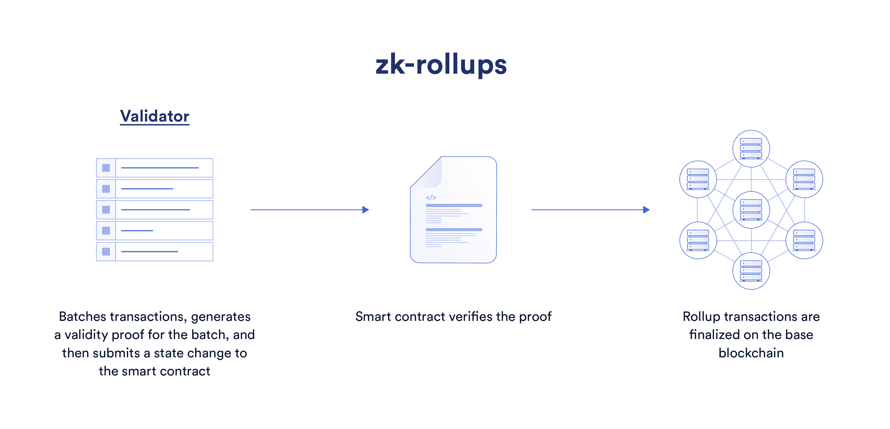

# 什么是第 2 层？

> 原文：<https://blog.chain.link/what-is-a-layer-2/>

第 2 层指的是在A之上 **构建的任何链外网络、系统或技术(通常称为第 1 层网络)，有助于扩展底层基础层网络的能力。第 2 层网络可以支持任何区块链来引入增强，例如更高的事务吞吐量。**

被认为是第二层的网络、系统或技术的一个核心要求是，它的 **继承了它所基于的区块链的** 的安全性。交易数据必须以某种形式由底层区块链网络验证和确认，而不是由一组单独的节点验证和确认。例如，侧链通常不被认为是第二层，因为它们通常部署自己的共识机制和验证器，导致一组不同于基础层链的安全保证。

对于牺牲可扩展性来实现更高的去中心化和安全性的区块链来说，第二层支持更高的交易吞吐量，从而降低费用。第 2 层可以被视为可伸缩性问题的一种解决方案，能够在不牺牲分散性或安全性的情况下实现快速和可伸缩的执行。

## 对第 2 层的需求

自 2008 年区块链技术出现以来，数千名研究人员和开发人员致力于解决区块链可扩展性的紧迫限制，以适应不断增长的采用率。这些限制在历史上导致了高昂的费用和缓慢的执行时间，削弱了区块链的规模经营能力。

以太坊联合创始人维塔利克·布特林提出了 [区块链可扩展性三难困境](https://vitalik.ca/general/2021/04/07/sharding.html) 假设区块链无法在保持底层网络安全和分散的同时进行有效扩展。相反，必须在这三个特征之间进行权衡——今天的区块链网络可以满足三个条件中的两个，但不能同时满足三个。

第二层是一项新兴技术，其前提是由于区块链承担了太多的任务，因此存在可扩展性限制。这是因为今天区块链实现了三个核心功能:执行、数据可用性和共识。

*   **执行**—交易处理和吞吐量。以区块链每秒可以处理的计算次数(事务是其中的一部分)来衡量。
*   **数据可用性**—网络上节点和验证器对事务、状态和其他数据的存储要求。以标准存储术语衡量，如兆字节、千兆字节等。
*   **共识**—节点和验证者对网络状态和交易顺序的广泛共识。根据分散化和终结时间，或者所有节点同意特定状态改变所花费的时间来度量。

**注意:** 出于本文的目的，我们将只关注执行层。要全面深入了解区块链的可伸缩性，请查看这篇关于 [区块链可伸缩性](https://blog.chain.link/blockchain-scalability-approaches/) 的博文。

## 第 2 层解决方案的工作原理

**注:** 大多数第二层解决方案的实现仍处于早期阶段，第二层协议设计的许多元素仍未经测试或验证。

在高层次上，第二层通常有两个部分:处理交易的网络和底层区块链上的 [智能契约](https://chain.link/education/smart-contracts) ，该智能契约通过将第二层网络绑定到底层区块链来解决任何争议并就第二层网络的状态达成共识。

第二层网络是快速执行交易和计算的地方。它们在实现这种吞吐量的方式上可以有很大的不同。然而，每个第 2 层环境之间的共同点是，当寻求解决基础链时，第 2 层必须向区块链提供某种加密的和可验证的“证明”,证明所提议的状态改变的完整性，无论是先发制人还是追溯既往。

类似地，底层智能合约实现可以在第二层之间变化，但是智能合约的核心功能始终是:

1.  持有和释放转移到第二层的资金
2.  接收第 2 层生成的某种证明，验证它，解决争议，然后完成交易

将这两种动态概念化的一个好方法是举两个现有第 2 层实施的例子——支付渠道和汇总。  

## 支付渠道

支付渠道通过将流动资金预先注入渠道，实现两个或更多用户之间的链上代币的链外转移。

Alice 和 Bob 通过在一份智能合同中锁定集体资金并同意(通过加密签名)每个人可以获得多少来创建一个支付渠道。例如，如果双方都锁定了总计 100 美元的 50 美元资金，他们很可能会同意在支付渠道中各使用 50 美元。

一旦建立了支付通道，Alice 和 Bob 就可以通过签名消息自由地进行链外交易，而无需向底层区块链提交交易。Alice 可以零成本和闪电般的延迟向 Bob 付款，反之亦然。当通过双向支付渠道进行通信时，Alice 和 Bob 的交易没有被过账到基础区块链上；只有当他们共同决定关闭通道时，最终的结果才会被传送到区块链，并最终确定下来。

这个系统的最终结果是 Bob 和 Alice 只需要支付两次链上交易就可以打开和关闭支付通道。在支付渠道开放的情况下，数百万笔转账可以零成本、亚秒速度直接点对点进行——这是可扩展性的经典例子。

<figcaption id="caption-attachment-4116" class="wp-caption-text">When open, payment channels can facilitate transactions at zero cost and lightning-fast speeds.</figcaption>

## 汇总

乐观和零知识汇总通过离线执行智能合同状态更改并在线验证它们，提供了更高的吞吐量和更低的成本。通过以下三种方法可以实现汇总的可伸缩性。

1.  Rollups **进行交易的链外执行** ，要求底层基础区块链只需要执行小证明来验证网络活动并存储原始交易数据。
2.  汇总 **批量交易数据** 一起提交给区块链，以便在多个交易中分配链上气体成本。
3.  汇总只需要 **最少一个诚实的** **验证者** 向基本层区块链证明交易的有效性，允许更小的验证者集和增加的硬件要求，而不会显著损害安全性。

### 链外执行

rollups 的一个关键特性是它们执行事务的链外执行。这意味着第 2 层网络代表基本区块链处理事务处理，无论是与另一个用户还是与智能合同。与具有更好硬件的更小的验证器集相结合，与基本区块链相比，这在第 2 层网络上进行交易时提供了更高的吞吐量。

基本区块链只需要执行提交给汇总智能合同的证明，以验证第二层网络上的活动(在乐观汇总的情况下，仅在有争议的情况下)，并将原始的、未执行的交易数据存储为 calldata。简而言之，这意味着区块链需要为发生在第 2 层的事务做更少的工作和存储更少的数据，从而降低每笔事务的总成本。

### 批量交易

降低成本的另一种方法是批量交易。这可以被认为是礼品包装。在区块链上，每笔交易都是一份单独的礼物，放在一个单独的盒子里。这使得运费昂贵，因为你每次想送礼物都要支付运费。有了汇总，你可以以更少的时间间隔将许多礼物装入一个更大的盒子中，并在多个礼物中分摊更大的运费。

从技术角度来说，更准确的解释是，汇总将原始交易数据作为 calldata 进行批处理。汇总事务不需要像链上事务那样进行验证；相反，批量事务数据只是一种将数据存储在基链上的方式，以便在必要时，验证器或汇总参与者可以随时重新创建第 2 层网络的状态。但是，核心逻辑仍然是相同的——主链上的一个批处理事务存储关于多个汇总事务的数据。

这是一种降低交易费用的简单明了的方法，交易费用会抑制区块链上的可伸缩性，结合数据压缩，与在基本区块链上进行交易相比，它在执行成本方面有了显著的改善。

ZK-汇总和乐观汇总都以类似的方式批量处理事务。

### 更少的验证器

如前所述，第二层固有的安全保证和其底层区块链的分散性。这将在下面详细阐述，但是核心思想是层 2 必须向它们的底层区块链提供一种形式的证明，证明它们提议的状态改变是有效的。

这使得汇总可以用更少的验证器来处理第二层网络上的所有事务。验证者可以是被许可的实体，通常有更复杂的硬件来更快和更低成本地计算交易。这是可能的，因为验证器不提供共识——这是通过基链上的智能契约实现的，而智能契约需要证明。

## 第 2 层安全性:证据的重要性

“证明”的概念是第 2 层的基础，以便它们继承基础链的安全保证。在物理世界中，证据可以采取多种形式。武器上的指纹和事件发生时的摄像机记录都是证据的例子。

密码证据以类似的方式工作，但其内容比物理法庭上可接受的要客观得多。用密码术来证明某件事可以提供客观的、可验证的、防篡改的保证，保证某件事是真实的。如果证据有效，就保证是真的。在支付渠道的情况下，交易的加密签名提供了智能合同解决任何争议所需的明确事实。

每个第 2 层都依赖某种形式的加密证明来解决基础链上的争议。今天最突出的证明是错误证明和有效性证明(也称为 [零知识证明](https://blog.chain.link/what-is-a-zero-knowledge-proof-zkp/) )，是现代乐观总结和 zk 总结的基础。

### 支付通道签名消息

假设在关闭支付通道时，鲍勃或爱丽丝恶意行为，试图取走不属于他们的资金。任何一方都可以通过向智能合约提供支付渠道“账本”的过时副本来做到这一点。

支付渠道的一个关键设计要素是交易必须始终经过加密签名。这成为一种证据形式，与解决争议的基础智能合同兼容。例如，如果 Alice 提出一份过期的分类账副本，该副本给了她比她应该得到的更多的资金，Bob 可以对结算交易提出异议，并提供一份较新的分类账副本。然后，智能合约可以确定正确的金额。爱丽丝也必须为她的不诚实行为付出代价。

底层智能合约的裁决过程正是支付渠道成为第二层的原因。思考这个问题的一个简单方法是从“证明”的角度来看。一旦支付通道打开，Bob 和 Alice 都必须对他们进行的每笔交易进行加密签名，并保存另一方签名的副本。

这是支付渠道内活动的证据，但仅有证据是不够的。需要执行真相，就像法官在提供证据和陪审团达成裁决后做出决定一样。在这种情况下，智能合约执行判断，并通过将正确的金额返回到基础链上每个参与者的钱包来结算账户。

这就是继承区块链权力下放和安全保障的意义。支付通道处理链外的大部分计算和执行，但是在需要共识来解决通道的情况下，底层区块链的健壮共识层做出最终决定。

### 乐观汇总故障证明

故障证明本质上很简单。使用故障证明的第 2 层假定所有事务在默认情况下都是有效的。然而，存在一个争议期，在此期间，任何网络参与者都可以产生争议，并向智能合约提供交易数据和提议的状态改变是错误的证据。当发布故障证明时，汇总事务部分或全部在链上重新执行，并将结果状态变化与原始声明进行比较。如果重新执行导致不同的结果，则原始索赔被视为无效并被恢复。

这个系统现在被乐观汇总使用。“乐观主义”来自于一种防错的哲学观点:智能契约“乐观地”假设所有交易都是有效的，直到被证明是错误的(无罪直到被证明有罪)。回到不诚实的验证者的例子，在交易完成之前，任何网络参与者只需要在争议期间向智能合同提出有效的错误证明，以使验证者的行为无效。

<figcaption id="caption-attachment-4118" class="wp-caption-text">Optimistic rollups use fault proofs to ensure finalized transactions correctly reflect activity on the layer-2 network.</figcaption>

### zk-rollup 有效性证明

有效性证明可以被视为具有与错误证明相反的哲学观点，在错误证明中，所有的计算和执行都受到质疑，并且必须被先发制人地证明为真。

简单来说，有效性证据证明某事是正确的。在 zk-rollup 的情况下，这必然是指发生在第 2 层网络上的事务和计算。相应的链上智能合同因此可以验证第 2 层的有效性证明以批准状态改变。在验证器的上下文中，功能完整的 zk-rollup 有效地使错误或恶意的事务不可能在基链上解决，因为每一批都必须有相应的有效性证明。

<figcaption id="caption-attachment-4119" class="wp-caption-text">Validity proofs preemptively prove the validity of layer-2 network activity.</figcaption>

## 攀登区块链

支付渠道、汇总和更广泛意义上的第二层都是以可持续和长期导向的方式解决区块链可扩展性问题的方法——支持 [Web3](https://chain.link/education/web3) 应用程序的日益普及和增强的用户体验。

作为一项新生的、不断发展的技术，大多数 Web3 基础设施组件，包括基础区块链和第二层，还没有达到明确知道哪种方法最适合市场需求的拐点。然而，成千上万的开发人员和研究人员继续不懈地努力，通过区块链网络、DAG 解决方案和当今存在的第二层的广阔生态系统来寻找可行的解决方案，以便将 Web3 的承诺带到社会的最前沿。