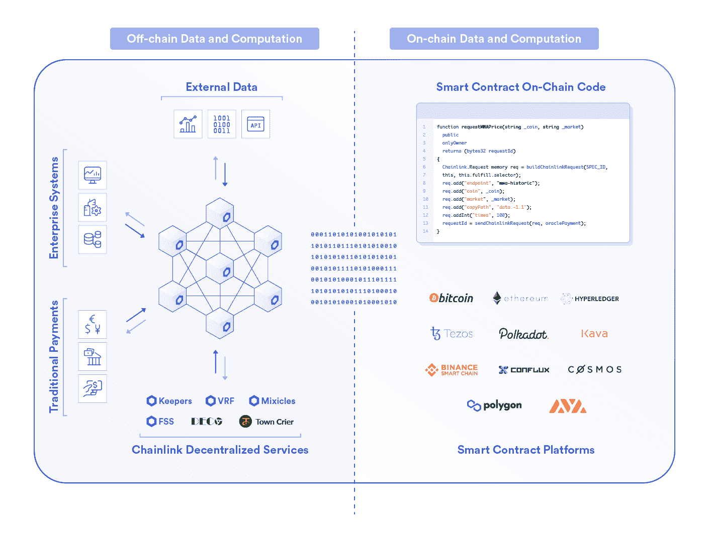
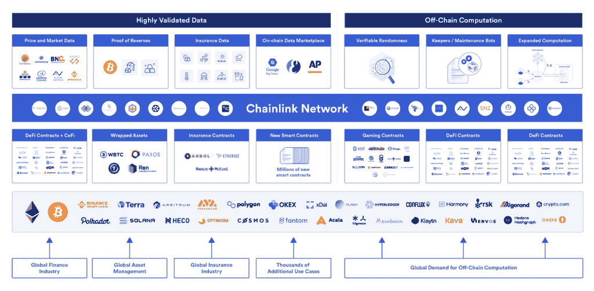

# 混合智能合同解释

> 原文：<https://blog.chain.link/hybrid-smart-contracts-explained/>

*混合智能合约将区块链(链上)上运行的代码与分散式 Oracle Networks 提供的区块链(链外)数据和计算结合起来。混合智能合约实现了高级形式的经济和社会协调，具有区块链的防篡改和不可改变的属性，同时利用安全的离线 oracle 服务来获得新的功能，如可伸缩性、机密性、订单公平性以及与任何现实世界数据源或系统的连接。*

在下面的文章中，我们定义了混合智能契约在新兴的基于区块链的信任模型中扮演的角色，并展示了 Chainlink oracles 为扩展其功能而提供的许多分散式服务。然后，我们将解释这如何最终打开新一代基于区块链的混合应用程序，这些应用程序具有改善未来社会在几乎每个主要行业中的协作方式所需的真实属性。

## Oracles 如何扩展基于区块链的协作

区块链的核心是旨在促进一个关键功能的计算基础设施:高度可信的协作。信任是参与者对合作的可靠性、真实性、能力或强度的坚定信念。在协作过程中建立信任的最常见方式是合同，它定义了每个参与者的法律和业务义务以及他们行为的惩罚/奖励。不幸的是，目前合同义务的执行机制远非完美，特别是当一个参与者拥有不对称优势时，如对执行基础设施的不公平影响、对细则更清晰的理解或延长仲裁过程的时间和资金。这导致了一种契约体系，在这种体系中，对交易对手品牌的信任成为决定其可信度的核心因素。

[区块链](https://blog.chain.link/what-is-a-blockchain-and-how-can-it-impact-the-world/)是一种支持协作的技术，它通过将合同的托管、执行、实施和保管机制转变为在分散网络上运行的软件逻辑，用[基于数学的信任取代了基于品牌的信任](https://blog.chain.link/brand-based-vs-math-based-agreements/)，任何个人参与者都无法破坏这种软件逻辑。类似于没有互联网的计算机，区块链是高度可信的，因为它们是封闭的网络，故意限制为促进非常小的、预定义的、易于实施的协作类型范围，例如在自含式分类帐的地址之间传输令牌。虽然这种隔离和狭窄的功能范围产生了使区块链有价值的防篡改和确定性保证，但它也禁止支持任何类型的需要非特定区块链固有的数据、计算或功能的协作。

扩大区块链可能的合作类型的愿望导致了甲骨文的诞生，以及随后混合智能合约的引入。Oracles 为区块链提供了通往外部世界的安全网关，因此智能合约应用程序可以验证外部事件，触发外部系统上的操作，并利用链上不可能或不实际的计算。

正如在 [Chainlink 2.0 白皮书](https://research.chain.link/whitepaper-v2.pdf)中所概述的，由去中心化 Oracle Networks(don)提供的链外服务极大地扩展了智能合约可以支持的链上协作的类型。这在[去中心化金融(DeFi)](https://chain.link/education/defi) 的迅速崛起中已经显而易见，一旦 Chainlink 的去中心化甲骨文网络使外部[金融市场数据](https://data.chain.link)在链上可用，就加速了这一进程，支持混合智能合约协议，如 Aave 的货币市场、Synthetix 的衍生品平台、dYdX 的杠杆交易市场、Ampleforth 的算法 stablecoin 和[等等](http://chainlinkecosystem.com/ecosystem)。

## 混合智能合约的组成

混合智能合约是由两部分组成的应用程序:1) [智能合约](https://chain.link/education/smart-contracts)—专门在区块链上运行的代码，以及 2) [分散式 oracle 网络](https://blog.chain.link/what-is-chainlink/)—支持智能合约的安全链外服务。这两个组件无缝、安全地相互交互，形成一个混合智能合约应用程序。其结果是链上代码以各种独特和重要的方式得到了增强，开辟了许多新的用例，这些用例由于技术、法律或财务限制而无法单独通过链上代码实现。

在该视频中，Chainlink 联合创始人 Sergey Nazarov 讨论了混合智能合同如何实现功能全面的分散式应用:

[https://www.youtube.com/embed/2POG4tqSBoA?feature=oembed](https://www.youtube.com/embed/2POG4tqSBoA?feature=oembed)

混合智能合约同步两个截然不同的计算环境，以创建一个无论是区块链还是 oracle 网络都无法单独实现的卓越应用程序，特别是因为每个环境都擅长提供另一个环境所不具备的功能。链上代码运行在一个极其安全且功能有限的区块链环境中，受攻击面更小，为用户提供了高度的执行和存储确定性——代码将完全按照编写的方式运行，结果将永久不变地存储。相反，don 运行在链外，因此提供了无限多的功能灵活性和数据可访问性。

值得注意的是，don 仍然提供非常高水平的防篡改和可靠性，以匹配智能合约提供的保证，但它们是在隔离的链外环境中使用多种不同的安全方法实现的。每个 DON 为特定的应用程序提供定制的分散服务，这意味着同一区块链上的其他智能合约与 DON 的性能无关，确保所有智能合约安全的底层区块链共识机制也不存在风险。作为独立的服务，don 不仅从安全的角度来看是有利的，而且它们还支持在无限复杂和开放的链外世界中进行验证和计算所需的灵活性。

例如，一个智能合同可能只包含一个 DON 以满足其特定的外部数据需求，如果它是高度分散的，并由大量的加密经济安全性支持，而不同的智能合同可能更喜欢一个 DON，它具有一组更具体的高信誉节点，这些节点使用高级加密技术来执行私有的可验证计算。在这样的[异构网络架构](https://blog.chain.link/how-chainlink-supports-any-off-chain-data-resource-and-computation/)上，数千到数百万个 DON 可以并行运行而没有交叉依赖性，从而为特定应用提供专门构建的分散式服务，尽管一些用户可能会分担同一 DON 服务的成本(例如，目前使用和资助[chain link ETH/USD Price Feed Oracle](https://data.chain.link/eth-usd)的众多 DeFi 协议)。该框架对于同时满足所有区块链和应用的需求非常重要，例如在高速区块链上运行的应用需要外部数据和隐私，而在高度分散的区块链上运行的应用也需要可扩展的计算。

### 混合智能合约如何结合链上和链下计算

为了进一步了解链上和链下组件之间的区别，让我们来确定每个组件的不同角色:

#### **链上:区块链**

*   维护一个持久的分类帐，为用户的资产提供权威的保管，并与私钥进行交互
*   通过处理在用户之间转移价值的不可逆交易来执行最终结算
*   提供争议解决方案和护栏，以确保由 DON 执行的链外服务的正常运行

#### **离线:分散的 Oracle 网络**

*   从[外部 API](https://blog.chain.link/understanding-how-data-and-apis-power-next-generation-economies/)获取、验证、保护数据，并将其交付给在区块链和第 2 层解决方案上运行的智能合约
*   为运行在区块链和第 2 层解决方案上的智能合约执行各种类型的计算
*   将智能合同代码的输出转发至其它区块链或外部系统

<figcaption id="caption-attachment-3050" class="wp-caption-text">Hybrid smart contracts combine on-chain code with off-chain decentralized oracle networks to enable more advanced blockchain-based applications.</figcaption>

## **支持混合智能合同的 Chainlink 分散式服务**

定义了混合智能合约后，让我们来探索通过 Chainlink DONs 提供的许多分散服务，这些服务可以极大地增强智能合约。分散服务将分为两大类:离线数据和离线计算。

### 链外数据

DONs 可以用来连接进出区块链的各种类型的外部数据，使混合智能合约能够围绕这些特定的数据编写。一些可访问的初始数据类型包括:

*   **价格反馈** —从数百家交易所汇总的资产价格数据，按交易量进行加权，并清除异常值和虚假交易。
*   **准备金证明** —支持令牌化资产的当前准备金余额的最新数据，如抵押 WBTC 的 BTC 准备金或抵押 TUSD 的美元银行账户。
*   **任何 API** —来自受密码保护的 API 的优质数据，范围从天气预报和体育比赛结果到来自企业后端和物联网网络的信息。
*   **区块链中间件** —用于离线系统在任何区块链网络上从智能合约读取和写入数据的抽象层。

### 离链计算

don 可以代表智能合约执行各种链外计算，以帮助它实现特定的输入或生成在其特定区块链上不可能实现的某些功能，如隐私、可伸缩性和订单公平性。通过 DONs 可能进行的一些当前和即将进行的链外计算包括:

*   **Keeper Network** —为智能合约执行常规维护任务的自动化机器人，当它需要执行关键链上功能时唤醒它。
*   **链外报告(OCR)**—DON 中 oracle 节点响应的可扩展聚合，然后在单个事务中进行链内交付，以降低链上成本。
*   **可扩展计算** —独立智能合同的高吞吐量、低成本合同执行，使用现有的第 2 层技术定期在链上同步。
*   **可验证的随机性函数(VRF)** —由证明过程完整性的密码证据支持的安全且可验证的随机数生成。
*   **数据和计算隐私** —保护隐私的 oracle 计算，使用零知识证明(DECO)、可信硬件(Town Crier)、安全多方计算和/或使用选择 DON 委员会，使敏感数据对智能合同保密可用。
*   **公平排序服务(FSS)** —基于预定义公平概念的分散交易排序，防止抢注和[矿工可提取价值(MEV)](https://blog.chain.link/what-is-miner-extractable-value-mev/) 。
*   **链上合同隐私** —智能合同的交易隐私，通过解除合同逻辑和结算输出之间的相关性，使用 DON 来中继两个部分之间的通信，例如使用 [Mixicles](https://chain.link/mixicles.pdf) 。

<figcaption id="caption-attachment-2100" class="wp-caption-text">Chainlink Decentralized Oracle Networks provide a wide range of services that extend the capabilities of hybrid smart contract applications.</figcaption>

## 混合智能合同对全球行业意味着什么

DONs 支持高级混合智能合同框架，在跨不同系统和区块链运营的任何和所有独立实体之间实现无缝、安全和通用的自动化。Chainlink 帮助开发人员克服智能合约当前的技术限制，使他们能够利用区块链技术的确定性执行保证，同时还安全地将外部连接性、隐私性、可扩展性和订单公平性等关键功能外包给 don。混合智能合同不仅在不同网络参与者之间开启了更可信、更高效的协作，还提供了一种无需后端修改即可将现有基础设施连接到区块链网络的方式。

don 解锁大量需要隐私或可扩展性的智能合约应用，包括大多数企业用例以及许多需要高吞吐量和实时决策的游戏和金融应用。混合智能合约还产生了前所未有的新用例，例如那些使用可验证的随机性和分散交易排序为社会系统内基于数学的经济公平和透明性开创了新先例的用例。

一些已经或即将受到混合智能合同影响的主要行业包括:

*   **身份** —能够以自动化和保护隐私的方式验证的身份信息。智能合同可以定义所需的个人信息以及收到信息后采取的行动，而 don 可以执行计算来验证用户的个人信息，而无需公开暴露、向交易对手披露和/或将其存储在外部系统中。
*   **金融** —开放的金融市场，不受审查，全球开放，透明。智能合同可以为买方和卖方定义参与规则，而 don 可以使用外部数据为产品定价和结算市场，并为交易隐藏、KYC 验证、公平交易排序和高速链外处理等可选功能执行计算。
*   **供应链** —多方贸易协议，在共享账本上运作，数字化产品线，和/或使用经验证的数据跨不同系统自动操作。智能合同可以概述各种义务、支付条款和罚款，而 don 可以通过结合隐私保护计算和来自物联网网络、web 服务器、其他区块链和企业后端的外部数据，帮助跟踪货运、监控质量控制、验证客户身份和触发结算支付。
*   **保险** —由基于预先指定事件的双边预测市场推动的参数保险。智能合同可以定义保费和索赔流程，而 don 可以将合同连接到外部数据源，以便对索赔进行报价和仲裁。don 还可以执行风险评估计算，获取复杂的风险评估输出(例如，从云平台)，并秘密验证 IDs。
*   **游戏** — [游戏平台](https://blog.chain.link/the-economic-impact-of-random-rewards-in-blockchain-video-games/)自动发放奖励，通过 [NFTs](https://chain.link/education/nfts) 给予用户游戏内资产的完全所有权，并提供所有玩家拥有平等获胜机会的明确证明。智能合同可以定义游戏和奖励分配模型，而 don 可以提供防篡改的随机性，以确保可证明的无偏见游戏和公平的奖金分配。借助 DONs，游戏 dApps 还可以连接物联网传感器读数等现实世界数据，用于增强现实，并离线处理某些游戏功能，以实现更高的性能。
*   **营销** —根据数据驱动的绩效目标实时自动分配奖励的营销活动。智能合同可以定义具有特定里程碑的分层支付模式，而 don 可以验证绩效指标是否达到，并提供对客户数据和更广泛市场趋势的机密计算，以进行高级活动评估。
*   **治理** —安全、公平地管理共享系统和池化资产的分布式社区。智能合同可以定义整个治理框架，而 don 可以提供外部数据和计算来触发利润共享、扣除共享费用、检查身份以减轻 Sybil 攻击、验证成员承诺，甚至自动化决策。

最终，通过将加密安全保证扩展到现有的数据和系统，DONs 可以提供区块链没有内在支持的所有服务，以及引导离线服务。混合智能合同架构有助于实现基于分散系统的更广泛的协作，允许区块链和非区块链基础设施以安全、可靠、可扩展、保密、可定制和/或通用连接的方式无缝交互。尽管加密货币是一种价值数万亿美元的资产类别，其经济规模接近 1000 亿美元，但混合智能合约和 Chainlink 去中心化 Oracle Networks 的深远适用性清楚地表明，区块链生态系统只是触及了未来的皮毛。

如果您想现在就开始构建混合智能合约应用程序，并且需要某种类型的外部数据或计算，请参考我们的[文档](https://docs.chain.link/docs/getting-started)，在 [Discord](https://discordapp.com/invite/aSK4zew) 中询问一个技术问题，或者[与我们的一位专家安排一次通话](https://chainlinkcommunity.typeform.com/to/OYQO67EF?page=homepage)。

要了解更多信息，请访问 [chain.link](https://chain.link/) ，订阅 [Chainlink 简讯](https://chn.lk/newsletter)，并在 [Twitter](https://twitter.com/chainlink) 、 [YouTube](https://www.youtube.com/channel/UCnjkrlqaWEBSnKZQ71gdyFA) 和 [Reddit](https://www.reddit.com/r/Chainlink/) 上关注 Chainlink。

