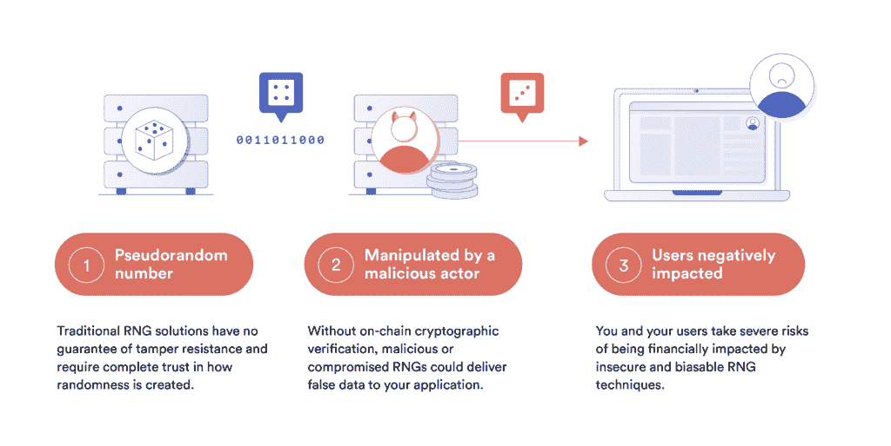
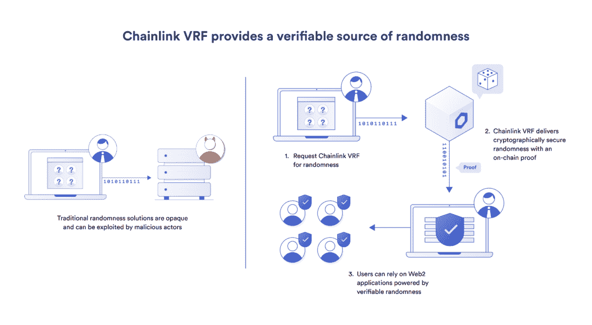
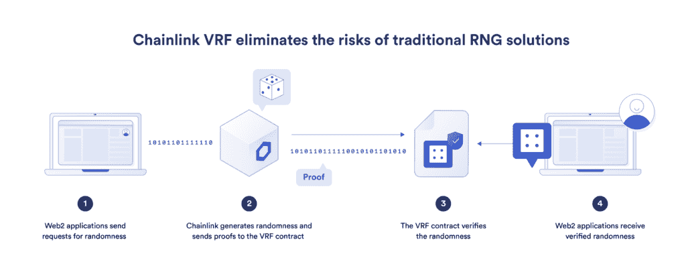
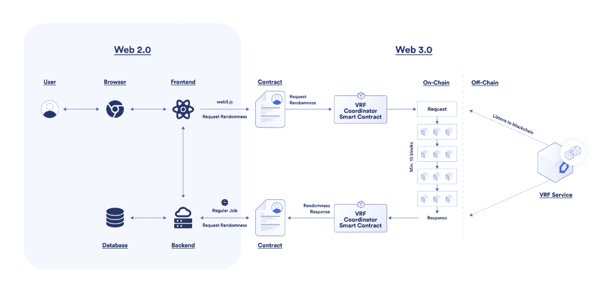
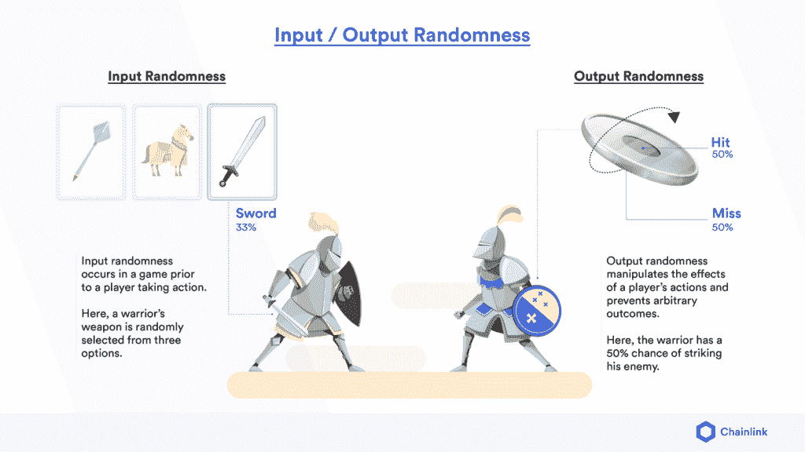

# Web2 的可证明公平的 RNG

> 原文：<https://blog.chain.link/provably-fair-rng-for-web2/>

传统的随机数发生器(RNG)已经具有密码安全性，并且易于使用。那么，为什么 Web2 应用程序需要 VRF 链呢？

一般来说，Web2 用户必须信任他们用于随机结果的应用程序，例如抽牌、挑选抽奖的获胜者等。实际的随机性生成发生在应用程序后端的一个黑盒中，无法保证公平性，也无法让最终用户验证结果。在某些情况下，服务提供商会对其 RNG 流程进行审核，但这无法向最终用户保证内部人员没有从 RNG 结果中获益，因为没有办法验证这一点。通过使用 Chainlink VRF，Web2 项目可以将防篡改和可审计的随机来源集成到他们的应用程序中。

不仅[chain link VRF](https://chain.link/chainlink-vrf)被证明是公平的随机性加强了游戏、营销和分析行业的一系列 Web2 产品，它还开启了以前不可能的新用例。现在，随着 Chainlink VRF 获得 BMM Testlabs 的合规认证，受监管的 iGaming 应用程序可以将其用作可验证的 RNG。公司可以利用 VRF 来增加用户透明度，制造更好的产品，强化品牌，并获得竞争优势。

在这篇文章中，我们探讨了 Web2 中使用的当前 RNG 的局限性，Chainlink VRF 如何为 Web2 应用解锁 [可验证的随机性](https://blog.chain.link/chainlink-vrf-on-chain-verifiable-randomness/) ，以及它支持的无数用例。最终，Chainlink VRF 是将所有 web 应用程序推向信任最小化标准的又一步。

## 传统 Web2 RNGs 的局限性

随机数对于许多 Web2 应用程序来说至关重要。虽然 Web2 中使用的最流行的 RNG 提供了高效的随机性来源，但它们通常具有安全性和透明性限制，这会破坏使用它们的产品。

### 伪随机数发生器(PRNGs)的问题

prng 使用数学公式生成一个看似随机的序列，比如 Javascript 中的 Math.random()函数、Python 中的 random.randint()和 Rust 中的 rand。虽然用于生成随机数的有限计算使它们变得高效和可伸缩，但它也使它们变得可预测。**prng**的问题在于，它们是可以逆向工程的确定性算法，这使得使用它们的应用程序容易受到操纵和攻击。

<figcaption id="caption-attachment-4332" class="wp-caption-text">PRNGs can be reverse-engineered by malicious actors, leaving them vulnerable to manipulation and attacks.</figcaption>

例如，卡巴斯基密码管理器中的一个现已修补的 [漏洞](https://blog.ledger.com/kaspersky-password-manager) 使得恶意行为者可以对使用该应用程序存储的密码进行逆向工程。网页版依赖于 Javascript 上的 Math.random()函数，该函数不包含足够的熵来生成安全密码，而桌面版使用了一个梅森图 PRNG，可以通过配置公共可用的[rand crack](https://github.com/tna0y/Python-random-module-cracker)工具，使用其 52 个密码输出进行逆向工程。

这些 PRNGs 的根本问题是它们在计算上不够复杂，可能会被暴力攻击利用。这就是为什么在种子中使用足够熵的计算更复杂、密码更安全的 PRNGs 是提高安全性的必备条件。

### 密码安全 prng(cs prng)的局限性

密码安全 prng 比普通 prng 更强大，因为它们是用高熵种子和更复杂的算法生成的，这使它们更不可预测，对逆向工程来说计算量更大。流行的 CSPRNGs，如 Mac 和 Linux 等基于 UNIX 的操作系统上的[/dev/random](https://support.apple.com/en-gb/guide/security/seca0c73a75b/web)函数，以及 Windows 上的[CryptGenRandom](https://docs.microsoft.com/en-us/windows/win32/api/wincrypt/nf-wincrypt-cryptgenrandom)使用硬件和随机系统函数生成的熵来播种随机性。 虽然 CSPRNGs 既高度安全又高效，但它们有一个关键的局限性——它们是不可验证的。使用的随机性来源缺乏透明度 ，这 **要求用户相信集中式数据提供者不会为了自己的利益而操纵结果** 。 随着对 [加密保证结果](https://blog.chain.link/what-is-trust-minimization/) 需求的不断增长，这种缺乏透明性和对集中式实体信任的要求对于依赖 CSPRNGs 的 Web2 应用来说可能是一个主要的缺点。

<figcaption id="caption-attachment-4333" class="wp-caption-text">While traditional RNGs can be manipulated without users knowing, Chainlink VRF provides cryptographic proof enabling users to verify the integrity of the random number provided.</figcaption>

## 利用可证明公平的 RNG

Web3 是互联网的下一次发展。它使用 [区块链技术](https://blog.chain.link/what-is-blockchain/)[智能合约](https://chain.link/education/smart-contracts) 和[Oracle networks](https://blog.chain.link/what-is-the-blockchain-oracle-problem/)来提供更加安全可靠的基于 web 的服务。幸运的是，对于许多 Web2 应用程序来说，它们不需要构建全新的产品和基础设施来利用 Web3 的许多优势。相反，他们可以将信任最小化的 Web3 服务(如 Chainlink VRF)整合到现有的应用程序中。

### VRF 链:一个可验证的密码安全的 RNG

[【chain link 可验证随机函数(VRF)](https://chain.link/chainlink-vrf) 使用密码术来创建任何人都可以独立验证的防篡改且可证明公平的随机源。与 Web2 中使用的现有 RNG 相比，加密安全和可验证提供了许多好处。

<figcaption id="caption-attachment-4330" class="wp-caption-text">Chainlink VRF delivers a tamper-proof source of randomness that users can verify is fair and unbiased.</figcaption>

Chainlink VRF 由行业领先的 Chainlink 网络提供支持，这是一个分散的 oracle 网络，为应用程序提供防篡改的输入、输出和计算。VRF 的工作原理是将发出随机性请求时未知的块数据与 oracle 节点预先提交的私钥相结合，以生成随机数和相应的加密证明。这使得消费应用程序只接受加密安全的随机数，并允许其用户独立验证随机源未被篡改。

使用 Javascript 的 Web3.js、Python 的 Web3.py 或 Java 的 Web3j，Web2 开发人员可以轻松地将 Chainlink VRF 集成到他们的应用程序中。该框架允许开发人员通过 HTTP、WebSocket 或 IPC 连接轻松访问以太坊节点的 JSON RPC，并将 VRF 链生成的可验证随机性整合到他们的应用程序中。这使得 Web2 开发人员能够在其 Web2 应用程序中利用 Chainlink VRF 的高安全性和透明性。

### 用于 Web2 的 Chainlink VRF 的优势

#### 可验证的

用户可以通过张贴在 chain 上的加密证明，独立验证来自 Chainlink VRF 的随机输入的完整性，这意味着他们不再需要信任一个中央实体，即随机数没有被操纵。

#### 可证明公平

用户拥有加密证明，证明生成的随机数是真正随机的，这意味着依赖它的应用程序可以提供可证明的公平和不可预测的结果。

#### 防篡改

与随机数一起提供的加密证明使消费应用程序能够验证所使用的随机性没有被任何人操纵，包括生成随机数的先知。

#### 不可预测

当提出链接 VRF 请求时，用作种子一部分的块数据尚未创建，因此未知。这确保了生成的随机数是不可预测的。

#### 透明

Chainlink VRF 公司使用的代码是开源的，使每个人，从独立用户到组织，都能检查生成随机数的过程。

#### 无缝集成

Chainlink 服务易于集成到 Web2 应用程序中。只需更改一些参数，开发人员就可以根据项目的技术需求配置随机输出。

#### 符合性认证

链家 VRF 通过[BMM Testlabs](https://bmm.com/bmm-testlabs-grants-the-first-compliance-certification-in-the-blockchain-industry-to-chainlink-vrf/)获得 GLI-19 合规认证。这使得受监管的 iGaming 应用程序能够在其应用程序中使用 Chainlink VRF 作为可验证的 RNG。

## 链节 VRF 的 Web2 使用案例

可验证的随机性可以使一系列 Web2 应用受益，包括在线游戏、营销活动、抽奖和数据分析。虽然密码安全的 RNG 很常见，但密码安全且 可证明公平的 RNG 解锁了大量新的 [用例](https://blog.chain.link/blockchain-rng-use-cases-enabled-by-chainlink-vrf/) ，并实现了高完整性流程。

<figcaption id="caption-attachment-4343" class="wp-caption-text">Web2 developers can leverage Web3 technology by incorporating Chainlink VRF into their applications.</figcaption>

### 网络游戏

公平是一款优秀游戏最重要的方面之一，而随机性通常会影响游戏结果，因此一个可证明公平的随机性来源是许多在线游戏的必备条件。

#### 受监管的互联网应用的可验证 RNG

通过认证游戏认证实验室 BMM Testlabs 的 GLI-19 合规认证，受监管的 iGaming 应用程序可以使用 Chainlink VRF 作为受监管的 iGaming 应用程序。正如 BMM Testlabs 的 iGaming 业务开发经理 Maria Romero 所说，“作为区块链行业的首批认证之一，BMM 为开发区块链游戏解决方案的公司以安全合规的方式获得认证铺平了道路，这是以前所没有的。”

#### 在战斗和冒险游戏中创造不可预测的结果

当玩家行动的结果不可预测时，例如用剑攻击对手，游戏会更加刺激。通过 Chainlink VRF 生成不可预测的结果，让不同技能水平的玩家相互竞争的游戏更加有趣， **让观众观看的** 更加有趣，并可以确保即使玩家提高技能，游戏仍具有挑战性。

<figcaption id="caption-attachment-1481" class="wp-caption-text">Chainlink VRF enables unpredictable gaming outcomes such as the amount of damage a blow in a fighting game inflicts.</figcaption>

#### 在元宇宙中产卵玩家位置和放置物品

Metaverses 有许多令人兴奋的功能和隐藏的“复活节彩蛋”。如果玩家在一个随机的地方产卵，他们将会享受到游戏所提供的更多新奇的东西。类似地，随着物品被空投到随机区域，玩家可以探索地图的不同部分。虽然一些 RNG 可能会导致玩家在相同的位置产卵和空投物品，但 Chainlink VRF 确保它们会以随机模式分散在地图上，帮助 **游戏保持更长时间的参与。**

#### 在 PvP 比赛中匹配玩家

无论是元宇宙的皇家战役还是有真实奖励的第一人称赛车游戏，你的对手都可能是玩家晋级锦标赛的决定性因素。用 Chainlink VRF 将玩家配对过程随机化可以给每个人一个 **公平的机会** 与技能最高或最低的对手竞争。

#### 从战利品箱中分发稀有物品

当被玩家打开时，战利品盒会分发游戏中的物品，如武器或药剂。稀有物品，如强力武器或限量版皮肤，深受玩家追捧。链环 VRF 可以帮助确保它们被随机分配， **确保** **没有玩家获得不公平的优势** 。

#### 向玩家发牌

桥牌和扑克等纸牌游戏既依赖运气，也依赖技巧。通过使用 VRF 链帮助分发卡片，玩家可以验证他们最初拿到的手牌是可证明公平的**。**

 **#### 支持基于奇数的游戏

一些游戏，比如扔硬币，完全取决于运气，技巧对游戏的结果几乎没有影响。鉴于随机性是游戏的核心特征，并且这些游戏相对容易开发，来自 Chainlink VRF 的可验证随机性可以 **将游戏与其竞争对手** 区分开来。

### 营销活动

通过将一个看似普通的事件变得非同寻常，营销人员可以强化他们的品牌，吸引消费者的注意力，并扩大他们的市场份额。VRF 链家可以为任何营销活动注入兴奋感和新鲜感，同时展示公司对可证明的公平、高度诚信流程的承诺。

#### 用户赠品

获得新用户、增加产品使用或探索更新功能可以通过随机赠品来激励。Chainlink VRF **为这一过程增加了透明度** ，因为用户可以验证每个人都有平等的访问权，公司内部人员没有任何特殊优势。

例如，[SmartCon 2022](https://smartcon.chain.link/)涉及七名幸运门票持有者的竞争，他们可以获得与 Chainlink 联合创始人谢尔盖·纳扎罗夫一起坐下来吃巨无霸的机会。通过使用 Chainlink VRF 帮助随机选择获胜者，抽奖的完整性得到了加强，同时还有一种乐趣，这有助于比赛在社交媒体上得到广泛分享

#### 新颖的产品特性

公司可以 **为他们的产品发布引起关注** 通过使用 VRF 链家随机确定新颖的产品特征，如独特的颜色、限量定制或粉丝生成的设计。

#### 选择事件地点

许多会议、活动和节日都有热情的粉丝群，他们希望组织者选择他们的城市来举办活动。不用组织者做决定，他们可以使用 VRF 链家，向他们的粉丝展示一个地点是从一系列合适的场地中公平选择的**。**

 **#### 游戏化奖励

营销人员可以通过将用户获得的奖励游戏化来提高忠诚度计划的吸引力。当用户要求他们的奖励，VRF 链家可以随机分配给他们几个可能的奖励之一。这使得忠诚计划的每个成员都有 **的公平机会赢得奖池中更高价值的项目** ，如假期或新车，确保忠诚计划的每个成员都有公平的机会获胜。

### 莱佛士

赌注越高，奖品越有价值，高诚信的流程对用户来说就越重要。VRF 链家有助于确保每个参赛者都有公平的机会赢得抽奖。

#### 公平分配演唱会门票

粉丝们对他们最喜爱的艺术家有着难以置信的热情，并为能参加他们的演唱会而兴奋不已。这些活动经常被超额预订，许多用户错过了获得门票的机会，通常是因为门票销售开始时他们无法在线。不是在设定的时间提供门票，而是给粉丝一个设定的时间参加抽奖，然后 VRF 链节可以用于 **在所有参赛者** 之间公平分配门票。

#### 选择获奖者

莱佛士通常拥有价值不菲的奖金池，参赛者希望获胜者的评选过程完全公平。可验证的随机性提供了证据，证明随机性的来源没有以任何方式被篡改或操纵。最终这个 **为抽奖活动建立了信誉** 并吸引了更多的参与者。

[猿类协会](https://medium.com/@theapesociety/the-ape-society-integrates-chainlink-vrf-to-help-power-dao-funded-community-raffles-557e3af3b03e) 正在使用 Chainlink VRF 来提高其抽奖活动的完整性。虽然他们是一个[web 3](https://chain.link/education/web3)-本地项目，但他们使用 Chainlink VRF 的方式类似于 Web2 公司如何利用该技术。每周，Ape Society 都会举办一次抽奖活动，将该项目产生的版税的 10%分配给七名幸运的获奖者。考虑到可验证的随机性的影响，该项目创始人表示，使用 Chainlink VRF“有助于在参加我们即将举办的活动时，给我们的社区带来更强的安全感。”

### 数据分析

Chainlink VRF 被播种了足够的熵，并使用足够复杂的加密算法来确保生成的所有随机数都是完全不可预测的，这使得它成为需要 [真随机性](https://blog.chain.link/why-randomness-web3/) 的数据分析的理想输入。此外，Chainlink VRF 使任何人都能够验证数据集中使用的随机性的完整性。

#### 公正的欺诈检测

金融服务和安全行业依靠随机数据选择来识别欺诈交易和恶意活动的早期迹象。鉴于这些系统负责保护的巨大价值以及不公平地锁定用户的可能性，Chainlink VRF 的防篡改和无偏见随机性可以提高欺诈检测过程的完整性，并向客户发出安全是重中之重的信号。

#### 具有足够熵的播种机学习算法

机器学习正成为企业越来越重要的工具，无论是用来帮助检测有缺陷的产品还是确定最有效的营销活动。运行模拟时经常使用随机性。通过 Chainlink VRF 提供足够的熵有助于确保从这些过程中产生的数据是可靠的。

## 前瞻性网络 2 公司的机会

传统 RNG 似乎足以满足当前的 Web2 环境。然而，与链环 VRF 相比，它们在随机性验证方面的局限性就显露出来了。链环 VRF 是密码安全和可验证的。

用户会更喜欢什么:一个在后端隐藏其随机性来源的产品，还是一个利用可证明公平、防篡改的 RNG 来发布加密证明以验证其完整性的产品？对于受益于透明度的用例，如游戏、营销活动、抽奖和数据分析，VRF 链家比传统 RNG 有明显的优势。

整合了 Chainlink VRF 公司的 Web2 公司可以在其垂直业务领域获得竞争优势。虽然从长远来看，Chainlink VRF 可能会成为受益于透明性的 Web2 用例的标准随机性解决方案，但短期内对早期采用者来说，这是一个在其领域建立差异点的机会。除了帮助企业生产更好的产品，VRF 链家还能帮助企业建立一个基于公平、诚信和透明原则的品牌。

VRF 链家让 Web2 公司能够立即从 Web3 技术中获益。

如果你是一名开发人员，想要快速将你的应用程序连接到 [【链接 VRF](https://chain.link/solutions/chainlink-vrf) ，请访问 [开发人员文档](https://docs.chain.link/docs/chainlink-vrf/) ，并加入 [不和谐](https://discordapp.com/invite/aSK4zew) 中的技术讨论。如果您想安排一次电话会议来更深入地讨论整合事宜，请点击 [这里的](https://chainlinkcommunity.typeform.com/to/OYQO67EF?page=announcement) 。****