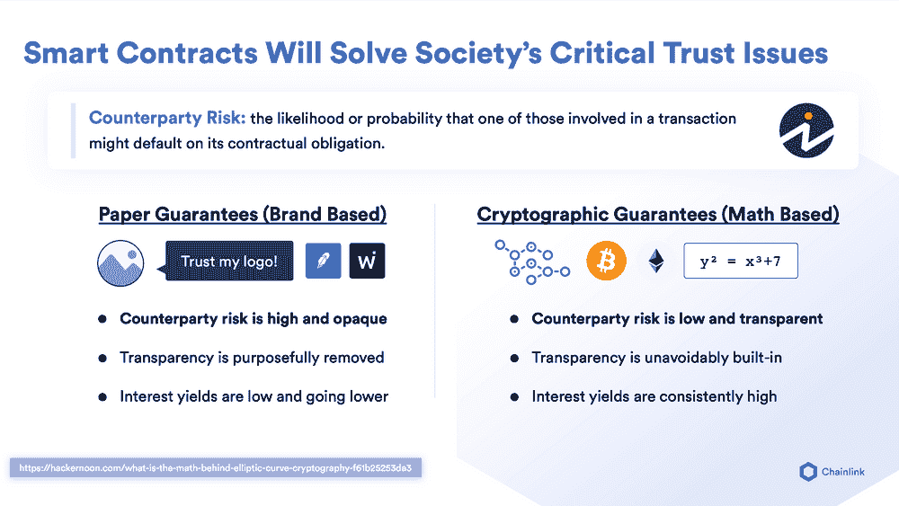
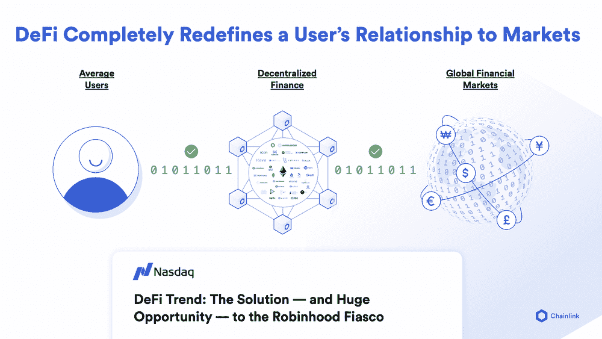
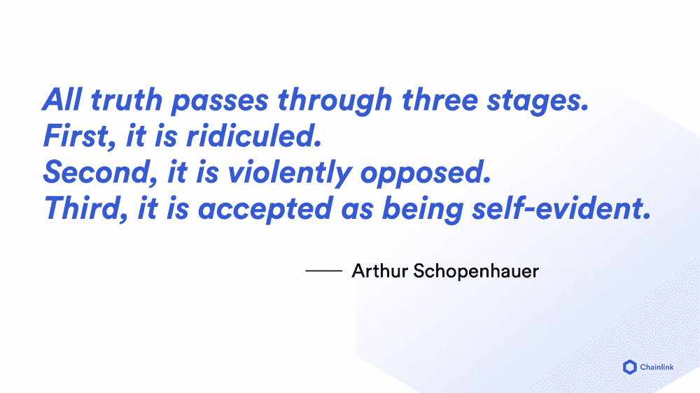

# 基于品牌的协议与基于数学的协议

> 原文：<https://blog.chain.link/brand-based-vs-math-based-agreements/>

今天，大多数人与现有机构的关系都是基于品牌的协议——书面承诺，要求你相信一个机构会履行其义务，仅仅因为他们的声誉。基于品牌的协议总是面临交易对手风险，即交易中的一方违约的可能性。随着[智能合约](https://chain.link/education/smart-contracts)的出现，一种新的协议形式出现了——*基于数学的协议、*使用加密技术和不可变的软件逻辑，根据合同参数自动结算协议。基于数学的协议的不信任性质意味着人们不再需要依赖其他方来维护他们的义务，因为合同总是会根据其预定义的条款来强制合作。

在基于品牌的协议中，如果对他们的声誉没有长期的不利影响，大型组织有时会在经济上受到激励而违反他们的合同义务(参见[不诚实保险公司的经济学](https://link.springer.com/article/10.1057/s10713-019-00047-7))。当大型机构不遵守诺言时，普通人就没有合理的追索权，因为合法地追求大型实体既昂贵又低效。基于数学的协议现在让普通人能够期待围绕其金融交易的端到端透明和自动化，特别是在新兴市场，因为监管法律不完善，大型机构更有可能违约。

在最近的 Real Vision 播客中，[Oracle 和区块链实用程序的扩展](https://www.youtube.com/watch?v=BVUZpWa8vpw)，Chainlink 的联合创始人 Sergey Nazarov 讨论了基于品牌和基于数学的合同。这篇博客文章摘自 Sergey Nazarov 的演讲，强调了[区块链](https://blog.chain.link/what-is-a-blockchain-and-how-can-it-impact-the-world/)和 Chainlink [甲骨文](https://chain.link/education/blockchain-oracles)如何帮助降低交易对手风险，实现公平、透明和高效的数字协议的未来。

 

## 基于品牌的合同的问题是

简单来说，从用户的角度来看，智能合同是基于数学的合同协议。我认为对比它们的方法是考虑基于品牌的合同协议。这将突出“防篡改”的概念和效用，因为很多时候，区块链是在防篡改和可靠性、防审查和不变性这些技术参数中解释的，这些概念并不总是转移到用例中。

我们需要的是理解当今世界的运行方式与基于数学的协议的运行方式之间的差异。人们可能不会想太多，因为它似乎在起作用，或者在某些情况下起作用，所以已经足够好了，那就是他们围绕银行账户、资产、金融工具达成的协议，实际上是基于品牌的协议。

基于品牌的协议是一个标志——某处的建筑上有一个标志，就像在狂野的西部一样。最大的建筑是有柱子的银行，每个人都会把钱存在有柱子的银行里，因为这是最好的、最令人印象深刻的建筑，甚至比教堂还要好。那是银行在那种金矿镇给你的品牌担保。在过去的几百年，甚至几千年里，基于品牌的担保并没有发生太大的变化。

“我有一个标志。我的标志代表一个机构或一个实体。我的机构或实体已经存在了 X 年，我向你保证，在书面文件上，我与你的关系是这样的，你的资产或你的金融产品或你在我的机构中持有的价值都在你的控制之下。您将能够访问它。你将能够买卖金融产品。你将拥有一个随时可以使用的储蓄账户。你储蓄账户里所有你可以随时取用的钱。交易账户里的所有钱你都可以随时交易，随时可以变现。”所有这些类型的担保基本上都是基于一个标志。它们基于机构的承诺，“我已经存在很长时间了。我会继续存在。我向你保证，我为你的价值而经营的这种关系，你与我之间的关系，将以某种方式发挥作用。”这些都是基于品牌的协议。

## 基于数学的协议的好处

现在，基于数学的协议基本上是说，“没有品牌。没有什么东西已经存在了几百年，它向你保证在纸质文件中事情会以某种方式运行。只有数学。”因此，在物理和数学的层面上，有密码学和数学来保证，你与某种资产、某种金融产品或某种合同有某种关系。

这意味着什么呢？我们以比特币为例。不管比特币的价值如何，不管比特币在全球市场上的价值如何，用户与比特币的关系是，他们有一种叫做私钥的东西。因此，他们有一种加密的强制方式来签名，并从数学上证明他们拥有，也只有他们拥有，对这个由成千上万台计算机组成的网络中的数字产品的控制权。

<figcaption>As opposed to paper guarantees, cryptographic guarantees build security and transparency into transactions. </figcaption>

我会给你一个例子来说明这是从哪里开始有意义的。如果你看看几年前发生在希腊的债务危机，你会发现人们只能从自动取款机上每个实体和每个人提取 66 欧元。所以不管你是实体企业，还是个人，你都只能提取 66 欧元。你在某些国家也有类似的情况，那里的事情并不尽如人意，你的自动提款机和银行控制被锁定。

你还看到，在所有这些地区，比特币钱包的注册数量增长了 300%，400%，600%，因为人们基本上意识到，他们与某项资产的关系并不是他们想象的那样。他们认为他们的关系是非常确定的。很直接。这是在物理学的层面上，和一定数量的保证和担保。而现实是——这是非常不同的。

就像保险单一样。人们不知道他们的保险单里有什么。实际上，依靠基于品牌的协议来巩固其与资产关系的人，对交易对手的理解也是一样的。当一个国家出现问题时，人们普遍感到惊讶，自动取款机被锁起来，他们转向比特币。他们转向比特币的原因是，即使你有 10 亿美元的比特币也没关系。如果你有了私钥，如果你有了移动资产的数学证明，除非物理和数学开始以不同的方式工作，否则这不可能发生。

这就是基于品牌的担保和基于数学的担保之间的独特区别。这种差异实际上比人们想象的要大得多，这种差异未被充分认识的部分原因是——嗯，基本上，当一切都在工作时，一切都很好。这就是全球金融体系的基本运作方式。一切都在工作，所以一切都很好，你真的不需要对你的交易对手风险评估和交易对手风险管理进行重大改进，因为一切都在工作。我可以动用我的资产。我可以清算他们。我可以对他们做任何我想做的事。

<figcaption>DeFi enables permissionless math-based contracts.</figcaption>

## 走向基于数学的协议世界

假设有一种不幸的可能性，即全球金融体系现在的方向是，其潜在的偿付能力和潜在的假设可能会导致无法获得资产的某些问题。作为持有价值或持有资产的一种方式，交易对手风险变得显而易见。这就是基于数学的协议的独特之处，即使是最简单的形式。比特币是基于数学的协议的最简单形式。是第一个，也是被采用最多的一个。但绝不是唯一的。还有很多很多其他形式的基于数学的契约协议，它们采取了其他代币的形式。现在他们开始采取分散金融产品的形式。但它们从根本上拥有的是这种级别的控制、这种级别的透明度以及交易对手风险评估和缓解，这是传统金融市场所不具备的。

我认为这是一个非常重要的区别，随着潜在偿付能力问题的浮出水面，这一点将会越来越受到重视。随着在这些 DeFi 产品中工作的智能合约的透明度开始受到重视，你也可以看到人们以非常有用的方式编写它们。所以从根本上来说，从用户的角度来看，这是一个基于数学的合同协议。从技术角度来看，它基本上是一段代码，代表一项资产，或代表所有权，或代表一种金融产品，但这段代码在一个不受任何一方控制的计算机系统中运行。这不是持有价值的人所能控制的。有些人希望他们停止清算自己的价值，或者控制自己的价值，这超出了他们的控制范围——这就是它的独特之处。

然后，因为你现在已经有了合同协议、金融产品和所有权，你已经把它变成了小块的代码，现在你可以让许多许多聪明人构建这些代码的各种配置，这涉及到创建一个生态系统——这就是 [Chainlink](https://blog.chain.link/what-is-chainlink/) 所涉及的。一旦你创造了一个生态系统，人们能够以代码片段的形式组合这些基于数学的契约，你就会开始看到新的金融产品和资产的爆炸，就像你看到互联网公司可以做的事情的爆炸一样。

因为一旦互联网公司可以将单个的小代码片段组成代码链，以有意义的新方式相互作用，你会看到电子商务，你会看到优步，你会看到所有这些其他种类的创新，这些创新实际上是以独特的方式将其他代码片段组合在一起。因此，一方面，你会得到一个系统，让人们有能力妥善管理对手风险。另一方面，你会得到一个生态系统，人们最终可以像互联网公司构建网络产品一样构建金融产品——以同样的速度，以同样的可用性，满足人们对网络的期望。

### 关于这个话题的更多信息

*   什么是智能合同？
*   [什么是 Chainlink？](https://blog.chain.link/what-is-chainlink/)
*   【Chainlink 如何帮助区块链跨越鸿沟成为主流