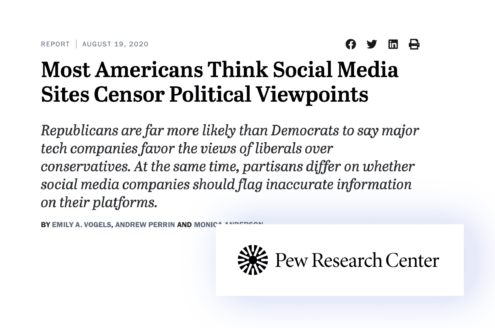
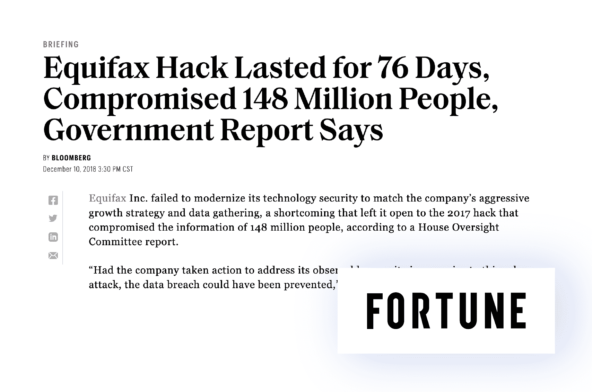
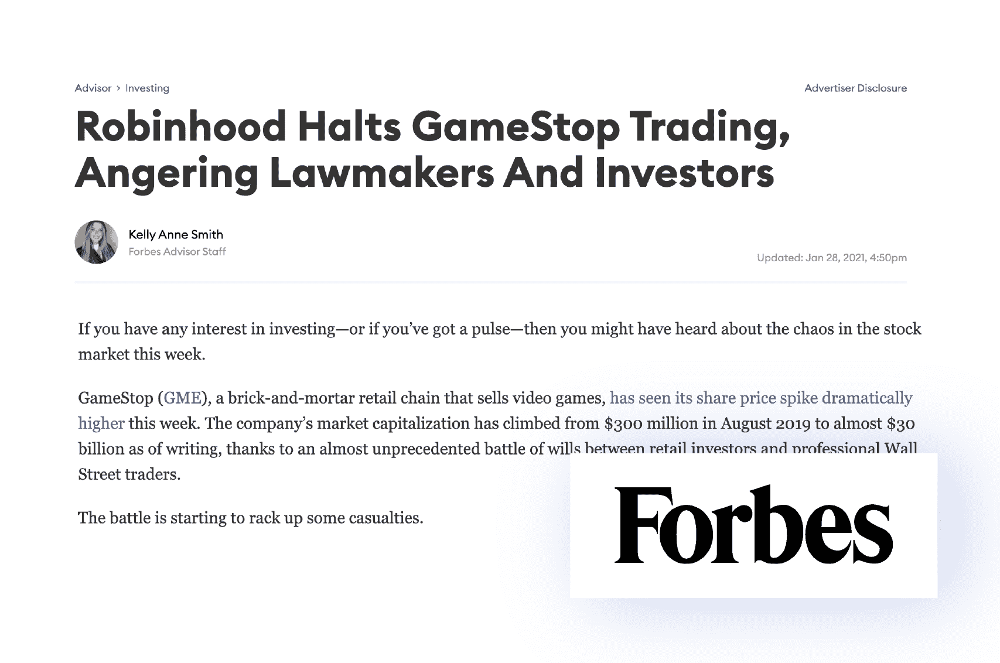
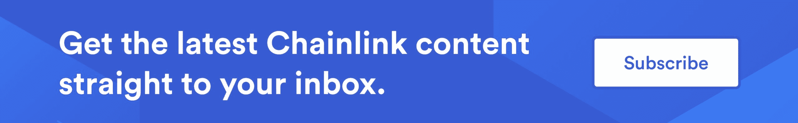
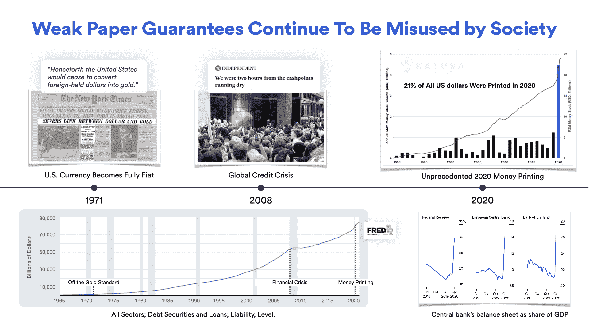
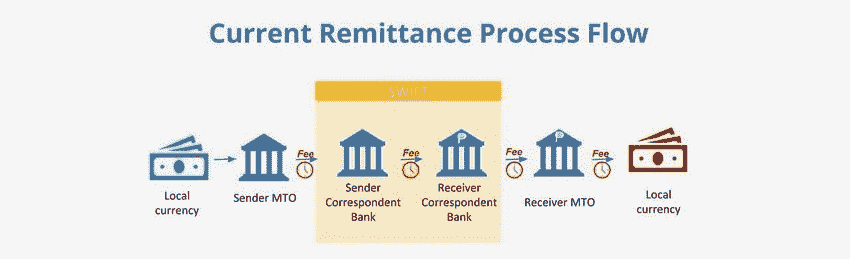
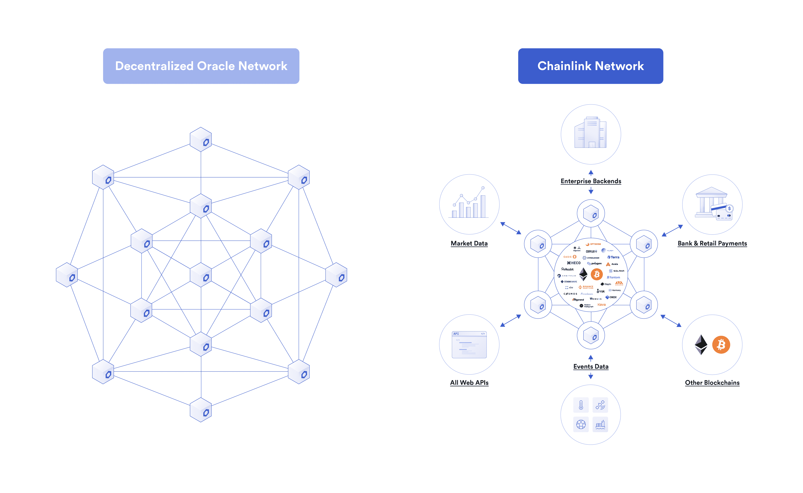
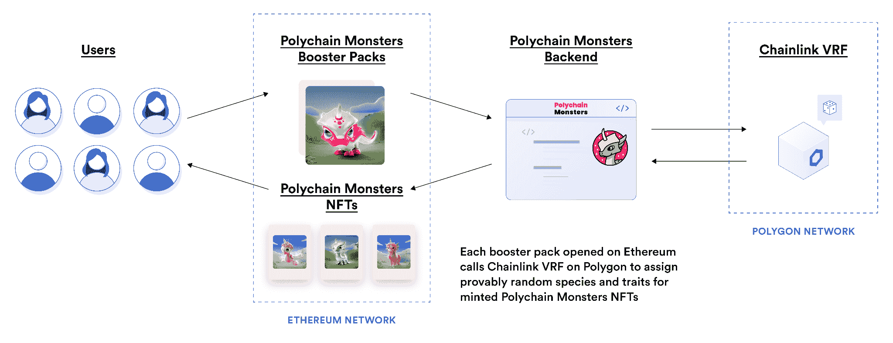
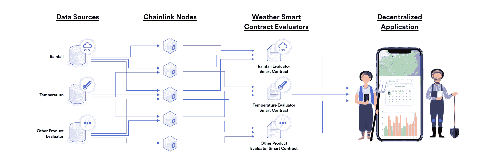

# 密码到底是什么

> 原文：<https://blog.chain.link/what-crypto-is-really-about/>

这是关于信任的未来的两部分系列的第一部分。请阅读第 2 部分，[加密真相:信任最小化计算和记录保存的未来](https://blog.chain.link/what-is-cryptographic-truth/)，了解支撑区块链技术的加密基础以及 Chainlink oracles 如何将加密保证的范围扩展到链外世界。

“信任”一词在区块链行业是一个备受争议的术语，工程师们经常提到 *零信任* 交互系统、 *无信任* 事务，以及其他 *信任最小化* 技术。尽管在区块链，个人对信任的理解有所不同，也有重叠，但信任将永远是理解密码真正含义的核心。

源自古挪威语 *traust* ，意为“信心”，也是“庇护”，信任在历史上指的是一个人对他人和过程会信守承诺的信念程度。信任是运转良好的社会的基础:高度信任的社会通常有更多的经济活动和更大的社会和谐，这要归功于交易对手风险的降低和更公平的争端解决。

不幸的是，对负责促进核心社会和经济活动的机构的信任正在开始瓦解。例如， [盖洛普民意测验](https://news.gallup.com/poll/1597/confidence-institutions.aspx) 表明，美国民众对国家许多主要机构的信心在过去 45 年中一直在下降。虽然不信任的程度因行业和国家而异，但从当前对现有体系的负面情绪来看，人们显然在寻求更公平的解决方案。

区块链、加密货币、智能合约和神谕已经成为以更加安全、透明和可访问的方式协调社会和经济活动的新技术。最重要的是，这些技术正在揭示密码保障的力量——我们常说的 *【密码真相】* 在恢复用户对日常交互的信任方面。

***注:*** *我们在广义上使用“app”一词，是指任何与公司、政府或同一平台上的其他用户进行交互的界面，无论是你在手机上下载的应用还是网站上的应用。此外，在解释区块链时，我们重点关注未经许可的区块链(如以太坊、比特币)，因为它们被广泛采用，而不是经过许可的区块链。*

## 问题:社会信任的崩溃

在现代社会的许多方面，人们对传统机构和程序的信任明显下降。下面列出了导致不信任的四个问题，它们直接影响生活质量和经济繁荣。

### 数据和流程的集中所有权

互联网最初设计方式的一个结果是应用程序大多是集中式的。中央实体通常拥有应用的知识产权(IP)，控制其后端计算，对其未来发展做出关键决策，并从任何数据和产生的收入中获利。这种集中化在用户和应用程序之间创造了一种不平等的关系，这种关系很容易被滥用，并加剧不信任。

例如，应用程序经常可以单方面审查用户的行为。虽然这种行为可能被认为是明显违反服务协议条款，如消除非法活动，但在许多情况下，审查是基于对模糊政策的主观解释。这就对平台的 [可信中立](https://nakamoto.com/credible-neutrality/)——不歧视任何特定人群——提出了质疑，尤其是在平台自身的财务利益受到威胁、受到外部政治或社会压力、或者用户的个人意见与平台自身意见不直接一致的情况下。这些力量导致了关于社交媒体、金融服务、内容流和各种其他平台是否有理由审查或不审查某些内容的两极分化的辩论。

<figcaption id="caption-attachment-3320" class="wp-caption-text">“A Pew Research Center survey conducted in June (2020) found that roughly three-quarters of U.S. adults think it is very (37%) or somewhat (36%) likely that social media sites intentionally censor political viewpoints that they find objectionable.”</figcaption>

集中化也导致了权力结构，在这种结构中，一小部分人在很大程度上控制着平台收入的分配和发展方向，而用户却没有多少发言权。虽然所有者通常会启动和管理应用程序，并在一定程度上对他们的成功负责，但用户作为内容创作者通常会为应用程序提供巨大的价值，这也是事实。例如，用户通过他们生成的材料赋予社交媒体平台价值，这些材料由应用开发者通过广告直接货币化。这无疑让用户质疑他们是否得到了公平的补偿和代表。

用户也越来越担心 [不得不信任应用程序及其敏感数据](https://www.washingtonpost.com/technology/2021/12/22/tech-trust-survey/) 。由于用户经常需要创建帐户来与应用程序交互，应用程序负责存储用户的个人信息。这种集中式存储模式为黑客打开了一个攻击点，导致了大量数据泄露，例如[Equifax](https://www.upguard.com/security-report/equifax)就是这种情况。这也是为什么应用程序能够在不与用户分享收入的情况下从用户数据中赚钱。正如许多人建议的那样，“如果它是免费的，那么你就是产品”是大多数 Web2 经济模式的基础。

<figcaption id="caption-attachment-3321" class="wp-caption-text">Equifax, one of the largest consumer credit reporting agencies, leaked the sensitive personal data of 148 million Americans, including names, home addresses, phone numbers, dates of birth, social security numbers, and driver’s license numbers.</figcaption>

### 没有共同的真理感

不信任的另一个原因是，社会或经济关系中的参与者并不总是参照相同的真理来源。例如，在许多业务关系中，所有参与者都维护自己的记录集。单个参与者的诚实错误不仅会导致漫长的对账过程，而且各方还可能故意伪造记录，以试图延迟协议、逃避义务或向交易对手展示虚假的成功感。

看看 Wirecard 丑闻就知道了，当德国公司 Wirecard 被发现参与欺诈性会计行为，以 [掩盖其资产负债表上 19 亿欧元的失踪资金](https://www.cnbc.com/2020/06/29/enron-of-germany-wirecard-scandal-casts-a-shadow-on-governance.html) 时，许多金融服务公司都蒙受了损失。类似地，2007—2008 年金融危机严重影响了全球金融业，这主要是因为对有毒抵押贷款支持证券(MBS)和 MBS 相关衍生品的系统性过度敞口缺乏共同理解。

<figcaption id="caption-attachment-3323" class="wp-caption-text">Many people in the UK couldn’t access their cash when Wirecard filed for insolvency, as several prominent Fintech apps relied on Wirecard for payment processing.</figcaption>

支撑这一趋势的是用户并不总是了解他们与机构之间的法律关系。尽管这种误解可能被解释为用户没有阅读服务协议条款的过错，但公平的问题是，用户是否应该花时间阅读和理解带有密集法律术语的长期合同，这些术语故意模糊，以便能够进行一系列解释。当事情进展顺利时，误解可能永远不会出现。然而，当意外事件发生时，用户通常会发现他们与机构的关系并不像他们想象的那样。不清楚的法律关系是为什么许多交易员在得知 Robinhood 可以在高交易量期间停止购买 GME 股票时措手不及，或者是为什么希腊公民在 2015 年震惊于他们的银行通知他们 [每天只能从自动取款机](https://www.businessinsider.com/greek-atm-limit-now-only-50-not-60-on-capital-controls-2015-6) 提取 60 欧元。

<figcaption id="caption-attachment-3322" class="wp-caption-text">Despite its mission of “democratizing finance for all,” many retail investors were left wondering if Robinhood in fact favored Wall Street hedge funds after the platform paused GameStop trading.</figcaption>

对于用户认为他们与社交媒体应用的关系，尤其是关于他们的数据是如何收集和共享的，以及应用的算法如何决定他们在新闻订阅中看到的内容，同样的误解也经常存在。特别是算法，由于其不透明的性质，用户无法理解为什么一些材料受到偏爱，而另一些材料根本没有显示出来，从而加剧了不信任。这种不明确性自然会导致用户提出政治偏见或未披露的影响，围绕着被认为真实可信的新闻和不真实可信的新闻，进一步导致信任的崩溃。

### 缺乏执行力度和问责制

在某些情况下，争议是不可避免的，所以当争议出现时，以一种被普遍认为公平的方式解决争议是至关重要的。然而，挑战在于较大的机构在争议解决过程中往往具有不对称的优势。这在老牌机构和零售用户之间的合同中尤其令人担忧，在这种情况下，机构知道他们有更多的回旋余地来违背自己的承诺，因为用户没有时间、资本或影响力来发起一场成功的诉讼。事实上，在一些发展中国家，面对强大的影响力和贿赂，法律制度是如此不可靠，以至于某些经济关系根本不实用。

[T2】](https://pages.chain.link/subscribe?utm_medium=referral&utm_source=chainlink-blog-what-crypto-is-really-about&utm_content=banner)

争端解决过程中的不信任也受到一种动态的影响，即一个机构变得如此强大，并与社会融为一体，以至于它变得“ [【太大而不能倒】](https://www.investopedia.com/terms/t/too-big-to-fail.asp)”——这是一个用来描述政府在做出糟糕决定后会出手救助的机构的短语，因为它们的失败带来了太多的系统性风险。该术语最初源于对大型银行和金融服务公司的公共救助，这些公司在 2007-2008 年金融危机期间因过度暴露于有毒 MBS 资产而破产。可以说，今天可以在政府和中央银行似乎缺乏问责制的情况下看到类似的动态，因为尽管它们宣布了控制通胀和促进经济稳定的目标，但高通胀和日益加剧的经济不平等仍然存在。

<figcaption id="caption-attachment-3324" class="wp-caption-text">Verbal and paper-based promises have been routinely misused by governments and institutions throughout history given weak enforcement mechanisms and lack of accountability.</figcaption>

### 低效的多步骤流程

通过可信第三方的加入和人工验证技术，可以在一定程度上抵消低信任度社会经济关系的风险。然而，这些过程会增加成本，延长等待时间，并增加信任假设。受到这种低效率影响的一个行业是国际汇款，在 2020 年，一笔 200 美元的交易平均产生 6.5%的费用.)，有时需要超过 24 小时才能结算。从技术上讲，由于数字技术的进步，汇款可以接近即时，但并非所有银行都相互信任。因此，支付必须通过几家代理银行才能到达最终目的地，这就产生了费用并延长了结算时间。

<figcaption id="caption-attachment-3332" class="wp-caption-text">International remittances can be subject to high fees, long wait times, a lack of transparency, and complex relationship management between banks.</figcaption>

## 解决方案:区块链和基于 Oracle 的信任网络

如果促进交易的基础设施能够保证公平的结果，而不是交易对手必须相互信任或信任第三方才能兑现他们的承诺，会怎么样？如果该基础设施没有中央管理员或所有者会怎样？

为了满足这些目标，这个基础设施必须体现两个关键的设计原则:最小提取协调和最小信任执行。

*   最小提取协调 是指基础设施以最小的、无价值的附加寻租促进用户之间的互动。与盈利性公司不同，这里的服务商除了连接用户之外，没有任何财务议程。例如，使用户能够以最小的交易费用买卖资产的金融市场。
*   **信任最小化执行** 指的是一个过程，其正确运行的概率在统计上非常高，几乎可以认为是有保证的。在某种意义上，用户不必信任基础设施。相反，基础架构被构建为确定性的，这意味着所有可能影响过程的潜在变量都被删除或减少到不完全按照编写/编码执行的可能性非常小的程度。有些人甚至将这种类型的基础设施称为不可信的，尽管人们可以说没有什么是真正不可信的。

区块链结合了这两种特性，充当最小提取协调器，以信任最小化的方式执行代码。区块链提供了这样的属性，因为它们没有中央管理员，而是分散的计算机网络，其在经济上被激励来维护谁拥有网络上的特定数据和资产的准确分类帐。每当有人创建新资产、将现有资产转让给另一个用户，或者在区块链上存储数据时，分散的节点网络都必须在批准之前就每个交互的有效性达成共识。例如，如果用户想从一个帐户向另一个帐户汇款，区块链将在执行交易之前验证用户是否有足够的资金来支付交易。

在区块链，分散共识和加密技术相结合，形成了加密真实性的基础——基于对已经存储在区块链总账中并被认为是真实的历史信息的验证，对新交易进行验证。在这个意义上，区块链是确定性的，因为批准新交易不需要新的或外部信息。

要更深入的了解区块链，可以参考这些文章: [什么是区块链技术？](https://blog.chain.link/what-is-blockchain/) 与 [区块链与神谕:异同与协同](https://blog.chain.link/blockchains-oracles-similarities-differences-synergies/) 。

<figcaption id="caption-attachment-3325" class="wp-caption-text">Traditional bank payments have banks serve as trusted custodians in between users while blockchain payments have blockchains act as trust-minimized non-custodial intermediaries.</figcaption>

虽然许多人认为区块链支持基于加密货币的支付系统，但区块链通过支持智能合约实现了更大的效用。智能合约是以防篡改的方式在区块链上运行的“如果 x，那么 y”程序。开发人员使用一个或多个智能合约来创建分散式应用程序(dApp)，智能合约本质上代表了用户在与 dApp 交互时必须遵守的条款和条件。要深入了解智能合约，请查看本文: [什么是智能合约？](https://chain.link/education/smart-contracts)

Oracles 对于创建高级 dApps 至关重要。由于区块链被保护的方式，它们本质上是与外界隔绝的——就像一台没有互联网的电脑。Oracles 支持区块链的基础设施，允许它们与外部数据和系统进行交互。通过这样做，oracles 使智能合约能够使用外部数据来触发其执行(例如，体育比赛结果来结算赌注)，将数据发送到外部系统进行结算(例如，支付消息来执行银行支付)，与其他区块链上的智能合约进行互操作，并执行在区块链上不可能或不切实际的计算。在这方面，oracles 启用了 [混合智能契约](https://blog.chain.link/hybrid-smart-contracts-explained/)——将链上代码与链外代码结合起来，形成一个应用程序。

[结果是由 Chainlink DONs 支持的新的](https://chain.link/) [智能合约用例](https://blog.chain.link/44-ways-to-enhance-your-smart-contract-with-chainlink/) 出现了爆炸式增长，例如在 [分散财务](https://chain.link/use-cases/defi)(DeFi)[不可替换令牌](https://chain.link/education/nfts)(NFTs)[即玩即赚游戏](https://blog.chain.link/what-is-play-to-earn/)(P2E)【T39】

要了解更多关于 Oracle 和 Chainlink 的信息，请参考这些文章: [什么是区块链 Oracle？](https://chain.link/education/blockchain-oracles) 和 [什么是链环？初学者指南](https://blog.chain.link/what-is-chainlink/) 。

<figcaption id="caption-attachment-3326" class="wp-caption-text">Chainlink decentralized oracle networks provide smart contracts on any blockchain with the ability to bidirectionally interact with any external system or resource in a secure, reliable, and accurate manner.</figcaption>

区块链和甲骨文的结合为协调经济和社会活动提供了一个端到端的信任网络。区块链充当编码、跟踪和执行数字合同的防篡改后端，而 oracles 使智能合同能够准确地验证现实世界的事件，与遗留系统无缝交互，并在区块链安全地互操作。该模型将应用程序和数字合同从概率性的和人为的转变为确定性的，并通过分散的共识进行验证。

## 未来:密码真理的力量重塑社会信任

通过将区块链和甲骨文支持的信任网络应用于上述原始问题，有可能建立一个基于真相的世界，在这个世界中，流程和人们坚持他们的协议和记录是高度可靠的。

### 数据的自我所有权和流程的分散所有权

区块链技术的最大优势之一是负责促进社会或经济活动的应用程序/机构的分散化。区块链技术可以创建可信的中立平台，平台因金融、政治或社会压力而任意审查用户的能力在很大程度上被消除。一旦条款和条件被编码到智能合约中并存储在区块链上，用户和 dApps 之间的关系对所有人都是透明的，任何一方或中央管理员都不能覆盖。

分散化的系统设计也消除了作为托管人的中介。相反，区块链类似于非托管服务商，其中 dApps 产生的所有数据都是公开可见且不可改变的，并且用户通过只有他们拥有的私钥直接控制他们的数据/资产。例如，任何人都可以查看比特币分类账的全部交易历史，任何人都可以保管他们的比特币，并将其发送给网络上的其他用户，而无需银行。

此外，保护隐私的甲骨文解决方案正在出现，如 [Chainlink 的 DECO](https://research.chain.link/deco.pdf) ，该解决方案旨在允许用户向 dApps 证明敏感信息，而无需公开披露。例如，用户可以证明他们生活在某个司法管辖区，或者他们的银行余额高于某个金额，而无需向 dApp 透露他们的地址或确切余额，最终消除了 dApp 存储凭据的责任，同时仍然可以使用它们。

<figcaption id="caption-attachment-3328" class="wp-caption-text">Chainlink DECO uses zero-knowledge proofs to enable the use of confidential data within smart contracts without revealing the data on-chain.</figcaption>

区块链和他们支持的民主行动党也在民主化获取他们的现金流。例如，以太坊区块链正在转向利益相关证明共识模型，在该模型中，世界上的任何人都可以在特定的智能合约中对其本地 ETH 加密货币进行利益相关(即以非托管方式锁定)以成为网络上的验证者。成为验证者后，用户可以获得以太坊区块链产生的一部分价值，作为验证用户交易的奖励。

类似的动态也存在于 DeFi 应用中，如 [曲线](https://curve.fi/) ，这是一种为低滑点交易设计的分散式交易所。在 Curve 中，用户可以选择在 staking smart 合同中锁定原生 CRV 令牌长达四年，这为他们提供了对 dApp 的治理权以及 dApp 产生的所有交易费用收入的 50%的比例百分比。

### 共享真相

区块链和 dApp 通常是开源技术，所有用户对驱动 dApp 的代码和其操作产生的数据有共同的理解。从本质上讲，区块链是一个单一的公共记录库，所有参与者都可以平等地获得这些记录，消除了对账争议，并使任何系统风险变得透明。交易还通过分散的共识机制进行验证，而不是单个用户或管理员的意见，这意味着用户和 dApps 之间的关系将遵循已编纂的条款。

当扩展到验证外部连接时，oracles 通常使用分散的节点网络和大量数据源来防止验证和执行中的任何单点故障。例如，[chain link Price Feeds](https://chain.link/data-feeds)是提供区块链实时资产价格以支持 [【去中心化金融(DeFi)](https://chain.link/education/defi#:~:text=Decentralized%20finance%2C%20or%20%E2%80%9CDeFi%2C,permissionless%20and%20transparent%20financial%20services.&text=In%20the%20DeFi%20economy%2C%20users,the%20involvement%20of%20centralized%20intermediaries.) 、向用户提供金融服务的 dApps 集合，如、衍生品、[stable coins](https://blog.chain.link/what-are-stablecoins/)等等。

<figcaption id="caption-attachment-3329" class="wp-caption-text">Chainlink Price Feeds, which currently help secure tens of billions of dollars in value across Decentralized Finance (DeFi), are oracle networks that provide real-time asset prices to dApps via decentralization at the data source, individual node, and oracle network levels.</figcaption>

其他生成共享真相的甲骨文解决方案包括由前比特币基地首席技术官、A16Z 普通合伙人巴拉吉·斯里尼瓦桑提出的 [记录总账](https://chainlinktoday.com/balaji-srinivasan-explains-the-pivotal-shift-from-fiat-information-to-cryptoinformation/) 。记录账本是一个概念，它使用神谕对区块链上的数据进行加密签名，以证明其来源，帮助建立一个可验证的信息来源。它不仅有助于防止假新闻、深度假新闻和隐藏的新闻撤回，还可以成为追踪数据源和分析师历史可信度的声誉系统的基础。

### 基于共识并以密码强制执行的承诺

由于区块链通过分散的共识来验证其网络上的交易，较大的交易对手在争议期间拥有的不对称优势通常会被消除。出错后，没有区块链管理员来保释 dApps 或点击重做。相反，区块链用分散的网络取代了人类管理员，这些网络受到加密和财务激励的保护，使篡改共识机制或更改先前存储的数据变得极其困难。

虽然区块链和 dApps 可以以支持变化的方式构建，但它们通常需要许多独立用户的社会共识，而不是集中式应用中的单边决策。这就是为什么许多 dApps 是通过分散的自治组织(Dao)来治理的，在那里用户对变更进行投票。事实上，许多 dApps 都有自己的本地令牌，Dao 使用这些令牌通过令牌加权投票来决定提案。

用于执行数字合同的高度防篡改且全球可访问的区块链平台极大地降低了交易对手风险。许多区块链和戴普甚至更进一步，引入了对参与者不良行为的自动强制惩罚。例如，利害关系证明区块链可以通过没收一些验证者的标记作为一种惩罚形式来惩罚恶意行为的验证者。dApps 还可以托管用户的资金，只有在验证某些事件后才进行分配，这使得败诉方几乎不可能放弃支付。

去中心化的 oracle 网络通过生成确定的事实提供了类似的保证——其中每个 dApp 确切地定义了他们希望如何从外部世界获取事实，以及超出这些界限的内容。从这个意义上说，oracle 在验证智能合约的外部事件时更加灵活，因为一些用户可能信任不同的数据源，而另一些用户可能希望为 Oracle 网络的更分散化付费。无论用户如何设计 oracle 机制，他们都必须同意它足以满足他们的需求。然后，用户和 oracles 之间的协议可以成为服务级别协议(SLA)智能合同，以避免篡改，并在完成后自动执行奖励/惩罚。

提供确定事实的 oracle 服务的一个例子是 Chainlink 可验证随机函数(VRF)。[chain link VRF](https://chain.link/chainlink-vrf)使用 oracle 技术离线生成随机数和密码证明。然后它将它们发布到链上，区块链使用加密证明来验证随机数没有被神谕篡改。 [NFT 和游戏应用](https://chain.link/use-cases/nfts-and-blockchain-games) 使用 VRF 链提供的随机性来执行各种链上功能，例如挑选特殊 NFT 掉落的获胜者和确定战利品盒的内容。重要的是，用户能够独立地验证该过程是公平和公正的，即使是游戏开发者/NFT 创作者也不能影响随机的结果。

<figcaption id="caption-attachment-3330" class="wp-caption-text">Polychain Monsters is a blockchain gaming project that uses Chainlink VRF to mint provably random NFTs from a pool of various traits of varying rarity.</figcaption>

### 高效的点对点流程

区块链不仅为它们的计算提供了更高的安全性、可靠性和准确性保证，而且它们以对等的方式运行。通过消除中介，可以减少寻租和结算时间。这在以太坊第二层可扩展性解决方案中表现得最为明显，该解决方案构建在以太坊之上，针对更低的成本和更高的吞吐量进行了优化，同时仍然从基础层以太坊区块链获得安全性。使用第二层解决方案，用户可以在几分钟内以低于标准国际电汇费用的价格向世界上任何人进行任意金额的对等支付。

这种点对点的质量在新的参数保险应用程序中也很明显，如由 [Arbol](https://chainlinktoday.com/arbols-parametric-insurance-leverages-blockchain-to-change-lives/) 和[ethersic](https://cointelegraph.com/news/etherisc-onboards-17k-kenyan-farmers-covered-by-blockchain-based-crop-insurance)创建的那些应用程序，它们使任何人都能够购买天气和航班保险，唯一的要求是互联网连接。一旦 oracle 网络确认了特定可保事件的结果，智能合同就会结算保单，例如通过特定地区的季节性降雨量结算的农作物保险，或者通过航班是否取消确定的航班保险。oracle 报告交付后，智能合同可以立即从托管中释放补偿，无需任何人工批准。

<figcaption id="caption-attachment-3327" class="wp-caption-text">Parametric crop insurance smart contracts can settle efficiently without human intermediaries.</figcaption>

## 开始从事区块链行业

如果互联网的创新时间表是一个指标，那么使用 [【区块链】和甲骨文技术](https://blog.chain.link/blockchains-oracles-similarities-differences-synergies/#:~:text=Monolithic%20blockchains%20act%20as%20a,use%20cases%20and%20trust%20assumptions.) ，社会仅仅触及了可能性的表面。可能性真的是无穷无尽的，并且有可能在社会最基本的社会和经济过程中重新建立信任。

如果您对区块链技术感兴趣，并且您想开始在该行业工作，请查看我们的演练 [如何成为一名智能合同开发人员](https://blog.chain.link/how-to-become-a-smart-contract-developer/) 了解如何在行业领先的组织中开始建立和探索职业生涯，如[chain link Labs](https://chainlinklabs.com/)，这些组织中有大量开放的技术和非技术角色。

[https://www.youtube.com/embed/9O0x_Hfkev8?feature=oembed](https://www.youtube.com/embed/9O0x_Hfkev8?feature=oembed)

### 了解更多信息

如果您想更多地了解区块链和甲骨文技术，我们鼓励您阅读我们博客上不断增加的教育材料。一个好的入门包包括:

*   [什么是区块链技术？T3】](https://blog.chain.link/what-is-blockchain/)
*   [什么是智能合约？T3】](https://chain.link/education/smart-contracts)
*   [什么是区块链甲骨文？T3】](https://chain.link/education/blockchain-oracles)
*   [什么是 Chainlink？初学者指南](https://blog.chain.link/what-is-chainlink/)

如果你想要更技术性的东西，我们建议你阅读 [原版 Chainlink 白皮书](https://link.smartcontract.com/whitepaper) 、 [Chainlink 2.0 白皮书](https://research.chain.link/whitepaper-v2.pdf) 和 [开发者文档](https://docs.chain.link/) 。

要了解更多，请访问[chain . link](https://chain.link/)，订阅 [Chainlink 简讯](https://chn.lk/newsletter) ，并关注 Chainlink 上的[Twitter](https://twitter.com/chainlink)，[YouTube](https://www.youtube.com/channel/UCnjkrlqaWEBSnKZQ71gdyFA)，以及[Reddit](https://www.reddit.com/r/Chainlink/)。