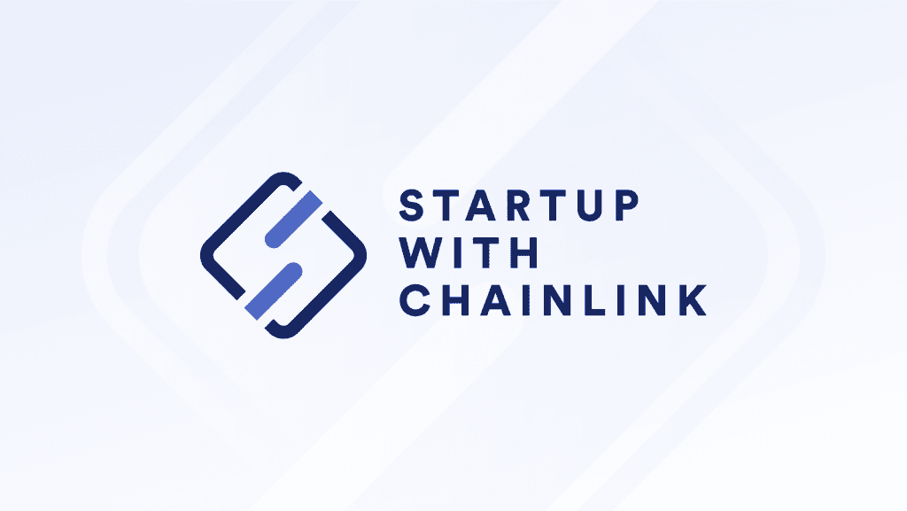

# 使用 Chainlink 启动简介

> 原文：<https://blog.chain.link/announcing-startup-with-chainlink/>

[Chainlink](https://chain.link/) 作为 Web3 生态系统的关键基础设施。无论是安全的价格数据，可验证的随机性，还是信任最小化的智能合约自动化，Chainlink 都为整个智能合约经济提供了增长所需的链外服务。

为了帮助推动智能合同创新和采用的新浪潮，[chain link Labs](https://chainlinklabs.com/)正在引领 chain link[初创公司](https://chainlinklabs.com/startup-with-chainlink)——一项针对早期 Web3 初创公司的首要支持计划。该计划旨在支持和授权团队构建下一代应用程序，这些应用程序将塑造区块链和智能合同的未来。简而言之，Chainlink 的启动为创始团队提供了成功的蓝图。

## 计划详情

Chainlink 的初创公司专注于早期项目。如果您的团队正在区块链和智能合同领域开发令人兴奋的东西，我们强烈鼓励您申请。

作为创业公司 Chainlink 社区一部分的团队将加入一个由创始人和企业家组成的全球网络，并有机会扩展他们的专业网络。该计划还为团队提供了一个精选的资源列表，涵盖了扩展、运营、行业最佳实践等内容。活动、网络研讨会和其他社区相关机会的独家访问权将作为计划的一部分。

社区中表现出非凡才能和驱动力并具有强大产品市场适应性的项目将从初创公司 Chainlink 团队获得增强的一揽子支持。为了帮助他们更有效地启动和扩展，这些项目将有机会:

*   直接与顶级服务提供商合作并获得他们的特别支持，包括 Alchemy、Blockdaemon、Ceramic、Filecoin、The Graph 等。
*   从经验丰富的导师那里获得实践支持，包括技术和法律问题、设计、营销等。
*   接触顶级风险投资家网络，他们可以帮助他们的项目更上一层楼。

成功完成项目后，项目可以继续成为 Chainlink network 初创公司的一部分。这一举措旨在帮助那些对 Web3 充满热情的人建立、加强和保持联系。

## 用 Chainlink 启动背后的理念

“与 Chainlink 一起创业”被设计成区块链行业中对创业者最友好的项目。该计划的主要目标是为创业者提供成功实现愿景所需的工具。

参与是没有成本的 Chainlink 的启动不是为了盈利，而是为了创建一个多链生态系统网络，帮助支持 Web3 中最好的新兴项目。

如果你想让你的项目更上一层楼，创造出有助于区块链产业发展的产品或服务，我们欢迎你加入 [、Chainlink](https://chainlinklabs.com/startup-with-chainlink) 创业公司。

[Apply today](https://chainlinklabs.com/startup-with-chainlink)