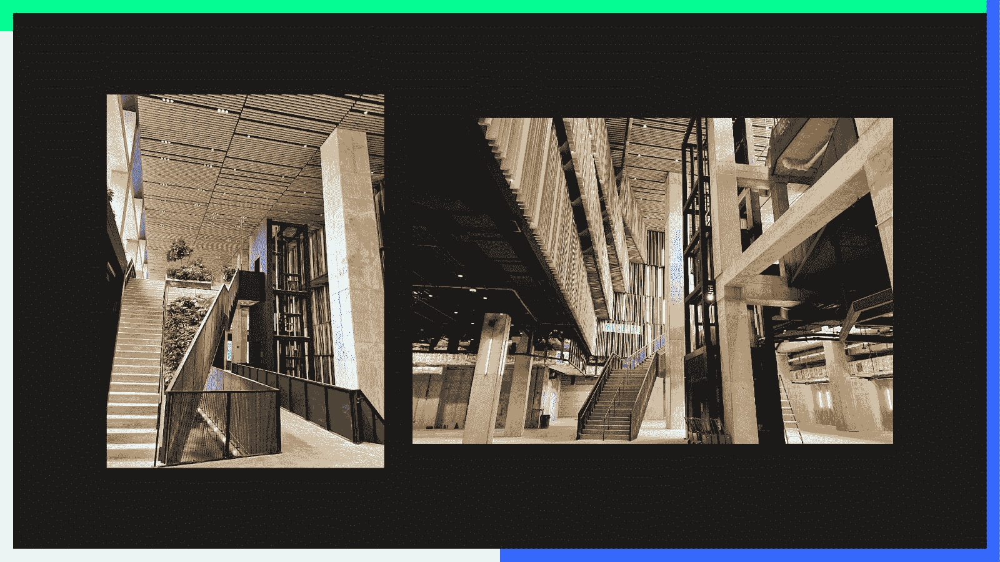
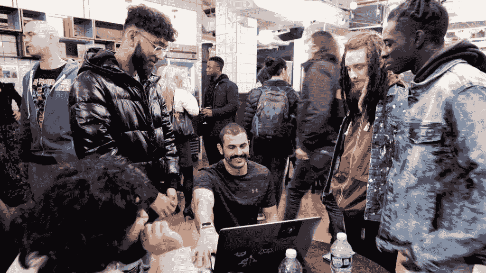
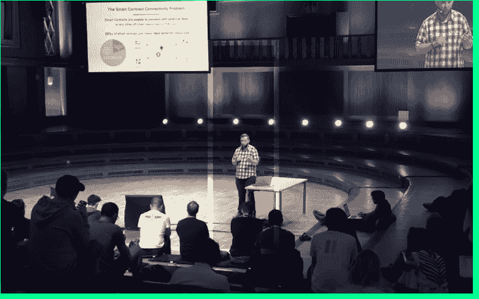
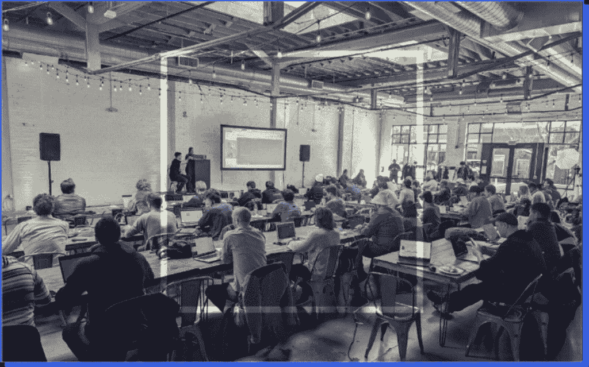
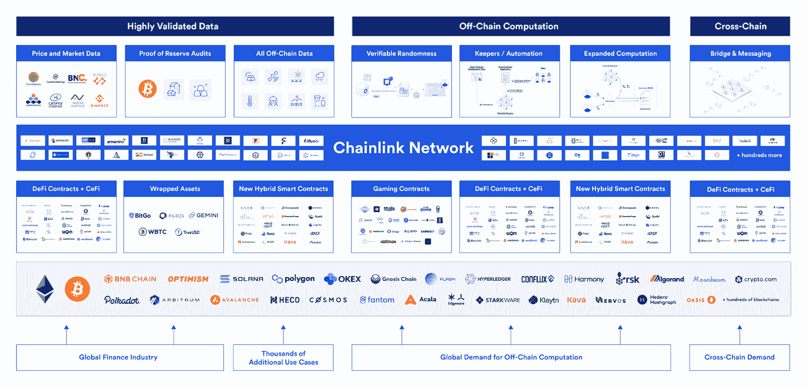
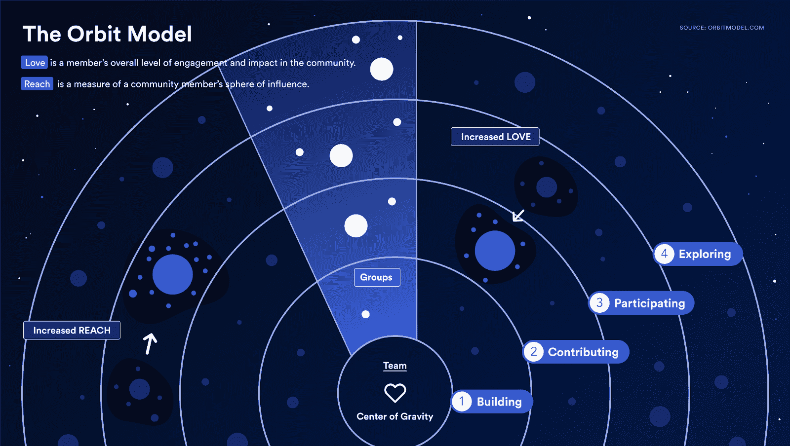
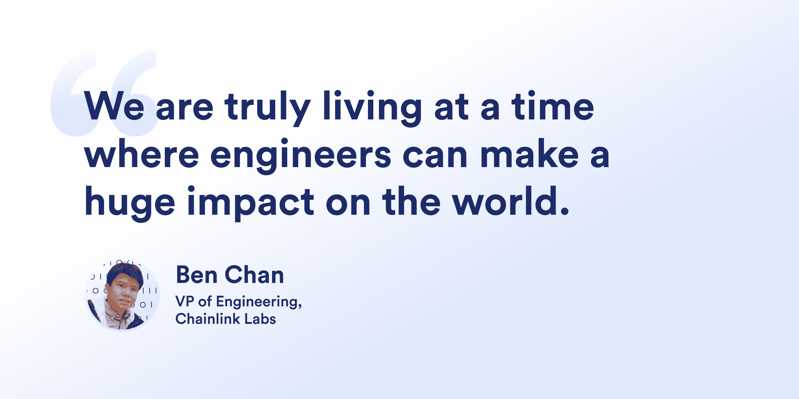
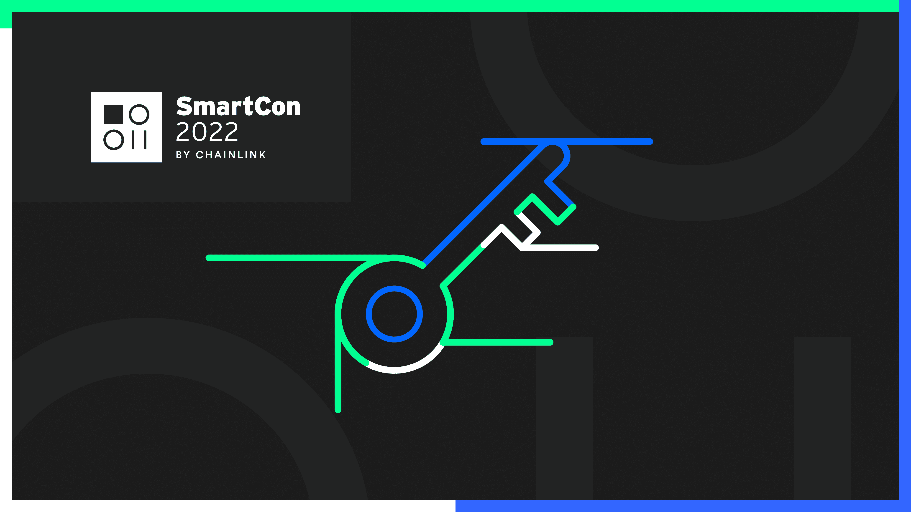

# 为什么 SmartCon 2022 是今年必参加的 Web3 活动

> 原文：<https://blog.chain.link/why-you-should-attend-smartcon-2022/>

SmartCon 2022 是在纽约市中心举行的为期一周的[【web 3】](https://chain.link/education/web3)体验活动，旗舰会议将于 9 月 28 日至 29 日举行。

<figcaption id="caption-attachment-4246" class="wp-caption-text">SmartCon 2022’s flagship conference is set underneath the Essex Market, at the center of Manhattan’s Lower East Side.</figcaption>

无论您是开发人员、创始人、 [初创企业、](https://chainlinklabs.com/startup) 、学者、加密爱好者，还是试图过渡到 Web3 的 Web2 企业，Chainlink 举办的 SmartCon 2022 都会为您带来其他任何加密或技术会议都没有的独特之处。

无论你在网络 3 之旅的哪个阶段，这都是一次不可错过的经历，原因有七个。

立即注册，获取限时早鸟通行证。

[Register for SmartCon](https://smartcon.chain.link)

## 1.SmartCon 是 Web3 中每个人的连接点

<figcaption id="caption-attachment-4244" class="wp-caption-text">Events at NFT.NYC gathered together passionate NFT enthusiasts from all around the world.</figcaption>

随着 Web3 社区遍布全球，面对面建立 Web3 联系的机会越来越少。为期一周的纽约 SmartCon 2022 体验让您有机会与来自 Web3 社区各个角落的新老朋友面对面交流。

与您的团队一起探索 SmartCon 的旗舰会议，与 Web3 老手分享知识，与长期不和的熟人在街区的熟食店吃点东西，在遍布城市的网络和卫星活动中与社区成员建立新的联系，或者只是通过更广泛的 Web3 社区沉浸在纽约传奇的夜生活场景中。

## 2.从 Web3 和更广泛的技术领域的名人那里获得内幕消息

<figcaption id="caption-attachment-4215" class="wp-caption-text">At SmartCon 2022, global thought leaders such as Sergey Nazarov will take to the stage.</figcaption>

思想领袖能看到别人看不到的东西，超越今天的技术局限，展望明天的可能。他们的前瞻性想法成为创始人、开发者和研究人员的燃料，为行业创新提供了有价值的方向。

在 SmartCon 大会上，与会者可以坐在前排观看思想领袖和技术远见者，如 Balaji Srinivasan 和 Eric Schmidt。探索区块链技术的最终游戏将是什么样子，从跨 Web2 技术和传统公司的广泛机构采用到互联网原生网络状态的形成。

还有一个大奖励:将随机抽取七名幸运的 SmartCon 与会者，与 Chainlink 的联合创始人 Sergey Nazarov 一起抢一个巨无霸并畅谈业务。

## 3.率先发现下一个大的行业趋势

<figcaption id="caption-attachment-4243" class="wp-caption-text">Web3 moves fast, but SmartCon moves faster.</figcaption>

去年的 SmartCon 揭开了主要创新和新加密原语的面纱，这些创新和原语催化了 NFT 的繁荣， [DeFi 2.0](https://blog.chain.link/defi-2-0-and-liquidity-incentivization/) ，以及去年其他重要的 Web3 叙述:

*   [动态 NFTs](https://blog.chain.link/what-is-a-dynamic-nft/)
*   自主 dApps
*   [混合智能合约](https://blog.chain.link/hybrid-smart-contracts-explained/)
*   [链外计算](https://blog.chain.link/off-chain-data-and-computation/)
*   记录的台账
*   道治
*   
*   多链
*   [跨链](https://blog.chain.link/cross-chain-smart-contracts/)

还有更多。SmartCon 2022 是引领下一波金融原语、智能合同应用程序和用例的地方，这些将塑造 Web3 的未来。 从 [第二层](https://blog.chain.link/what-is-a-layer-2/) 执行环境和信任最小化硬件到数字身份解决方案，第一时间了解可能成为行业定义的项目、技术和研究。

## 4.发现最新的链环创新

<figcaption id="caption-attachment-4217" class="wp-caption-text">The Chainlink ecosystem spans all parts of the Web3 stack.</figcaption>

作为 Web3 堆栈的核心基础设施，Chainlink 网络在历史上推动了众多区块链和第二层的尖端 dApps 的开发。

[甲骨文](https://chain.link/education/blockchain-oracles) 创新引领整个生态系统的创新，SmartCon 2022 让与会者深入了解接下来会发生什么。从 Chainlink Labs 研究团队了解有关新 Chainlink 服务的最新技术进步，从 Web3 中的 [零知识技术](https://blog.chain.link/what-is-a-zero-knowledge-proof-zkp/) 的作用，到近实时审计对于 [令牌化现实世界资产](https://blog.chain.link/asset-tokenization-bringing-real-world-value-to-the-blockchain/) 的重要性。

## 5.找到您未来的用户群和构建者群

<figcaption id="caption-attachment-4218" class="wp-caption-text">An alternative to the traditional market funnel purpose-built for developer relations.</figcaption>

对于开发基础设施和 dApp 项目团队来说，SmartCon 2022 是为数不多的跨越整个 Web3 的活动之一，它将研究人员、开发人员和用户的大型网络聚集在一起。

在 SmartCon 上，你可以了解整个 Web3 的情况，学习如何从人群中脱颖而出，亲自宣传你的使命，并启动你的项目所需的 [网络效果](https://blog.chain.link/network-effects-web3/) 。不仅如此，SmartCon 还提供独特的技术研讨会和面向开发人员的演示，旨在帮助您成为更好的建设者。

如果你想吸引 dApp 的早期用户，测试你的销售策略，获得系统设计的技术反馈，学习如何建立一个活跃的开发者社区，了解竞争优势的关键要素，并使你的项目在日益激烈的 Web3 空间中脱颖而出，SmartCon 是你找到关键基础的地方。

## 6.发现新的融资和投资机会

[https://www.youtube.com/embed/-1n4e2wh13I?feature=oembed](https://www.youtube.com/embed/-1n4e2wh13I?feature=oembed)

创业公司和风险投资家之间的关系充满了信息不对称，需要双方的合作和信任。

SmartCon 是建立只能亲自培养的深层联系的最佳场所。虽然网上交流对每月的会议、限额谈判和技术问题非常有用，但在达成交易时，没有什么能取代传统的握手。

## 7.在 Web3 中开始你的职业生涯

<figcaption id="caption-attachment-4219" class="wp-caption-text">SmartCon 2022 is an ideal environment to break into Web3.</figcaption>

Web3 行业规模小，领域知识匮乏。区块链开发人员仍然只占软件开发人员劳动力的一小部分，而非工程部门通常要求员工具有深厚的产品知识和对单个项目的热情——这使得招聘 *右* 人员成为一项艰巨的任务。

小行业是人脉大放异彩的地方。与创业公司的使命和文化一致的热情、知识渊博的人是有价值的。如果你是一个希望在 Web3 中工作的区块链爱好者，来到纽约的 SmartCon 是一种直接向你最感兴趣的项目展示你的奉献精神和专业知识的方式。手拿简历参观 SmartCon 旗舰会议的项目展位，在私密的卫星活动中与您最喜爱的 dApps 背后的团队建立联系，掌控您的 Web3 职业生涯。

## 额外收获:找到 SmartCon 的关键

<figcaption id="caption-attachment-4220" class="wp-caption-text">9/25/22: The online search for the Key to SmartCon has officially concluded.</figcaption>

你会是找到它的少数人之一吗？规则/条件[此处为](https://assets.website-files.com/6244869babb7c8841146a53b/6308a5d0c1959e79a15f32a2_ACPRIV_%20Key%20to%20SmartCon%202022%20Official%20Rules.pdf)。

## 申请社区和建设者通行证

我们非常感谢我们敬业的社区成员、建设者、学者和开发者，他们为推进 Chainlink 和更广阔的区块链空间贡献了时间、精力和知识。

如果您已经帮助宣传了 Web3 的好处，那么您可能有资格获得 SmartCon 2022 社区& Builder 通行证，该通行证以优惠价格授予您充分的亲身体验。 [今天填表。](https://chainlinkcommunity.typeform.com/smartcon2022/?utm_medium=referral&utm_source=chainlink-blog&utm_campaign=FY22Q3-smartcon-2022&utm_content=7-reasons)