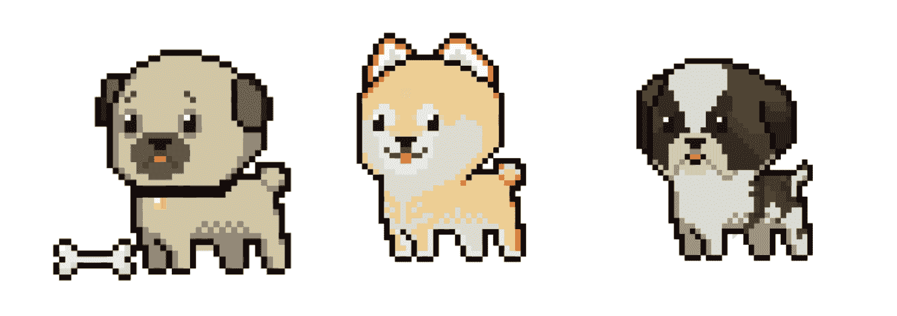
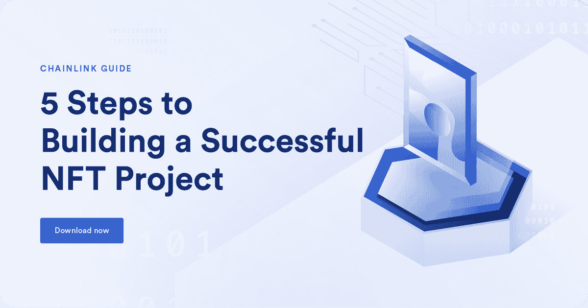

# 如何创造生成性艺术

> 原文：<https://blog.chain.link/how-to-create-generative-art-nfts/>

[](https://chain.link/education/nfts)不可替代代币，或 NFT，是区块链上的数字代币，每个代币代表一些独特的东西，如一件数字艺术品、一件特殊的游戏内物品、一张稀有的交易卡收藏品或任何其他独特的数字/实物资产。NFT 与可替换的令牌相反:每个都是唯一的，不能与自身的另一个版本交换。持有人关心的是他们持有哪个代币，而不是有多少。

在本技术教程中，你将学习如何开发一个生成性艺术 NFT 收藏，并在 IPFS 举办展览。你的 NFT 将是不同的狗品种。NFTs 的生成艺术将使用来自 [链环 VRF](https://docs.chain.link/docs/chainlink-vrf/) 的可验证随机数生成。

让我们开始吧。



## 克隆回购

第一步是克隆 [Chainlink 智能合约实例库](https://github.com/smartcontractkit/smart-contract-examples) 。一旦你这样做了，导航到“最终 NFT 回购”目录，并安装必要的依赖关系。

```
git clone https://github.com/smartcontractkit/smart-contract-examples.git
cd smart-contract-examples/ultimate-nft-repo

yarn
```

然后，在您选择的代码编辑器中打开项目。按照项目的“自述”文件中的说明设置所需的环境变量(您需要注册一个免费的 [炼金术](https://www.alchemy.com/) 账户和一个免费的 [以太扫描 API 密钥](https://etherscan.io/apis) )。在本教程中，我们将在以太坊上部署 Rinkeby testnet。

```
ETHERSCAN_API_KEY=<YOUR ETHERSCAN API>
RINKEBY_URL=https://eth-rinkeby.alchemyapi.io/v2/<YOUR ALCHEMY KEY>
PRIVATE_KEY=<YOUR PRIVATE KEY>
```

## 使用链环 VRF v2

为了获得随机值，我们需要将我们的创成式艺术 NFTs 应用到区块链，我们将使用最近发布的 Chainlink VRF v2。新版本的 VRF 包括了几项关于如何申请和资助智能合同随机性的改进。

首先，导航至 [VRF 订阅页面](https://vrf.chain.link/) ，选择 Rinkeby 网络，连接钱包，点击“创建订阅”。然后，保存您的`subscriptionId`—我们稍后需要将它作为构造函数参数传递。

完成开发并将智能合同部署到 Rinkeby 后，返回 VRF 订阅页面，导航到您的订阅，点击“添加消费者”按钮，然后粘贴最近部署的合同的地址。

最后，用几个 Rinkeby 测试链接代币资助你的订阅。你可以在 [水龙头处得到它们。](https://faucets.chain.link/)

## 开发 NFT 智能合同

创建一个名为`RandomIpfsNft.sol`的新实体文件。我们将从 OpenZeppelin library 继承一些智能合同，并使用 Chainlink VRF。

Solidity 0 . 8 . 4 版本引入了所谓的“自定义错误”，这是一种更高效的从代码库中报告错误的方式。虽然已经可以使用字符串来提供更多关于故障的信息，但这是相当昂贵的，并且很难在其中使用动态信息。

自定义错误的语法与`events`类似。它们是使用`error`语句定义的，必须与`revert` 语句一起使用。不支持`require` 。

```
//SPDX-License-Identifier: MIT
pragma solidity ^0.8.8;

import "@openzeppelin/contracts/token/ERC721/extensions/ERC721URIStorage.sol";
import "@openzeppelin/contracts/access/Ownable.sol";
import "@chainlink/contracts/src/v0.8/VRFConsumerBaseV2.sol";
import "@chainlink/contracts/src/v0.8/interfaces/VRFCoordinatorV2Interface.sol";

error AlreadyInitialized();
error NeedMoreETHSent();
error RangeOutOfBounds();

contract RandomIpfsNft is ERC721URIStorage, VRFConsumerBaseV2, Ownable {
 // Types
 enum Breed {
 PUG,
 SHIBA_INU,
 ST_BERNARD
    }

 // Chainlink VRF Variables
 VRFCoordinatorV2Interface private immutable i_vrfCoordinator;
 uint64 private immutable i_subscriptionId;
 bytes32 private immutable i_gasLane;
 uint32 private immutable i_callbackGasLimit;
 uint16 private constant REQUEST_CONFIRMATIONS = 3;
    uint32 private constant NUM_WORDS = 1;

 // NFT Variables
 uint256 private i_mintFee;
 uint256 public s_tokenCounter;
 mapping(uint256 => Breed) private s_tokenIdToBreed;
 uint256 internal constant MAX_CHANCE_VALUE = 100;
 string[] internal s_dogTokenUris;
    bool private s_initialized;

 // VRF Helpers
 mapping(uint256 => address) public s_requestIdToSender;

 // Events
 event NftRequested(uint256 indexed requestId, address requester);
    event NftMinted(Breed breed, address minter);
```

我们还需要将狗的图像部署到 IPFS，并将它们的 URL 存储在合同中。为此，请导航至 [皮纳塔](https://www.pinata.cloud/) ，并注册免费账户。然后转到您的文件标签，点击“上传”，并选择要上传的文件或文件夹。

为了确保智能合约将被正确部署，让我们添加一个`constructor`函数，并使用“随机 IPFS·NFT”作为集合名称，“RIN”作为股票代码。您可以随意更改这些值，并随意命名您的集合。

现在我们需要`subscriptionId`，这是我们在 [VRF 订阅页面](https://vrf.chain.link/) 注册后保存的，还有狗狗图片的 IPFS 网址。最后，从 [官方文档](https://docs.chain.link/docs/vrf-contracts/#rinkeby-testnet) 中抓取其他必要的 VRF 参数。

```
constructor(
 address vrfCoordinatorV2,
 uint64 subscriptionId,
 bytes32 gasLane, // keyHash
 uint256 mintFee,
 uint32 callbackGasLimit,
 string[3] memory dogTokenUris
 ) VRFConsumerBaseV2(vrfCoordinatorV2) ERC721("Random IPFS NFT", "RIN") {
 i_vrfCoordinator = VRFCoordinatorV2Interface(vrfCoordinatorV2);
 i_gasLane = gasLane;
 i_subscriptionId = subscriptionId;
 i_mintFee = mintFee;
 i_callbackGasLimit = callbackGasLimit;
 _initializeContract(dogTokenUris);
    }

 function _initializeContract(string[3] memory dogTokenUris) private {
 if (s_initialized) {
 revert AlreadyInitialized();
 }
 s_dogTokenUris = dogTokenUris;
 s_initialized = true;
    }
```

现在让我们添加一个创建新的 NFT 的方法。用户需要提供至少`i_mintFee`数量的原生硬币，否则交易将恢复。然后，我们的方法将从 Chainlink VRF 请求一个随机值。由于链节 VRF 是异步的，我们将使用`s_requestIdToSender`将所有链节 VRF 请求映射到令牌的 minter。

从 Chainlink 分散式 oracle 网络回调后，`fulfillRandomWords`函数将确定狗的品种和主人，并铸造一个新鲜的 NFT。

```
function requestNft() public payable returns (uint256 requestId) {
 if (msg.value < i_mintFee) {
 revert NeedMoreETHSent();
 }
 requestId = i_vrfCoordinator.requestRandomWords(
 i_gasLane,
 i_subscriptionId,
 REQUEST_CONFIRMATIONS,
 i_callbackGasLimit,
 NUM_WORDS
        );

 s_requestIdToSender[requestId] = msg.sender;
 emit NftRequested(requestId, msg.sender);
    }

 function fulfillRandomWords(uint256 requestId, uint256[] memory randomWords) internal override {
 address dogOwner = s_requestIdToSender[requestId];
 uint256 newItemId = s_tokenCounter;
 s_tokenCounter = s_tokenCounter + 1;
 uint256 moddedRng = randomWords[0] % MAX_CHANCE_VALUE;
 Breed dogBreed = getBreedFromModdedRng(moddedRng);
 _safeMint(dogOwner, newItemId);
 _setTokenURI(newItemId, s_dogTokenUris[uint256(dogBreed)]);
 emit NftMinted(dogBreed, dogOwner);
    }

 function getBreedFromModdedRng(uint256 moddedRng) public pure returns (Breed) {
 uint256 cumulativeSum = 0;
 uint256[3] memory chanceArracy = getChanceArray();
 for (uint256 i = 0; i < chanceArracy.length; i++) {
 if (moddedRng >= cumulativeSum && moddedRng < cumulativeSum + chanceArracy[i]) {
 return Breed(i);
 }
 cumulativeSum = cumulativeSum + chanceArracy[i];
 }
 revert RangeOutOfBounds();
    }

 function getChanceArray() public pure returns (uint256[3] memory) {
 return [10, 30, MAX_CHANCE_VALUE];
 }
```

将你的存储和不可变变量设为私有，用前缀“I _”&“s _”标记它们，并编写 getter 函数，这是一个很好的做法。这种方法将使您的代码更加整洁和高效。所以就这么办吧:

```
function getMintFee() public view returns (uint256) {
 return i_mintFee;
    }

 function getDogTokenUris(uint256 index) public view returns (string memory) {
 return s_dogTokenUris[index];
    }

 function getInitialized() public view returns (bool) {
 return s_initialized;
    }

 function getTokenCounter() public view returns (uint256) {
 return s_tokenCounter;
    }
```

由于铸造这个集合需要原生硬币的成本，我们在构造函数中将其指定为`i_mintFee`变量，所以最后要实现的功能实际上是一个使 admin DAO multisig wallet 能够提取这些锁定资金的方法。

自 2019 年以来，`call`方式一直是发送固体原生硬币的首选方式。这个过程描述如下。出于安全原因，避免使用`transfer`和`send`。

```
function withdraw() public onlyOwner {
 uint256 amount = address(this).balance;
 (bool success, ) = payable(msg.sender).call{value: amount}("");
 require(success, "Transfer failed");
    }
```

就这样，我们的 NFT 已经准备好了！不要忘记在部署后将此智能合同添加为您的 VRF 订阅的消费者。

## 铸造您的代币并在 OpenSea 上交易

现在，您可以轻松铸造您的代币，方法是将您的钱包连接到 Etherscan 并点击“requestNft”功能，或者创建一个 dApp UI 来与您的智能合约交互。铸币后，前往 Rinkeby 上的 [OpenSea，搜索你的 NFT 收藏或钱包地址。](https://testnets.opensea.io/)

## 总结

在这篇文章中，你已经学习了如何创建一个生成式艺术 NFT 智能合同，我们还讨论了 Solidity 自定义错误，使用 Chainlink VRF，将文件部署到 IPFS，以及在 Solidity 中安全地发送本地硬币。

要了解更多信息，请访问 [Chainlink 智能合同范例库](https://github.com/smartcontractkit/smart-contract-examples) ，开始尝试这个和其他范例项目。如果你的目标是建立你自己的 NFT 项目，探索建立一个成功的 NFT 项目的五个关键步骤。 

[](https://chain.link/resources/5-steps-to-building-nft-project)

<figcaption id="caption-attachment-5082" class="wp-caption-text">A downloadable guide to building a successful NFT project.</figcaption>


访问[chain . link](https://chain.link/)或阅读[docs . chain . link](https://docs.chain.link/)上的文档，了解更多关于 Chainlink 的信息。要讨论集成，请联系专家。