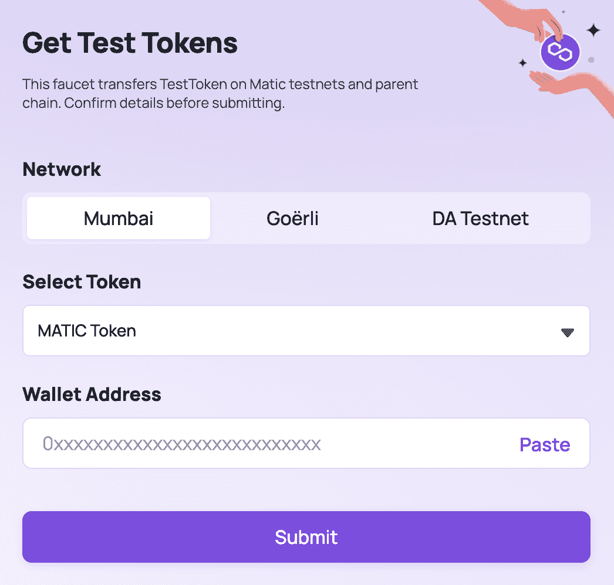
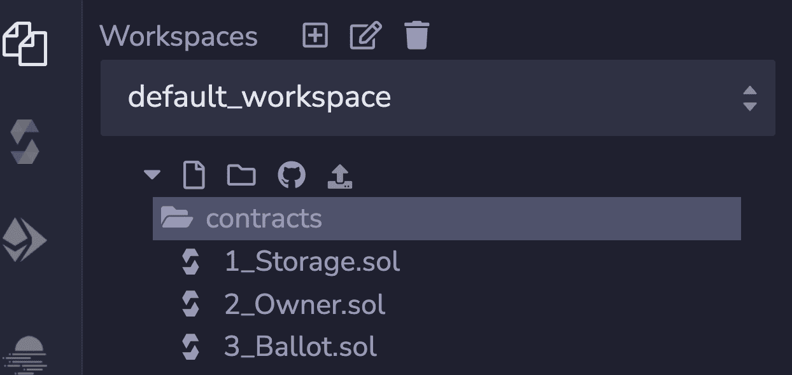
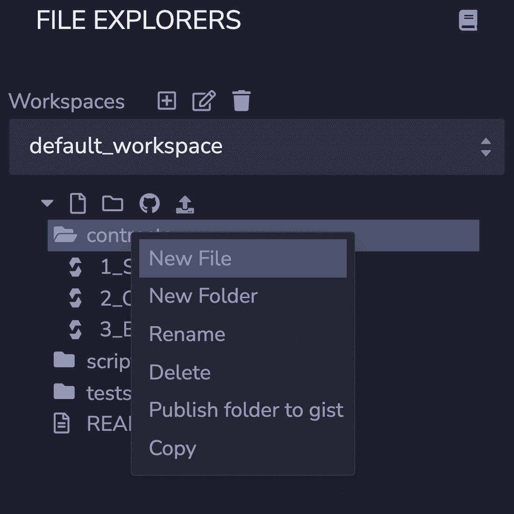
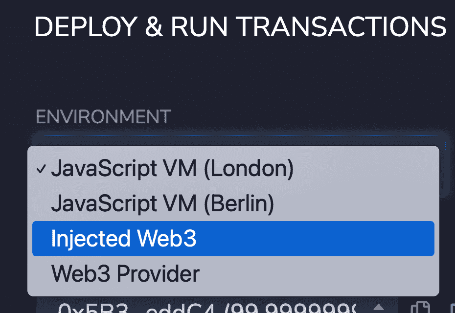
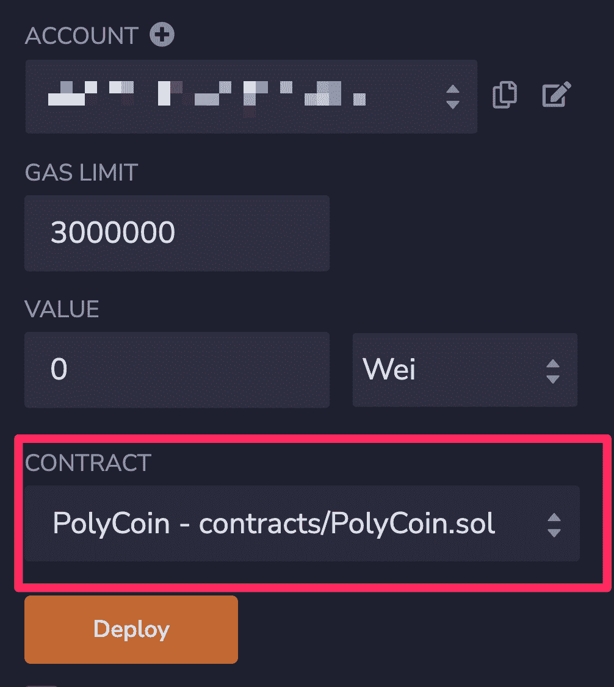
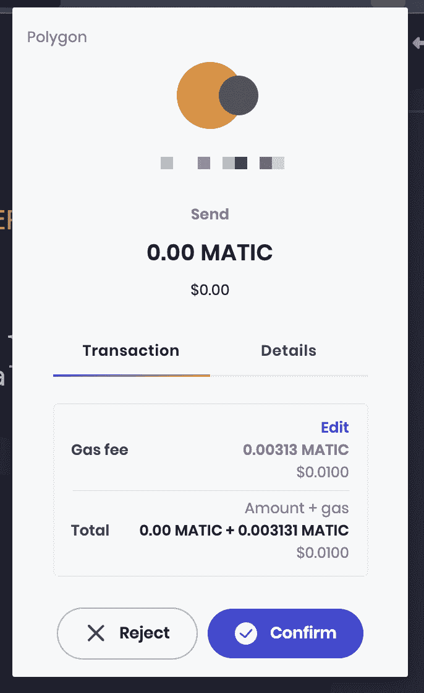
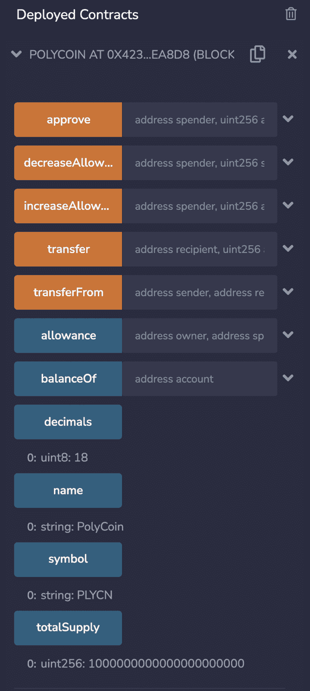
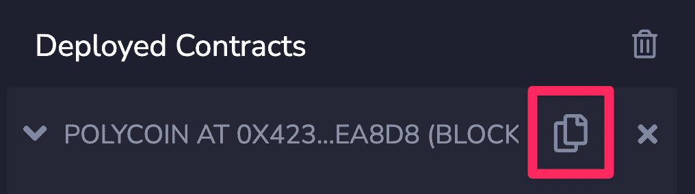
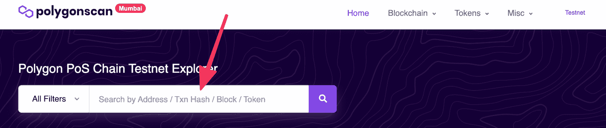
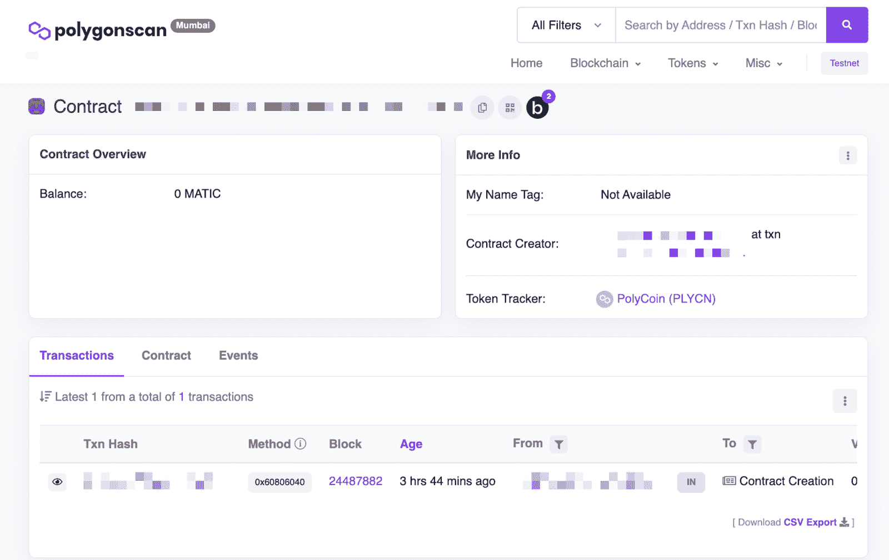

# 如何在多边形上创建 ERC-20 令牌

> 原文：<https://blog.chain.link/how-to-create-an-erc-20-token-on-polygon/>

ERC-20 令牌是在兼容 EVM 的区块链和第二层上交易的关键部分。在本教程中，您将学习如何在 Polygon 上创建一个 ERC-20 令牌，这是一个比直接部署在以太坊主网上成本更低的第二层 EVM 区块链。

## 什么是 ERC 20 代币？

ERC——20 枚代币代表区块链上的“某物”。它们是可互换的 *，* ，这意味着它们是可互换的:你不在乎你有哪个代币，因为它们都是一样的，只在乎你有多少代币。这与不可替换令牌(NFT)形成对比，NFT 是唯一的，因此不可互换:您关心您拥有哪个令牌，而不一定是多少。

## 多边形上的建筑

随着以太坊这样的网络变得越来越繁忙，天然气价格上涨，交易时间延长。为了避免这些问题，开发人员可以将他们的 dApps 部署到像 Polygon PoS Network 这样的扩展解决方案中。让我们看看多边形，为什么你可能想使用它，以及如何开始。

### 什么是多边形？

“多边形”通常指的是多边形位置链，但是多边形比我们将要关注的链要大。开发人员正在努力扩展 Polygon，使其不仅仅是 Polygon PoS 链，旨在将其转变为一种协议和框架，用于构建和连接兼容以太坊的区块链网络。例如，Polygon Hermez 是 ZK 的一款在线支付产品。

另外，Polygon 以前叫 Matic。这个名称更改的一个遗留问题是多边形位置链中使用的标记:MATIC。

### 多边形 PoS 是图层 2 吗？

通常，人们将多边形 PoS 称为第二层链。虽然它提供了第 2 层的一些主要优点，但实际上它是一个侧链，增加了一个额外的特性:在以太坊主链上创建检查点的能力。虽然这听起来类似于乐观的汇总，因为它在主链中添加了事务检查点，但是有必要理解 Polygon PoS 是一个独立的链，它有自己的安全性和信任保证。

### 多边形位置的优点

Polygon PoS 是一个 EVM 兼容链。这意味着您可以在 Polygon PoS 上部署与在 Ethereum 上相同的合同。Polygon PoS 的速度也很快:理论上每秒最多可以处理 65，000 笔交易。与以太坊目前每部分 15 笔交易相比，这是一个巨大的速度差异。多边形 PoS 的燃气费也比以太坊低很多。

### 链条间的桥梁

要将资产从以太坊转移到多边形 PoS，您需要与 [多边形桥](https://wallet.polygon.technology/bridge) 交互。这是一个契约，它将保管你在以太坊一方的资产，大约 7-8 分钟后，在多边形一方创建该资产的包装版本。

这有点像在街机上使用代币。你把你的钱(ETH)交给街机雇员(桥牌合同)，反过来，他们创造代币(POS-WETH，包裹 ETH 的赌注证明)在街机内使用(多边形 POS)。从那里，您可以使用代币(POS-ETH)在街机上玩游戏。如果你想离开，你可以把你的代币(POS-WETH)还给员工(过桥合同)，他们拿走代币(POS-WETH)并把钱还给你作为交换(ETH for POS-WETH)。

## 教程

现在，让我们开始吧。按照下面的步骤，或编码与此视频。

[https://www.youtube.com/embed/h8SKFy6yqus?feature=oembed](https://www.youtube.com/embed/h8SKFy6yqus?feature=oembed)

### 要求

为了开始，你需要与构建以太坊基本相同的工具。这是 EVM 兼容链的一个优势:它们通常不需要您切换工具集。对于本教程，我们将使用:

[](https://remix.ethereum.org)—一个基于网络的固化 IDE

[勇敢钱包](https://brave.com/wallet/)—类似于 [元掩码](https://metamask.io) 的加密钱包

[](https://openzeppelin.com)——区块链合约的安全标准

[多边形孟买](https://mumbai.polygonscan.com)—多边形的测试网络

[多边形龙头](https://faucet.polygon.technology/)—获取 testnet ETH 的好地方

### 连接到多边形孟买测试网

在 Mumbai testnet 上构建应用程序的第一步是校准你的钱包，使其能够工作。你需要先设置你的钱包[](https://www.youtube.com/watch?v=4ZgFijd02Jo)。[chain list](https://chainlist.org/)是一个很好的工具，让你可以简单地连接你的钱包，并从那里添加链。如果想自己添加，可以在 [多边形文档](https://docs.polygon.technology/docs/develop/alchemy/#step-3-create-an-wallet-address) 中找到以下信息。

**网络名称:**多边形孟买测试网

**新 RPC 网址:【https://rpc-mumbai.maticvigil.com T2】**

**ChainID:** 80001

**符号:** MATIC

**屏蔽浏览器网址:【https://mumbai.polygonscan.com/= T2】**

### 获得孟买 MATIC

MATIC 是孟买测试网的本地令牌。为了部署和与契约交互，我们需要一些。前往 [多边形龙头](https://faucet.polygon.technology/) 获取一些 testnet MATIC。您需要提供您的钱包地址，然后点击“提交”。



### 使用 Web3 标准 open zeppelin

OpenZeppelin 为开发人员提供了一套合同和库，这些正在成为 Web3 行业的标准。我们将使用他们的 ERC-20 合同来定义我们的令牌。使用标准化合约将有助于确保我们创建的令牌是可靠的。如果你想了解更多关于 OpenZeppelin 提供的合同，请查看其 [入门页面](https://openzeppelin.com/contracts/) 。

### 建立合同

让我们从 [混音 IDE](https://remix.ethereum.org/) 开始吧。

Remix 提供了一些合同样本。我们现在可以忽略这些。



在合同目录中创建新合同。



姑且称之为 `PolyCoin.sol`

```
// SPDX-License-Identifier: MIT
pragma solidity ^0.8.2;
import "@openzeppelin/contracts/token/ERC20/ERC20.sol";
contract PolyCoin is ERC20 {
    constructor() ERC20("PolyCoin", "PLYCN") {
        _mint(msg.sender, 1000 * 10 ** decimals());
 }
} 
```

#### 关于小数的一个注记

坚固性不使用小数。这意味着任何时候我们想要处理小于整数的数据，我们都需要使用定点运算。本质上，我们在值中存储固定数量的小数。在这种情况下， `decimals()` 是 18，这意味着我们将我们铸造的代币数乘以 `10^18` 。

### 展开

你现在有了一个功能齐全的 ERC-20 代币！让我们把它部署到多边形孟买网络。

首先你需要做的是将环境改为 `Injected Web3` 。这将使混音通过你的钱包与一个真实的区块链互动。



接下来，确保您选择了正确的合同。在本例中，我们将合同命名为 `PolyCoin` 。



点击“部署”按钮，您应该会看到一个确认按钮。我们正在部署到一个真实的区块链，所以会涉及到汽油费。



合同完全展开可能需要一段时间。一旦完成，您将在已部署的合同下看到它。您还可以看到合同中提供的所有功能。OpenZeppelin 契约导入也包括这些函数。



### 验证

部署合同后，我们可以仔细检查它是否出现在孟买网络上。



复制合同地址，抬头为 [多边形扫描](https://mumbai.polygonscan.com/) 。



输入合同地址并搜索。

你应该看看合同和令牌。



您已经创建了一个 ERC-20 令牌并将其部署到 Polygon 测试网络中！

## 接下来的步骤

从这里，你可以带着你的代币去 Polygon mainnet 或任何其他 EVM 兼容的区块链。这是可靠性的伟大之处之一——许多连锁店支持 EVM 兼容的合同。

您还可以为您的令牌添加更多功能。OpenZeppelin 合约支持额外的铸造、燃烧、投票等等。查看 [OpenZeppelin 文档](https://docs.openzeppelin.com/contracts/4.x/erc20) 了解完整细节。

从促进协议监管到与 DeFi 应用程序交互，创建自己的 ERC-20 令牌的能力开启了许多新的机会。接下来，您甚至可以为您的新令牌推出一个 Chainlink Price Feed，使其能够在广泛的 DeFi 协议中使用。

要了解更多信息，请访问 [chain.link](https://chain.link/) ，订阅 [Chainlink 简讯](https://chn.lk/newsletter)，并在 [Twitter](https://twitter.com/chainlink) 、 [YouTube](https://www.youtube.com/channel/UCnjkrlqaWEBSnKZQ71gdyFA) 和 [Reddit](https://www.reddit.com/r/Chainlink/) 上关注 Chainlink。