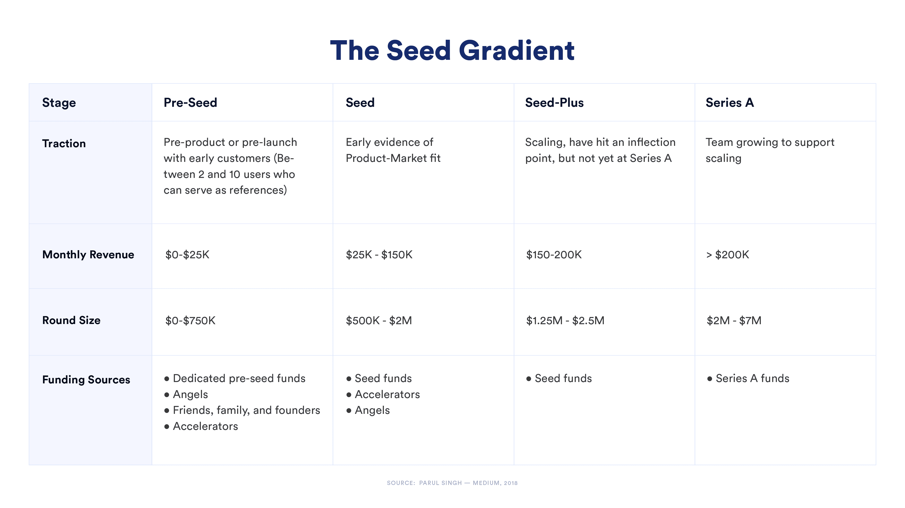
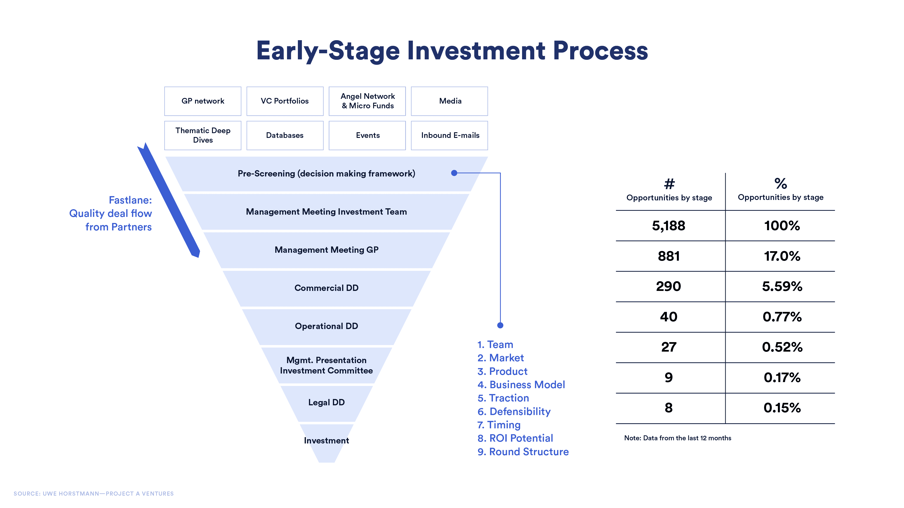

# 早期 Web3 启动资金:介绍

> 原文：<https://blog.chain.link/early-stage-web3-startup-funding-an-introduction/>

对于任何刚刚起步的初创公司来说，筹集资金都是最艰难但最重要的挑战之一——对于那些建立在 Web2 或 Web3 上的公司来说也是如此。但与 Web2 不同的是，Web3 生态系统为崭露头角的创始人提供了利用分散融资技术的能力，而传统的创业团队没有这种能力。

在初创公司的早期阶段，一些屡试不爽的自举方法对于 Web3 的创始人来说仍然是最好的选择。当 Web2 和 Web3 初创公司的轨迹真正开始出现分歧时，它就在融资路径的更下游。

[https://www.youtube.com/embed/-1n4e2wh13I?feature=oembed](https://www.youtube.com/embed/-1n4e2wh13I?feature=oembed)

### 在本帖中，我们将讨论以下主题以及它们如何应用于 Web3 创业:

*   创业公司生命周期的早期阶段
*   启动过程和种子前资金的来源
*   如何准备和专业投资人一起筹资
*   Web3 领域特有的种子资金来源

## 创业公司生命周期的早期阶段

传统上，种子阶段被视为创业公司筹资旅程的第一站。然而，一些投资者认为种子阶段是一个“”的梯度，而不是一个独特的阶段。早期投资者帕鲁尔·辛格这样分解梯度:

<figcaption id="caption-attachment-4000" class="wp-caption-text">The early-stage round sizes for Web3 projects are also getting larger, dwarfing the round sizes proposed in Singh’s original seed gradient from 2018.</figcaption>

根据 2021 年福布斯文章 中的一篇 [报道，平均种子融资从 2020 年的 150 万美元上升到 2021 年的 330 万美元。甚至在种子期之前，一些网络 3 公司正在筹集大约 300 万美元的资金。](https://www.forbes.com/sites/rahulrai/2022/01/02/an-overview-of-web3-venture-capital-activity-in-2021/?sh=5aef2d661f16)

尽管对这个领域很感兴趣，但 Web3 初创公司的融资仍然是一个充满挑战的过程，与更传统的初创公司相比，这些资金的来源也有所不同。

为了理解这些差异，让我们更详细地看看早期筹资阶段。

## 【Web3 初创公司的种子前期资金来源

在种子期之前，大多数创始人只是充实他们的想法，建立一个原型。许多人将这一阶段称为“自举”而非筹资。

为了启动他们的初创公司，创始人可能会使用不需要放弃公司股权的资源，如赠款或贷款。或者，他们可以选择投资一些自己的钱，或者如果他们幸运的话，他们可能与愿意为他们提供早期资本的天使投资人有私人关系。

然而，大多数创始人将不得不求助于他们个人网络之外的资源来开始创业。赠款是无偿资金的一个重要来源，在 Web3 生态系统中尤其受欢迎。

### 来自传统实体的赠款

许多来自公共和私营部门的传统组织都希望进入 Web3 领域，通过向有前途的初创公司提供资助来刺激创新。

##### 其中的一些例子是:

*   欧盟委员会的 [地平线计划](https://digital-strategy.ec.europa.eu/en/policies/blockchain-funding) ，通过地平线 2020 提供 1.8 亿欧元的奖金和拨款。
*   桑坦德银行的 [桑坦德 X 全球挑战赛](https://www.santander.com/en/landing-pages/santander-x-global-challenge-blockchain-beyond#introduction) ，从 12 万欧元的资金池中为区块链提供创业资助。
*   [联合国儿童基金会风险基金](https://www.unicef.org/innovation/venturefund/funding-opportunity-blockchain-capacity-building) ，向有潜力造福人类的初创公司提供高达 10 万美元的无股权投资。

##### 考虑

密切关注申请标准:这类资助通常有非常精确的要求，规定初创企业必须在特定的地区或行业运营。政府资助项目尤其倾向于将区块链技术用于社会公益。

此外，许多传统的资助项目或补贴要求创始人分担一部分费用。例如，他们可能会提供开发原型成本的 70%的补贴，而创始人或团队预计会支付剩余的 30%。

### 来自 Web3 行业内部的资助

在 Web3 行业内部，越来越多的老牌公司正在寻求通过向使用他们特定技术的初创公司提供资助来构建他们的生态系统。对于那些基于某种区块链来管理生态系统的组织来说尤其如此，比如以太坊、卡尔达诺或索拉纳。来自大公司或项目的资助竞争可能会很激烈，所以另一个选择是看看更新的、新兴的区块链网络的资助项目。一旦你在一个链条上证明了你的概念，就更容易筹集资金扩展到其他链条上。

##### 区块链专项拨款项目的例子:

*   **以太坊**[T5】生态系统支持计划](https://esp.ethereum.foundation/)
*   **波尔卡多**[T5】web 3 基础](https://web3.foundation/)
*   **雪崩**[T5】多元宇宙激励计划](https://medium.com/avalancheavax/avalanche-foundation-launches-multiverse-an-up-to-290m-incentive-program-to-accelerate-growth-of-c815ac5692c7)
*   **协议 [拨款计划](https://near.org/grants/)**
***   **Celo**基金会 [资助计划](https://celo.org/experience/grants#introduction)*   **和谐**[T5】生态系统基金](https://open.harmony.one/300m-on-bounties-grants-daos)*   **链间基金会** [资助项目](https://interchain.io/)**

 **有关类似资助项目的更全面列表，请参见[【blockchaingrants.org】](https://www.blockchaingrants.org/)。

也有来自与任何特定区块链无关的 Web3 组织的资助，如基础设施公司和加密货币交易所。

##### 更多区块链不可知论资助项目的例子:

*   [Chainlink 社区资助计划](https://chain.link/community/grants) ，为开发 Chainlink 生态系统工具或集成 chain link 技术的开发团队提供资助。
*   Filecoin 的 [开发者资助计划](https://grants.filecoin.io/#learnmore) ，旨在资助增强 Filecoin 实用性的新产品、业务和工具。
*   北海巨妖的 [开发者资助计划](https://www.kraken.com/en-us/features/grants) ，该计划支持已建立的生态系统中的开发项目，如比特币和以太坊。
*   比特币基地的 [开发者资助计划](https://blog.coinbase.com/2022-developer-grants-call-for-applications-461ca9903122) 支持致力于发展和维护加密生态系统的开发者

##### 考虑

这些资助项目经常被申请人淹没，很快就停止接受新的申请。这就是为什么设置有针对性的谷歌提醒很重要，这样一旦有机会公布，你就会得到通知。

此外，这些类型的资助旨在促进对特定技术生态系统的参与，因此你将被要求使用特定技术或解决可能不适合你的创业性质的特定用例。

与一般的资助一样，提供的资金只够启动你的产品，你需要立即开始寻找资金来维持你的开发，直到原型阶段结束。

### Web3 孵化器、加速器和创始人社区

虽然从技术上来说，初创企业 [孵化器](https://www.investopedia.com/terms/i/incubatorfirm.asp) 和加速器并不总是资金来源，但它们通过提供培训、指导和工作空间来帮助初创企业。

孵化器项目旨在从第一天起就帮助创业者，让他们掌握下一阶段融资所需的商业技能。如果你是一家区块链的初创公司，下一阶段可能不总是涉及传统的融资技术，所以选择一个专门针对 Web3 初创公司的孵化器很重要。

##### web 3 孵化器和创始人社区的例子:

*   [用 Chainlink 启动](https://chainlinklabs.com/startup) 是由 Chainlink Labs 支持的一个创始人友好的 Web3 启动程序。“与 Chainlink 一起创业”让早期的区块链项目可以接触到全球创始人网络，并获得成功启动区块链项目所需的指导。
*   [克莱滕孵化项目](https://www.f10.global/program/klaytn) 专注于在 DeFi、元宇宙、GameFi 和创造者经济中工作的创业公司。
*   [R3 venture development](https://www.r3.com/venture-development/%20P)是一家基金，帮助使用分布式账本技术从事企业(B2B)解决方案的首轮融资初创公司进行预播种。
*   [dlab venture](https://dlab.vc/)是一家由 SOSV 和 EMURGO(Cardano 的支持者)提供支持的孵化器，为全球各地的创始人提供种子前资金和资源，以开发和测试区块链支持的产品和服务 。
*   [橙道](https://www.orangedao.xyz/) 是一个由 Y Combinator 校友组成的社区，为早期 Web3 创业公司 提供资金。

##### web 3 加速器示例:

*   [联盟道](https://alliance.xyz/) 是一个 Web3 加速器和方正社区。
*   [离群创投的大本营](https://outlierventures.io/base-camp/) 是一个开放的元宇宙创业加速器。
*   [超光速粒子](https://mesh.xyz/tachyon/) 是早期区块链和 Web 3.0 创业公司的加速器 。

许多更传统的加速器项目，如[【Y Combinator】](https://www.ycombinator.com/)[tech stars](https://www.techstars.com/)和 [【鹿角】](https://www.antler.co/) 现在也在投资区块链的创业公司。

面向创始人的资源如 [孵化器列表](https://incubatorlist.com/) 和 [F6S](https://www.f6s.com/) 也提供全面的全球创业项目列表，包括那些专门关注 [区块链创业公司](https://incubatorlist.com/top-blockchain-startup-accelerators-incubators-and-vcs/) 的项目。

虽然孵化器不是必需的，但对于缺乏创业经验或向投资者推销经验的创业者来说，它是非常值得推荐的。它们为一些挑战提供了重要的指导，例如撰写商业计划和导航特定于 Web3 行业的走向市场方法。

### Web3 众筹

众筹的概念已经存在了一段时间，但在 Web3 领域，由于使用了区块链技术，它的运作方式略有不同。例如， [Juicebox](https://juicebox.money/) ，被称为“去中心化 Kickstarter”，是以太坊上由公共智能合约驱动的流行平台。它的目标是使 DAO 项目能够从更广泛的 Web3 社区筹集资金。根据 2021 年 12 月 [的公告](https://www.kickstarter.com/articles/the-future-of-crowdfunding-creative-projectswhich%20they%20announced%20in%20December%202021) ，Kickstarter 本身打算推出一个新的基于 Web3 的平台，这将有助于在 Celo 区块链上众筹创意项目。[git coin](https://gitcoin.co/)提供分散资助，帮助专注于开源开发的小项目和团队。像 Gitcoin 一样，[Dora hacks](https://dorahacks.io/))提供持续的资金、资助、奖金和黑客马拉松，但更专注于亚洲市场。

虽然这些新资源是自举过程的宝贵补充，但资金数额不足以维持长期的产品开发。创始人最终将需要筹集更多的资金，这样他们就有足够的跑道来打造他们的产品。

## 【Web3 初创公司的种子资金及其他

在这个阶段，融资是通过向某种机构实体或专业投资者出售公司股权来进行的，无论是加速器、天使投资者还是早期风险投资公司。

然后，这种金融资本可以转化为生产资本，即从获得硬件、技术和人力资源中获得的净值。对于 Web3，这些人力资源可以是新员工或通过开发者拓展计划获得的签约贡献者。

无论资本来源如何，所有的创业公司都需要满足一些基本的先决条件，才能开始种子资金筹集过程。首先，他们需要了解投资者在评估一家初创公司的潜力时，他们在寻找什么；其次，创始人需要明白他们自己对投资者的要求是什么。这第二点对于 Web3 的创始人来说尤其重要，因为许多投资者可能对 Web3 创业公司的潜力感到兴奋，但不适合指导他们的成长。

### 理解投资者希望在一个 Web3 初创企业中看到什么

传统风险投资者通常每年筛选数千个投资机会，并开发了一个决策框架，在开始正式评估流程之前，他们可以利用该框架快速预先筛选初创公司。一般来说，同样的标准可以适用于 Web3 初创公司，尽管在细节上会有所不同。

下图举例说明了风险投资公司的交易流程，包括如何寻找机会以及在每个评估阶段用于筛选机会的标准。

<figcaption id="caption-attachment-3998" class="wp-caption-text">This decision-making framework filtered out 83% of opportunities at the top of the pipeline, and only 17% made it to the next stage.</figcaption>

许多筛选标准是显而易见的，不会因 Web3 而发生显著变化。例如，对于 Web2 和 Web3 的创业公司来说，创始人的业绩记录或产品的实力或 [的上市(GTM)战略](https://blog.chain.link/a-guide-to-building-web3-products/) 同样重要。然而，在 Web3 中，防御性和交易结构等品质呈现出不同的动态。

### 在 Web3 中，可防御性更多的是关于转换成本和网络效应

Web3 的分散性质通常要求项目是开源的，并由分布式贡献者网络维护。这意味着任何项目都可以分叉和改编。例如，在撰写本文时，Defi Llama 目前列出了 Uniswap 的 [254 叉](https://defillama.com/forks/Uniswap) ，许多 [分散交换(dex)](https://blog.chain.link/dex-decentralized-exchange/)使用的开创性协议。然而，就 TVL(锁定总价值)而言，Uniswap 指数仍然保持着头把交椅，尽管以太坊区块链上存在竞争指数(如 SushiSwap)。这个例子说明了在 Web3 中，防御性更多的是关于时间和社区，而不是拥有专有代码。因此，风险投资公司正在寻找有潜力建立一个充满活力的社区和独特、有粘性的功能的产品，这些功能会增加转向任何竞争对手的成本，这些竞争对手可能会将项目进一步分支。

### Web3 交易结构有不同的稀释问题

对于 Web2 初创公司，交易结构谈判通常围绕当前和未来投资者与创始团队之间的所有权比例进行。一旦一家初创公司进入 A 轮、B 轮和 C 轮，创始人和早期投资者的所有权将被稀释。因此，许多条款清单考虑到了这种风险，并在合同中规定了防止稀释的条款。

然而，对于 Web3 初创公司来说，私人融资轮往往不会超过 a 轮。一旦它们在目标市场达到一定程度的牵引力，许多 Web3 初创公司就会转向分散融资，不再寻求私人融资轮。稀释仍然是一个问题，但许多 Web3 初创公司主要在融资之初处理这个问题，而不是在多轮私人融资过程中重新评估它。

### Web3 创始人也需要明白他们在投资者身上寻找什么

虽然一些 Web3 项目完全由社区资助，但大多数 Web3 初创公司将受益于领投人，领投人将引导项目走过市场的起伏。这是一种天生的长期关系。虽然 Web3 项目可能会在比 Web2 初创公司更短的时间内出现指数增长，但这些增长峰值与整个加密市场的情绪高度相关，这可能是不稳定的。

因此，有经验的投资者有更长的时间跨度，并且不指望在多年内看到投资回报。出于这个原因，投资者和创始人的关系经常被比作婚姻，双方都需要清楚他们想从这种关系中得到什么。我们已经讨论了投资者的期望，所以让我们看看创始人应该考虑什么。

### 找到了解 Web3 的投资者

2021 年，大量新投资者涌入这个领域，许多人仍在学习诀窍。尽管他们可能对 Web3 非常热情，但他们可能无法就如何扩大公司规模和发展社区向你提供太多指导。

然而，大多数 Web3 初创公司都在寻找纯资本之外的投资。这包括增值如:  

*   股权分配指引
*   关于构建开源社区的指导
*   接入更广阔的网络
*   获得商业和运营专业知识

谈到增值，创始人必须尽职调查风险投资公司现有的投资组合公司是否确实得到了他们期望的支持，这一点很重要。这是因为创始人和风投通常对这种支持应该是什么样子有着不匹配的期望。例如，在其 [【超过金钱】报告](https://forwardpartners.com/latest/insights-key-insights-from-our-more-than-money-report-launch-panel) 中，Forward Partners 发现，五分之三的创始人觉得他们受到的支持水平“欺骗了”。

### 分散投资的兴起

分散自治组织提供了另一个独特的筹款渠道。投资人辛迪加并不是什么新鲜事，在[AngelList](https://www.angellist.com/)等平台上都能找到很多传统辛迪加。但是 Dao 对 Web3 的创始人很有吸引力，因为它们允许资金民主化，而不是依赖风险投资的批准。

比如 [辛迪加道](https://syndicate.io/) 允许投资人组成分散的“投资俱乐部”，集合资金投资一个项目。[Stacker Ventures](https://stacker.vc/)是另一个基于 DAO 的项目，投资于早期创业公司，旨在“将社区投资者的激励与创始团队结合起来”。

### Web3 正在改变筹资流程，但创始人仍需要关注基本面

Web3 初创公司有很多方式来筹集资金，包括自举、赠款和孵化器项目。Web3 空间还引入了许多新的筹资创新，如分散式众筹。尽管许多观察家预计这些创新将改变风险投资基金在 Web3 中的运作方式，但创始人需要记住，任何类型的种子投资者仍然希望看到传统风险投资寻求的相同基础:坚实的技术、清晰的商业计划、现实的产品路线图和可靠的领导。

尽管如此，许多创始人还是很难获得赢得经验丰富的投资者所需的技能、人脉和运营专业知识。这就是为什么加入专门面向 Web3 创始人的孵化器项目或创始人社区是资助早期 Web3 项目的重要一步。

## 适用于带链环的启动

[chain link](https://chainlinklabs.com/startup?utm_medium=referral&utm_source=chainlink-blog&utm_content=early-stage-web3-startup-funding-an-introduction)初创公司是专为支持 Web3 创始人而建立的，为他们提供世界一流的资源，帮助他们踏上创业之旅。该项目帮助初创公司从最初的构思和验证到建立一个工作系统和培养社区。

正在开发独特而有趣的产品、服务或供应品的 Web3 创始团队受邀[申请](https://chainlinklabs.com/startup?utm_medium=referral&utm_source=chainlink-blog&utm_content=early-stage-web3-startup-funding-an-introduction)。为了将更多的 Web3 启动资源直接发送到你的收件箱，[注册 Chainlink 简讯](https://pages.chain.link/subscribe?utm_medium=referral&utm_source=chainlink-blog&utm_content=early-stage-web3-startup-funding-an-introduction)。

* * *

*免责声明:本文提供的信息仅用于教育和信息目的。这篇文章无意成为金融建议。在没有进行独立的尽职调查和咨询合格的法律和税务专业人士之前，你不应该根据这篇博文中的任何信息采取行动。T3】***