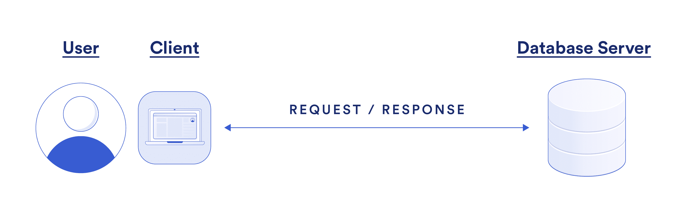
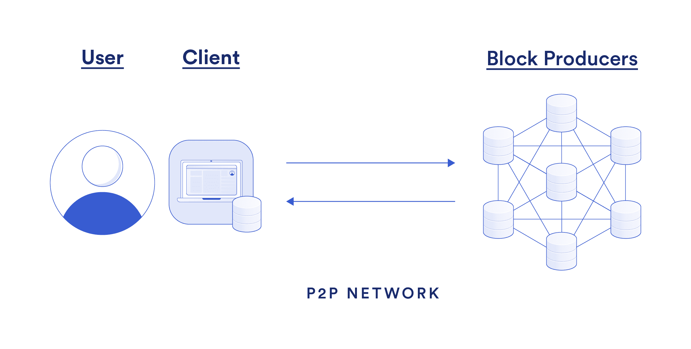
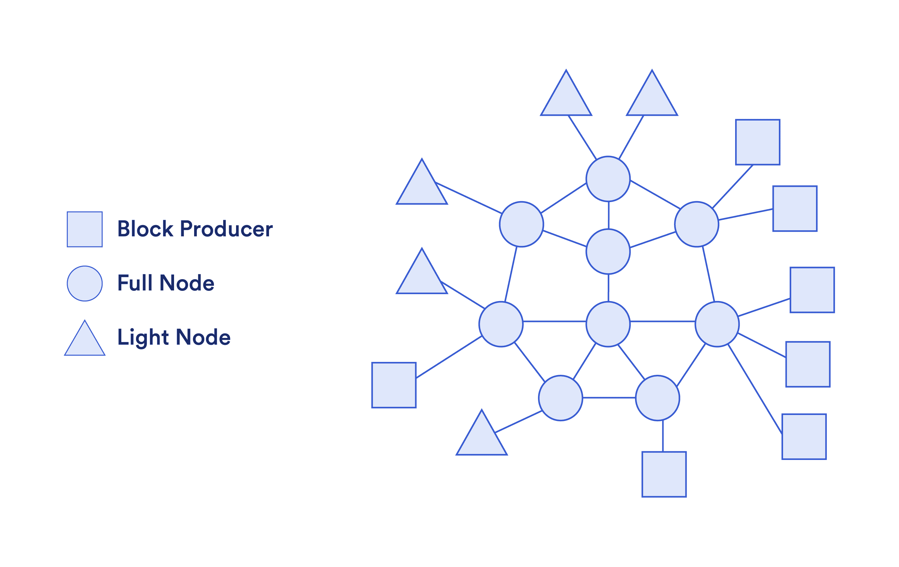
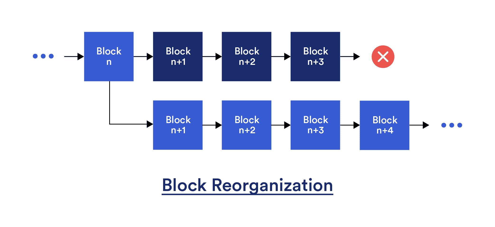
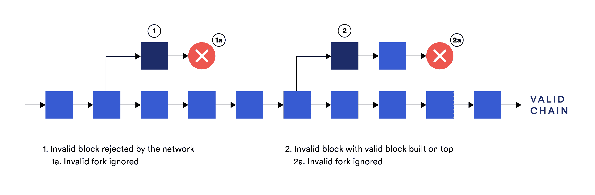
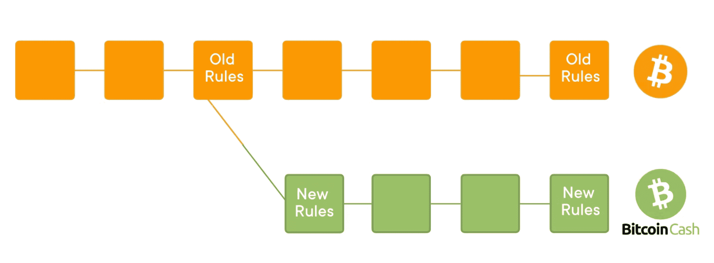
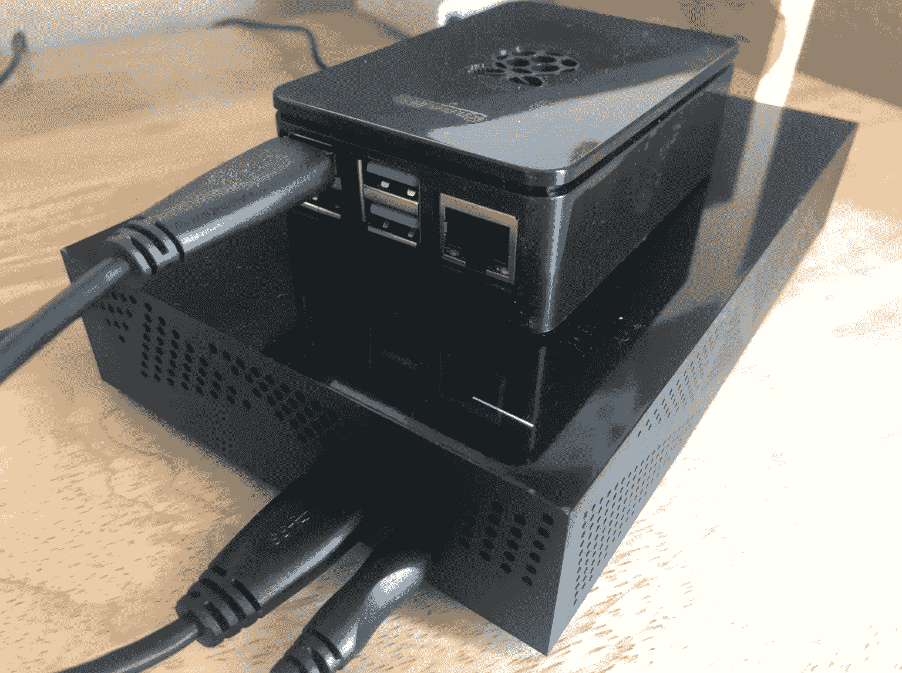
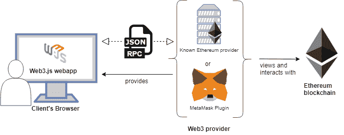
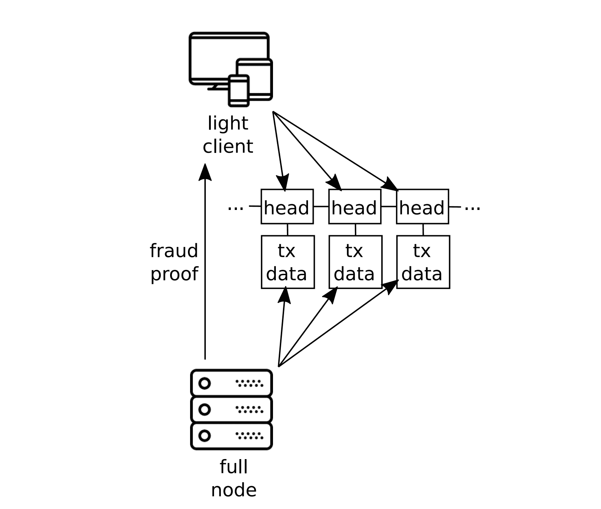
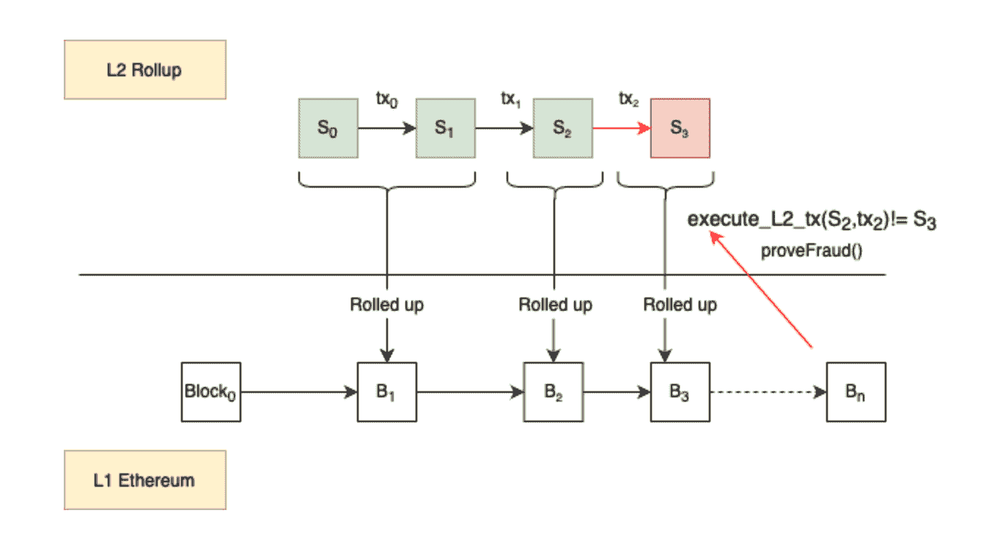

# 每个人对区块链的误解

> 原文：<https://blog.chain.link/blockchain-trust-model/>

是一种全新的计算模式，其中数据和应用程序不是由集中的中介来保护，而是由分散的计算机网络来保护。由于其无许可的性质，区块链允许任何人选择加入并开始独立验证计算的完整性，从而在用户和网络运营商之间形成了一个制衡系统。

从创建具有程序化货币政策的新数字货币(如比特币)，到执行可编程的 [信任最小化应用](https://blog.chain.link/what-is-trust-minimization/) (如以太坊)，区块链作为一种新形式的数字基础设施，通常被称为 Web3，正迅速进入公众意识。然而，尽管区块链的总体价值主张得到了许多人的认可，但关于区块链基本信任模式的细微差别却常常被误解。

本文将通过查看自验证完整节点的角色，特别是它们如何保持块生产者(例如挖掘者/验证者)的责任，以及如何降低验证成本是区块链可扩展性的核心，来解释区块链的信任模型与传统计算有何不同。

# 传统计算模式的局限性

当今大多数应用程序使用的计算模型包括 [客户端-服务器模型](https://www.geeksforgeeks.org/client-server-model/) ，其中请求被发送到中央数据库服务器。传统计算模式内的参与者可以细分为以下几种:

 ***   **客户端:** 通常通过个人设备生成请求的最终用户，这些请求通过 TCP/IP 发送到互联网上的中央数据库服务器，并等待响应。客户端相信数据库服务器会忠实地响应请求。
*   **数据库服务器:** 远程计算机，通常以集中式云提供商的形式，提供信息或对特定服务的访问。后端数据库服务器通常是由传统机构集中管理的计算机集合。

<figcaption id="caption-attachment-4348" class="wp-caption-text">In the traditional computing model, users must trust an opaque centralized database.</figcaption>

这种计算模式通常被称为“Web2”，支持开发人员按需快速启动和扩展应用。由于数据中心提供的低延迟和高吞吐量计算，用户还可以获得无缝的用户体验。虽然托管在集中式数据库上的应用程序为全球数十亿用户提供了巨大的价值，但它们也有一定的局限性。

最值得注意的是，最终用户无法验证生成请求响应所涉及的计算是否合法，或者数据库条目是否随时间推移而被篡改。这种应用程序实际上是在一个黑盒中运行的，这意味着用户必须完全相信第三方中介会按照他们的最大利益行事。

与集中托管的应用程序相关联的信任假设可能会对用户 [产生负面影响](https://blog.chain.link/what-crypto-is-really-about/) ，这些用户可能会遭遇金融审查、社交媒体去平台化、个人数据泄露、操纵式内容选择算法、增加的对账成本、损坏的数据和数据丢失，以及总体上缺乏问责。最终结果是社会信任的崩溃和经济协调成本的增加。

# 区块链计算模式

区块链没有相信集中式中介的诚信，而是通过使用引入了 [信任最小化和可信中立](https://blog.chain.link/what-is-cryptographic-truth/)

1.  验证数据/资产所有权并验证交易完整性的加密技术；
2.  分散的共识，以建立交易的排序并执行协议的规则；
3.  确保网络分类账及其持续运营的不变性的财务激励。

重要的是，区块链是一个开放的网络——世界上的任何人都可以作为积极的贡献者或消极的倾听者加入。这使得最终用户能够自己验证网络产生的任何输出是有效的，并且分类帐条目没有被篡改。区块链的透明度还降低了不透明带来的风险，消除了信息不对称，并确保所有参与者都可以获得有关风险敞口的信息。

<figcaption id="caption-attachment-4349" class="wp-caption-text">In the blockchain computing model, end-users can opt-in to join the network and verify the computations being performed.</figcaption>

## 区块链参与者的不同角色

为了确保区块链的正常运行，网络参与者有各种不同的类别(通常是重叠的),每个类别都扮演着至关重要的角色。

 ***   **块生产者(BP):**负责将交易排序并打包成称为块的离散数据结构的实体，然后将这些数据结构提交给网络进行验证。如果在相同的块高度产生两个有效块，BP 负责确定哪个版本的链是规范的(例如，最长链规则)。共识算法用于确定哪个 BP 负责生成区块链中的下一个区块，工作证明(矿工)和利益证明(验证者)是两种最流行的模型。
*   **全节点:** 区块链网络的心脏。完整节点下载并自我验证 BPs 提出的每个块。如果发现该块是有效的(即遵守了协议规则)，则将该块添加到完整节点的个人分类帐副本中，并应用状态改变。任何不符合协议规则的无效块都会被忽略，并因此被丢弃，而不会发生任何状态变化。
*   **归档节点:** 存储与完整节点相同的所有信息的实体，但也计算和存储区块链的先前状态。归档节点对于查询任意历史数据非常有用，例如过去特定数据块高度的用户帐户余额。请注意，完整节点可以随时转换为归档节点，而无需从网络上下载任何额外信息。归档节点通常具有较高的硬件要求，通常由服务提供商(例如数据块浏览器)运行。
*   **轻型客户端:** 一种有限形式的完整节点，其中仅下载块的报头(即小型唯一加密指纹)。轻型客户端可以验证一个事务是否包含在一个块中，但是因为它们不下载或执行块中的所有事务，所以它们隐式地信任大多数块生成者是诚实的。轻客户端，也称为简单支付验证(SPV)客户端，最初是在最初的 [比特币白皮书](https://bitcoin.org/bitcoin.pdf) 中描述的。
*   **RPC 提供者:** 方便其他网络参与者对区块链进行读/写访问的完整节点。RPC ( [远程过程调用](https://www.techtarget.com/searchapparchitecture/definition/Remote-Procedure-Call-RPC) )节点经常被那些没有或不能运行自己的全节点或轻客户端的人使用，大大减少了访问区块链的摩擦。任何连接到 RPC 提供程序的用户都隐式地信任提供程序的诚实性，因为没有完成任何自我验证工作。
*   **最终用户:** 希望在区块链网络上进行交易的普通用户。这个类别可以包括运行完整节点或轻型客户端的参与者，以及连接到 RPC 提供程序的参与者。区块链的存在是为了服务最终用户，否则网络就没有存在的理由。

虽然这些网络参与者在区块链生态系统中发挥着关键作用，但完整节点是区块链网络的核心，因为它们是负责维护网络账本完整副本的实体。其他网络参与者，如块生成器和轻型客户端，连接到完整节点以了解网络状态。生成的网络拓扑如下图所示。

<figcaption id="caption-attachment-4350" class="wp-caption-text">The topography of a blockchain network, where light clients and BPs are connected to full nodes.</figcaption>

## 砌块生产商的有限权力

对区块链的一个常见误解是，由于区块生产商负责生成包含交易的新区块，因此他们必须单方面控制区块链。换句话说，人们相信，如果大多数 BP 被破坏/串通(通常称为 [51%攻击](https://www.investopedia.com/terms/1/51-attack.asp) )，那么网络就被完全破坏了，所有有价值的东西都会被不可挽回地摧毁。实际上，BP 的权力范围有限，只能进行特定类型的恶意活动。

砌块生产商能做什么:

 ***   **审查事务:** 单个 BP 决定哪些事务包含在他们创建的块中，允许他们选择性地忽略特定的事务。虽然串通 BP 可以防止事务被包括在它们创建的块中，但是只需要有一个诚实的 BP 就可以将事务包括在有效的块中。
*   **重写链:** 如果大多数 BP 串通(例如 51%的攻击)，那么先前创建的有效块可以通过称为块重组(reorg)的过程分叉出网络，其中新的块链成为规范链。请注意，一些区块链通过检查点系统具有“经济终结”的概念，对比检查点旧的块进行重组会导致连锁停止，这需要通过社会共识来解决。

<figcaption id="caption-attachment-4351" class="wp-caption-text">A block reorg reverts previously accepted valid blocks with a new set of valid blocks.</figcaption>

什么块制作人 *不能* 做:

 ***   **更改协议规则:** BPs 不能随意更改协议规则，如添加/删除功能(如操作码)，增加/减少最大允许块大小或块时间间隔，或增加/减少为生产块而发放的块奖励。
*   **盗取用户资金:** BPs 不能从没有私钥的地址消费硬币/代币，因为这种交易的加密签名是无效的。请注意，虽然链重组会导致 [双重花费攻击](https://www.gemini.com/cryptopedia/double-spend-attacks-bitcoin) ，但这只是从链的分类账中删除由私钥持有者签名的交易，而不是伪造交易签名。

要理解为什么 BPs 的能力天生有限，重要的是要理解 BPs 和自验证满节点的关系。

# 满节点如何让块生产者负责

虽然 BP 通过提议新的块来确保区块链的活性，但是它们并不代表网络来确定块的有效性。相反，完整节点的作用是独立验证每个块并执行其中包含的所有交易，以确定是否遵守了协议的规则，完整节点存储了区块链账本的个人副本。

结果是一个检查和平衡系统，其中完整的节点通过只接受有效的块并忽略不符合协议规则的块来使 BPs 负责。因此，BP 在经济上受到激励，只生产有效区块，否则他们会因生产无效区块而浪费经济资源，并丧失他们本可获得的任何区块奖励和交易费。即使其他 BP 在无效块之上构建有效块，这些块也会被完整节点忽略，导致这些 BP 实际上脱离网络。

完整节点由区块链生态系统中的关键经济行为者运营，包括加密货币交易所、稳定货币发行者、甲骨文、二层验证者、RPC 提供商、托管钱包提供商、大型加密资产持有者和普通用户等。通过自我验证区块链的账本，这些关键的经济参与者不会被骗去接受无效的数据块。完整节点也不需要相互协调/通信来确定一个块是否有效。相反，通过在检查数据块时遵循协议的规则，它们将在数据块有效性方面得出相同的结论。

<figcaption id="caption-attachment-4352" class="wp-caption-text">Invalid blocks are rejected by full nodes which continue to follow the valid chain of blocks.</figcaption>

在许多区块链中，协议规则是由链外社区在一个称为社会共识的过程中确定的。这通常涉及一个形式化的流程(例如， [【以太坊改进提案】](https://eips.ethereum.org/) 或 EIPs)，其中社区在各种社交渠道上讨论任何协议规则变更的优点。一旦达成粗略的离线共识，区块链核心开发人员编写新版本的区块链软件客户端，实现这些变化。完整节点和 BP 然后可以选择是否运行这个新软件来通过硬分叉(非向后兼容的改变)或软分叉(向后兼容的改变)来升级网络。

如果硬分叉升级有争议，那么网络可能会经历链分裂，即创建两个不同版本的区块链并分别维护。一旦发生剥离，每个区块链都将拥有一个从源数据块到发生剥离的特定数据块高度的共享历史。2017 年比特币/比特币现金硬分叉就出现了这种情况，当时在如何扩大交易吞吐量方面出现了分歧。在 2016 年的以太坊/以太坊经典硬分叉中也看到了这一点，当时在如何处理 DAO hack 上出现了分歧。

<figcaption id="caption-attachment-4353" class="wp-caption-text">Bitcoin Cash was a fork of the Bitcoin blockchain that arose around differences in how to scale transaction throughput. ([source](https://monnos.com/en/blog/what-is-a-soft-or-hard-fork/))</figcaption>

与链外共识相反，其他区块链选择通过链上治理来处理升级，由令牌持有者治理的 [分散自治组织](https://blog.chain.link/daos/) (DAO)决定协议规则的改变。促进协议升级的两种方法都有其独特的优势和挑战，所使用的方法取决于社区的需求。

## 全节点硬件要求低

如果运行完整节点的硬件要求太高(例如，需要非消费类硬件)，那么将会有较少的实体能够或愿意运行完整节点，而是依靠集中式解决方案来读取/写入区块链。这可能导致区块链网络更容易受到 BPs 的攻击。

为了支持完整节点的健康网络，许多区块链有意将网络的交易吞吐量限制在最低规格的计算机上，以满足社区自我验证分类帐的需求。较低的硬件要求不仅有助于那些希望在正常操作期间运行完整节点的人，而且在区块链受到一组相互勾结的 BP 的主动攻击时，还可以更容易地启动一个新的自验证完整节点。从区块链到区块链，保持与网络完全同步所需的确切硬件要求各不相同，但是，一个共同的目标是 [普通消费者硬件](https://vitalik.ca/general/2021/05/23/scaling.html) 。

<figcaption id="caption-attachment-4700" class="wp-caption-text">An example of a Bitcoin full node running on a [Raspberry Pi](https://www.raspberrypi.com/), a low-spec microcomputer. ([source](https://howchoo.com/bitcoin/run-bitcoin-full-node-raspberry-pi))</figcaption>

以下逻辑描述了低硬件要求如何导致区块链的核心价值主张:

> 低硬件要求→验证块的低成本→更多实体可以运行完整节点→更强的抗 BP 攻击能力→提高网络安全性→卓越的可信中立性→提高采用率

虽然在区块链协议的规则中没有明确定义能够运行一个完整节点的最低硬件要求(硬件/软件效率的提高是不断发生的)，但是区块链的事务吞吐量规则(通常由块的大小和频率确定)被调整以针对特定范围的设备规范。

尽管以普通消费者硬件为目标是一种常见的方法，但一些区块链选择更强大的服务器级硬件作为验证的最低硬件要求，以提高交易吞吐量。与此同时，人们认识到，虽然能够使用自托管设备自我核实分类账的实体可能较少，但足够数量的关键经济行为体可能仍然拥有运行一个完整节点所需的资源。

## 降低区块链验证成本

世界上的每个人都在运行自己的完整节点来自我验证区块链是一个理想化的目标。然而，在实践中，启动整个节点所需的时间和资源可能会给许多最终用户带来太多的摩擦。随着区块链被越来越广泛地采用，熟悉信任集中式服务提供商的用户可能会发现设置完整节点的过程过于繁琐，并且更希望能够立即开始与链上应用程序进行交互。

因此，如今广泛使用的区块链的大多数最终用户并不运行他们自己的完整节点，而是连接到并隐式信任 RPC 提供商，以将事务中继到网络并通知他们区块链的当前状态。这样的用户可能无法享受区块链的完全自我验证的好处，并且网络的安全性也不如它应该的那样强，但是，在信任最小化方面，它仍然比传统的计算模型有一个数量级的改进。

<figcaption id="caption-attachment-4355" class="wp-caption-text">Many end-users today do not run a full node but rather connect to and trust an RPC provider. ([source](https://medium.com/beovolytics/dapp-on-ethereum-public-blockchain-9dd8fbfb5ad6))</figcaption>

这个问题的折中解决方案可能需要将轻客户端整合到区块链钱包中。虽然通过减少对 RPC 提供者的信任，这将是对现状的一种改进，但是轻量级客户端仍然隐含地相信大多数 BP 正在生成有效的块，并且块中的所有事务数据都已经公开可用。

为了让轻客户端验证 BPs 的工作，而不是简单地下载和执行整个块(即运行一个完整的节点)，轻客户端实现中的技术改进可以增加它们的信任最小化属性，从而产生可以被认为是“信任最小化的轻客户端”。这些技术改进包括:

*   **欺诈证明:** 一种由全节点生成的密码证明，可以发送给轻客户端，证明某个块是无效的，违反了协议的规则，而无需轻客户端重新执行整个块。
*   **有效性证明** :欺诈证明的替代方案，生成一个 [零知识证明](https://blog.chain.link/what-is-a-zero-knowledge-proof-zkp/) ，允许块生产者直接向轻客户端证明块是有效的，并遵循协议的规则。
*   **数据可用性采样(DAS):** 一种概率采样技术，用于验证数据块中的所有数据都已可供网络使用，而无需轻客户端下载整个数据块。

<figcaption id="caption-attachment-4356" class="wp-caption-text">Trust-minimized light clients verify the work of block producers without downloading or executing an entire block. ([source](https://arxiv.org/pdf/1809.09044.pdf))</figcaption>

随着额外的信任最小化技术被创建并成功部署到生产中，在不下载和执行整个块的情况下验证块生产者的工作的成本和摩擦得到了改善，从而导致更安全的区块链网络。值得注意的是，创建信任最小化的轻客户端的方法甚至可以使更多的 [可扩展的区块链网络](https://blog.chain.link/blockchain-scalability-approaches/) 出现。

## 缩放区块链，同时保留自我验证

扩展区块链通常被认为等同于增加交易吞吐量。然而，更全面的解释是在保持低验证成本的同时增加交易吞吐量。由于信任最小化的轻客户端的属性，区块链网络的吞吐量可以增加(例如，增加块大小和/或块间隔时间),而仍然保持保持 BPs 负责所需的低验证成本。

此外， [第二层扩展解决方案](https://blog.chain.link/what-is-a-layer-2/) 如汇总利用了与信任最小化的轻客户端类似的技术，通过使用密码证明来证明交易的有效性，而无需区块链网络执行每一个交易。在这种情况下，区块链为第 2 层汇总操作一个专用的信任最小化的轻型客户端。结合事务批处理和事务数据的链上存储以实现数据可用性，事务吞吐量可以提高多个数量级，而对底层区块链施加的额外验证成本很少甚至没有。

<figcaption id="caption-attachment-4357" class="wp-caption-text">Layer-2 rollups use a blockchain as an enshrined trust-minimized light client to increase transaction throughput. ([source](https://medium.com/onther-tech/fast-withdrawals-in-optimistic-rollups-part-1-6fbb93abf1c3))</figcaption>

# 结论

区块链是高度安全、可信中立和透明的仅附加分类账，为计算提供了新的范式。通过在块生产者和完整节点之间合并一个检查和平衡系统，区块链可以服务于其社区的需求，并随着时间的推移而发展，同时还保持对操纵的抵抗力。虽然需要做更多的工作来降低验证成本，但区块链在目前的状态下仍然提供了比传统计算模型更大数量级的信任最小化。

—

*本文中表达的观点仅是作者个人的观点，并不代表链家基金会或链家实验室的观点和信念。T3】*********