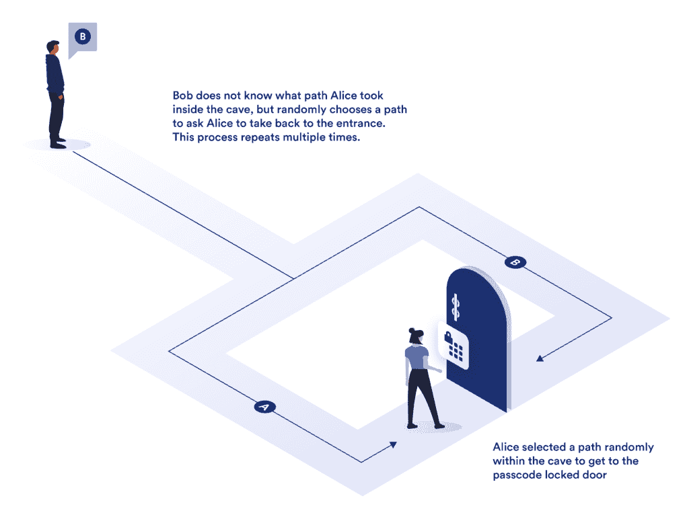

# 什么是零知识证明(ZKP)？

> 原文：<https://blog.chain.link/what-is-a-zero-knowledge-proof-zkp/>

虽然固有的透明性在许多情况下提供了优势，但也有许多 [智能合同用例](https://blog.chain.link/44-ways-to-enhance-your-smart-contract-with-chainlink/) 由于各种业务或法律原因而需要隐私，例如使用专有数据作为输入来触发智能合同的执行。在公共区块链网络上实现隐私的一种越来越常见的方式是通过 *零知识证明(ZKPs)*——一方以加密的方式向另一方证明他们拥有关于一条信息的知识，而不暴露实际的底层信息的方法。在区块链网络的上下文中，由 ZKP 在链上揭示的唯一信息是一些隐藏的信息是有效的，并且被证明者高度确定地知道。

在这篇文章中，我们探索零知识证明如何提供隐私保证，它们为用户提供的核心好处，以及一系列利用 zkp 的区块链用例。此外，我们还展示了 Chainlink 的 [DECO](https://research.chain.link/deco.pdf) 技术如何创建保护隐私的 oracle 网络，以保密和向后兼容的方式证明数据来自特定的 web 服务器。

## 零知识证明是如何工作的

沙菲·戈德瓦瑟和希尔维奥·米卡利在 1985 年的一篇名为“ [交互式证明系统的知识复杂性](http://citeseerx.ist.psu.edu/viewdoc/download?doi=10.1.1.419.8132&rep=rep1&type=pdf) ”的麻省理工论文中首次描述了零知识证明。在本文中，作者证明了一个 *证明者* 有可能说服一个 *验证者* 关于一个数据点的特定陈述是真实的，而不披露关于该数据的任何附加信息。ZKPs 可以是交互式的，即证明者说服特定的验证者，但需要对每个验证者重复这个过程；也可以是非交互式的，即证明者生成的证明可以被任何使用相同证明的人验证。此外，现在有各种各样的 ZKPs 实现，包括 zk-SNARKS、zk-STARKS、PLONK 和 Bulletproofs，每种都有自己的证明大小、证明者时间、验证时间等方面的权衡。

定义 ZKP 的三个基本特征包括:

 ***   完整性: 如果一个陈述为真，那么诚实的验证者可以被诚实的证明者说服，他们拥有关于正确输入的知识。
*   **可靠性:** 如果一个陈述是假的，那么没有一个不诚实的证明者能够单方面地使诚实的验证者相信他们拥有关于正确输入的知识。
*   **零知识:** 如果状态为真，那么验证者除了语句为真之外，不会从证明者那里学到更多的东西。

在高层次上，ZKP 的创建包括验证者要求证明者执行一系列动作，这些动作只有在证明者知道底层信息的情况下才能准确执行。如果证明者只是猜测这些行为的结果，那么验证者的测试最终会以很高的概率证明这些行为是错误的。

 **

<figcaption id="caption-attachment-2103" class="wp-caption-text">Conceptual example of how a Zero-Knowledge Proof works to prove knowledge about data without revealing the data to another party</figcaption>

直观理解零知识证明数据的一个概念性示例是，想象一个只有一个入口但有两条路径(路径 A 和 B)的洞穴，这两条路径在一个由密码锁定的公共门处相连。爱丽丝想向鲍勃证明她知道这门的密码，但又不想向鲍勃透露密码。为此，Bob 站在洞穴外面，Alice 从两条路径中选择一条进入洞穴(Bob 不知道选择了哪条路径)。然后鲍勃让爱丽丝从两条路中选择一条回到洞口(随机选择)。如果 Alice 最初选择走路径 A 到门口，但是 Bob 要求她走路径 B 回来，那么完成这个谜题的唯一方法是 Alice 知道锁着的门的密码。这个过程可以重复多次，以证明 Alice 知道门的密码，并且最初没有以很高的概率选择正确的路径。

完成此过程后，Bob 非常确信 Alice 知道门的密码，而不会将密码透露给 Bob。虽然只是一个概念性的例子，但是 ZKPs 部署了相同的策略，但是使用加密技术来证明关于数据点的知识，而不暴露数据点。在这个 cave 示例中，有一个输入、一个路径和一个输出。在计算中，也有类似的系统和电路，它们接受一些输入，将输入信号通过一条电通路，然后产生一个输出。零知识证明利用这样的电路来证明陈述。

想象一个计算电路，对于给定的输入，在曲线上输出一个值。如果用户能够始终如一地提供曲线上某一点的正确答案，则可以确信用户拥有关于曲线的一些知识，因为随着每一轮连续的挑战，猜测正确答案变得越来越不可能。你可以把这个回路想象成爱丽丝在洞穴中行走的路径，如果她能够用她的输入穿越这个回路，她证明她拥有一些知识，也就是回路的“密码”，这种可能性很高。能够证明关于数据点的知识而不泄露除数据知识之外的任何附加信息提供了许多关键好处，尤其是在区块链网络的环境中。

## 零知识证明的好处

零知识证明的主要好处是能够在透明系统中利用隐私保护数据集，例如以太坊这样的公共区块链网络。虽然区块链被设计为高度透明，任何运行自己的区块链节点的人都可以看到并下载存储在账本上的所有数据，但 ZKP 技术的加入允许用户和企业在执行[智能合同](https://chain.link/education/smart-contracts)时利用他们的私人数据集，而不会泄露底层数据。

确保区块链网络中的隐私对于传统机构至关重要，例如供应链公司、企业和银行，它们希望与智能合同互动并推出智能合同，但需要对其商业秘密保密以保持竞争力。此外，法律通常要求此类机构保护其客户的个人身份信息(PII ),并遵守法规，如欧盟的《通用数据保护条例》( GDPR)和美国的《健康保险便携性和责任法案》( HIPAA)。

虽然获得许可的区块链网络已经成为保护机构交易隐私不受公众关注的一种手段，但 ZKPs 允许机构安全地与公共区块链网络交互，而不放弃对敏感和专有数据集的控制，这些网络通常受益于全球用户的巨大网络效应。因此，ZKP 技术成功地为以前无法访问的公共区块链网络开辟了广泛的机构使用案例，激励了创新，创造了更高效的全球经济。

## 零知识证明应用

区块链已经使用了 zkp，例如[【Zcash】](http://z.cash)来允许用户创建保护隐私的交易，以保持货币金额、发送者和接收者地址的私密性。 [分散式 oracle networks](https://blog.chain.link/what-is-chainlink/) ，为智能合约提供了对链外数据和计算的访问，也可以利用 ZKPs 来证明关于链外数据点的一些事实，而不会暴露链上的底层数据。

一个正在开发中的基于零知识证明的 oracle 解决方案的实现是 [DECO](https://research.chain.link/deco.pdf) ，这是 Chainlink 网络的安全链外计算套件中的一个隐私保护 oracle 协议。通过扩展 HTTPS/TLS(最常用于在互联网上传输数据的协议), DECO 保证了数据在从各种私有和高级数据源传输的过程中保持私有和防篡改。DECO 与现代 TLS 版本一起工作，不需要可信的硬件，并且以向后兼容的方式运行，不需要服务器端的修改。因此，支持 DECO 的 Chainlink oracle 节点可以证明来自可信服务器的数据的事实，而不会泄露链上的数据，同时还可以证明数据的来源，因为 TLS 保管链得到了维护。

有了像 DECO 这样的 zkp，各种各样的智能合同用例成为可能，包括低抵押贷款，借款人以保护隐私的方式生成证明其信誉的高保证凭证。具体来说，借款人可以根据权威在线来源(如已建立的机构)的记录生成这些凭证，而不会暴露潜在的敏感数据，如他们的姓名、位置或确切的信用评分值(只需超过预定义的阈值)。

DECO 还可用于创建 [分散身份(DID)协议](https://blog.chain.link/digital-identity-on-the-blockchain/) 如 [坦诚](https://eprint.iacr.org/2020/934.pdf) ，用户可以在其中获得并管理自己的凭证，而不是依赖于一个集中的第三方。这种凭证由称为发行者的实体签名，发行者可以权威地将声明与用户(如公民身份、职业、大学学位等)相关联。DECO 允许任何现有的 web 服务器成为发行者，并提供密钥共享管理来备份帐户，以及基于明确的唯一标识符(如社会安全号(SSN))的隐私保护形式的 Sybil 抵抗。

最后，像 DECO 这样的 ZKP 解决方案不仅让用户受益，还能让传统机构和数据提供商以保密的方式利用其专有的敏感数据集赚钱。不需要直接在链上发布数据，只需要发布来自 zkp 的证明，证明关于数据的事实。这为数据提供商开辟了新的市场，他们可以将现有数据集货币化，增加收入，同时确保零数据泄露。当与 chain link[Mixicles](https://research.chain.link/mixicles.pdf)结合使用时，隐私扩展到执行协议的输入数据之外，还包括协议本身的条款。

通过将区块链网络固有的透明性与零知识证明的隐私保护设计相结合，企业和机构可以两全其美:他们可以保持其内部数据集的私密性，同时仍然可以在智能合同应用的可靠执行环境中利用它们。

*阅读 [Chainlink 2.0 白皮书](https://chain.link/whitepaper)，深入了解分散式甲骨文网络在保密智能合约系统中的作用，并注册[官方 Chainlink 简讯](https://chn.lk/newsletter)，了解关于 Chainlink 网络的最新动态。*****