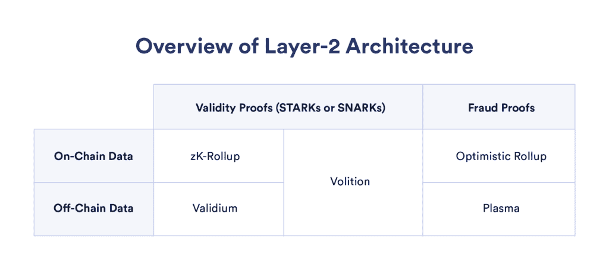
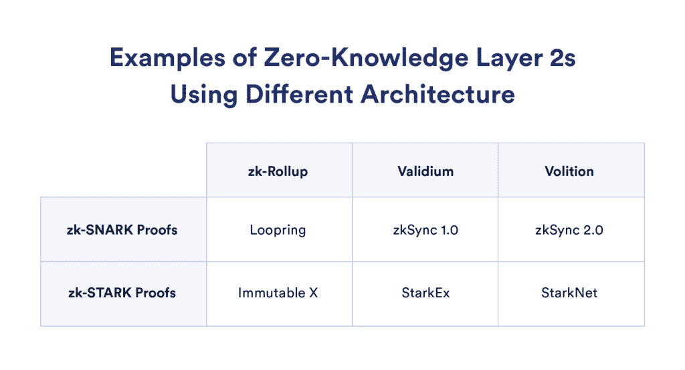
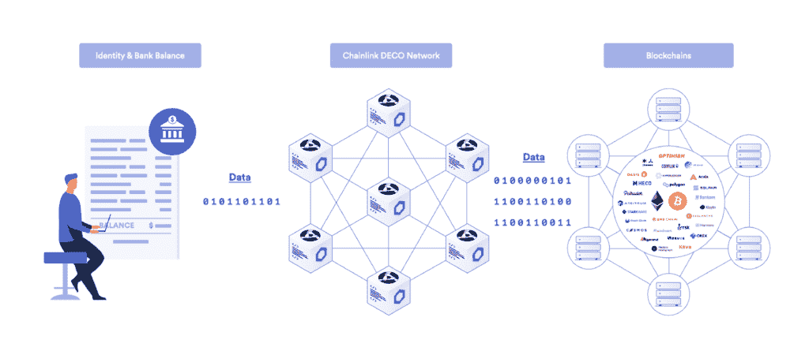

# 零知识区块链项目概述

> 原文：<https://blog.chain.link/zero-knowledge-projects/>

零知识技术是密码学的一个子集，帮助区块链项目克服许多第 1 层固有的扩展性和隐私限制。该技术使区块链项目能够促进更大的交易吞吐量，保护用户数据，同时仍然能够验证身份，并支持复杂的计算，同时还允许企业采用区块链技术，同时保护其知识产权。支撑所有这些用例的是零知识证明。

什么是[【ZKP】](https://blog.chain.link/what-is-a-zero-knowledge-proof-zkp/)？zkp 使人们能够证明他们知道或拥有一段数据，而不暴露潜在的信息。“证明者”使用系统输入的知识创建证明,“验证者”确认证明计算正确，即使验证者看不到信息。本质上，零知识证明使得在保护数据本身隐私的同时验证数据集的有效性成为可能。

在本文中，我们探索了基于零知识的解决方案的一些独特优势，区块链项目如何使用零知识技术(如 zkSNARKs 和 zkSTARKs)来帮助开发人员构建高级 dApps，这些高级 dApps 在保护用户隐私的同时扩展 [Web3](https://chain.link/education/web3) 生态系统，以及 Chainlink 信任最小化服务如何帮助这些协议变得更加分散、可靠和安全。

## 为什么要使用零知识网络？

零知识解决方案为开发人员提供了一种利用现有第 1 层区块链(如以太坊)的安全性的方法，同时使 dApps 能够通过更高的吞吐量和更快的交易进行扩展，通过隐藏离线信息来保护用户的个人信息，并通过批量发布交易来降低最终用户的成本。最终，这些优势使项目能够构建先进的 dApps，在保持分散化优势的同时，与 Web2 系统的性能和功能相媲美。

### 比较零知识解决方案和乐观汇总

乐观汇总是知名扩展解决方案使用的替代第 2 层技术。截至 2022 年 6 月 29 日，根据分析网站 [L2Beat](https://l2beat.com/) 的数据，存储在以太坊二层网络上的 TVL 中，乐观汇总占 74.3%，基于零知识的解决方案占 25.9%。

零知识扩展解决方案和乐观汇总之间的根本区别在于如何验证交易。乐观汇总使用欺诈证明，该证明仅在对第 1 层区块链上发布的状态更改有争议时生成，而零知识解决方案在每一批在链上发布后发布有效性证明。这意味着基于零知识的协议总是有一个有效状态，代价是消耗更多的 gas 来验证基链上的有效性证明。

然而，将零知识汇总与链外数据相结合可以提高气体消耗效率。这些更有效的基于零知识的解决方案被称为验证和意志。至关重要的是，它们还能够证明一个状态是有效的，而不暴露底层数据。这有助于推动 [企业采用](https://blog.chain.link/chainlink-enterprise-blockchain-middleware/) 的公共区块链作为组织可以保护用户信息和商业秘密。

两种不同类型的第 2 层解决方案的另一个区别是它们的资本效率。在乐观汇总中，完成交易和处理提款的标准窗口是一周，而用户可以在大约十分钟内从零知识解决方案中提取资金。

要了解有关乐观汇总和零知识协议之间的差异的更多信息，请观看来自 Offchain Labs、Polygon Hermez、Matter Labs、Metis DAO 和乐观主义的领导者最近关于以太坊第 2 层的未来的视频:

[https://www.youtube.com/embed/t-SQQmLhepY?feature=oembed](https://www.youtube.com/embed/t-SQQmLhepY?feature=oembed)

## 基于零知识的解决方案的类型

<figcaption id="caption-attachment-4105" class="wp-caption-text">Layer-2 solutions can use validity proofs or fraud proofs, and store data on- or off-chain.</figcaption>

### 架构

#### ZK-rolups

零知识汇总将许多交易捆绑在一起，并将它们发送到第 1 层区块链，并提供一个证明来验证该计算的有效性。链上发布的证明被称为有效性证明，可以是 SNARKs 或 STARKs。当这些证明在第一层区块链上被验证时，零知识汇总有了新的状态。

#### 井冈霉素

Validiums 将有效性证明与离线数据存储相结合，增强了的可扩展性。有效性证明仍然在基链上发布，而数据存储在链外。这大大提高了产量，降低了天然气成本。

虽然这是一种比 zk-rollups 更高效、更可扩展的架构，但它也带来了风险，即恶意行为者会使数据不可用，用户可能无法提取资金。这种数据可用性问题正在被证据类型的系统所克服，这些系统使用加密经济激励来帮助确保数据由许多不同的节点存储并始终可用。值得注意的是，虽然这些恶意行为者可以停止交易，但他们不能直接窃取用户的资金。

#### 转译

Volitions 结合了 zk-rollups 和 validiums，允许用户在两种扩展解决方案之间进行选择(因此得名),因为它们共享一个状态根。即使在意志的 validium 端有成功的恶意攻击，zk-rollup 端的资金仍然是安全的。

这使得愿意为 zk-rollup 的更高安全性担保支付更高费用的实体能够与偏好更低交易成本的参与者自然地互动，例如在 [DEX](https://blog.chain.link/dex-decentralized-exchange/) 上，做市商提供数亿的流动性，而散户可能只有几个小头寸未结。

### 有效性证明

#### 呼噜声

SNARK 代表“零知识简洁 **非交互式** 知识论证”SNARK 是一种加密证明，它体积小，易于验证。SNARKs 使用椭圆曲线生成一个加密证明，它假设从一个公共已知的基点找到随机椭圆曲线元素的离散对数是不可行的。计算椭圆曲线比计算 STARKs 使用的散列函数的计算成本更低，这就是为什么基于 SNARK 的协议更高效。

#### 斯塔克斯

STARKS 代表“零知识可扩展的 **透明的** 知识的论证”这是一种加密证明，几乎不需要证明者和验证者之间的交互。STARKs 相对于 SNARKs 的主要优势在于，它们具有快速的证明时间，并且更容易扩展，因为它们提供了更多的计算能力。此外，使用散列函数使它们具有量子抵抗性。

值得注意的是，STARKs 是由 Eli Ben-Sasson 发明的，他是 StarkWare、StarkEx 和 StarkNet 团队的联合创始人。

## 零知识区块链项目

<figcaption id="caption-attachment-4106" class="wp-caption-text">Examples of projects using different zero-knowledge solutions.</figcaption>

### 基于 zk-STARK 的项目

#### StarkEx

[StarkEx](https://starkware.co/starkex/) 是一个构建在以太坊之上的第二层可扩展性解决方案，它使用 STARK proofs 来验证自我托管的交易，使交易和支付应用程序能够构建在其上。像 DeversiFi、Sorare 和 dYdX 等建立在 StarkEx 上的项目已经产生了数亿笔交易和价值数千亿美元的交易量。然而，StarkEx 不支持支持全功能 dApps 的智能合约功能。

#### 史塔克顿网

[StarkNet](https://starkware.co/starknet/) 是一个通用平台，使开发者能够在基于以太坊的 zk-rollup 上部署智能合约。著名的以太坊 dApps Aave 和 Maker 都将在 StarkNet 上推出。值得注意的是，StarkEx zk-rollups 可以在 StarkNet 上启动，以增加应用程序的可伸缩性。

为了充分利用 STARKs 可能提供的高级计算和可扩展性，StarkWare 创建了一种新的高效、图灵的完整编程语言，用于生成 STARK 证明，名为 Cairo。这意味着 StarkWare 需要用文档、框架和附带的工具来引导开发者生态系统。

#### 不可变 X

[【不可变 X】](https://www.immutable.com/)，一个 NFT 平台，促进了 NFT 和代币的铸造和交易，正在与 StarkEx 一起使用特定于应用的 zk-rollup。该平台已经支持了数千万的 NFT 造币厂和交易，所有交易费用都很低，即使是在以太坊网络拥堵的时期。

不可变 X 也将在 StarkNet 上推出。不可变 X 将把它们发布在 StarkNet 上，然后通过 StarkNet 的 rollup 递归发布到以太坊上，而不是直接发布到以太坊上。然后，Immutable X 可以利用 StarkEx 在 StarkNet 上发布应用链，本质上为项目提供了第三层扩展解决方案。

### 基于 zk-SNARK 的项目

#### Zcash

[【Zcash】](https://z.cash/)】之前被命名为 ZeroCash，指的是用于支持其隐私保护交易的零知识证明，是较早的加密资产之一，并帮助在行业中率先使用零知识技术。

#### Loopring

[Loopring](https://medium.loopring.io/chainlink-and-loopring-collaborate-on-oracles-for-zkrollup-dex-protocol-c1c8094afc27) 是建立在以太坊基础上的 DEX，支持订单式交易，无需托管用户资产。由 Chainlink 价格馈送提供支持，它已经服务了超过 10 万个用户，促成了数十亿的交易量。

#### zkSync 1.0

[zkSync](https://zksync.io/) 是以太坊上的一个汇总，和 StarkEx 一样，支持令牌转移和互换，但不支持智能合约。该协议是由物质实验室创建的。

#### zkSync 2.0

与 StarkNet 类似，[ZK sync 2.0](https://blog.matter-labs.io/zksync-2-0-hello-ethereum-ca48588de179)是一个第二层以太坊扩展解决方案，使用支持智能合约的 volition 架构。zkSync 使用 zk-SNARKs 来验证交易，并使用 zkPorter(一种风险证明系统)来保证数据可用性。除了有效性证明之外，zkSync 2.0 和 StarkNet 的主要区别在于 zkSync 2.0 是 EVM 兼容的。1inch、Alchemix 和 Curve 计划在 zkSync 2.0 上推出。

#### 之字形

[之字形](https://info.zigzag.exchange/) 协议是一个分散的交易所，它使用 ERC-20 交易对的订单簿，不像大多数 dex，它们使用 [自动做市商](https://blog.chain.link/automated-market-maker-amm/) 设计。正是 zk-rollups 的可伸缩性使得订单簿设计变得可行。zkSync 的注册表中的任何令牌都可以在 ZigZag 上列出。该协议目前在 zkSync 1.0 上运行，但计划在 zkSync 2.0 和 StarkNet 上推出。

#### Mina 

[米娜](https://minaprotocol.com/) 协议是一种轻量级区块链，它使用 SNARKs 来产生大小限制在 22kb 的块。项目可以在 Mina 上构建具有完整智能合约功能的应用程序。

## 零知识协议如何提高分散可靠性和安全性

零知识协议可以通过可靠且分散的链式链接 [oracle](https://chain.link/education/blockchain-oracles) 服务来加强其安全保障并自动化其应用。跨 Web3 生态系统的协议可以使用链式链接信任最小化服务来访问任何外部 API，并利用安全的链外计算来构建更高级的应用程序。

零知识协议可以通过增强它们的 dApps

*   **高度精确的市场数据** — [Chainlink 价格馈送](https://data.chain.link/) 支撑[DeFi](https://chain.link/education/defi)经济，其具有超可靠和全球精确的价格市场数据，用于支持分散的稳定信贷、借贷协议、交易平台和更多使用案例。
*   **可验证的随机性** — [链环 VRF](https://chain.link/solutions/chainlink-vrf) 生成加密证明支持的随机性，然后交付并在线验证。NFT 平台可以利用这种随机性来制造公平的薄荷糖，而区块链游戏可以利用这种随机性来创造不可预测的游戏性。
*   **智能合约自动化**—[chain link Automation](https://chain.link/automation)是一种分散式服务，可用于自动触发重要的智能合约功能，如结算限价单、执行清算、重置代币等。
*   **储备证明** — [储备证明链](https://chain.link/proof-of-reserve) 为储备资产提供基于密码真实性的自动化验证，使零知识协议能够降低风险，提高透明度，并有助于防止 DeFi 中的系统故障。
*   **跨链通信**—[跨链互操作性协议(CCIP)](https://chain.link/cross-chain) 提供了具有通用、开放标准的协议，利用该标准可以构建安全的跨链应用程序，这些应用程序可以跨 Web3 传输令牌、发送消息和启动操作。

## 用 DECO 增强任何区块链项目

项目不一定要使用 zk-rollup、validium 或 volition 才能从零知识技术中获益。目前正在开发中， [DECO](https://research.chain.link/deco.pdf) 使用零知识证明来保证数据在跨 HTTPS/TLS 系统交付期间保持私密性和防篡改性。

<figcaption id="caption-attachment-4107" class="wp-caption-text">DECO-enabled Chainlink oracle nodes can prove facts about data without revealing that data.</figcaption>

支持 DECO 的 Chainlink oracle 节点可以证明来自可信服务器的数据的事实，而不会泄露链上的数据，同时还可以证明数据的来源，因为 TLS 保管链得到了维护。这支持广泛的高级用例，如 [【分散身份认证】【DID】](https://blog.chain.link/digital-identity-on-the-blockchain/)协议，如 [坦诚](https://eprint.iacr.org/2020/934.pdf) ，使用户能够管理他们的凭证，而不是依赖第三方。

DECO 最终提供安全性 保证 使用户能够在链上系统中安全地使用个人信息，而不必在链上提供这些数据。

## 结论

零知识证明与第一层区块链和分散式甲骨文网络一起，通过支持项目构建高度可扩展、经济高效的高级应用，同时保护用户隐私，从而改变区块链行业。

虽然有其他第二层解决方案可能为某些应用提供更好的架构，但随着区块链行业走向大规模采用，ZK-roll up、validiums 和 wiloints 将在个人和 [企业](https://blog.chain.link/chainlink-enterprise-blockchain-middleware/) 中获得大量用户。

如果你是一名开发者，想要集成 Chainlink 信任最小化服务，请查看我们的 [文档](https://docs.chain.link/) ，在[Discord](https://discord.com/invite/aSK4zew)中提问，或者 [与专家建立通话](https://chainlinkcommunity.typeform.com/to/OYQO67EF?page=homepage&typeform-source=blog.chain.link) 。

## 附加资源

*   [什么是零知识证明(ZKP)？T3】](https://blog.chain.link/what-is-a-zero-knowledge-proof-zkp/)
*   [密码真相:信任最小化计算和记录保存的未来](https://blog.chain.link/what-is-cryptographic-truth/)
*   [区块链可扩展性:执行、存储、共识](https://blog.chain.link/blockchain-scalability-approaches/)
*   [什么是链外数据和计算？T3】](https://blog.chain.link/off-chain-data-and-computation/)
*   [DECO:使用 TLS 的分散式 Oracles 释放 Web 数据](https://research.chain.link/deco.pdf)