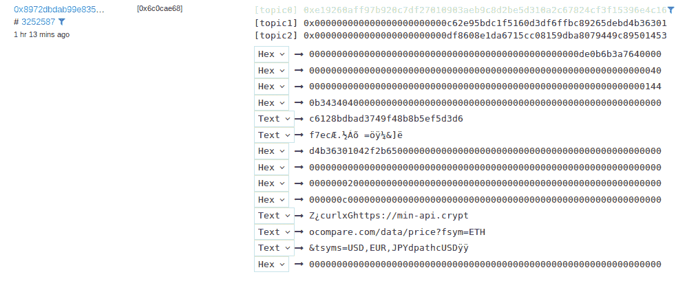
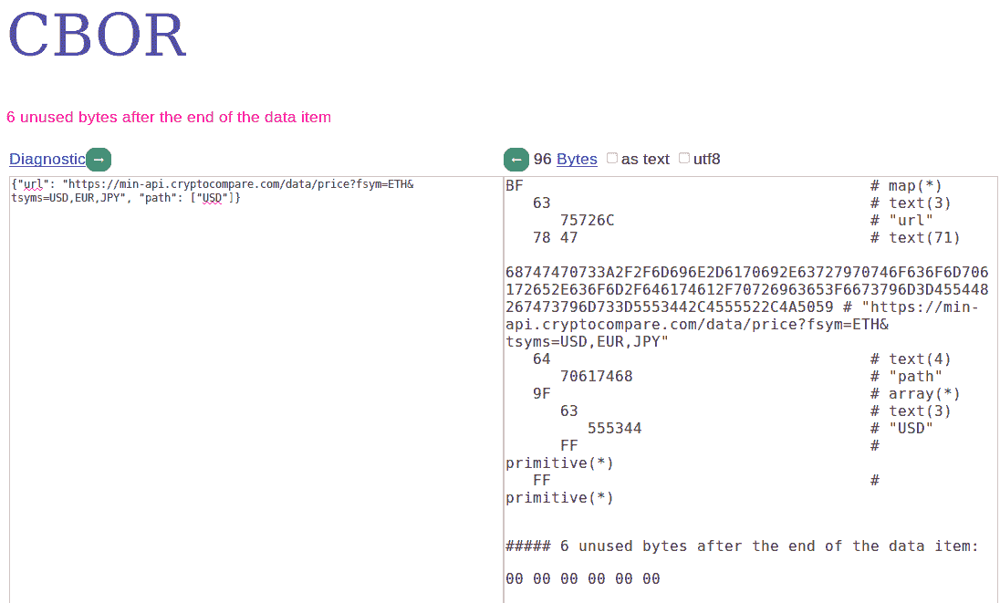
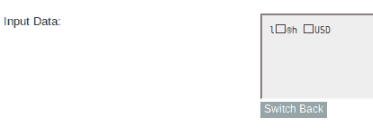
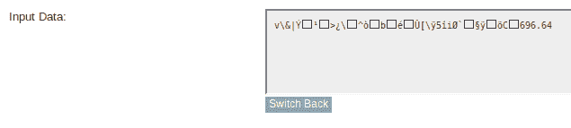
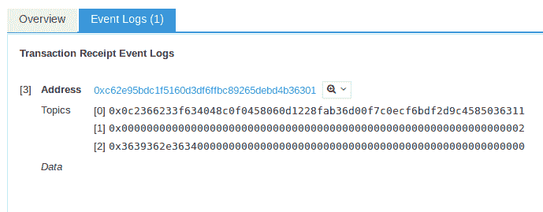
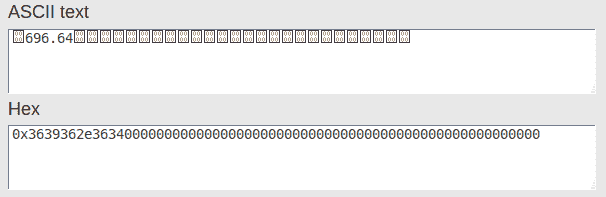

# 在 Ropsten Testnet 上查看 Chainlink 事务

> 原文：<https://blog.chain.link/viewing-chainlink-transactions-on-the-ropsten-testnet/>

首先，您可以在 Ropsten [这里](https://ropsten.etherscan.io/txs?ea=0x20fe562d797a42dcb3399062ae9546cd06f63280&topic0=0xddf252ad1be2c89b69c2b068fc378daa952ba7f163c4a11628f55a4df523b3ef)观看已部署的 LINK token 契约的事务。此链接过滤数据请求的事件主题。单击一个事务并转到 Event Logs 选项卡，您会注意到一些事件包含的数据比其他事件多得多。这些是对数据的请求，您可以将最后几个条目的十六进制下拉列表更改为文本，并查看部分有效载荷。

<figcaption id="caption-attachment-689" class="wp-caption-text">查看组成请求有效负载的 URL 和路径。</figcaption>

您还可以使用 [CBOR 解码器](http://cbor.me/)以纯文本方式查看完整的有效载荷:

<figcaption id="caption-attachment-690" class="wp-caption-text">我们用 CBOR 来编码对数据的请求。</figcaption>

比如这里的[这里的](https://ropsten.etherscan.io/tx/0x8972dbdab99e8356e34800a2944c0b1377de06d4e5404a30cb56a8a942cfa665)是我的一个测试的事务。首先，你可以看到输入数据的开头， *0x620cae68* ，是你用 Keccak-256 哈希它时*requestehereumprice(string)*的函数选择器。然后，如果您将输入数据转换为 UTF8，您将看到我使用“USD”作为输入参数。

<figcaption id="caption-attachment-691" class="wp-caption-text">USD 是使用的输入参数。</figcaption>

转到该事务的 Event Logs 选项卡，您可以再次看到请求的有效负载，以及我使用的 oracle 契约的地址，这里是。在 oracle 契约上，您将看到我的节点为满足请求[而创建的事务，这里是](https://ropsten.etherscan.io/tx/0x5a1e42a854969cada65e280ca6ef9bffd42eccdb8eee31870e74735afe4935fe)，同样，您可以将输入数据转换为 UTF8 以查看给出的值。

<figcaption id="caption-attachment-692" class="wp-caption-text">696.64 是赋予甲骨文合约的价值。</figcaption>

<figcaption></figcaption>

此外，您可以转到“事件日志”选项卡，直接获取发送给合同的十六进制值:

<figcaption id="caption-attachment-693" class="wp-caption-text">Topics[2] contains the requested value.</figcaption>

一旦您将最后一个主题(主题[2])的值输入到[十六进制到字符串转换器](https://www.rapidtables.com/convert/number/ascii-hex-bin-dec-converter.html)中，您可以看到该值:

<figcaption id="caption-attachment-694" class="wp-caption-text">请求返回合同通缉字节。</figcaption>

<figcaption></figcaption>

如果你想在 Ropsten 上部署合同或运行自己的 Chainlink 节点，请查看我们的 Github 上的[示例。你现在可以](https://github.com/smartcontractkit/chainlink/tree/master/examples/ropsten)[创建自己的合同](https://github.com/smartcontractkit/chainlink/wiki/How-to-make-a-Chainlinked-contract)来使用 Ropsten 上的 Chainlink。欢迎在 [Gitter](https://gitter.im/smartcontractkit-chainlink/Lobby) 上向我们提问！