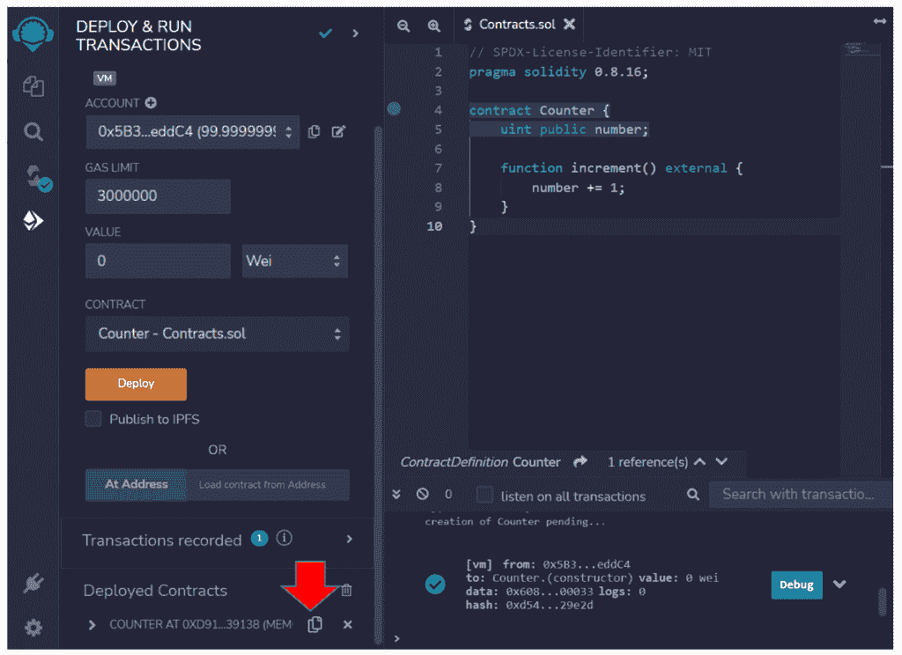
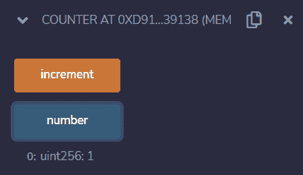
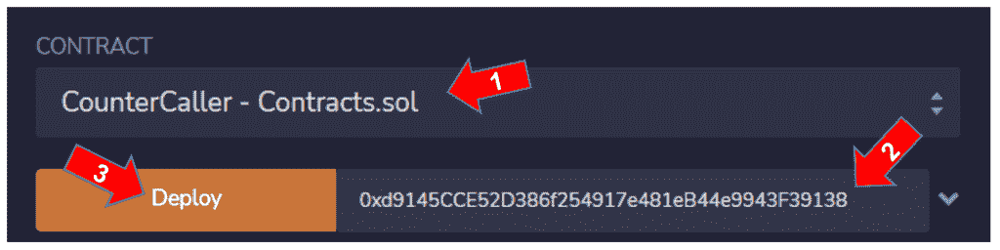
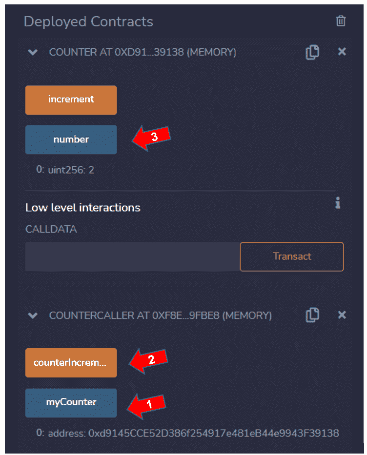

# 如何从另一个智能合约调用智能合约

> 原文：<https://blog.chain.link/smart-contract-call-another-smart-contract/>

[智能合约](https://chain.link/education/smart-contracts) 是在区块链环境中发布并执行的计算机程序。由于它们运行在区块链，它们可以在没有中央党或服务器的情况下运行。它们一般是用[](https://soliditylang.org/)语言编写的。

在以太坊区块链上，智能合约可以与现有的已部署合约进行交互。这也适用于任何其他 EVM 兼容的区块链(任何使用以太坊虚拟机创建的区块链)。

以下是与其他智能合约交互的智能合约的一些示例:

*   代币制造商或发行商有权调用代币的智能合约并发行它。
*   分散式交易所一直以交易代币的形式与其他智能合约互动。
*   当您使用 Chainlink Data Feed 获得某项资产的报价时，您的智能合约将与该资产的价格聚合器交互，这是另一个智能合约。
*   当您使用可验证随机数生成器 Chainlink VRF 时，您的合同会向 VRF 协调器发送一个请求，该协调器会将数字发送回您的智能合同。
*   为了使用 Chailink Keepers 自动执行智能合约，您创建了一个 Keepers maintenance，它将检查条件并执行已部署智能合约上的指令。

## 为什么从另一个智能合约中调用函数？

有时，一个应用程序需要拆分成几个智能合约。例如，我曾经创建了一个应用程序，它已经被分成三个相互交互的智能合约，但我无法在以太坊 mainnet 上发布它，因为以字节为单位的大小超过了允许的限制。为了发布应用程序，我不得不重构应用程序，将它分成五个智能合同。

另一个有趣的使用案例是可升级合同。区块链是不可变的，这意味着一旦部署了智能合约，就不可能更改它的代码。但是可以创建一个代理，将函数调用委托给另一个包含实际业务逻辑的契约。

如果您想更改逻辑，您可以为代理契约提供不同的目标地址，例如，一个经过一些改进的新部署版本。可以将逻辑和数据分离到不同的智能合约中。逻辑契约可以通过代理更新或换出，同时保留数据契约中的所有信息。

这个特性非常强大，因为它允许代码被重用，一些部署的契约可以像库一样使用。它还可以降低部署成本，因为使用该库的合同不需要包含所有代码本身。

## 召唤又一份坚固的智能合同

让我们使用在线网络工具 Remix。前往 remix.ethereum.org[](http://remix.ethereum.org)入门。

### 为您的智能合同创建一个文件

创建要添加智能合同的文件。是的，在同一个文件中可以有多个智能合同！

1.  在 Remix 中，点击左边栏的第二个图标“文件浏览器”。
2.  点击按钮“创建新文件”。
3.  将文件命名为 Contracts.sol

您将在这个文件中编写并部署两个智能契约。

首先，定义 [SPDX](https://spdx.org/licenses/) 许可类型和编译器版本。复制并粘贴此零件: 

```
// SPDX-License-Identifier: MIT

pragma solidity 0.8.16; 
```

### 反合同

第一个契约是“计数器”，一个递增数字的脚本。

复制并粘贴此示例:

```
contract Counter {

    uint public number;

    function increment() external {

number += 1;

    }

}
```

该反合同有:

*   一个无符号整数类型的公共变量 **数字** ，它将存储增量的值。
*   一个函数 **增量** 将数字变量的值增加 1。它是一个外部函数，这意味着它可以从其他契约和事务中调用。

编制柜台合同

1.  在左侧栏中找到一个名为“可靠性编译器”的按钮。
2.  点击按钮“编译 Contracts.sol”。
3.  启用自动编译选项。
4.  检查显示编译成功消息的按钮上的绿色标志。

部署柜台合同

1.  在左侧面板中，转到“部署和运行事务”按钮。
2.  目前，我们只有一个智能合同，因此在下拉“合同”中自动选择“柜台”。
3.  点击“部署”按钮。

找到左侧面板底部的合同，并复制其地址。比如我的是:

0xd 9145 CCE 52d 386 f 254917 e 481 EB 44 e 9943 f 39138

您应该会看到类似下图的内容:



<figcaption id="caption-attachment-4431" class="wp-caption-text">Find the contract in the bottom left of screen.</figcaption>


### 与计数器交互

展开柜台合同:

1.  点击“数字”按钮，检查是否为 0。
2.  点击“增加”按钮，发送交易增加数量。
3.  再次点击“数字”按钮，检查现在是 1。

这是最终结果:



<figcaption id="caption-attachment-4432" class="wp-caption-text">The final result of the contract counter.</figcaption>


### 反诉合同

现在我们已经部署了第一个合同，让我们创建另一个使用计数器递增函数的合同。这是一种类似依赖注入的机制。调用者可以实例化它想要调用的契约，并且知道函数和公共变量的类型签名。

将此代码复制并粘贴到 Contracts.sol 文件的末尾:

```
contract CounterCaller {

Counter public myCounter;

    constructor(address counterAddress) {

myCounter = Counter(counterAddress);

    }

    function counterIncrement() external {

        myCounter.increment();

    }

}
```

反索赔合同有:

*   一个名为 **myCounter** 的公共变量，类型为 Counter。这意味着我们正在使用我们想要作为类型调用的契约，获取计数器契约的公共函数和变量的规范。
*   **构造器** ，这个函数只在部署过程中被调用，用来用之前部署的计数器地址初始化 myCounter。
*   函数 **反欺诈** 将调用 myCounter 上的函数 Increment，它就像是智能合同计数器的“指针”。

查看完整文件 Contracts.sol:

```
// SPDX-License-Identifier: MIT

pragma solidity 0.8.16;

contract Counter {

    uint public number;

    function increment() external {

number += 1;

    }

}

contract CounterCaller {

Counter public myCounter;

    constructor(address counterAddress) {

myCounter = Counter(counterAddress);

    }

    function counterIncrement() external {

        myCounter.increment();

    }

}
```

编制反索赔合同

1.  如果您已经启用了自动编译选项，它将被编译。
2.  检查显示编译成功消息的按钮上的绿色标志。
3.  否则，按照之前解释的说明来编制专柜合约。

现在，让我们展开反诉合同。在左侧面板中，转到按钮“部署和运行事务”。

1.  在下拉合同中，选择 **反诉。**
2.  将计数器地址粘贴到 Deploy 按钮右侧的字段中。
3.  点击“部署”按钮。



<figcaption id="caption-attachment-4433" class="wp-caption-text">Deploying the ContractCaller contract.</figcaption>


### 与反诉人互动

在左侧面板的底部找到反诉合同，并将其展开。

1.  点击“我的计数器”按钮，检查是否是计数器地址。
2.  点击“反违约”按钮，发送调用柜台合约上的函数增量的交易。
3.  转到柜台合约，点击数字按钮，验证再次增加，现在应该是 2。

这是最终结果:



<figcaption id="caption-attachment-4434" class="wp-caption-text">Interact with the CounterCaller contract.</figcaption>


这是一个基本示例，帮助您学习如何使用 Solidity 从另一个智能合约调用一个智能合约。

在 Solidity 中，还有其他方法来委托合同之间的调用。需要注意的是，已部署的契约总是有一个地址，如果您知道函数和公共变量，另一个智能契约可以调用它。

既然您已经知道如何从另一个智能合约中调用一个智能合约，那么一大堆用例及功能就向您敞开了大门。可以:

*   将一份合同拆分成多份合同
*   设计复杂 dApps 的架构
*   启用可重用性
*   创建工厂合同(可以创建其他合同的智能合同)

如果您是一名开发人员，并且想要保护您的智能合约、dApp 或协议，请考虑在您的智能合约应用程序中使用 Chainlink。更多学习和参考资源，请查看 [【区块链教育中心】](https://blockchain.education/)[开发者文档](https://docs.chain.link/docs) ，或 [联系专家](https://chainlink.typeform.com/to/gEwrPO) 。你也可以通过 [分散式预言](https://docs.chain.link/docs/conceptual-overview/) 将你的智能合约与现实世界的数据连接起来。