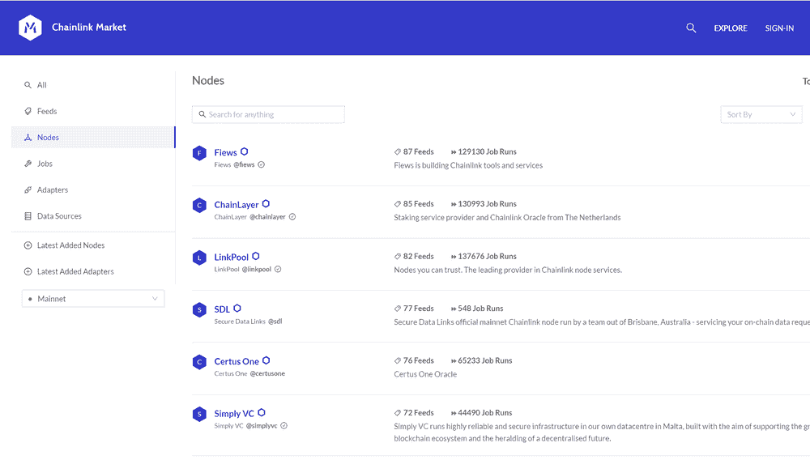

# LinkPool 获得 Chainlink 社区资助

> 原文：<https://blog.chain.link/linkpool-awarded-chainlink-community-grant/>

为了进一步支持 Chainlink 生态系统的快速增长，我们最近发布了 [Chainlink 社区资助计划](https://blog.chain.link/introducing-the-chainlink-community-grant-program/)，作为一种为许多开发 Chainlink 的开发团队提供重要财政资源的方式，以及许多能够轻松访问网络的额外开发人员资源。我们资助计划的目标是部署大量的财政资源，用于创建关键的开发工具、添加更多高质量的数据以及围绕 Chainlink 网络推出关键服务。我们很高兴开始宣布我们的 Chainlink 社区资助奖，并鼓励我们社区中所有有才华的个人开发人员和开发团队在这里向[申请资助计划。](https://chainlinkgrants.typeform.com/to/efEbsq)

我们很高兴地宣布，Chainlink 网络产品和服务的领先提供商 [LinkPool](https://www.linkpool.io/) 被选为 Chainlink 社区资助计划的接受者。LinkPool 将获得一笔资金，用于改善 [Chainlink Market](https://market.link/) — 智能合约开发商、数据提供商和节点运营商的资源中心，以列出和发现使用 Chainlink 网络创建下一代智能合约所需的组件。

Chainlink Market 为 [smart contract](https://chain.link/education/smart-contracts) 开发者提供了一种基于各种不同参数查找、过滤、验证和选择高质量 Chainlink 节点运营商和服务的简单方法。这使得智能合约开发人员及其用户能够更轻松地访问重要的 Chainlink 信息，并参与构建网络。Chainlink 市场还创建了一个社区构建的资源，允许访问分散的 Chainlink 网络，而无需 Chainlink 团队或文档的任何参与。使智能合约开发者能够从多个独立资源访问和监控 Chainlink 网络，是 Chainlink 整体弹性分散化的一个重要额外步骤，作为有效数据的全球公共产品。

[Market.link](https://market.link/) 已经成为参与 [Chainlink 的价格参考数据合同](https://data.chain.link/)的安全审查节点的重要资源，以公开访问的方式列出自己，与 feeds 页面或任何其他 Chainlink 资源分开。这包括它们支持的提要、总作业运行、认证服务等等。对于想要进一步了解为其 dApps 服务的节点运营商的 DeFi 开发人员来说，它是一个很好的资源。此外，还有许多社区节点可用于服务作业请求。

<figcaption id="caption-attachment-655" class="wp-caption-text">The Chainlink Market allows users to filter through Chainlink Network data, such as feeds, nodes, jobs, adapters, data sources, and more.</figcaption>

作为 Chainlink 生态系统的核心功能，它们代表了一种共享的社区资源，值得通过社区资助计划以开源方式开发新的创新功能。支持像 Chainlink Market 这样的大型社区资源符合社区赠款计划的目标，即提供工具和服务，在所有区块链环境中发展 Chainlink 网络、DeFi 生态系统和智能合同生态系统。

由于这笔赠款，链节市场的一些预期改进包括:

*   赋予合同创建者更大的权力，使他们能够通过直观的用户界面轻松部署新的 Chainlink oracle networks，同时能够轻松选择和比较最适合其特定使用情形的确切节点和数据源。
*   扩展平台，使其他服务提供商、其他节点运营商和数据提供商能够直接通过市场提供自己的产品，如节点即服务，以及易于使用的 Chainlink 支持的智能合同支付系统。

“我很高兴 LinkPool 被选为 Chainlink 社区赠款计划的接受者，以进一步发展 Chainlink 市场，”LinkPool 联合创始人 Jonny Huxtable 说。“在过去的两年半时间里，我们已经从一个小型业余爱好者项目成长为 Chainlink 生态系统中领先的工具和服务提供商之一。这笔拨款将使我们能够扩大 Chainlink 市场的功能集，并从整体上改善 Chainlink 生态系统，包括轻松部署 Chainlink 智能合约的令人兴奋的新工具。”

通过 Chainlink 社区资助计划，我们期待继续为越来越多的 Chainlink 生态系统团队提供支持，这些团队正在构建关键工具和基础设施，以加速通用智能合同和安全 oracle 节点基础设施的开发。我们将继续支持社区，将其作为 Chainlink 快速增长的关键驱动力，因为只有团结起来，我们才能让普遍连接的智能合同成为数字协议的主导形式。

## 关于 Chainlink 资助计划

如果你想了解更多关于资助项目的信息，请查看我们最近的博客文章,它进一步阐述了资助项目的目标和提交标准。如果您想参与 Chainlink Grant 计划，请[在此](https://chainlinkgrants.typeform.com/to/efEbsq)申请。Chainlink 社区赠款以现金和/或 link 的形式提供。

### 关于链接库

LinkPool 是领先的链节服务提供商，目标是提供有益于链节生态系统的工具和服务。LinkPool 的目标包括降低链接节点的准入门槛，降低运行链接节点所需的技术经验量，并为智能合同创建者提供工具，以轻松搜索和识别符合其数据要求的链接节点。

LinkPool 通过提供易于使用且直观的 staking dApp 来实现这些目标，通过其节点即服务和托管节点产品以及其行业首创的 Chainlink 市场来提供其节点基础架构。

LinkPool 的基础设施产品为用户提供了一个机会，通过创建一个节点或不可信地汇集资产来加入 Chainlink 网络。企业、风险公司和数据提供商依赖于 LinkPool 的同类最佳基础设施，其声誉是通过最佳性能和正常运行时间建立的。