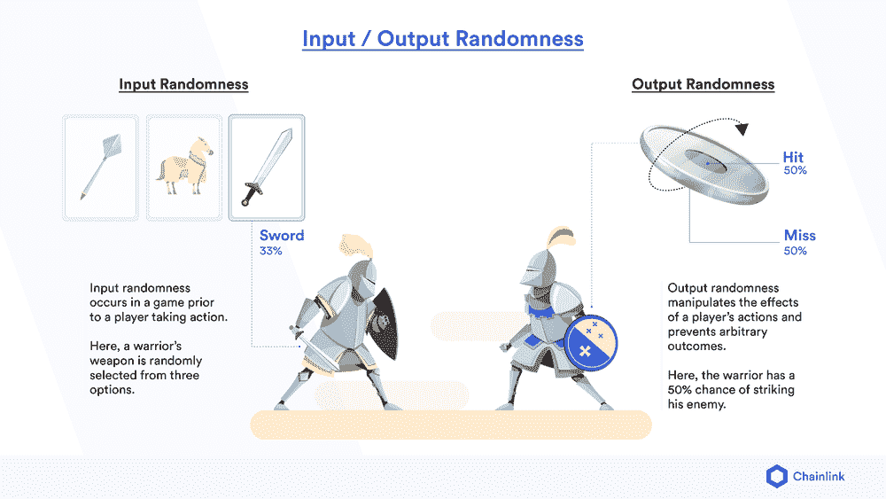
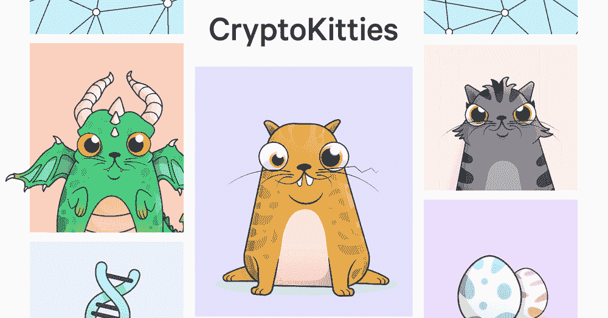
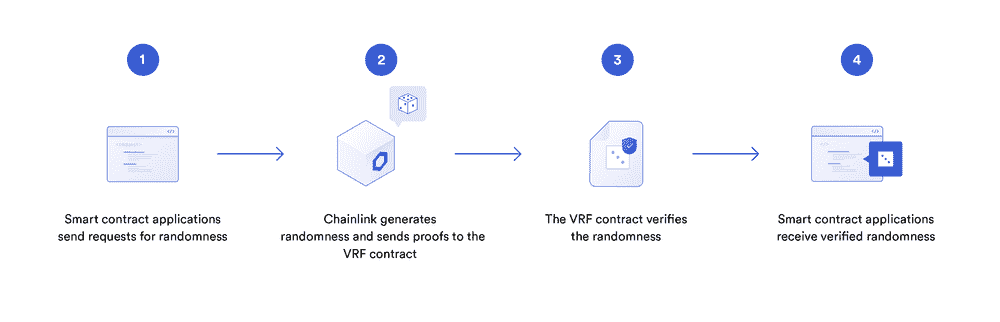
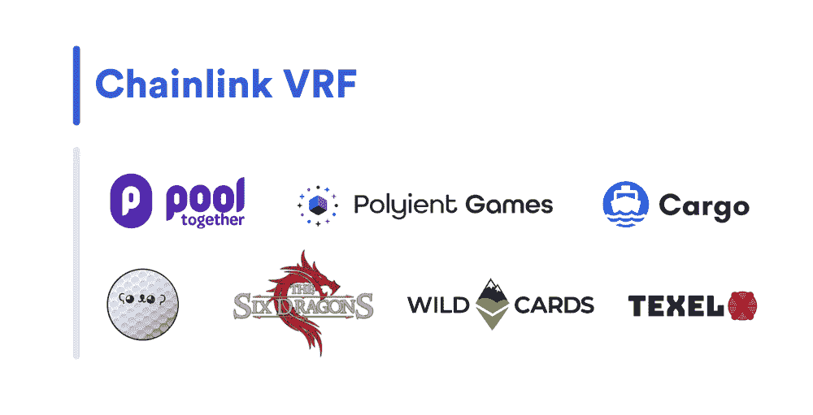

# 区块链视频游戏中随机奖励的经济影响

> 原文：<https://blog.chain.link/the-economic-impact-of-random-rewards-in-blockchain-video-games/>

关键要点:

*   游戏中的随机性分为两类:输入或输出
*   基于区块链的游戏有可能将游戏市场扩大到数万亿，特别是通过输入随机性发放经济奖励
*   区块链游戏奖励是稀缺、不可改变的资产，可以在二级市场交易，可能很快就会在多个不同的游戏中使用
*   当前的随机性解决方案非常有限，不适合保护它们将创造的价值
*   Chainlink VRF 旨在为区块链游戏创造一个随机来源，用户可以独立验证其真实性

## 介绍

尽管随机性无处不在，常常被忽视，但在许多用来创造有趣和身临其境的玩家体验的游戏中，随机性是一个至关重要的元素。随机性是在输入和输出连续体的高层次上运行的，游戏开发者利用它来创造玩家行动的条件(输入随机性)或操纵玩家行动的结果(输出随机性)。根据开发者和理论家杰西·谢尔(Jesse Schell)的说法，这些随机类型的组合，加上结构化的游戏元素，将在理想情况下诱导玩家进入一种状态*“惊喜的快乐”*——谢尔对“乐趣”的定义。

今天，区块链的游戏开发者几乎完全没有随机性。随着区块链游戏领域的发展壮大，随机性的重要性将不再局限于创造复杂和动态的游戏体验，因此缺乏安全的随机性解决方案尤为突出。相反，区块链游戏中的随机性将成为开发商和玩家日益强大的经济力量。相对于传统游戏，区块链游戏最大的承诺之一是更好地货币化玩家时间和游戏内动作的潜力。这将通过各种方法来实现，包括游戏内资产的[标记化](https://en.wikipedia.org/wiki/Non-fungible_token#:~:text=A%20non%2Dfungible%20token%20(NFT,interchangeable%20by%20their%20individual%20specification.)，创建“元诗句”来扩展这些资产的可用性，以及游戏资产的可证明稀缺性，等等。

因此，为了让基于区块链的游戏与传统游戏竞争，开发人员需要一个公正的随机数生成(RNG)解决方案，用于在[智能合同](https://chain.link/education/smart-contracts)中安全使用。直到最近，希望在区块链游戏中引入随机元素的开发者面临着一个困难的选择:使用集中式链外随机性解决方案，或者使用可能暴露于各种攻击媒介的链内随机性函数。由于这些缺点，像[链环 VRF](https://blog.chain.link/chainlink-vrf-on-chain-verifiable-randomness/) (可验证的随机性功能)这样的随机性解决方案将成为区块链游戏致力于革新空间的重要工具。

这篇文章研究了随机性如何在游戏中使用，游戏中的随机性和其他玩家活动的经济影响，区块链游戏中随机性的预计经济重要性，以及 VRF 链如何超越当前随机性解决方案的限制。

## 游戏中的随机性

在他 2005 年的书《游戏设计的乐趣理论》中，开发者拉斐尔·科斯特描述了无聊游戏中的一个通病:他称之为“掌握问题”。

根据科斯特的说法，“乐趣”是识别模式、解决难题和吸取教训的副产品——所有这些都是为了最终掌握一组信息。由于井字游戏的规则和模式简单，即使是语言前的儿童也可以学习玩并享受这种游戏，但由于同样的原因，认知能力更强的玩家很快就会厌倦；他们太容易成为游戏的主人。因此，游戏中随机性的一个关键功能是扩大玩家行动和环境的动态性——防止掌握变得太快，并更好地奖励持续参与。

这是通过两种随机性实现的:输入和输出。输入随机性发生在玩家采取行动之前的游戏中——一些例子包括庄家给玩家一手牌，玩家进入游戏区时随机的怪物“产卵”,或者游戏地图按程序生成其环境。在所有情况下，这种随机性通过改变游戏场景的细节来阻碍玩家的掌握。玩家不能记住一步一步的策略来获得最佳性能，而是必须学习更广泛的游戏机制——假设会导致更长、更具挑战性和更有价值的游戏体验。

另一方面，输出随机性操纵玩家行动的效果，或者在结果中注入“噪音”。这种类型的随机性可以包括在策略游戏中赢得战斗的百分比机会；德州扑克中的翻牌圈、转牌圈和河牌；或者掷骰子来确定玩家是否通过技能检查。输出随机性阻止游戏产生完全任意的结果——它迫使玩家学习额外的风险管理策略，以及如何从不太可能但潜在的灾难性损失中恢复，从而阻碍了掌控。

<figcaption id="caption-attachment-837" class="wp-caption-text">输入输出随机性如何影响游戏内场景</figcaption>

所有这些随机性的例子要么现在出现在基于区块链的游戏中，要么随着游戏空间的发展即将出现。然而，从经济角度来看，有一种特殊形式的输入随机性对区块链游戏开发商和玩家来说非常重要:用于确定玩家奖励的输入随机性。这可以包括打开战利品盒，制作物品，以及为达到游戏中的某些里程碑而分发奖品。

不像其他形式，这是部署来阻碍或复杂化玩家走向精通，这种类型的随机性奖励玩家在他们的道路上。“奖励随机性”的独特之处还在于，游戏中的奖励通常可以在二级市场上买卖，在游戏的基本乐趣水平之上增加了一层利润激励。这种随机性将成为即将到来的区块链游戏经济中至关重要的一环。

## 奖励随机性的经济影响

游戏研究公司 [NewZoo](https://newzoo.com/insights/articles/newzoo-games-market-numbers-revenues-and-audience-2020-2023/) 的一份报告预计，2020 年游戏市场总额将接近 1600 亿美元，到 2023 年，该市场有望超过每年 2000 亿美元。其中，购买游戏中的虚拟角色“皮肤”、物品包和附加内容目前每年占 500 亿美元，接近整个市场的三分之一。这个虚拟商品市场有多少来自随机分发工具，如“战利品盒”——随机的游戏内物品或皮肤包——尚不清楚，但可能占很大一部分。

基于区块链的游戏已经在扩展这个市场。三个最受欢迎的游戏和收藏品项目， [CryptoKitties](https://www.cryptokitties.co/) 、 [Gods Unchained](https://godsunchained.com/) 和 [My Crypto Heroes](https://www.mycryptoheroes.net/) 在存在的第一年分别赚了 700 万美元、420 万美元和 150 万美元，玩家在二级市场上交易游戏资产赚了超过 2000 万美元。

<figcaption id="caption-attachment-838" class="wp-caption-text">CryptoKitties，受欢迎的 NFT 支持的收藏品</figcaption>

区块链内容协会的负责人 Hironao Kunimitsu 最近表示，他相信区块链游戏市场最终会超过日本的国内生产总值(目前估计为 4.7 万亿美元)。这将主要通过将游戏中随机分布的物品标记为[NFT](https://chain.link/education/nfts)(不可替换的标记)来实现。正如我们在之前的深度探讨[中所讨论的，使用 chain link Oracle](https://blog.chain.link/create-dynamic-nfts-using-chainlink-oracles/)创建动态不可替换令牌(NFT)的 16 种方法，不可替换令牌(NFT)是一种加密的安全令牌，存在于区块链上，代表某个独特事物的所有权。

作为 NFTs 支持的区块链游戏项目的一个主要价值来源是可证明的所有权和不变性。在传统游戏中，物品的所有权可以被取消，物品的状态和外观可以被操纵，如果游戏不再存在，物品也会消失。使用 NFTs 的令牌化减轻了所有这些缺点:NFTs 加密地保护了项目的所有权；除非明确许可，否则不可能操纵与 NFT 相关联的元数据；因为它存储在区块链上，一个 NFT 游戏道具可以比生成它的游戏活得更久。

此外，NFT 在其原始游戏之外存在的这种能力创建了一个新的用例，称为元宇宙。元宇宙是一个可互操作游戏的链接网络，其中 NFT 支持的物品可以在每个不同的游戏“宇宙”中使用例如，在幻想游戏中生成的装甲背心可以增强玩家的攻击保护，也可以在科幻游戏中使用，具有相同的效果。通过允许一个 NFT 游戏物品在多个游戏中提供效用，开发者可以假设增加物品的价值。

最后，NFT 支持的游戏项目还允许二级市场有更大的流动性和透明度。像 [Fair Games](https://fair.game/) 这样的组织已经在寻求跟踪游戏随机生成的 NFT 与生成资产的市场价格的比率，并随后向玩家提供这些信息。这将允许玩家选择他们希望玩的游戏，基于他们更好地利用 NFT 奖金赚钱的机会，以及通过区块链的基本公共性质提供 NFT 物品可证明是稀缺的保证。

已经是一个令人印象深刻的经济力量，专家认为，游戏内奖励随机性奖励的符号化所产生的卓越效用有可能将虚拟商品空间扩大几个数量级。然而，随着价值的增加，对随机性解决方案的需求也相应增加，这种解决方案可以为空间提供安全性、可靠性和可证明的公平保证。

## 当前随机性解决方案的局限性

就像用户不会相信一个只有一个可操作的[预言](https://chain.link/education/blockchain-oracles)的 [DeFi](https://chain.link/education/defi) 协议一样，用户很快就会拒绝那些不能提供安全保证的视频游戏。尤其是在任何游戏环境中，现实世界的价值可能受到威胁，对安全、可靠和可证明公平的解决方案的需求增加了。考虑到发行的普遍性和这种随机性产生的潜在价值，当涉及到作为随机奖励发行的 NFT 时，这种需求尤其迫切。

在集中式解决方案的情况下，随机性的来源有被控制方(开发人员)操纵的风险。这样做是为了将最好的和最有价值的非功能性交易分配给他们自己或优先选择的交易方。此外，在受信任的开发者的情况下，仍然缺乏透明度，这可能导致玩家社区甚至对最善意的团队产生怀疑。随机性本质上允许长尾、低概率事件；在足够长的时间内，一个玩家不寻常的好运是不可避免的现象。当一个社区看到一个玩家得到了大量稀有或有价值的物品时，集中解决方案缺乏透明度自然会导致他们怀疑这些物品是以公平的方式分配的。

使用 blockhash 的链上解决方案也受限于它们能够可靠保护的价值数量。一旦游戏变得足够成功，足以激励坏演员，他们就有了一个攻击载体，通过像 blockhash 这样的可偏置输入来这样做。我们在 VRF 的介绍文章列出了这种攻击的细节:

*“例如，假设一个合约基于某个高度的块的散列中最后一位的奇偶性做出决策。这看起来像是 50/50 的结果，但是考虑平均生产三分之一块的矿工(或矿工联盟)可能决定放弃块散列的最后一位是 1 的获胜块，放弃大约 2-3 ETH 的块奖励。在这种情况下，矿工可能会将零结果从可靠的 50%可能性偏向 2/3 可能性，导致任何依赖这种随机生成方法的智能合约的用户资金损失。”*

在其他方面，过去成功的区块链游戏发布会也受到过类似方法的攻击，让团队面临一个选择，要么让他们的 NFT 价值被稀释，要么向攻击者支付赎金。

## 链上可证明随机性的链环 VRF

<figcaption id="caption-attachment-839" class="wp-caption-text">VRF 工程基础知识</figcaption>

一个理想的区块链游戏的随机性解决方案将克服这些障碍，既可证明是公平的，链上可验证的，以及对剥削或篡改的安全。拥有这些特性的随机性解决方案的一个例子是[链环 VRF。](https://blog.chain.link/verifiable-random-functions-vrf-random-number-generation-rng-feature/) Chainlink VRF 生成链上随机性，任何节点操作者、挖掘者或用户都无法操纵。它由一个加密证明支持，任何人都可以在区块链上验证它是一个真实的随机性来源。

VRF 链条工程分为五个步骤:

1.  用户向智能合同应用程序提交种子
2.  应用程序使用提供的种子提交一个链接 VRF 请求
3.  链式链接节点操作符生成随机性，并在链上发布该生成的密码证明
4.  响应在链上被验证
5.  智能合约应用基于经验证的随机数据来执行。

这种体系结构防止智能合约使用被操纵的随机性。此外，随着产品的成熟，Chainlink VRF 将变得更加安全。目前，如果节点操作者希望影响随机数的结果，他们有一种“抑制攻击”的方法虽然节点操作者不能篡改随机性，但他们有能力完全不提交随机计算。在未来，这将通过使用多个 oracles 来缓解，这些 oracles 通过[门限签名](https://blog.chain.link/threshold-signatures-in-chainlink/)提交答案。这将使 Chainlink VRF 公司的安全保障得到加强，以适应区块链电子游戏市场不断增长的价值。

目前，各种各样的项目正在实施 VRF 链的生产和分配随机奖励。这些人包括: [PoolTogether](https://www.pooltogether.com/) ，他们将在他们的游戏化平台上分发储蓄奖励；[聚友游戏](https://www.polyient.games/)，他们将向创始人令牌持有者发放 NFT 奖励； [Cargo](https://www.cargo.build/) ，他们将使用 Chainlink VRF 允许在他们的铸造平台上随机 NFT 特征；FaceGolf ，他将使用 VRF 来决定比赛的结果和赢得的奖品；[六条龙](https://thesixdragons.com/)，其工艺特征带有随机风险/回报收益；[通配符](https://wildcards.world/)，一个哈伯格征税的 NFT 慈善项目，它将利用 VRF 铸造新 NFTS；和[特克塞尔](https://texel.space/)，他们将利用 VRF 来确定他们收藏的郁金香的基因特征。

<figcaption id="caption-attachment-840" class="wp-caption-text">使用 Chainlink VRF 的区块链博彩项目生态系统持续增长。</figcaption>

随着空间的成熟和安全随机性的经济重要性变得更加明显，我们预计更多的团队将不得不评估像 VRF 链家提供的安全保证的需要。

## 结论

区块链视频游戏是该领域最有前途的用例之一，不仅有可能通过增加透明度和可证明的游戏资产所有权来改善玩家体验，还可能通过允许玩家更好地利用游戏时间和技能来从根本上重新定义游戏。虽然它已经是一股令人印象深刻的经济力量，但这些转变将显著扩大整个游戏产业。

然而，为了让这个空间达到这些崇高的目标，开发者和玩家需要安全保障和基础设施来支持他们将创造的价值的增加。游戏中的随机性将从主要作为创造更好游戏体验的工具转变为创造和分配价值的重要渠道。Chainlink VRF 是一个专为智能合约应用开发的随机性函数，它可以满足新经济将创造的需求。

## 立即实施 Chainlink VRF

如果你是一个聪明的合同开发者，并且想利用 Chainlink VRF 特性，请访问我们的[开发者文档](https://docs.chain.link/docs/chainlink-vrf)，并加入关于[不和谐](https://discordapp.com/invite/aSK4zew)的技术讨论。如果您想安排一次电话会议来更深入地讨论整合事宜，请点击此处的。

通过访问 [Chainlink 网站](https://chain.link/)或在 [Twitter](https://twitter.com/chainlink) 或 [Reddit](https://www.reddit.com/r/Chainlink/) 上关注我们，了解更多信息。