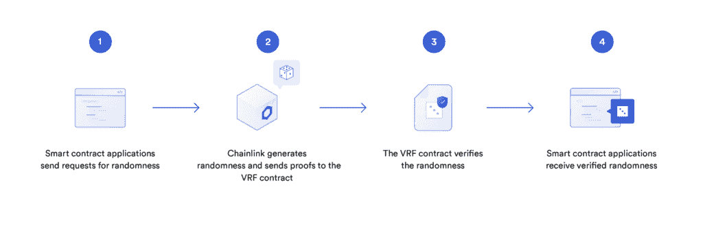

# 链环 VRF 现在在以太坊主网上直播

> 原文：<https://blog.chain.link/chainlink-vrf-now-live-on-ethereum-mainnet/>

我们很兴奋地宣布 [Chainlink VRF](https://chain.link/solutions/chainlink-vrf) (可验证的随机函数)现已在以太坊主网上上线，为区块链应用程序生成了一个高度安全且可证明公平的链上随机性来源。一些项目已经在生产中使用 Chainlink VRF live 来保护关键的[智能合约](https://chain.link/education/smart-contracts)功能:PoolTogether 用于在其 v3 版本中随机选择奖金池获奖者，Centaur 和 UniLend 用于公平随机选择公开销售参与者，以及许多其他项目已经承诺在不久的将来推出，如 Aavegotchi、Polyient、Get Protocol 等等。

Chainlink VRF 的推出展示了安全可靠的[神谕](https://chain.link/education/blockchain-oracles)的力量，它不仅是为 [DeFi](https://chain.link/education/defi) 生态系统提供准确的[价格反馈](https://chain.link/solutions/defi)的一种手段，也是为游戏、[不可替代代币(NFT)](https://chain.link/education/nfts)和其他各种需要不可预测性的应用生成和提供可证明的公平随机性的一种手段。这是 Chainlink Network 不断扩展用户可以通过其 oracle networks 接收的数据和计算类型的又一个例子，大大增加了智能合约开发人员可以构建的应用程序的数量和种类。

如果你是一个新的或现有的智能合同开发者，并希望与 Chainlink VRF 一起构建，请查看我们的[文档](https://docs.chain.link/docs/chainlink-vrf)以在 Remix 中部署 testnet 合同或将 Chainlink VRF 集成到 mainnet 上的 dApp 中。如果您想更深入地讨论整合事宜，[请联系我们，安排一次通话](http://vrf@chain.link/)。

如果你想更深入地了解支持该开发的学术研究和正式证据，请参考我们的 [Chainlink VRF 博客帖子](https://blog.chain.link/verifiable-random-functions-vrf-random-number-generation-rng-feature/)关于链上可验证的随机性。

## **可验证随机性的重要性**

随机数生成(RNG)对于许多软件应用程序的开发至关重要，因为它是一种创造不可预测性的机制。不可预测性不仅可以防止恶意实体试图对系统进行逆向工程，还可以给应用程序带来惊喜，确定流程的结果，以及验证原始对象和事件的创建。然而，获得一个可靠的不能被篡改或预测的 RNG 来源是一个非常困难的问题。

在 Chainlink VRF 之前，开发人员有两种主要的 RNG 方法:通过使用块哈希的链上 RNG 或使用单一故障源 RNG 提供者的链下 RNG。这些随机性解决方案引入了几个安全漏洞，即链上的 RNG 容易受到矿工攻击，而链下的 RNG 将对 RNG 输出的完全控制交给了集中的 RNG 提供商。

随着依靠随机性的智能合约所保证的价值增加，利用它们的动机也增加了。考虑到智能合同是数据驱动的应用程序，没有人工中介或退款，这一点尤为重要。因此，它们需要在用于保护用户资金的大型资产池的 RNG 上有更高的安全性和可靠性保证。

Chainlink VRF 专为支持智能合约的需求而设计，为他们提供开源和易于集成的 RNG 解决方案，任何用户都可以通过加密证据直接在链上进行审计。这在基于随机性的过程中提供了更高水平的信任和透明度，即使是 oracle 或项目开发人员也无法篡改。

<figcaption id="caption-attachment-2050" class="wp-caption-text">How smart contract applications receive verified randomness from Chainlink.</figcaption>

## **开启一系列全新的区块链用例**

以可证明的安全方式访问公平和无偏见的随机性来源的能力允许区块链开发人员开始构建一组全新的链上函数，例如:

*   **生成不可替代的代币(NFT)**-播种特定的可收集特征、原始战利品盒、稀有游戏内物品和各种其他独特的数字资产
*   **在游戏中引入随机元素**——地图生成、致命一击(战斗游戏)、配对(多人游戏)、抽卡顺序和随机遭遇/事件
*   **订购流程**-分发高需求活动的门票，选择受欢迎的公开销售的参与者，以及选择稀有鞋子等奢侈品的预售获奖者
*   **随机选择某人**–为一个案件挑选一名陪审员，为共识选择一名验证者，抽取一名规定的彩票中奖者，或者在一个协议或 DAO 中的许多其他选择过程

这些只是可证明的随机性将扩大普遍连接的智能合约的可寻址市场的许多方式中的几种。我们很高兴看到使用 Chainlink VRF 开发了什么，并期待听到更广泛的智能合同社区对随机性的需求。

如果您有兴趣了解游戏和 NFTs 中的 Chainlink VRF，请查看我们的其他博客帖子:

*   [链环 VRF:链上可验证的随机性](https://blog.chain.link/verifiable-random-functions-vrf-random-number-generation-rng-feature/)
*   [区块链视频游戏中随机奖励的经济影响](https://blog.chain.link/the-economic-impact-of-random-rewards-in-blockchain-video-games/)
*   [使用链式甲骨文创建动态不可替换令牌(NFT)的 16 种方法](https://blog.chain.link/create-dynamic-nfts-using-chainlink-oracles/)

如果你是一个 dApp 开发者，想要在 mainnet 上测试或集成 Chainlink VRF，请查看我们的[文档](https://docs.chain.link/docs/chainlink-vrf)或[与我们安排一次通话](http://vrf@chain.link/)。

[Explore Chainlink docs](https://docs.chain.link/) [Talk to an expert](https://chainlinkcommunity.typeform.com/to/OYQO67EF?page=blog)

### 关于这个话题的更多信息

*   [随机数生成(RNG)固化](https://blog.chain.link/random-number-generation-solidity/)
*   什么是 NFT？
*   [使用 Chainlink Oracles 创建动态 NFT 的 16 种方法](https://blog.chain.link/create-dynamic-nfts-using-chainlink-oracles/)

[网站](https://chain.link/) | [简讯](https://chn.lk/newsletter) | [推特](https://twitter.com/chainlink) | [不和](https://discordapp.com/invite/aSK4zew)|[Reddit](https://www.reddit.com/r/Chainlink/)|[YouTube](https://www.youtube.com/channel/UCnjkrlqaWEBSnKZQ71gdyFA)|[电报](https://t.me/chainlinkofficial) | [事件](https://blog.chain.link/tag/events/) | [GitHub](https://github.com/smartcontractkit/chainlink) | [价格供稿](https://feeds.chain.link/) | [DeFi](https://www.chain.link/solutions/defi)