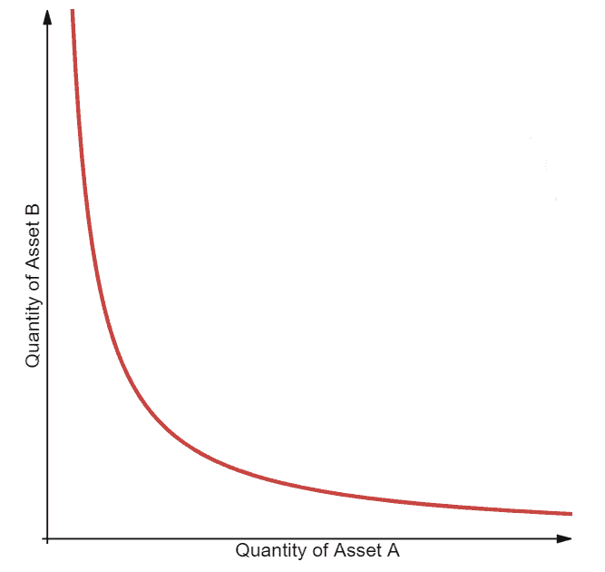
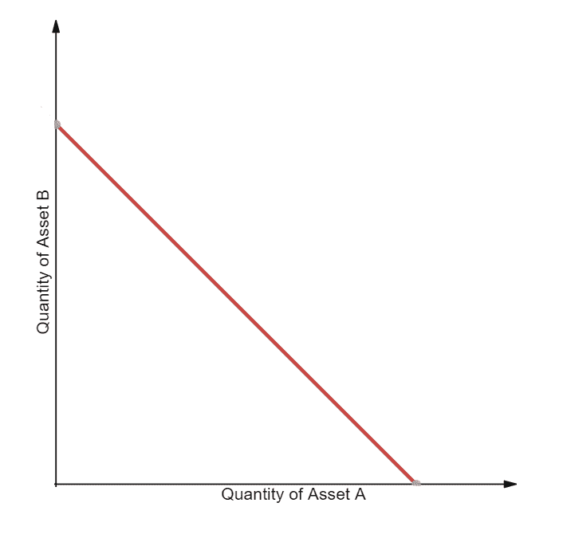
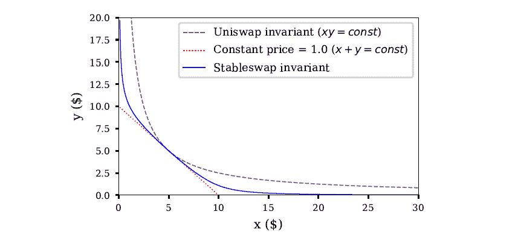

# 什么是自动做市商？

> 原文：<https://blog.chain.link/automated-market-maker-amm/>

*2022 年 5 月 17 日更新*

什么是自动化做市商？自动做市商(AMMs)是一种 [分散交易所(DEX)](https://blog.chain.link/dex-decentralized-exchange/) 的类型，它使用算法“货币机器人”来使个人交易者轻松买卖加密资产。用户直接通过 AMM 交易，而不是像传统的订单簿那样直接与其他人交易。

做市商是负责为交易所中可能缺乏流动性的可交易资产提供流动性的实体。做市商通过从自己的账户中买卖资产来实现这一目标，目的是获利，通常是从价差——最高买入报价和最低卖出报价之间的差额——中获利。他们的交易活动创造了流动性，降低了大宗交易的价格影响。

虽然存在其他类型的分散式交易所(DEX)设计，但总部位于 AMM 的 DEX 已经变得非常受欢迎，为各种数字代币提供了深度流动性。

## 什么是流动性池和流动性提供者？

支撑 AMMs 的是流动性池，这是一个加密资产的众包集合，AMM 使用它与购买或出售这些资产的人进行交易。将资产存入资金池的用户被称为流动性提供者(LP)。

流动性对于资产管理系统的正常运行至关重要。如果 AMM 没有足够的流动性池，当交易者在 DeFi AMM 上买卖资产时，它会产生巨大的价格影响，导致资本效率低下和非永久性损失。为了激励流动性提供者将他们的加密资产存放到协议中，AMMs 用 AMM 产生的费用的一小部分来奖励他们，通常以 LP 令牌的形式分发。存放资产以赚取报酬的做法被称为 [产农](https://chain.link/education/defi/yield-farming) 。

AMM 上的资产价格会根据需求自动变化。例如，一个流动性池可以持有 1000 万美元的 ETH 和 1000 万美元的 USDC。然后，交易者可以将价值 50 万美元的 USDC 换成 ETH，这将提高 AMM ETH 的价格。

## 有哪些不同的自动做市商(AMM)模式？

常数函数做市商(CFMMs)，如常数乘积做市商、常数和做市商和常数均值做市商，是通过 Bancor、Curve 和 Uniswap 等协议流行的第一代 AMM 的一类。这些 AMM 交易所基于一个常数函数，交易对的总资产储备必须保持不变。在非托管 AMMs 中，交易对的用户存款集中在一个 [智能合约](https://chain.link/education/smart-contracts) 内，任何交易者都可以使用该合约进行代币互换流动性。用户根据智能合约(集合资产)进行交易，而不是像在订单簿交换中那样直接与交易对手进行交易。

### 恒产品做市商(CPMM)

第一种出现的 CFMM 是“固定产品做市商”( CPMM ),它是由 AMM 的第一个 DEX Bancor 推广开来的。CPMMs 基于函数 x*y=k，该函数根据每个代币的可用数量(流动性)建立两个代币的价格范围。当代币 X 的供给增加时，代币 Y 的供给必须减少，反之亦然，以保持不变的产品 k。绘制时，结果是一条双曲线，其中流动性总是可用的，但价格越来越高，两端接近无穷大。

<figcaption id="caption-attachment-846" class="wp-caption-text">一个不变产品的可视化做市商；资料来源:德米特里·贝伦宗</figcaption>

### 恒和做市商(CSMM)

第二种是恒和做市商(CSMM)，这是零价格影响交易的理想选择，但不能提供无限的流动性。CSMMs 遵循公式 x+y=k，绘制时会产生一条直线。不幸的是，如果代币之间的链外参考价格不是 1:1，这种设计允许套利者耗尽其中一个储备。这种情况会破坏流动性池的一面，使所有的流动性只存在于一种资产中，因此没有更多的流动性留给交易者。正因为如此，CSMM 是一个很少被 AMMs 使用的模型。

<figcaption id="caption-attachment-847" class="wp-caption-text">一个可视化的恒和做市商；资料来源:德米特里·贝伦宗</figcaption>

### 恒定均值做市商(CMMM)

第三种类型是常数均值做市商(CMMM ),这种做市商可以创建具有两个以上代币的 AMM，并且在标准的 50/50 分布之外进行加权。在这个模型中，每个储备的加权几何平均数保持不变。对于有三种资产的流动性池，等式如下:(x*y*z)^(⅓)=k.)这允许池中不同资产的可变风险敞口，并允许池中任何资产之间的互换。

## 第一代 AMM 车型的问题

许多第一代 AMM 受到非永久性损失和低资本效率的限制，这影响了流动性提供者和交易者。

### 非永久性损失

非永久性损失是指将代币存入 AMM 与简单地将代币放入钱包之间的价值差异。当 AMM 内代币的市场价格向任何方向偏离时，就会发生这种损失。由于资产管理市场不会自动调整汇率，因此它们需要套利者买入定价过低的资产或卖出定价过高的资产，直到 AMM 提供的价格与外部市场的市场价格相匹配。套利者获取的利润从流动性提供者的口袋中抽走，造成了损失。

### 资金效率低

传统的 AMM 设计需要大量的流动性，才能达到与基于订单簿的交易所相同的价格影响水平。这是因为只有当定价曲线开始呈指数增长时，AMM 的大部分流动性才是可用的。因此，由于经历了极端的价格冲击，理性交易者永远不会使用大部分流动性。

在这种情况下，AMM 流动性提供者无法控制向交易者提供的价格点，这导致一些人将资产管理系统称为“懒惰的流动性”，即未得到充分利用且供应不足。与此同时，订单簿交易所的做市商可以精确控制他们想要买卖代币的价格点。这导致了非常高的资本效率，但代价是需要积极参与和监督流动性供应。

## 利用混合、动态、主动和虚拟解决方案改进 AMM 模型

具有新设计模式的创新项目正在克服上述限制，例如混合自动化做市商、动态自动化做市商、主动式做市商和虚拟自动化做市商。

### 混合 cfmm

随着基于 AMM 的流动性的发展，我们已经看到了高级混合 CFMMs 的出现，它们结合了多种功能和参数来实现特定的行为，例如为流动性提供者调整风险敞口或降低对交易者的价格影响。

例如， [曲线](http://curve.fi/)AMMs——被称为 stableswap 不变量——使用先进的公式将 CPMM 和 CSMM 结合起来，创建更密集的流动性口袋，在给定的交易范围内降低价格影响。结果是一条双曲线(蓝线),当汇率接近外边界时，它返回价格曲线大部分和指数价格的线性汇率。

<figcaption id="caption-attachment-848" class="wp-caption-text">来源:曲线 whitepaper‌‌</figcaption>

混合型 CFMMs 通过使用汇率曲线来实现极低的价格影响交易，该曲线主要是线性的，只有当流动性池达到极限时才变成抛物线。流动性提供者在费用上赚得更多(尽管每笔交易的费用更低)，因为资本得到了更有效的利用，而套利者仍从资金池的再平衡中获利。

Curve 在具有相对稳定的 1:1 汇率的代币之间提供低价格影响互换。这意味着它的解决方案主要是为稳定的硬币设计的。然而，Curve 最近也推出了对流动性类似集中的波动性更大的令牌对的支持。

### 动态自动做市商(DAMM)

使用动态自动做市商(DAMM)模型，[【sigma dex】](https://sigmadex.org/)利用 [链式价格馈送](https://chain.link/solutions/defi) 和隐含波动率来帮助沿着价格曲线动态分配流动性。通过将多个动态变量纳入其算法，它可以创建一个适应不断变化的市场条件的更强大的做市商。在低波动时期，Sigmadex 可以将流动性集中在市场价格附近并提高资本效率，然后在高波动时期扩大流动性，以帮助保护交易者免受减值损失。

### 主动型做市商(PMM)

也是为了增加其协议的流动性， [多多](https://dodoex.io/) 正在使用一种被称为主动做市商(PMM)的模型，模仿传统中央限价指令簿的人类做市商行为。该协议使用来自 Chainlink 价格馈送的全球精确市场价格来主动移动每个资产的价格曲线以响应市场变化，从而增加当前市场价格附近的流动性。最终，这有助于提高交易效率，减少流动性提供者的减值损失。

### 虚拟自动做市商(vAMM)

虚拟自动做市商(vAMMs)如 [永久协议](https://perp.com/) 最小化价格影响，减轻非永久性损失，并实现合成资产的单一令牌风险。vAMMs 使用与 CPMMs 相同的 x*y=k 常数产品公式，但不是依赖于流动性池，而是交易者将抵押品存入智能合约。通过交易合成资产而不是基础资产，用户可以以高效的方式获得对各种加密资产的价格变动的敞口。然而，持有合成资产未平仓头寸的用户面临着抵押品被清算的风险，如果价格对他们不利的话。

## chain link Oracle 为 AMM 创新提供动力

chain link 价格馈送已经支撑了 DeFi 经济的大部分，并在帮助 AMMs 准确设定资产价格和增加交易者可用流动性方面发挥了关键作用。现在， [Chainlink Automation](https://chain.link/automation) 开始发挥重要作用，以分散和高度安全的方式实现智能合同的自动化。例如，Bancor 3 集成了 Chainlink Automation 来帮助支持其自动复合功能。

从 Bancor 到 Sigmadex 再到 DODO 等等，由 Chainlink 信任最小化服务驱动的创新 AMM 正在为任何数字资产提供获取即时流动性的新模式。由 Chainlink 驱动的 AMMs 不仅有助于在以前缺乏流动性的市场中创造价格行为，而且它们以高度安全、全球可访问和非托管的方式实现这一点。

要了解更多关于 Chainlink 的信息，请访问[chain . link](https://chain.link/)，浏览 [文档](https://docs.chain.link/) ，并在 Twitter 上关注[@ chain link](https://twitter.com/chainlink)。