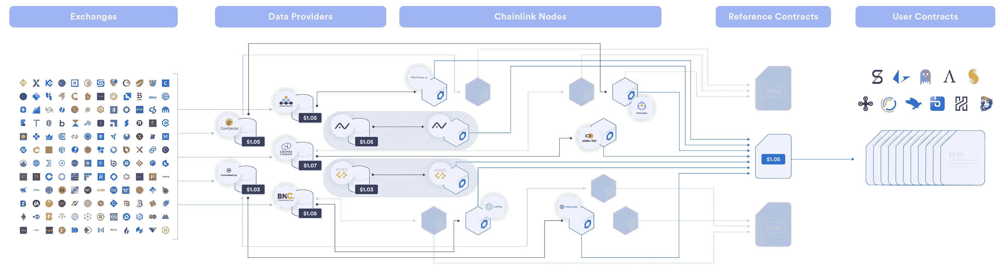
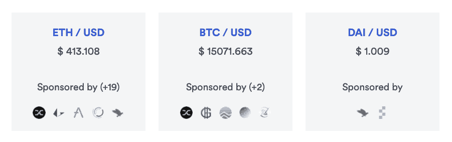
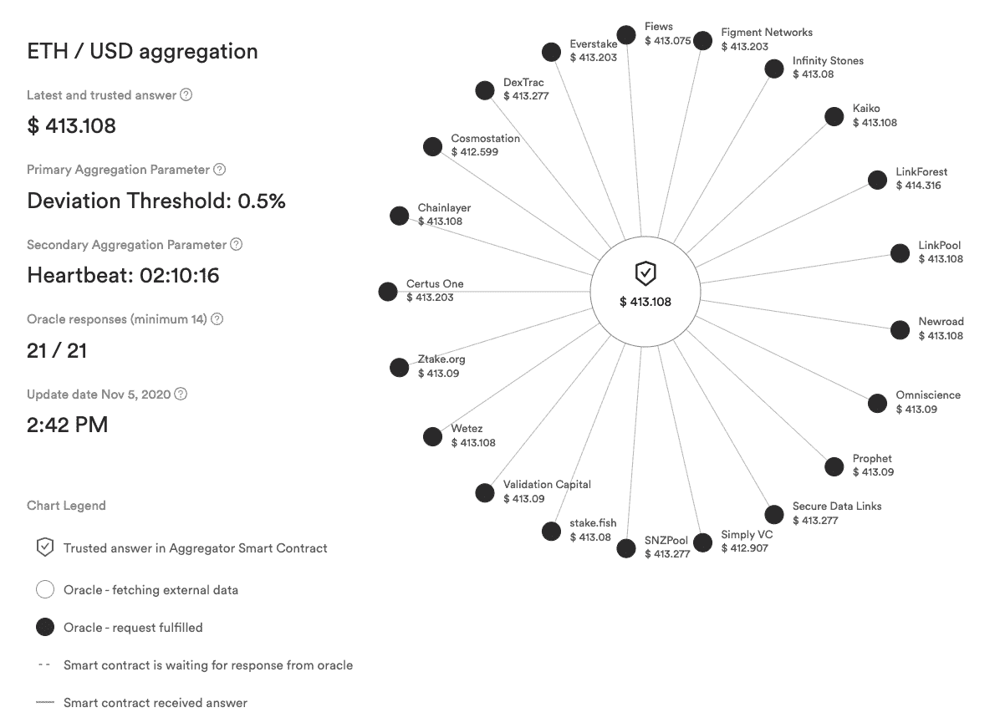
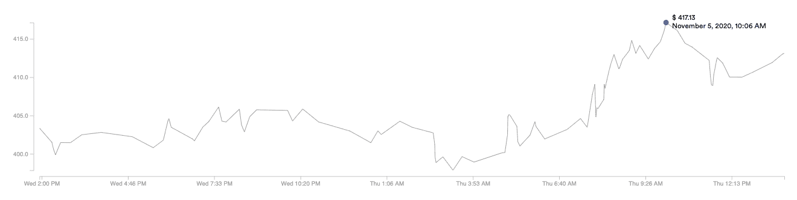
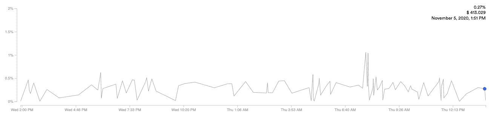
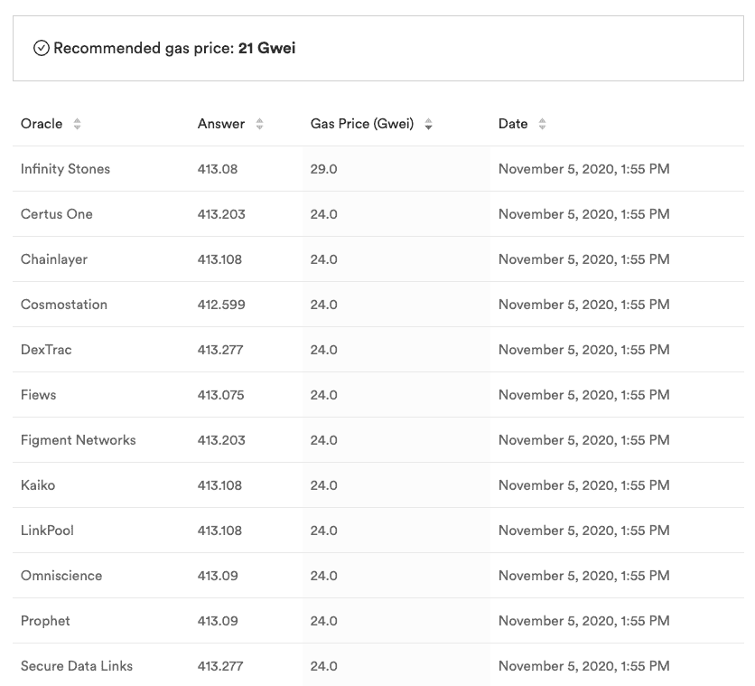

# 利用 Chainlink 的价格反馈可视化功能实时分析分散式 Oracles

> 原文：<https://blog.chain.link/analyze-decentralized-oracles-in-real-time/>

透明度是 [DeFi](https://chain.link/education/defi) 生态系统中的一个关键原则，确保任何人都可以验证分散式融资协议是如何设计的，以及访问有关抵押和公平定价的关键市场数据。Chainlink 的 Price Feed 可视化工具通过显示分散式 oracle 网络的构成，帮助提高 DeFi 领域的透明度，这些网络验证价格参考数据并将其提供给[智能合约](https://chain.link/education/smart-contracts)。此外，可视化为用户提供了一个简单的途径来审核链上发布的实际价格数据。本文是 Chainlink 价格馈送可视化及其特定功能的指南，您可以使用这些功能来验证 DeFi 资产对的定价是否公平和安全。

## 分散式 Oracle Networks 如何保护 DeFi Price 数据

[Chainlink Price Feeds](https://chain.link/solutions/defi) 通过从著名的数据整合商的 API 中提取数据，从他们那里获取高质量的价格数据。然后，数据通过分散的 oracle 网络在链上交付，该网络由多个独立的经过安全审查的节点操作员组成。数据聚合和 oracle 网络级别的去中心化可以防止数据操纵，并确保依赖高度可靠的价格预测的智能合约的可用性。由于其安全性和可靠性保证，Chainlink Price Feeds 已成为 DeFi 的行业标准 oracle 解决方案，现在已获得数十亿美元的价值，并支持各种各样的使用案例和市场，从[衍生品](https://blog.chain.link/solving-deep-seated-trust-problems-in-derivatives-using-chainlink-enabled-smart-contracts/)到 stablecoins。

<figcaption id="caption-attachment-775" class="wp-caption-text">chain link 如何使用数据提供商和 oracles 的分布式网络来提供对链上公平市场价格的访问。</figcaption>

<figcaption></figcaption>

## DeFi 价格馈送

除了准确性、安全性和可靠性保证之外，Chainlink 还提供来自链上数据的价格反馈性能的可视化。可视化使智能合同开发人员和用户能够独立验证每个价格源的 oracle 网络如何确定资产价格。它们还允许用户轻松访问有关基础设施、功能和分散式 [oracle](https://chain.link/education/blockchain-oracles) 网络的当前/历史数据的各种信息，从而确保这些价格。

### 资产对

在[主价格反馈页面](https://feeds.chain.link/)上，每个资产对显示三条核心信息:

*   两对资产，如瑞士法郎/美元
*   如果智能合约调用该 Chainlink oracle network 获取价格，则智能合约将收到的当前价格(存储在参考合约的链上)
*   哪些 DeFi 项目使用并资助生产中的每个价格馈送

<figcaption id="caption-attachment-776" class="wp-caption-text">三个价格馈送，显示每对资产的资产对、价格和发起人/活动 mainnet 项目。</figcaption>

<figcaption></figcaption>

### 赞助商和节点运营商

在 [data.chain.link](https://data.chain.link/) 页面的底部，您可以看到一个使用 Chainlink 价格源的项目示例，以及提供价格数据的独立节点运营商列表。这里列出了各种各样的 DeFi 项目类型，包括领先的 DeFi 项目，如 Aave、Synthetix、Nexus Mutual，以及更多通过 Chainlink Price Feeds 在 mainnet 上直播的项目。类似地，节点运营商包括许多值得信赖的 DevOps 和安全团队，如德国电信的 T-Systems，它们确保向 Chainlink 网络提供可靠和安全的数据。

## 单个价格馈送页面

在主页上单击一个资产对，您将进入给定资产对的单个价格馈送页面。

<figcaption id="caption-attachment-777" class="wp-caption-text">支持 ETH/USD 价格馈送的分散式 oracle 网络的可视化。</figcaption>

<figcaption></figcaption>

### Oracle 可视化

*   **当前价格**–这是 oracle 智能合约存储的价格数据。Chainlink 使用汇总价格数据的中位数来确定当前的公平市场价格。各个页面上的价格点通过 oracle 网络实时动态更新。
*   **节点操作符–**可视化识别单个节点操作符和每个操作符提交的最新价格，允许用户检测哪些 oracles 在线，以及是否有任何 oracles 提交异常数据。
*   **Oracle 请求已完成–**当圆圈变黑时，表示 oracle smart contract 已经记录了节点的提交价格。
*   **Oracle 获取外部数据—**白色节点圆圈表示 Oracle 正在从外部来源获取数据，或者正在记录链上的数据。一条动画线还表示 oracle smart contract 正在等待单个节点的响应。

如果您想要关于给定节点或可信智能合约价格的更多信息，动画可视化中的元素是交互式的。例如，将鼠标悬停在节点操作符上可以显示该节点提交的最新价格、交易中使用的天然气、记录交易的区块以及提交的确切时间。有关每个节点运营商智能合约的更多深入信息，请单击一个节点以访问指向 Etherscan 的链接。

### 最新和可信的答案

价格是 oracle 网络实时存储在链上的价值。

### 主要聚集参数:偏差阈值

偏差阈值指示提要何时更新。在 ETH/USD 的情况下，当数据聚合器的 API 报告的链外价格偏离链内可信价格 0.5%时，提要更新。每个链节偏差阈值都可以根据智能合约的需求进行定制。

### 辅助聚集参数:心跳

Heartbeat 是一个倒计时器，当它到达 00:00 时，会更新链上的价格。这是在偏差阈值没有在心跳长度上触发更新的情况下的备份。如果资产的价格波动性非常低，它们可能不会经常达到偏离阈值，因此心跳确保数据馈送保持新鲜。

### 甲骨文回应

该比率显示了有多少 oracles 对上次价格馈送更新做出了贡献。最小数量是指提交新价格更新所需的最小 oracles 数量。如果没有达到，那么价格更新将不会通过。

### 更新日期和时间

此字段指示价格馈送使用新的可信答案更新智能合同的最近日期和时间。

### 24 小时价格历史

这是一个交互式图表，显示了过去 24 小时的资产价格历史。

<figcaption id="caption-attachment-778" class="wp-caption-text">24 小时 ETH/USD 链价格历史</figcaption>

<figcaption></figcaption>

### 24 小时挥发性

这是一个交互式图表，显示了过去 24 小时内价格波动的百分比变化。

<figcaption id="caption-attachment-779" class="wp-caption-text">24 小时波动的 ETH/USD 链价</figcaption>

<figcaption></figcaption>

### 甲骨文日期

这个可排序的图表显示了每个 oracle 提交最新价格时支付的汽油价格。该图表使用“已付天然气”来推荐当前提交的 GWEI 天然气价格。

<figcaption id="caption-attachment-780" class="wp-caption-text">天然气中各 oracle 所支付的 ETH/USD 价格</figcaption>

<figcaption></figcaption>

## 围绕 DeFi Price Oracles 提供透明度和可验证性

DeFi 生态系统拥有一个重要的机会，可以通过分散、透明的协议来重新定义和重建金融系统。作为安全 DeFi 开发的基石，透明度确保这些创新的金融应用程序是安全的，并可被更广泛的社区审计。Chainlink 的可视化为 DeFi 生态系统带来了更高的透明度，因此任何人都可以验证 Chainlink oracle networks 提供了公平准确的价格和强大的市场覆盖。我们希望这一工具能够增强开发者和用户的信心，让他们建立并参与到由智能合约推动的可验证、透明的金融活动中来。

## 了解更多信息

如果你是一名开发人员，并且想使用 Chainlink Price Feeds 构建一个 DeFi 产品，请查看[我们的快速入门教程](https://blog.chain.link/build-defi-yield-farming-application-with-chainlink/)以获得如何开始的分步指南。

如果您想要将您的智能合约连接到底层区块链之外的其他现有数据和基础设施，请访问[开发者文档](https://docs.chain.link/)或[联系我们的团队](https://chainlink.typeform.com/to/gEwrPO)。

[网站](https://chain.link/) | [推特](https://twitter.com/chainlink)|[|](https://www.reddit.com/r/Chainlink/)[不和](https://discordapp.com/invite/aSK4zew)|[Reddit](https://www.reddit.com/r/Chainlink/)|[YouTube](https://www.youtube.com/channel/UCnjkrlqaWEBSnKZQ71gdyFA)|[电报](https://t.me/chainlinkofficial) | [事件](https://blog.chain.link/tag/events/) | [GitHub](https://github.com/smartcontractkit/chainlink) | [价格供稿](https://feeds.chain.link/) | [DeFi](https://defi.chain.link/)