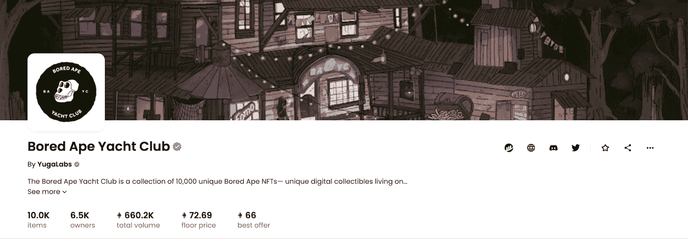
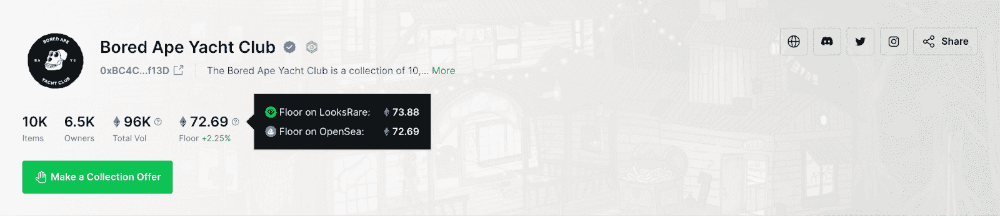
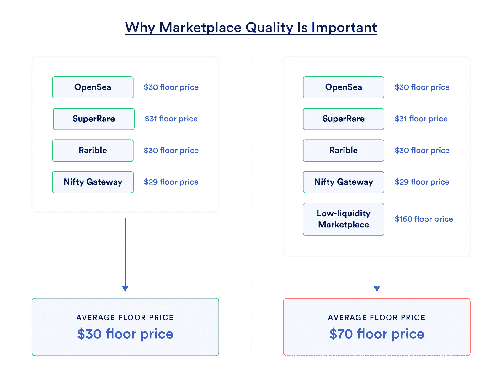
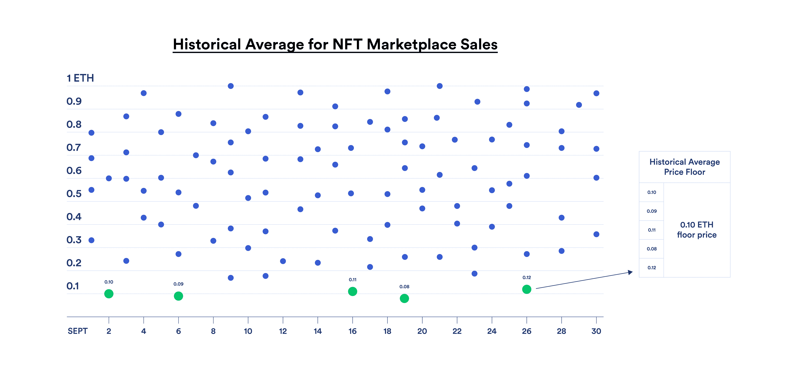

# NFT 的底价是多少？

> 原文：<https://blog.chain.link/what-is-an-nft-floor-price/>

一件[【NFT】](https://chain.link/education/nfts)底价最简单的定义是，它是给定藏品中任何一件 NFT 的最低价格。

在这篇文章中，你将了解到:

*   NFT 底价意味着什么。
*   计算 NFT 最低价的最简单方法。
*   NFT 底价的附加因素。
*   计算 NFT 楼面地价的高级方法。
*   标准化的 NFT 底价如何拉近 [DeFi](https://chain.link/education/defi) 和 NFTs 的距离。

## NFT 底价含义

一般来说，NFT 底价是市场参与者在藏品层面上洞察 NFT 项目公平市场价值的一种尝试。这有助于集中 NFT 买家的决策过程和分析，剥离了藏品中的因素，如稀有性、特征等。

计算 NFT 底价最简单的方法是在一个系列中选择价格最低的 NFT。例如，在 Opensea 上，Bored Ape 游艇俱乐部(BAYC) NFT 系列的底价为 72.69 ETH，因为这是市场上 BAYC NFT 的最低挂牌价格。

<figcaption id="caption-attachment-4741" class="wp-caption-text">Screenshot taken on September 9th, 2022.</figcaption>

## NFT 底价是如何计算的

有多种方法可以计算 NFT 的地板价格。如上所述，最直接的方法是取集合中单个 NFT 的最低值。

假设一个随机的 NFT 收藏的最低价格是 20 美元。这使得 20 美元成为事实上的底价。如果有人买了 NFT，下一个最低价格的 NFT(例如，一个价格为 30 美元的 NFT)代表新的底价，底价增加到 30 美元。如果有人列出一个低于 20 美元的 NFT，底价就会降到这个 NFT 设定的价格。

## 超越基本的 NFT 底价

一件 NFT 藏品的底价最初可能看起来像是一个简单而有效的指标，表明了任何一件 NFT 藏品的最低价值。然而，当试图真正衡量 NFT 收藏的底价时，还有许多其他因素需要考虑。

### 市场分裂

NFT 市场通常对其平台上列出的非金融交易有不同的底价。在下面 LooksRare 的 BAYC 收藏页面截图中，楼面价列为 72.69 ETH。不过附加信息显示，LooksRare 是匹配 Opensea 的底价，平台的底价其实是 73.88 ETH。因此，计算更准确的 NFT 底价需要搜索多个平台，以考虑市场碎片化的差异。  

<figcaption id="caption-attachment-4742" class="wp-caption-text">Screenshot taken on September 9th, 2022.</figcaption>

### 资产流动性

流动性是一个广泛使用的金融术语，指的是资产交换的难易程度。对于 NFTs，流动性是指出售 NFT 并将其兑换为代币的难易程度。

例如，考虑代币和股票等流动资产。如果交易所显示了数字资产的价格，任何人都可能立即以该价格或接近该价格出售。对于大多数非功能性测试来说，情况并非如此。一个好的 NFT 底价模型应该考虑不同水平的流动性。做到这一点的最好方法之一是考虑到最近的 NFT 拍卖，这提供了对一个系列中 NFT 拍卖的真实价格和频率的洞察。

### 极端值

基本的 NFT 底价很容易被异常值操纵。例如，考虑这样一种情况，99%的 NFT 集合在 10 ETH 交易，但是有大量的 NFT 在 3 ETH 上市。

NFT 的底价立即降到了 3 ETH，虽然考虑到 NFT 底价通常是如何计算的，这在技术上是正确的，但并不能准确代表 NFT 系列的一般底价。获得一个更准确的 NFT 底价模型需要从计算中去除异常值，因为它们往往会使底价偏离其预期——让人们更广泛地了解 NFT 藏品的公平市场价值。

### 价格操纵

一些 NFT 收藏品，通常是低价的，可能会以大量购买的形式受到价格操纵。在 NFT 被称为“扫地”的社区，团体或富裕的个人可以集中努力提高地板价格。在这种情况下，底价被定义为由市场定价的集合中价格最低的 NFT。

操纵价格的另一种方式是通过清洗交易，即个人交易自己的 NFT。简单地说，一个拥有足够多非正规金融工具的团体或个人可以通过在市场上以更高的价格列出自己的非正规金融工具来操纵价格，然后购买它们以人为抬高价格。

这两种方法都有意误导潜在的 NFT 买家，让他们相信 NFT 的公平市场价值就是新的底价，而实际上这个价格并不是自然需求的结果。与其他 NFT 底价因素相比，这一因素更难计入，并且需要 NFT 买家对 NFT 所有权指标、市场销售、项目社区等进行尽职调查。

## 高级 NFT 底价

与传统方法相比，考虑到与 NFT 实际底价相关的诸多因素，许多 NFT 分析项目旨在为用户提供更可靠、更准确的 NFT 底价数据。

下面列出了最常用的方法。这些技术不是单独使用，而是由不同的 NFT 数据分析项目以不同的方式组合使用。因此，项目如何运用这些方法很重要。

### 市场聚合

提供底价的 NFT 数据分析项目通常会汇总 NFT 著名市场的数据，以最大限度地增加可用于可靠计算 NFT 底价的数据点数量。

市场聚合的一个关键考虑因素是质量。流动性低的市场，以及与之相关的低采用率，经常被忽略在计算之外。低流动性市场提供的数据不太可靠，在汇总过程中会稀释来自成熟市场的高质量数据。

<figcaption id="caption-attachment-4743" class="wp-caption-text">Even a single low-quality data source can diminish the price accuracy from marketplace aggregation.</figcaption>

### 历史平均值

一般来说，历史平均值是指过去一段时间(一个月、一年等)的 NFT 销售额。)并计算数据以估计现在和未来的 NFT 底价。例如，基于历史平均值的底价可以取过去 30 天中 NFT 5%最低价销售的平均值。然后，可以将平均值与其他方法结合起来，得出最终底价，供用户使用。

历史平均值的主要考虑因素是时间段频率、时间段内可用的数据点、平均值计算方法等。这些因素都对底价的可靠性有重大影响，尤其是在动荡的市场条件下。

<figcaption id="caption-attachment-4744" class="wp-caption-text">Historical averages take the lowest confirmed sales in a set time period to estimate the average floor price for a collection.</figcaption>

### 离群值和清洗交易过滤器

NFT 数据分析项目过滤掉异常值，清洗交易。这样做最重要的方面是准确识别和区分真正的市场活动和非法交易。

## NFT 底价标准的必要性

快速增长的 NFT 生态系统不断为 NFT 底价创造新的框架。然而，在今天的环境下，用户和开发者必须浏览各种 NFT 数据分析项目，每个项目都有自己计算 NFT 底价的方式。关于哪种 NFT 底价方法是最好的，几乎没有标准化。

NFT 底价标准的缺乏抑制了创新。例如，在 NFT 借贷中，NFT 持有者锁定其 NFT 作为抵押品，以借入可互换的代币，这要求 NFT 抵押品由一个广泛采用的底价担保，这是保护贷方的可靠清算所必需的。

标准化的 NFT 底价馈送将成为 Web3 生态系统的核心基础设施，为 NFT 衍生品、借贷协议、高效的 NFT 定价、NFT 可比资产等提供支持。

### 用 Chainlink 实现 NFT 价格标准化

[就像](https://chain.link) [Chainlink 价格反馈](https://data.chain.link) 如何成为 DeFi 生态系统中最广泛采用的价格数据标准一样，旨在开创 NFT 定价新时代的项目被鼓励利用 Chainlink 及其固有的 [区块链无关设计](https://blog.chain.link/chainlinks-blockchain-agnostic-design/) 来扩大其数据提供的范围，并覆盖整个多链生态系统的项目和用户。

使用 Chainlink，建设 NFT 底价馈送的项目可以通过向成千上万的开发商提供数据来赚钱，加入像[比特币基地云](https://www.coinbase.com/blog/coinbase-cloud-teams-up-with-chainlink-labs-to-launch-nft-floor-pricing)这样的 Chainlink 网络上的 [高质量的 NFT 底价数据提供商](https://chain.link/ecosystem/data-providers) ，并广泛采用他们的 NFT 底价数据。 如果你是一家正在寻找新市场的数据提供商，或者是一家新兴的 NFT 数据分析公司，旨在让你的数据产品出现在开发者面前， [今天就和专家](https://chain.link/ecosystem/data-providers) 谈谈吧。

**更多资源:**

*   [打造成功 NFT 项目的 5 个步骤](https://chain.link/resources/5-steps-to-building-nft-project)
*   [如何铸造一个 NFT](https://blog.chain.link/how-to-mint-an-nft/)
*   [如何创建 NFT](https://blog.chain.link/how-to-create-an-nft/)
*   [如何创建一个 NFT 游戏](https://blog.chain.link/how-to-create-an-nft-game/)