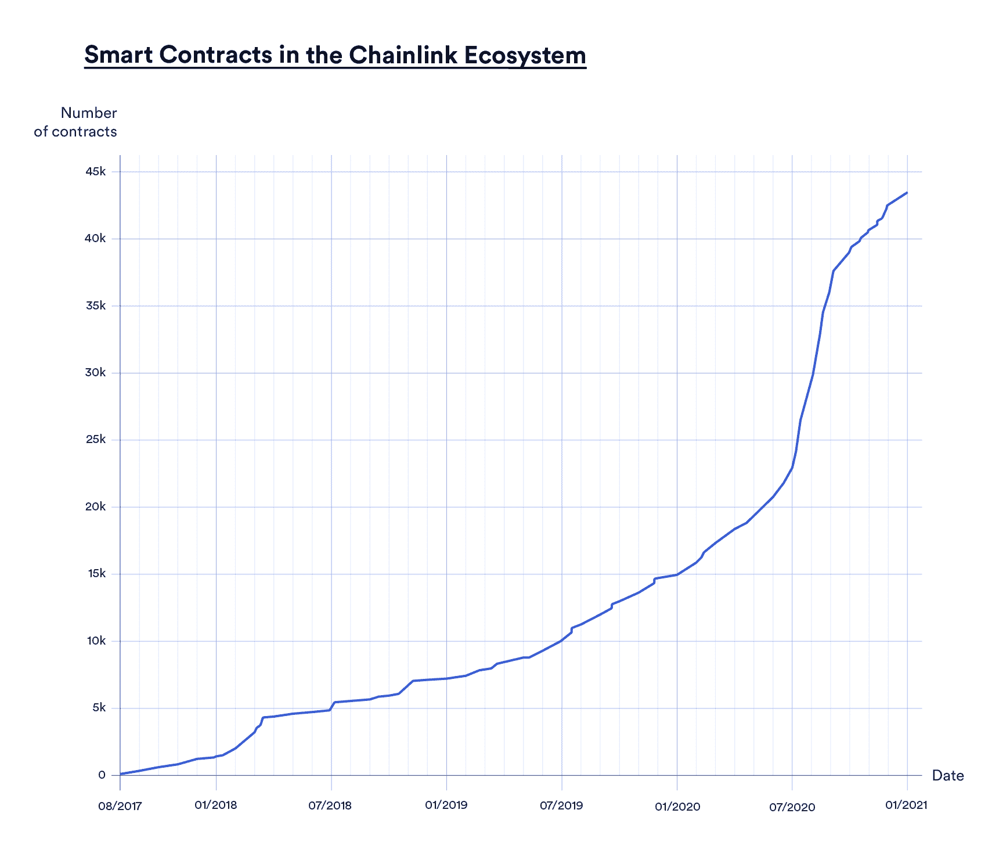
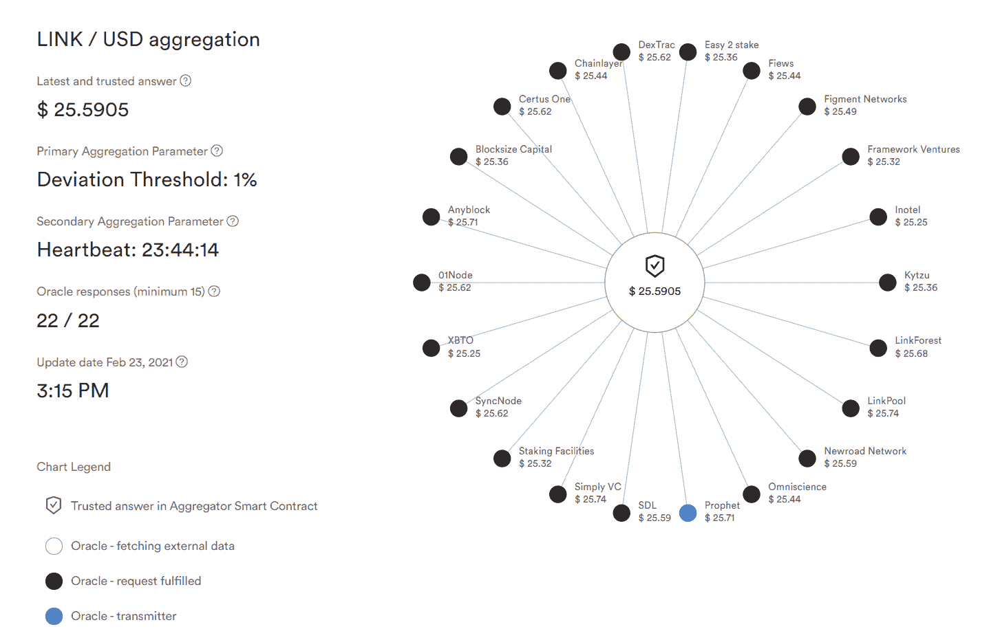

# Chainlink 通过 Mainnet 发布离链报告(OCR)实现了重大的可扩展性升级

> 原文：<https://blog.chain.link/off-chain-reporting-live-on-mainnet/>

我们很高兴地宣布，经过一年多的开发和大量的安全审计，Chainlink[Off-Chain Reporting(OCR)](https://docs.chain.link/docs/off-chain-reporting#how-does-it-work)已在 mainnet 上正式推出，这标志着 Chain link 分散式 oracle 网络可扩展性的一个重要里程碑。OCR 显著提高了通过[Chainlink](https://chain.link/)Oracle 计算数据的效率，降低了高达 90%的运营成本，并使 chain link 网络能够加快在 [DeFi](https://chain.link/education/defi) 市场和其他各种行业开发普遍连接的智能合同。

**对 DeFi 及其用户来说，最直接的好处是可用于[智能合同](https://chain.link/education/smart-contracts)应用的真实数据量将增加 10 倍。**随着智能合约开发商利用新的可用数据集开发更广泛的金融产品和市场，链上数据的大规模增长将在 DeFi、分散保险、区块链博彩业和众多其他行业掀起新一轮创新浪潮。

虽然 Chainlink 网络已经通过不断推出价格馈送、[储备证明](https://chain.link/proof-of-reserve)、可验证的随机性(VRF)等快速增加了它在链上提供的数据量，但 OCR 的可扩展性改进将大大加速这一趋势。借助 OCR，智能合同开发人员将能够更好地访问更多样化的资产、真实事件和区块链的外部数据，从而为新行业和独特的用例提供服务。

<figcaption id="caption-attachment-1485" class="wp-caption-text">Chainlink OCR 将进一步加快 Chainlink 生态系统中智能合同的数量。</figcaption>

## OCR 的其他优势

OCR 是 Chainlink 节点运行的 Chainlink 核心客户端的第三个也是最新版本。重要的是，所有生产中运行的 Chainlink 节点现在将并行运行 OCR 和 FluxMonitor 客户端，以通过冗余实现可扩展性和安全性。[多客户端多样性](https://blog.chain.link/circuit-breakers-and-client-diversity-within-the-chainlink-network/)确保在发生任何潜在黑天鹅事件时提供自动故障转移保护，从而进一步增强 Chainlink 网络在任何时候的超可靠性。

除了通过推出新的 [oracle](https://chain.link/education/blockchain-oracles) 网络提供更多的链上数据，OCR 还为 Chainlink 网络带来了许多其他显著的增强功能:

*   **增强 oracle 网络的分散性**为 Chainlink 用户带来更高的准确性、可用性和防篡改性。
*   **更高频率的链上 oracle 更新**为智能合约应用程序提供更加精确和最新的数据，这些应用程序可能对微小的价格变动更加敏感。
*   **经济高效地部署新节点**进一步分散对运行在 Chainlink 网络上的 oracle 服务的参与。
*   **通过减轻 oracle networks 在以太坊等高需求区块链网络上的负载链，减少了链上网络拥塞**。
*   **降低 oracle 网络延迟**确保即使在区块链网络拥塞和市场极度波动的情况下也能快速向智能合约提供数据。

## 信任的基础最小化链外计算和更高级的智能合约应用

OCR 在可扩展性、安全性和性能方面的这些数量级改进是由 Chainlink 节点实现的，这些节点现在能够进行链外通信，允许它们使用分布式对等网络以零 gas 成本聚合数据。这涉及到每个节点从一个或多个数据源获取数据，用它们唯一的私钥对数据进行签名，然后将数据广播到 oracle 网络的其余部分。一旦生成了足够的响应阈值，就在链上传输包含每个节点的观察值的单个事务。然后，oracle 报告和节点签名通过智能合约在链上进行验证，保持透明和防篡改的属性，这是 Chainlink oracle networks 的基础。有了 OCR，智能合同就可以像现在一样在链上使用这些经过验证的数据，从而提供无缝的网络升级体验。

<figcaption id="caption-attachment-1486" class="wp-caption-text">Chainlink OCR 通过聚合离线数据和在线提交单个交易来扩展 oracle 网络。</figcaption>

<figcaption></figcaption>

对于那些想要深入研究计算机科学、安全假设和支撑 OCR 的架构的人，请参考研发团队最近发布的 Chainlink [OCR 协议论文](https://chain.link/ocrpaper)。

OCR 还将为 Chainlink oracle networks 奠定基础，以可扩展、高效且经济的方式执行新型的链外计算。无论是组合众多数据类型来构建链上索引，还是使用各种参数来计算保险报价，OCR 都将允许 Chainlink 网络提供具有更高级和更广泛的信任最小化计算的智能合同，进一步使智能合同应用程序能够为不同行业的用户产生真实世界的价值。

例如，OCR 将被用作基于 Chainlink 的 oracle networks 的计算框架，开始以具有成本效益的价格大规模支持[公平测序服务(FSS)](https://blog.chain.link/chainlink-fair-sequencing-services-enabling-a-provably-fair-defi-ecosystem/) 和 [DECO](https://arxiv.org/pdf/1909.00938.pdf) 。这将允许 oracles 处理大量的事务量，以便从高容量的内存池中公平地订购事务，并为数据隐私生成分布式密钥和零知识证明(zkp)。

## Chainlink OCR 在跨越众多 Oracle 网络的 Mainnet 上运行

OCR 已经在 mainnet 上部署在多个 Chainlink [价格馈送](https://chain.link/solutions/defi)中，例如广泛使用的 [LINK/USD 馈送](https://data.chain.link/link-usd-ocr)，并将继续推广到所有现有和未来的 oracle networks 价格馈送中。

<figcaption id="caption-attachment-1487" class="wp-caption-text">chain LINK LINK/USD OCR 价格馈送，带 22 个安全审查节点。</figcaption>

<figcaption></figcaption>

OCR 的推出代表了 Chainlink 网络历史上最重要的一次升级，为加快针对 DeFi 和整个智能合同生态系统推出更多 oracle networks 奠定了基础。随着链上数据数量和范围的增加，我们很高兴看到将会构建出哪些创新的智能合约应用程序。

* * *

要与社区中的其他研究人员和工程师一起讨论 OCR 及其影响，请访问智能合同研究论坛上的 [OCR 协议研究摘要](https://www.smartcontractresearch.org/t/research-summary-chainlink-off-chain-reporting-protocol/230)。

如果您是一名开发人员，想要集成 Chainlink 价格提要，请求一个新提要，或者构建一个定制的 oracle 解决方案，请浏览 [Chainlink 的技术文档](https://docs.chain.link/docs)，加入官方的 [Discord](https://discordapp.com/invite/aSK4zew) ，或者[与专家交谈。](https://chainlinkcommunity.typeform.com/to/OYQO67EF)