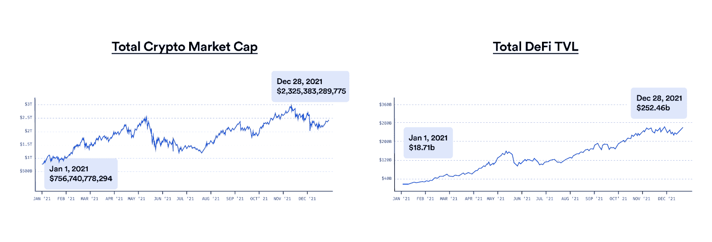
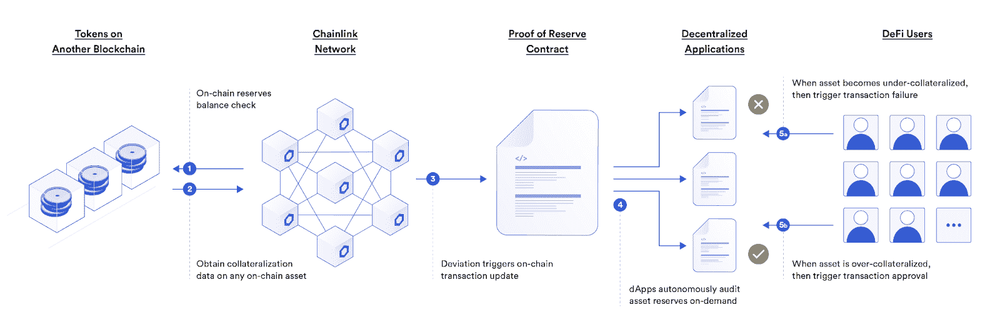
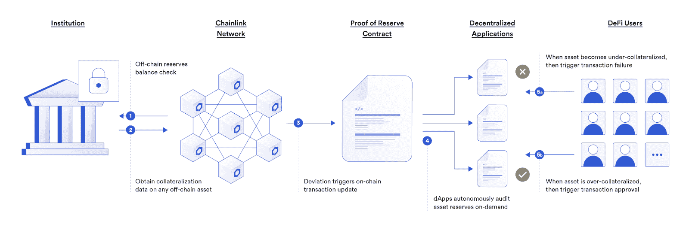

# 使用链连接储备证明解锁具有包装代币的跨链流动性

> 原文：<https://blog.chain.link/using-chainlink-proof-of-reserve-to-unlock-cross-chain-liquidity/>

区块链工业正经历一个快速增长的时期。这一增长部分可归因于[【DeFi】](https://chain.link/use-cases/defi)市场规模的扩大，这为全球用户群带来了新的金融机遇。然而，尽管 DeFi 是一个前沿的、变革性的行业，但它仍然只代表了更广泛的区块链行业总市值的一小部分。

<figcaption id="caption-attachment-3347" class="wp-caption-text">Blockchain and DeFi’s immense growth over the past year.</figcaption>

尽管多种因素促成了区块链行业的增长，但最近激增的原因之一是更多的项目通过 Chainlink 分散服务利用 [真实世界数据和链外计算](https://blog.chain.link/how-chainlink-supports-any-off-chain-data-resource-and-computation/) ，从而能够创建跨多个链的更高级的智能合同应用。mainnet 在 2021 年推出了多个链和第 2 层网络，进一步推动了行业增长，通过让开发人员能够利用新的区块链架构来构建新颖的智能合同用例，刺激了快速创新。

然而，随着用户越来越多地采用新区块链，流动性在不同的智能合约平台之间陷入困境。多个项目已经创建或正在构建包装令牌来解决这个问题。一个显著的例子就是 WBTC，由 [Bitgo](https://www.bitgo.com/) 与[Kyber Network](https://kyber.network/)[任](https://renproject.io/) 合作打造。WBTC 是目前使用最广泛的比特币包装版本，其抵押通过 [【链链储备证明】](https://chain.link/proof-of-reserve) 变得透明。

以下博文探讨了包装令牌的工作原理，并概述了 Chainlink PoR 如何成为最经得起时间考验、防篡改的解决方案，来帮助保护和自主审计包装令牌。

## 什么是包裹代币？

虽然不同的包装代币有其自己的新颖架构，但它们通常被理解为与另一种资产的价值 1:1 挂钩的链上资产，无论是商品、房地产、另一种区块链代币还是任何其他资产。开发商创造包装代币的主要原因之一是释放整个区块链的资产流动性。在包装令牌之前，本地区块链资产被隔离在各自的链上环境中，因为大多数区块链不具备本地互操作性，并且通常支持不同的令牌选择。

为了克服这一障碍，许多由另一家区块链的资产支持的传统包装代币都是通过类似的过程创造出来的。首先，用户将他们的代币抵押品发送给托管人，托管人然后在另一个区块链上铸造一个代表代币。当用户希望赎回他们包装好的资产时，他们向托管人发送请求，托管人烧掉包装好的代币以换取用户的抵押品。

也可以使用类似的流程创建包装令牌来表示链外抵押品。然而，一个单独的机构经常创造它的代币，在许多情况下通过控制整个铸造、赎回和燃烧过程。这导致了一个更加不透明的过程，因为用户无法直接在链上验证真实世界的资产储备。此外，由于单个当事方或少数当事方控制其发行或供应，包装代币通常是集中的，并且易受单点故障的影响。这意味着用户无法审核打包的令牌抵押，也无法验证令牌是否被再抵押。

虽然一些项目已经选择准备传统的审计来为打包资产提供更多的透明度，但这些通常是冗长、昂贵且容易出错的手动过程。

## 用 PoR 链保护和审计包装令牌

随着开发人员继续构建包装令牌以释放跨链流动性，需要一种高度可靠、透明和分散的标准，使包装令牌能够通过自动化流程进行安全审计——输入[chain link PoR](https://blog.chain.link/chainlink-proof-of-reserve-bringing-transparency-to-defi-collateral/)。

### 跨任何网络的自主链上审计

与其强迫用户相信托管人提供的书面担保，不如部署 Chainlink PoR 进行自动在线审计，为用户提供包装令牌真实基础抵押的高级担保。结果，用户获得了对其风险暴露的透明度，并获得了对其包装的令牌的支持的信心。

Chainlink 是区块链不可知的，这意味着 PoR 可以帮助保护任何链上或第二层网络的包装令牌。区块链 DevOps 领先团队、数据提供商和传统企业运行的 oracle nodes 也保护了 Chainlink PoR 馈送的安全，即使在不利的市场和外部网络条件下，也有助于确保稳健的数据质量。

### 减少部分储备的断路器

除了为用户和 dApps 提供抵押的在线审计，Chainlink PoR 还越来越多地被用于帮助保护包装资产的铸造、赎回和燃烧。Chainlink PoR 通过在线实时审计取代低效的手动审计流程。这使得开发人员能够使用 PoR 作为断路器，在检测到部分储备活动时停止铸造/燃烧，有助于防止铸造未包装的代币。

一旦 Chainlink PoR 确定包装的代币不足，[chain link Automation](https://chain.link/automation)可用于暂停包装代币的铸造、兑换和刻录，使开发人员能够修复底层问题，而不会给用户带来风险。

### 真实世界、非连锁储备的透明度

chain link PoR 的另一个独特之处在于，其灵活的架构支持通过定制的 [外部适配器](https://docs.chain.link/docs/external-adapters/) 对真实世界和链上储备进行审计。Chainlink PoR 也可以被任何人实时监控，允许用户验证当前的资产抵押。

<figcaption id="caption-attachment-3348" class="wp-caption-text">How Chainlink PoR helps secure wrapped tokens backed by on-chain reserves.</figcaption>

<figcaption id="caption-attachment-3349" class="wp-caption-text">How Chainlink PoR helps secure wrapped tokens backed by off-chain reserves.</figcaption>

## 结论

Chainlink Proof of Reserve 将在区块链行业的持续增长中发挥关键作用，它提供实时、自动化的审计，使包装好的代币能够更安全地跨链使用，提高其流动性和实用性。最终，这将提高链上协议的透明度，并有助于防止 DeFi 中的系统性故障。

## 关于这个话题的更多信息

*   [链环准备金证明:为 DeFi 抵押品带来透明度](https://blog.chain.link/chainlink-proof-of-reserve-bringing-transparency-to-defi-collateral/)
*   [使用智能合约和区块链甲骨文的资产管理的未来](https://blog.chain.link/the-future-of-asset-management-using-smart-contracts-and-blockchain-oracles/)
*   [保险中的区块链](https://blog.chain.link/blockchain-insurance/)