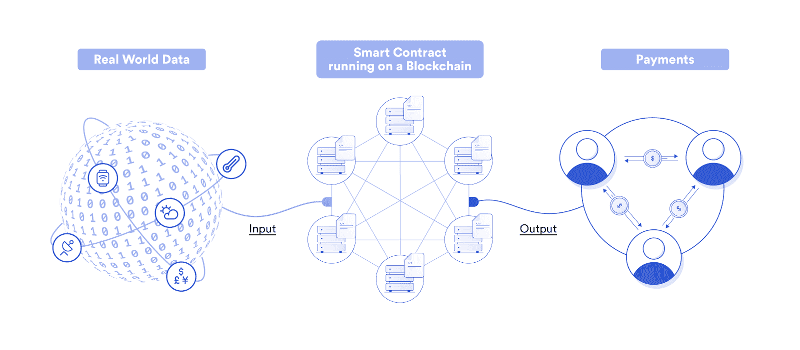
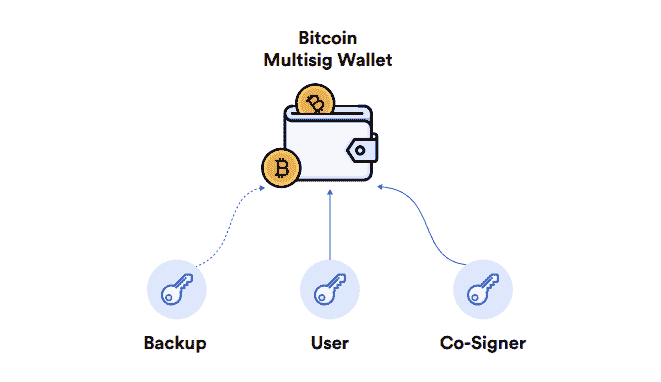
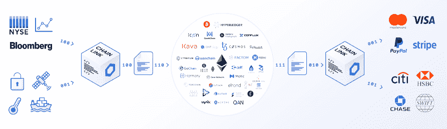

# What is a smart contract? Why is it more advantageous than traditional digital contract?

> 原文：<https://blog.chain.link/what-is-a-smart-contract-and-why-it-is-a-superior-form-of-digital-agreement-zh/>

The first article in [of this popular science series introduces blockchain, and it is mentioned that blockchain is a very safe and reliable network, which can exchange values and store data in an unchangeable ledger. Blockchain has given birth to brand-new currency tools such as Bitcoin, but its application value is far more than that. Blockchain can also drive smart contracts (Note: this is a digital contract with preset conditions). This article will discuss the following in detail:](https://blog.chain.link/what-is-a-blockchain-and-how-can-it-impact-the-world-cn/)

*   What is a smart contract?
*   How smart contracts create value?
*   The development process of intelligent contract
*   Current application mode of intelligent contract

# What is a smart contract?

Digital contract is a digital signature contract running on the Internet. For example, when passengers click "Agree" in Uber's user terms, they agree to pay the driver when the vehicle delivers them to their destination.

In most digital agreements, both parties don't know each other. In this case, if either party fails to perform the contract, there will be risks. In order to avoid such counterparty risks, digital agreements are usually executed by for-profit enterprises with a certain scale, which can reliably execute the contract terms. This kind of digital contract can be signed between users and big companies, or between two users, and big companies act as trusted intermediaries to coordinate. Although this mechanism greatly reduces the counterparty risk and broadens the application scenarios of contracts, it gives these big companies great control over contracts.

The smart contract itself is also a digital agreement, but it is software that cannot be tampered with on the blockchain, and it is strictly executed according to the agreed terms. The simplest conditional logic is: "If the event X occurs, the behavior Y is executed." For example, if Team A wins the sports competition, it will pay Bob；; If Team B wins the game, it will pay Steve. The intelligent contract does not need to manually input the competition result, but directly connects the competition result data to trigger the execution. After receiving the data, the contract will be automatically executed, and the usual task is payment.

Business logic (i.e. contract) is based on probability, which means that the contract may or may not be executed according to the agreed terms; The smart contract is highly certain, which means that 100% of the contract will be executed according to the prescribed terms. The reason why intelligent contracts can be executed exactly is that the blockchain environment in which they are located has the characteristics of decentralization, license-free, tamper-proof and always-on. Under this framework, the contract runs in a neutral decentralized network, and its execution is guaranteed by technical means.

# The value of smart contracts

Compared with traditional digital contracts, smart contracts have the following advantages:

**Security** : Running smart contracts in decentralized infrastructure can avoid the risk of single-point failure and remove centralized intermediary, and neither the contract party nor the system administrator can tamper with the results.

**Reliability** : Multiple independent nodes in the network will repeatedly process and verify the intelligent contract logic, so as to effectively avoid manipulation risks, guarantee the running time of the network, and ensure that the contract is executed on time according to the specified terms.

**Fairness** : Using the point-to-point decentralized network to run and enforce the contract terms can reduce the centralized for-profit entities from squeezing the transaction value.

**Efficiency** : Automation of back-end processes such as custody, maintenance, execution and delivery means that both parties to the contract do not have to wait for manual data input, the counterparty to perform the contract duties or the intermediary to handle the transaction.

# The development process of intelligent contract

The earliest version of smart contract is called **multi-signature smart contract** . There must be enough people (i.e. public key) to sign the transaction with the corresponding private key in order for the transaction to take effect. Bitcoin introduced multi-signature transactions into blockchain for the first time in 2012.

<figcaption id="caption-attachment-954" class="wp-caption-text">比特币区块链上多重签名交易的简化框架</figcaption>

After that, the developer developed the **protocol-based intelligent contract** on this basis, and embedded several core programming instructions (note: also called opcode) in the blockchain. The protocol smart contract is a blockchain incarnated as an application, and can execute opcode. However, this smart contract is difficult to expand, because the contract (i.e. protocol) will have a hard fork every time it is updated, and the hard fork means that a brand new blockchain needs to be created, and every node needs to upgrade its software.

Ethereum released the **scripted intelligent contract** in 2015, which achieved a major breakthrough and turned the blockchain into a "world computer" that can run multiple different applications at the same time. Developers can manage smart contracts themselves, and can make changes at any time without hard fork. Scripts abstract low-level development problems, and developers can develop smart contracts in weeks or even days, but before that, it takes months to years.

Now we have ushered in a new round of innovation, that is, connecting scripted smart contracts to real-world data and systems under the chain. **Intelligent contract with external connectivity** uses a middleware called Oracle, and the data under the connection chain triggers the contract execution. Oracle also allows smart contracts to send data to other systems, such as sending payment instructions to traditional legal tender payment systems and delivering smart contracts under the chain.

<figcaption id="caption-attachment-955" class="wp-caption-text">Chainlink 预言机可将数据（左边）发送至区块链上的智能合约（中间），并将支付指令发送至链下支付系统（右边）</figcaption>

# Current application mode of intelligent contract

Although the smart contract is still in the early stage of development, we find that it is taking root in four markets, giving full play to its unique advantages in security and reliability.

## Equity management (pass)

The role of the general contract is to create, track and distribute ownership. Such contracts will embed specific functions in their pass, such as providing dApp service/bandwidth (utility pass) for pass holders, voting in the agreement by weight (governance pass), distributing company equity (securities pass) and ownership of physical assets or digital assets (non-homogeneous pass), etc. For example, SIA Pass can be used to pay for Siacoin's decentralized cloud storage services, while COMP Pass can be used to participate in the governance of the Compound protocol.

## Financial products (DeFi)

[Decentralized Finance (DeFi) 【T1] The application uses smart contracts to recreate traditional financial products and services, including money market, derivatives, stable currency, exchange and asset management. Smart contracts can trust users' funds and distribute them to corresponding users according to the results. For example, the [T2】 Set protocol](https://blog.chain.link/analyzing-the-defi-ecosystem-and-the-many-ways-chainlink-can-accelerate-adoption/) uses market data to automatically manage portfolios, and the [T4】 Opium Exchange delivers option contracts based on real-time asset prices.

## game

Blockchain games use smart contracts to prevent fraud in games. One example is [T0】 PoolTogether 【T1], which is a capital preservation savings game in which users put their deposits in a lottery smart contract and connect them to the money market. Accumulate interest in the deposit money market, and distribute the interest to the winners based on the [random number generation mechanism [T3】 (RNG). After the winner is announced, everyone can get the original principal back. Similarly, smart contracts can also use RNG to create rare game items, such as disposable magic swords. You can use the verifiable random function (VRF) of Chainlink to generate random numbers, so that users can believe the randomness of the results, and users can independently verify the results to ensure that the results are not manipulated by game developers or data providers.](https://blog.chain.link/chainlink-vrf-on-chain-verifiable-randomness/)

## insurance

Parameterized insurance is a new insurance model, and insurance claims are directly linked to specific events set in advance. Intelligent contract can provide tamper-proof infrastructure for parametric insurance, and trigger contract execution based on data input. For example, Etherisc is developing a [flight insurance smart contract](https://blog.etherisc.com/etherisc-to-leverage-chainlink-oracles-for-decentralized-flight-insurance-product-9559b64d79c7) , which can be paid automatically when receiving flight status information. Terminal users can not only get greater protection, but also individual investors can participate in the supply side of insurance through smart contracts and deposit funds in the contract fund pool. Smart contracts distribute revenue based on the proportion of users' contributions to the pool of funds.

# Learn more

For more information, please look forward to our future articles. The next article in this popular science series will discuss the topic of smart contracts. Welcome to follow our [T0】 Twitter account and receive the article update notification. You can also join our [telegraph group](https://t.me/chainlinkofficial) to learn the latest information of [T4】 Chainlink 【T5].

Search micro-signal `ChainlinkOfficial` to join Chainlink Chinese WeChat community, and search micro-signal `neils_` to join Chainlink Chinese developer community.