# 通过 Chainlink Automation 解锁智能合约用例

> 原文：<https://blog.chain.link/smart-contract-use-cases-unlocked-by-chainlink-automation/>

## 快速链接:

*   [产量收获与复利](#yield-harvesting-compounding)
*   [令牌的重置和再平衡](#rebasing-rebalancing-tokens)
*   [开始和停止游戏或回合](#starting-stopping-games-rounds)
*   [清算](#liquidations)
*   [流动性管理](#liquidity-management)
*   [环比利率更新](#on-chain-interest-rate-updates)
*   [DEX 限价单](#dex-limit-orders)
*   [跨链 NFT 明廷](#cross-chain-nft-minting)
*   [动态 NFTs](#dynamic-nfts)
*   [自动化交易策略](#automated-trading-strategies)
*   [刀自动化](#dao-automation)
*   [期权合约结算](#options-contract-settlement)
*   [自动化的资金流动](#automated-money-flows)
*   [自动令牌归属](#automated-token-vesting)
*   [自动化和链上随机性](#automation-on-chain-randomness)

[chain link Automation](https://chain.link/automation)是一种分散式交易执行解决方案，支持智能合约以高度可靠、信任最小化和经济高效的方式自动化关键功能和开发任务。个人开发人员、团队和 Dao 可以利用 Chainlink Automation 作为链外计算层来可靠地自动化关键功能并解锁高级实用程序。

Chainlink Automation 已经在 [【雪崩】](https://medium.com/avalancheavax/chainlink-keepers-and-chainlink-vrf-go-live-on-avalanche-3ebee050ebef)[BNB 链](https://www.binance.org/en/blog/chainlink-keepers-now-live-on-binance-smart-chain-for-securely-automating-smart-contract-devops/)[以太坊](https://blog.chain.link/chainlink-keepers-is-now-live-on-mainnet/)[多边形](https://blog.polygon.technology/chainlink-keepers-now-live-on-polygon-mainnet-to-automate-smart-contract-devops/) 上赋能智能合约开发者，构建功能丰富的、去中心化、全自动化的端到端 dApps。

在这篇博文中，我们简要分析了为什么智能合同需要安全和分散的自动化服务，然后探讨了 Chainlink Automation 支持的一些高级用例。

[https://www.youtube.com/embed/xL96sTwQ5Ho?feature=oembed](https://www.youtube.com/embed/xL96sTwQ5Ho?feature=oembed)

## 为什么智能合同需要分散自动化

智能合约的一个经常被忽视的特点是它们不能触发自己的功能。相反，它们需要由外部实体通过链上事务来触发，以运行某些功能。虽然一些协议如 [【自动做市商(AMMs)](https://blog.chain.link/challenges-in-defi-how-to-bring-more-capital-and-less-risk-to-automated-market-maker-dexs/) 可以依靠用户发起交易来唤醒合约，但许多智能合约需要一个称为“看守者”的外部实体来监控预定义的条件，并在这些条件得到满足时触发合约。这样的条件可以包括及时到达特定时刻、特定事件的发生或者复杂的链外计算的执行。

在自动化服务之前， [智能合约](https://chain.link/education/smart-contracts) 开发团队必须设置集中式服务器或使用 DevOps 团队来手动触发事务。然而，这种方法不仅引入了使协议遭受潜在故障和停机的中心故障点，而且消耗了宝贵的开发资源，这些资源可以用于改进协议的底层业务逻辑或扩展其功能。

本质上，Chainlink Automation 是一个分散的节点网络，支持智能合约自主运行。开发人员可以向 Chainlink Automation 提交自定义作业，概述应基于特定条件调用的智能合约功能，然后 Automation 通过安全的链外计算监控这些条件，并在达到这些条件时触发这些功能。最终结果是，开发人员能够增加他们的分散应用程序的正常运行时间保证，节省开发成本，简化用户体验，并创建功能丰富的 [混合智能契约](https://blog.chain.link/hybrid-smart-contracts-explained/) ，它们是完全自动化的端到端。

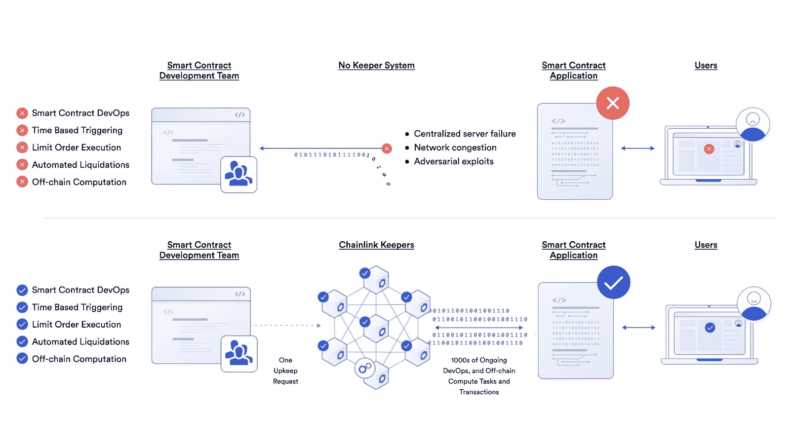

<figcaption id="caption-attachment-3121" class="wp-caption-text">Chainlink Automation enables development teams to decentralize their protocols end-to-end.</figcaption>

Chainlink Automation 支持广泛的智能合同使用案例，从基本的自动化和 DevOps 任务(如替换集中式脚本)到高级的 [链外计算](https://blog.chain.link/what-is-oracle-computation/) 以实现节能、安全或保密。至关重要的是，自动化开启了区块链生态系统中以前不可能实现的全新分散功能，当自动化与其他 Chainlink 服务(如[chain link Price Feeds](https://chain.link/data-feeds)和[chain link VRF](https://blog.chain.link/blockchain-rng-use-cases-enabled-by-chainlink-vrf/))相结合时，甚至可以实现更多用例。可能性是无限的，智能合约开发人员社区现在能够发明和发现令人兴奋的新用例，这些用例利用 Chainlink 的数据交付和链外计算功能为用户带来更多价值。

Chainlink Automation 已经为各种著名的 DeFi 应用提供支持，同时许多开发团队正在积极地将自动化集成到他们的协议中。下面是开发团队已经在 mainnet 上使用或者正在集成以支持可靠的事务自动化的 Chainlink 自动化用例的集合。如果您对在自己的项目中利用 Chainlink Automation 的功能感兴趣， 点击 [Discord](https://discordapp.com/invite/aSK4zew) 找到我们，查看 [开发人员文档](https://docs.chain.link/docs/chainlink-automation/introduction/) ，立即开始使用自动化进行构建。

## 产量收获和复合

[收益农业](https://chain.link/education/defi/yield-farming) 协议奖励为协议提供流动性或提供其他增值服务的用户，通常通过出借或标记代币。

在 DeFi 中赚取收益的一些方法包括

*   在类似 [Aave](https://aave.com/) 的分散式货币市场协议上出借代币。
*   将代币存入诸如 [曲线](https://curve.fi/) 的 AMM 上的流动性池中，以赚取一部分交易费用。
*   在类似 [Liquity](https://www.liquity.org/) 的协议中下注，赚取一部分借款和赎回费。

<figcaption id="caption-attachment-3120" class="wp-caption-text">Curve liquidity providers can manually collect their earned trading fees.</figcaption>

收获产量是产量农业平台的基本功能。为了获得收益，需要一个链上交易来从一个收益生成库要求奖励。由于智能合约不能触发它们自己的功能，它们需要一个外部实体来触发链上事务，以便运行它们的编码逻辑。虽然用户可以启动这些事务并定期“唤醒”合同以执行收集操作，但这需要手动干预或使用集中式机器人。这两种解决方案都不可靠，并且会导致协议停机。

Beefy Finance 是一个去中心化的多链收益优化平台，使其用户能够从其加密资产中赚取复利。Beefy 提供了一种“一劳永逸”的 DeFi 用户体验，用户无需任何人工干预就可以直接从自己的账户中获得收入。奖励会定期收获，交换到原来的金库资产，并再次存入复合农场。

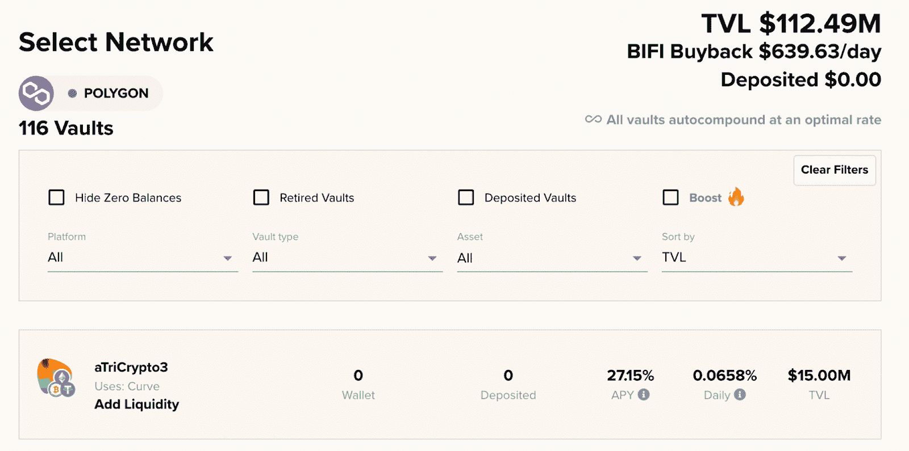

<figcaption id="caption-attachment-3119" class="wp-caption-text">Beefy Finance’s dashboard for tracking yield farming returns.</figcaption>

Beefy Finance 正在 BNB 链和 Polygon 上集成 Chainlink Automation，以安全地自动化该平台上 700 多个产量池的产量收割功能。将收割外包给分散的节点网络不仅会给用户体验带来重大升级，还将有助于确保一旦计算出有利可图，或至少每 24 小时收获一次。这种增强将最大限度地提高复合效率，分散 Beefy 的 vault 收割和产量复合功能的自动化，并使平台在 [产量农业](https://blog.chain.link/defi-yield-farming-explained/) 领域更具竞争力。

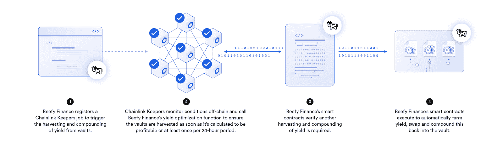

<figcaption id="caption-attachment-3118" class="wp-caption-text">Beefy Finance is integrating Chainlink Automation to harvest and compound yield in a fully decentralized manner.</figcaption>

> “chain link 自动化使我们能够以分散的方式触发产量收获和复利功能，从而提高我们所有产量优化策略的可靠性、透明度和易用性。”—强健的财务团队

Alchemix 是一种自我偿还的贷款协议，它将用户抵押品存放在 Yearn 的收益率聚合器金库中，产生的利息用于在一段时间内偿还用户贷款。实质上，Alchemix 平台让用户以可替代代币的形式提前获得未来收益。为了实现自动化操作，需要在 Alchemix 智能合约中定期触发收益收获和债务偿还功能。

[Alchemix](https://alchemixfi.medium.com/alchemix-integrates-chainlink-keepers-for-vault-harvesting-and-launches-new-price-feeds-for-defi-34ff62a07b43) 选择集成 Chainlink Automation 来触发收益收获和债务偿还，这些现在都是完全自动化的，无需 Alchemix 团队的任何手动干预，为用户提供了更大的保证，即他们的贷款将持续得到偿还。

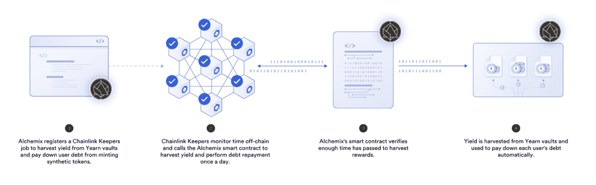

<figcaption id="caption-attachment-3117" class="wp-caption-text">Alchemix uses Chainlink Automation to trigger yield harvesting.</figcaption>

[Synthetix](https://synthetix.io/) 是一个分散的衍生产品协议，为用户提供过度抵押的合成资产的链上风险敞口，并使他们能够根据流动性池合同零滑动地交易这些资产。 Synthetix 是利用 Chainlink Automation 为其 [费期结账](https://keepers.chain.link/mainnet/33) 服务 。 Chainlink Automation 在费用周期结束后调用此函数，以自动分配 Kwenta 兑换费用和赌注奖励。

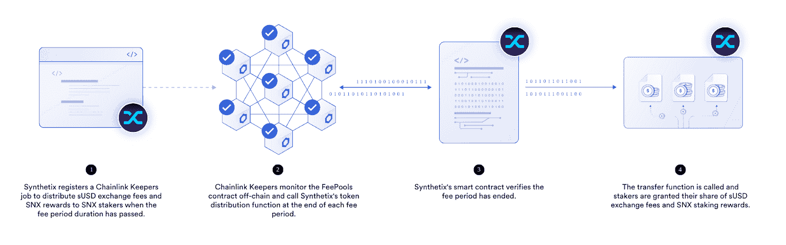

<figcaption id="caption-attachment-3116" class="wp-caption-text">Synthetix uses Chainlink Automation to trigger the distribution of exchange fees.</figcaption>

[帕卡](https://pacoca.medium.com/pacoca-integrates-chainlink-keepers-on-bsc-to-reliably-auto-compound-its-sweet-vaults-53aa7ff43258) 是一个投资组合追踪器、指数聚集器和收益率聚集器，带有自动复利金库，称为 Sweet Vaults。为了帮助分散其 DeFi 平台并创建信任最小化的架构，paoca 集成了 Chainlink Automation，以可靠地自动复合其保险库的产量。

> *“通过利用 Chainlink Automation 执行安全的链外计算，paoca 协议现在可以以分散、无信任和防篡改的方式可靠地自动合成其甜蜜金库。最终，这简化了用户体验，因为用户不需要手动进行交易来自动计算其收益率。”–帕卡核心团队*

## 令牌的重置和重新平衡

分散式金融应用程序的美妙之处在于，战略家和开发者可以创建成熟的资产分配策略，这些策略可以自动执行预先定义的行动计划，并将其编入确定性的智能合同中。这些系统的成功不仅取决于策略本身，还取决于定义的逻辑的一致执行。根据预定义的暴露比率自动执行弹性供应令牌的重新定基机制和重新平衡令牌是智能合同维护任务，必须定期执行这些任务以实现期望的功能。

创造了 [加密波动率指数(CVI)](https://cvi.finance/) ，一种旨在预测加密货币市场未来 30 天预期波动率的指数，以及与该指数挂钩的波动率令牌。这些代币需要定期调整供应量，即所谓的“重定基数”,以维持其盯住汇率。依赖集中式脚本或手动输入会使易失性令牌重置功能面临潜在的停机时间，导致不正确的令牌定价和集成令牌的其他 DeFi 应用程序中的级联故障。

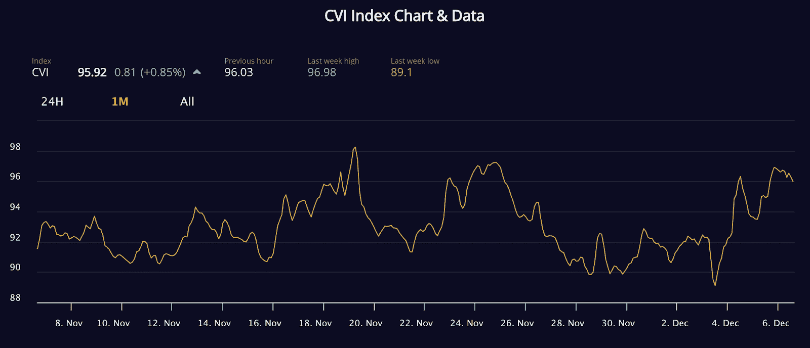

<figcaption id="caption-attachment-3115" class="wp-caption-text">The Crypto Volatility Index uses Chainlink Automation for automated rebases.</figcaption>

COTI 团队决定集成 Chainlink Automation，因为他们需要一个分散的、高度可靠的实体来调用他们的智能合同 on-chain，以触发重置机制。每隔 24 小时，在世界协调时午夜，Chainlink Automation 就会触发一次重置基础智能合约。CVI 智能合约随后验证是否需要调整供应量，并执行重定基数，以实现与指数挂钩的预期目标。在 Chainlink Automation 的帮助下，CVI 智能合约现在可以以完全分散和信任最小化的方式执行 rebases，而无需任何手动输入。由于 check maintenance 是离线进行的，CVI 优化了汽油费用，从而节省了大量成本。

[巴恩布里奇](https://medium.com/barnbridge/barnbridge-integrates-chainlink-keepers-to-automate-smart-exposure-product-ef97f9f878c9) 集成 Chainlink Automation，以触发其智能敞口产品中的再平衡功能，该功能让用户保持对 ERC-20 令牌对的特定风险敞口。投资者可以在两个代币之间定义一个理想的目标分配，当基础代币的价格发生变化时，智能合约会通过再平衡机制自动维护该目标分配。当超过预定义的分配阈值时，Chainlink Automation 会启动一个重新平衡事务，为及时和一致的重新平衡提供强有力的保证。

[基准协议](https://medium.com/benchmarkprotocol/benchmark-protocol-integrates-chainlink-keepers-to-automate-and-decentralize-token-rebasing-e98cf159b31b) 也在使用 Chainlink Automation 以分散的方式执行完全链上 rebases。基准令牌(马克)是一种弹性供应抵押品工具，旨在在与全球股票市场相关的高波动期间注入流动性。Chainlink Automation 的集成允许基于特定时间间隔的触发器进行自动重置。

**自动化您的智能合同**

[Go to Docs](https://docs.chain.link/docs/chainlink-automation/introduction/)

## 开始和停止游戏或回合

预测市场使用户能够对现实世界的事件结果进行下注，比如选举、体育比赛，甚至天气。鉴于这些合同依赖于区块链外部的数据，他们可以集成 [Chainlink 数据馈送](https://chain.link/solutions/defi) 来帮助使用高质量、防篡改的数据确定正确的结果。然而，如果协议依赖于集中式自动化机器人、DevOps 团队的手动干预或启动和停止预测回合的激励奖金，则协议仍将存在安全风险、可靠性问题，并且容易出现单点故障。这就是为什么开发人员越来越多地将[chain link Automation](https://automation.chain.link)集成到他们的协议中。通过使用相同的 Chainlink oracle 网络自动执行智能合约功能，帮助 DeFi 获得数百亿美元的安全，他们可以以高度安全、经济高效和分散的方式自动开始和停止预测轮次。

[Entropyfi](https://medium.com/entropyfi/entropyfi-using-chainlink-price-feeds-and-chainlink-keepers-to-help-power-amplified-prediction-9e4e4d850cbb) 围绕各种链上和链下资产提供预测游戏，以放大的收益率回报用户。用户通过将资产存入 Entropyfi，有机会在零损失的情况下从市场波动中获利。然后，用户资产被存入产生收益的平台，以产生兴趣。预测市场的赢家获得了池中所得的利息，而所有用户——不管他们是否赢了——都拿回了本金。

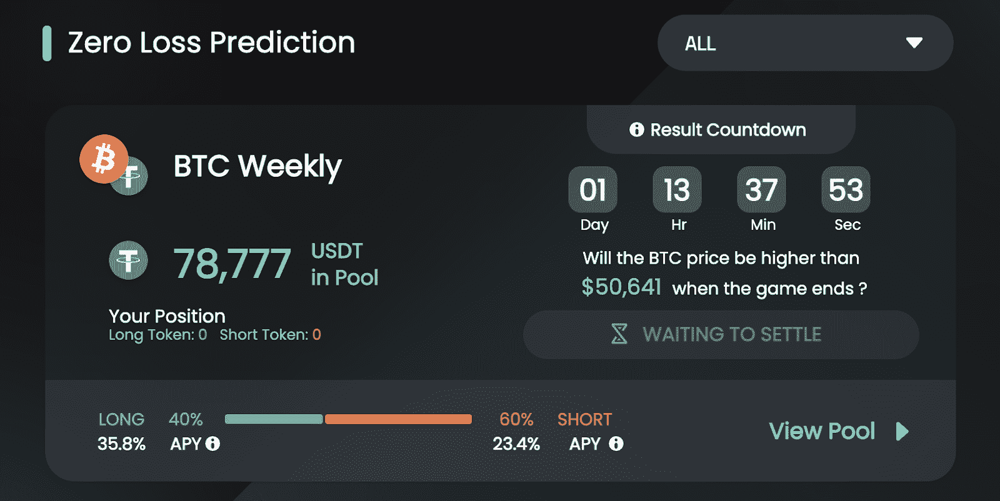

<figcaption id="caption-attachment-3114" class="wp-caption-text">EntropyFi uses Chainlink Automation to trigger its prediction games.</figcaption>

Entropyfi 使用 Chainlink Automation 来触发其智能合约工作流，以开始和结束预测市场并计算用户的利润。每个无损预测游戏都有一个开始日期、贡献截止日期和结算日期。用户只能在开始日期和缴费截止日期之间存款。Chainlink Automation 自动调用 Entropyfi 智能合约，以触发缴费截止日期暂停并触发结算流程的执行。通过集成 Chainlink Automation，[Entropyfi](https://medium.com/entropyfi/entropyfi-saves-engineering-hours-with-chainlink-keepers-6ec172a76249)消除了单点故障，每周能够节省 20 个工程小时。

## 清算

健康的链上 DeFi 生态系统的一个特征是容易获得债务。 [分散的货币市场](https://blog.chain.link/decentralized-money-markets/) 正变得越来越受欢迎，作为一种获得贷款或从闲置资产中赚取收益的方式。然而，这些协议需要一个强大而可靠的清算机制，以防止抵押不足的立场，并确保持续的平台偿付能力。

Aave 是一个 DeFi 协议，允许用户借入和借出加密资产，它正在集成 Chainlink Automation，以帮助确保该协议通过可靠的清算机制保持偿付能力。自动化将通过一致地计算抵押并检查未结贷款的抵押比率是否低于预定义的清算阈值来监控用户贷款的离线健康状况。如果用户的借贷交易被发现抵押不足，Chainlink Automation 将调用 Aave 协议的清算功能，帮助确保即使在市场高度波动和网络拥塞的时期，头寸也能保持偿付能力。

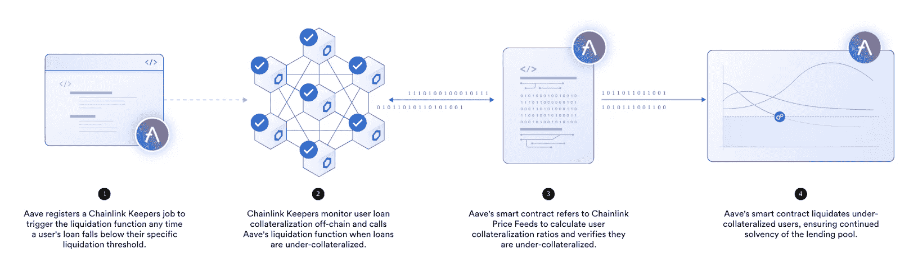

<figcaption id="caption-attachment-3113" class="wp-caption-text">Aave is integrating Chainlink Automation to trigger liquidations for undercollateralized loans on the platform.</figcaption>

[B .协议](https://medium.com/b-protocol/b-protocol-integrates-chainlink-keepers-on-ethereum-testnet-to-further-secure-liquidations-within-b-8fa0e23e4429) 的 Backstop 自动做市商(B.AMM)旨在通过激励流动性提供者——而不是机器人和矿工——清算抵押不足的贷款，来改善贷款平台的清算流程。如果发生清算，自动再平衡流程会根据价格公式，以折扣价出售资产，从而将被扣押的抵押品转换回原始资产。

B.AMM 系统中的一个潜在的不利情况是，尽管有很大的折扣，购买者可能不会购买所提供的库存，因为大部分时间没有库存出售。另一个潜在的不利情况是，在极端的市场条件下和网络拥塞时期，流动性提供者清算贷款的速度可能会很慢。为了解决这些边缘情况，B.Protocol 需要一个二级清算机制来帮助它提供及时可靠的清算流程。

B .协议集成链自动化，使用链外计算定期检查 DEX 套利和抵押不足的未结贷款。如果 B.AMM 的价格明显偏离或流动性提供者未能按时清算贷款，Chainlink Automation 会触发套利或清算，导致 B.AMM 的清算和链上定价机制始终代表最新的全球市场价格，无论市场条件如何。Chainlink Automation 的集成不仅使 B.AMM 系统更加强大，而且有助于提供更公平、更安全、更可靠的用户体验。

## 流动性管理

Uniswap v3 引入了集中流动性的概念，流动性提供者(LP)可以对其流动性头寸所分配到的价格范围进行精细控制。这种新颖的 [自动做市商(AMM)](https://blog.chain.link/automated-market-maker-amm/) 设计引发了分散交易自动化服务的新兴行业，该行业根据预定义的条件重新平衡 Uniswap v3 流动性头寸。

[Visor Finance](https://medium.com/visorfinance/visor-finance-integrates-chainlink-keepers-to-automate-liquidity-provisioning-strategies-on-uniswap-2fd46a2bbcc7) 是旨在优化 LP 回报的自动化流动性供应管理协议的一个例子。用户可以将他们的资产交由“监管人”管理，监管人根据选择的条件和阈值执行 Uniswap v3 流动性头寸管理策略。Visor 与 Uniswap 上的许多流动性池相集成，并利用各种做市策略来最大化回报，同时最小化非永久性损失。

为了自动执行这些流动性管理策略，Visor 的智能合约需要根据外部条件和阈值进行通知。Visor 集成了 Chainlink Automation 来触发某些链上流动性管理功能，如再投资费用、开仓和平仓限价单以及设置价格范围。在 Chainlink Automation 的支持下，Visor 中的流动性管理策略可以以自动化和可靠的方式运行。

将自动化的强大可靠性保证添加到 Visor 的功能集降低了第三方管理监管机构的复杂性，并使策略师能够专注于他们的基本任务，即开发高级流动性管理策略，为 Uniswap v3 LPs 保持尽可能高的资产利用率。

另一个例子来自[Pickle Finance](https://picklefinance.medium.com/pickle-finance-univ3-jars-powered-by-chainlink-keepers-8ce1756a2497)，该公司在其 Pickle Jars 产品中使用 Chainlink Automation 来帮助自动管理 Uniswap v3 上的资本高效型 lp 头寸。Chainlink Automation 有助于自动重新平衡用户的 lp 头寸，以确保他们始终保持在范围内，并收取最高的 LP 费用。这有助于使 Pickle Jars 最大化用户的回报，而不需要任何人工干预或对集中式脚本的依赖。

## 连锁利率更新

DeFi 生态系统允许日益先进的“金钱乐高”插入现有协议，以提供复杂的链上产出机会。 [88mph](https://medium.com/88mphapp/88mph-using-chainlink-keepers-to-automate-our-on-chain-interest-rate-updates-b521e83aac2b) 是一个非托管、链上固定收益率协议，提供两种产品:

*   一种具有自定义或预设到期日的固定期限固定收益产品，允许用户从其提供的资产中赚取固定利率。
*   一种称为收益率令牌(YT)的收益率投机工具，允许用户对第三方借贷协议的可变收益率进行投机，如 Aave 或 Compound。

为了使平台更易于使用，88 英里/小时的团队需要一种方法来自动更新他们的链上利率，这是一项以前必须手动完成的任务。自动化通过允许自动化的链上利率更新，为 88mph 的基于加密货币的债券提供了低成本的交易执行解决方案。

Chainlink Automation 触发由 88mph 团队开发的[Keeper Hub contract](https://github.com/88mphapp/oracle-chainlink-keeper/blob/main/contracts/EMAOracleKeeperHub.sol)，它允许外部拥有的帐户检查他们的许多链上利率中哪些需要更新。自动化不仅消除了 88 英里/小时的手动流程，还增强了平台的可靠性，因为分散式网络由同样经过时间考验的节点运营商组成，这些运营商有助于在 Chainlink 价格馈送中获得数百亿美元的智能合同价值。

在这段视频中，来自 88 英里/小时团队的小飞侠解释了他们如何使用 Chainlink Automation 增强他们的链上利率更新:

[https://www.youtube.com/embed/TbJA1ZyHxtQ?feature=oembed](https://www.youtube.com/embed/TbJA1ZyHxtQ?feature=oembed)

## DEX 限价单

dex 是点对点市场，无需中介即可实现无缝交易。大多数 dex 由 AMM 协议驱动，本质上是自我管理的交易机制。AMMs 通过允许用户存入代币收取一定份额的交易费来汇集流动性，流动性池由 AMM 根据供求关系自动重新平衡。虽然 AMM 是非常有用的工具，但有一个限制是它们没有订单簿，这意味着用户不能设置限价订单，以他们想要的目标价格自动购买或出售资产。相反，交易者被迫等待他们想要的价格，一旦达到该价格，市场就会买入资产，这非常耗时且效率低下。

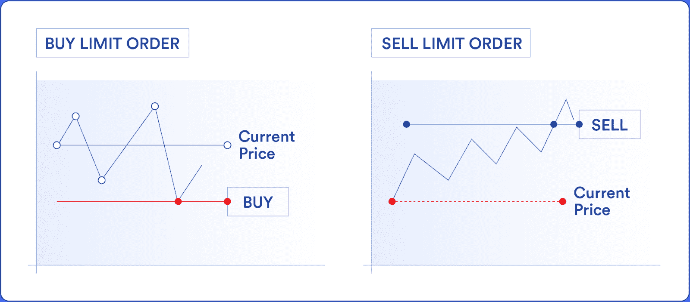

<figcaption id="caption-attachment-3112" class="wp-caption-text">Limit orders allow traders to specify future entry and exit points.</figcaption>

然而，随着 Chainlink Automation 的推出，情况发生了变化。用户可以指定他们的目标买入或卖出价格，Chainlink Automation 将使用离线计算来持续监控 DEX 上的资产价格。一旦达到用户的目标价格，Chainlink Automation 将代表他们执行交易。有了 Chainlink Automation，用户不再需要在电脑前一坐就是几个小时，直到达到他们想要的目标价格，这对许多 dex 来说是一个显著的用户体验改善。

其实 DEXs[ape swap](https://www.binance.org/en/blog/chainlink-keepers-now-live-on-binance-smart-chain-for-securely-automating-smart-contract-devops/)[文明](https://news.civfund.org/civtrade-with-chainlink-keepers-8b6c3965a92e)[DODO](https://www.binance.org/en/blog/chainlink-keepers-now-live-on-binance-smart-chain-for-securely-automating-smart-contract-devops/)[JamonSwap](https://medium.com/@JamonSwap/jamonswap-introduces-new-limit-order-functionality-using-chainlink-keepers-51bd94d75feb)都是利用 Chainlink 自动化来启用限价单。虽然这些 dex 可以使用集中服务器上的 cron 作业来自动执行限价订单，但这将引入一个中心故障点并破坏安全性。相反，Chainlink Automation 有助于以高度安全、可靠和分散的方式触发限价单交易。

在构建限价单功能时，使用 Chainlink Automation 进行现成的离线计算也可以节省大量成本。通过 Chainlink Automation，JamonSwap 能够节省无数小时的开发时间和大约 8000 美元的成本，而文明则节省了大约 250000 美元/年和三个月的开发时间。

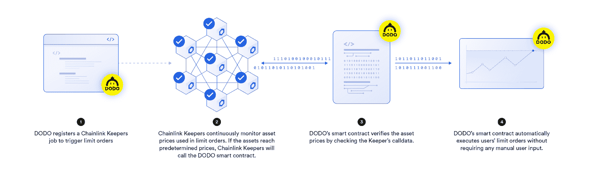

<figcaption id="caption-attachment-3111" class="wp-caption-text">DODO is integrating Chainlink Automation for automated limit order functionality.</figcaption>

> “Chainlink Automation 为安全智能的合同执行设定了行业标准，我们很高兴能够为交易者提供新的工具来利用市场波动，即使他们并不清醒。”—雷明达，多多创始人

**使用 Chainlink 自动化开始构建**

[Go to Docs](https://docs.chain.link/docs/chainlink-automation/introduction/)

## 交叉链 NFT 铸币厂

[NFTs](https://chain.link/education/nfts#:~:text=Fungible%20Token)%3F-,DEFINITION,other%20distinct%20digital%2Fphysical%20asset.) 人气飙升，仅 2021 年第三季度总销售额 [就达 107 亿美元](https://www.reuters.com/technology/nft-sales-surge-107-bln-q3-crypto-asset-frenzy-hits-new-highs-2021-10-04/) 。然而，围绕 NFT 滴滴出行出现了一些 [问题](https://www.paradigm.xyz/2021/10/a-guide-to-designing-effective-nft-launches/)——出现了机器人不公平地制造最稀有的 NFT 的例子，许多滴滴出行导致了创纪录的油价。许多项目已经集成了[chain link VRF](https://chain.link/chainlink-vrf)来帮助消除 bot 操纵，并确保他们的 NFT 通过可证明的公平过程进行分配。为了应对高油价，一些项目选择将项目转移到第二层解决方案或天然气费用较低的区块链。

也就是说，许多项目认为以太坊是启动 NFT 项目最理想的区块链，因为它拥有庞大的用户群和安全的架构。在以太坊上推出 NFTs 的同时，绕过高油价这一令人望而却步的问题的一种方法是使用 Chainlink VRF 和 Chainlink 自动化进行跨链 NFT 造币— [疯狂乌鸦国际象棋俱乐部(CCCC)](https://medium.com/@kingmakereth/crazy-crows-chess-club-integrates-chainlink-oracles-for-cross-chain-breeding-97a55bbe4998) 正是这样做的。

CCCC 在 Polygon 和以太坊都有一套智能合约。首先，CCCC 使用 VRF 链开始铸造多边形上可证明罕见的 NFT。一旦 NFT 的初始元数据被设置在多边形上，链节自动化就被用来将元数据推回到基于以太坊的 NFT，然后自动铸造出可验证的随机特征。通过将一些复杂的智能合约交互卸载到第二层环境，CCCC 能够以更低的费用在以太坊上启动。

> “最终，我们希望打造出经久耐用的产品。我们不想与今天还在，明天就消失的服务集成。我们认为 Chainlink 具有长期生存能力和远见。这给了我们很大的信心，CCCC 可以在没有我们的情况下继续运行，因为我们已经完成了整合，我们的社区可以利用我们的令牌的效用。”——疯狂乌鸦国际象棋俱乐部的创始人和联合创始人

## 动态 NFTs

NFT 是区块链的代币，代表独特事物的所有权，无论是现实世界中的资产，如房契还是独特的数字艺术品。大多数 NFT 是静态的，这意味着它们的特征一旦铸造出来就永久不变。然而，在 Chainlink 的分散 oracle 网络的真实世界数据输入的帮助下，静态 NFT 正在演变为 [动态 NFT](https://blog.chain.link/create-dynamic-nfts-using-chainlink-oracles/)。NFT 项目可以通过使用现成的 [Chainlink 数据馈送](https://data.chain.link/) 或使用定制的 [外部适配器](https://blog.chain.link/build-and-use-external-adapters/) 连接到任何基于互联网的 API，用真实世界的数据更新它们的 NFT。

然而，由于智能合约在默认情况下处于休眠状态，因此在没有人或物触发智能合约的情况下，NFTs 不会根据真实世界的数据输入自动更新。作为分散的、防篡改的自动化节点，Chainlink Automation 是创建自动化动态 NFT 的完美工具。

人们可以想象代表现实世界资产的动态 NFT 的各种用例。例如，抵押贷款支持的 NFT 可以使用 Chainlink 数据馈送和 Chainlink Automation 根据市场利率自动更新其可变利率。同时，Chainlink Automation 可以监控基于身份的区块链系统的变化，以自动更新代表个人数字身份的数字 NFT。

[《被诅咒的共享》中的《诅咒 NFT》](https://accursedshare.art/the-curse-nft-powered-by-chainlinks-keeper-network-is-now-live-on-ethereum/)使用自动链接创建了一个变化 4K 3D 图像的新颖动态 NFT。以 1/1 的 Krystall Schott 模型为特色，诅咒 NFT 根据以太坊的价格变动进行更新。Chainlink Automation 使用链外计算来持续监控以太坊的价格，根据以太坊的价格改变 NFT，以显示 Krystall 脸上新的正面和负面表示。

<figcaption id="caption-attachment-3109" class="wp-caption-text">A caption from the Curse NFT showing model Krystall Schott. [Source](https://opensea.io/assets/0x58a5acfc6e3b86d72d7183b81c3f1c1bf4bce665/1)</figcaption>

在 Chainlink Live 上查看该死的 Share 的采访:

[https://www.youtube.com/embed/JGYEoKAReU4?feature=oembed](https://www.youtube.com/embed/JGYEoKAReU4?feature=oembed)

## 自动化交易策略

在传统市场中，许多交易公司使用自动化交易策略来应对市场波动。为了建立和执行这些策略，金融机构通常会大量投资先进的计算机设备和交易机器人，从而消除对大多数人工干预形式的需求。交易公司对这些机器人进行编程，使其根据市场走势以特定方式做出反应，无论是根据价格波动自动出售或购买资产的趋势策略，还是使公司能够利用资产在多个交易所的价差的套利方法。

然而，由于上述与 DEX 限价单相关的许多相同原因，在基于 DEX 的市场上很难引入自动化交易策略。但是有了正确的数据输入，Chainlink Automation 可以为 dex 提供无缝、自动化的交易策略。例如，如果 DeFi 协议的总锁定值(TVL)低于某个阈值，Chainlink Automation 可以被编程为出售一定数量的令牌。此外，交易者可以使用 Chainlink Automation 的链外计算能力来跟踪基于趋势的策略和现货套利机会，就像在传统市场一样。

[CoTrader](https://cotrader.com/) 正在整合 Chainlink Automation 来帮助触发其交易策略，利用 Automation 可靠、低成本的智能合约执行能力。

“我们全新的 Chainlink 自动化分散投资基金平台提供了先进、久经考验的交易策略，整合了动态比率，如 TVL 与市值比率。决定使用 Chainlink Automation 很容易，因为它是分散、安全且经济高效的智能合同自动化的行业标准。”— Gary Bernstein，CoTrader 的创始人。

了解如何使用 Chainlink Automation 触发您的 Solidity 智能合约:

[https://www.youtube.com/embed/-Wkw5JVQGUo?feature=oembed](https://www.youtube.com/embed/-Wkw5JVQGUo?feature=oembed)

## 道自动化

随着智能合同生态系统的扩展，越来越多的团队正以分散自治组织(Dao)的形式从集中治理模式转向分散治理模式。Dao 正在通过自下而上、以社区为中心的决策流程重塑传统治理模式。

在实践中，域名组织通常由令牌持有者指定的工作组或董事会组成。通常，DAO 服务于特定的目的或具有明确定义的目标，无论是帮助正在进行的协议治理(如)还是试图购买和分享美国宪法的所有权(目的是 [【宪法】](https://www.constitutiondao.com/) )。截至 2022 年 6 月 4 日，超过 170 万个独特实体涉及 200 多个 Dao，帮助控制[【89 亿美元】资产](https://deepdao.io/#/deepdao/dashboard) 。虽然 Dao 在重新定义传统的组织层次结构方面取得了长足的进步，但是阻碍他们前进的一个主要问题是无法实现关键流程的自动化。

借助 Chainlink Automation，Dao 能够以分散的方式触发日常流程，有助于减少决策摩擦。Dao 可以通过许多方式使用 Chainlink Automation，但是一些例子包括:

*   中继链上链下投票
*   当达到一定的余额阈值时，用代币给道府库充值
*   发放投票奖励
*   自动授予或取消授予代币
*   在时间锁定后执行投票
*   从道金库自动支付工资
*   随着市场价格的变化重新平衡 DAO 基金

Dao 可以使用 Chainlink 自动化来触发关键的日常任务，成为真正的自治组织。例如， [humanDAO](https://medium.com/@TheHumanDAO/humandao-integrates-chainlink-keepers-to-securely-automate-community-staking-rewards-37d84b9bfe74) ，一个旨在通过区块链技术改善人们生活的社会影响项目，正在使用 Chainlink 自动化来触发赌注奖励的计算，这是 humanDAO 实现社区所有权最大化这一使命的核心部分。因此，humanDAO 可以以更高的频率更新和显示社区奖励。

## 期权合同结算

期权合约是金融衍生品的一种。它们授予所有者在未来预定的“到期日”之前以特定价格购买或出售一定数量特定资产的“选择权”。期权合约的价值与其基础资产的价格相关，如 BTC、ETH 或 SOL。这些买入/卖出期权，也称为看涨/看跌期权，被交易员用来投机资产价格或对冲风险。

期权合约到期时需要结算。如果标的资产价格已经高于买入价格(或低于卖出价格)，那么就需要执行合约，这样所有者就可以实现他们的利润。相反，如果合同没有钱，那么它就过期了，一文不值。

[Siren](https://sirenxyz.medium.com/siren-and-chainlink-enhance-the-defi-user-experience-759d1afa5e64) 是一个分散期权协议，使交易者能够在以太坊上买卖任何 ERC-20 代币的完全抵押期权合约。当期权合同在 Siren 协议上到期时，需要将结算交易提交给区块链。Siren 以前使用内部基础设施来实现结算交易的自动化。然而，这种区块链自动化解决方案不可靠，给用户造成了令人沮丧的延迟。通过升级其协议以使用 Chainlink Automation 来帮助自动结算期权合约，Siren 能够显著提高其协议的可靠性。

> “chain link Automation 解决了 DeFi 中分散的智能合同执行问题。通过自动化，我们能够简化 DeFi options 用户体验，并将更多工程资源用于改进我们的方案。我们很高兴能够继续为新兴的全球免许可金融应用生态系统做出贡献。”— SeaFi，Siren 的核心开发者。

## 自动化资金流动

自动化资金流是一种无需手动执行交易即可续订套餐、安排付款、实现定期计费等的方式。自动化交易实现了有用的工具，使支付产品、服务和管理资金变得更加容易，为最终用户和企业节省了宝贵的时间。然而，考虑到智能合同本质上是确定性的，Web3 应用程序需要一个智能合同自动化服务来自动化交易。

Chainlink Automation 使 Web3 中的自动化资金流动成为可能，因为它可以在需要时自动触发智能合同功能。传统经济中的自动化交易与 Web3 中的自动化交易之间的关键区别在于，Web3 自动化使最终用户能够对谁获得报酬、他们获得多少报酬以及谁授权交易保持更多的控制。在 Web3 中，没有人可以随意从你的信用卡中扣钱。

[木桶协议](https://blog.cask.fi/integrating-chainlink-keepers-to-help-keep-the-cask-flowing-ad9adce17b0a) 是一种分散的非托管协议，用于管理消费者和服务提供商之间的定期支付协议(订阅)。木桶协议使用 Chainlink Automation 来帮助触发用户创建的订阅的资金流动。例如，Chainlink Automation 有助于更新在线服务订阅、安排付款、触发过期重试等。

> “chain link 是 oracle 服务无可争议的标准。通过将 Chainlink Automation 集成到木桶中，我们在不牺牲可用性、安全性或成本的情况下，坚持了我们的去中心化优先理念。”——屏蔽罐协议团队。

## **自动令牌授予**

授权是将代币锁定一段时间，然后在日后分发的过程。象征性授权是 Web3 项目的常见做法，因为它可以激励员工、投资者和社区成员为项目的长期发展做出贡献。Chainlink Automation 使项目能够轻松地自动化令牌授予。

实时投票平台 [Cratos](https://cratostoken.medium.com/cratos-integrates-chainlink-keepers-to-help-decentralize-the-automation-of-token-vesting-87363029c373) 正在使用 Chainlink Automation 来帮助每月安全且经济高效地执行令牌授予。与之前需要开发团队手动触发智能合约的授权流程相比，Chainlink Automation 帮助 Cratos 实现了授权流程的完全自动化，提高了授权的分散性和可靠性。

> “chain link Automation 是让 Cratos 触发和分散令牌授权流程的最佳解决方案。得益于 Chainlink 久经考验的基础设施，我们可以更有力地保证授权能够及时进行。”Cratos 首席执行官 David Kang

## **自动化和链上随机性**

在许多 NFTs 项目和区块链游戏应用中，随机性是一个关键因素。Web3 中对透明随机性不断增长的需求使得 [Chainlink 可验证随机函数(VRF)](https://chain.link/chainlink-vrf) 的推出成为必要——这是一个为 Web2 和 Web3 中的广泛用例设计的随机数生成器。

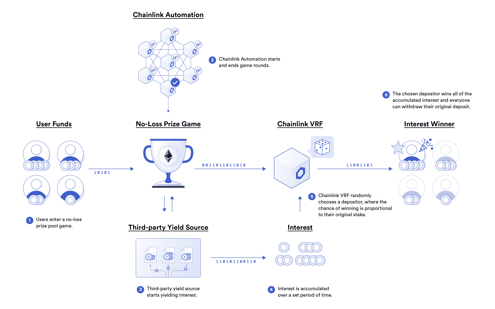

<figcaption id="caption-attachment-5105" class="wp-caption-text">The combination of Chainlink VRF and Chainlink Automation enables novel use cases for Web3 gaming.</figcaption>

然而，许多应用需要在它们提供的体验期间的特定点上获得链上随机性。例如，区块链游戏可能需要智能合同自动化服务来触发一轮的开始，然后在请求另一个自动化触发来结束该轮之前，为特定的游戏机制生成随机性。Chainlink Automation 和 Chainlink VRF 的结合可以为开发团队节省宝贵的资源，使他们能够将任务外包给 Chainlink services，从而获得简化的开发人员体验和无缝的用户体验。

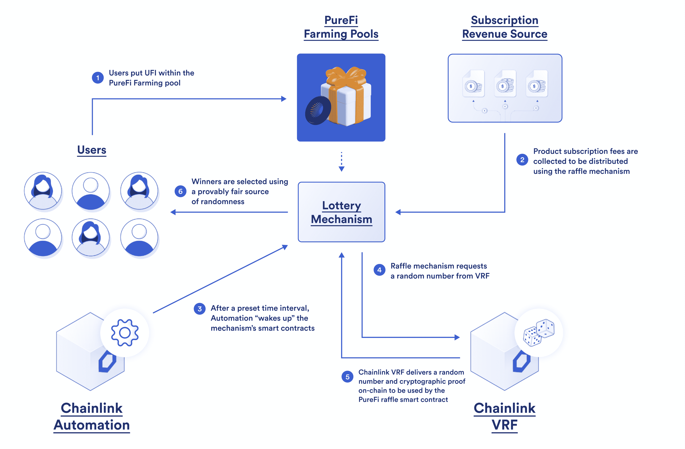

<figcaption id="caption-attachment-5107" class="wp-caption-text">PureFi uses Chainlink VRF and Chainlink Automation to support its winner selection and reward distribution.</figcaption>

[PureFi](https://blog.purefi.io/purefi-integrates-chainlink-vrf-and-automation-to-help-power-raffle-rewards-8e139e3d80c5) ，DeFi 的合规协议，集成了 Chainlink VRF 和自动化，以支持其农业抽奖奖励的获奖者选择过程，具有可验证的随机性，并安全地自动进行每月奖励分配。通过利用安全自动化和可验证随机性的结合，PureFi 能够在其平台上引入全新的功能，同时节省宝贵的开发资源。

> *“我们很高兴将 Chainlink VRF 公司和 Chainlink Automation 公司集成在一起，以帮助巩固我们的养殖池抽奖的获胜者选择流程和奖励分配。有了尖端、久经考验的 Web3 服务，Chainlink 成为行业标准的原因就显而易见了。”——Slava Demchuk，PureFi 创始人兼首席执行官。T3】*

即玩即赚游戏 [克拉巴达](https://medium.com/@PlayCrabada/crabada-uses-chainlink-vrf-and-keepers-to-help-secure-and-automate-daily-lucky-draws-7d24e23e7ad2) 集成 Chainlink 自动化和 Chainlink VRF，帮助创建可验证的随机、自动化每周抽奖。VRF 帮助随机选择获胜者，自动化帮助开始和停止每轮抽奖，发起 VRF 呼叫，并向获胜者分发奖品。因此，Crabada 每周的幸运抽奖是完全自动化的，不需要 Crabada 团队的任何手动输入。

> *“我们将 Chainlink VRF 和 Chainlink Automation 集成到我们的幸运抽奖智能合同中，以帮助使用可证明公平的 RNG 选择获奖者，并帮助以高度安全的方式自动化关键功能。Chainlink VRF 和自动化的集成过程是无缝的——我们强烈推荐任何 GameFi 项目利用 Chainlink 行业领先的服务。”—OxTender，克拉巴达联合创始人*

## 结论

虽然上面列出的使用案例提供了 Chainlink Automation 实现的广泛功能的概述，但记住每天都有新的使用案例出现是很重要的。重复智能合约功能的安全、信任最小化自动化是许多开发团队努力的目标，这一趋势将继续推动对交易自动化解决方案的更多需求，这些解决方案提供了一种端到端完全分散 dApps 的方式，并使开发人员能够创建基于区块链的应用程序，与传统替代方案相比，这些应用程序脱颖而出。

如果您是一名开发人员，并且希望快速将您的应用程序与[chain link Automation](https://chain.link/automation)集成，请访问 [开发人员文档](https://docs.chain.link/docs/chainlink-automation/introduction/) 并加入[Discord](https://discordapp.com/invite/aSK4zew)中的技术讨论。如果您想安排一次电话会议来更深入地讨论整合事宜，请点击 [这里的](https://chainlinkcommunity.typeform.com/to/OYQO67EF?page=announcement) 。

要了解更多，请访问[chain . link](https://chain.link/)，订阅 [Chainlink 简讯](https://chn.lk/newsletter) ，并关注 Chainlink 上的[Twitter](https://twitter.com/chainlink)，[YouTube](https://www.youtube.com/channel/UCnjkrlqaWEBSnKZQ71gdyFA)，以及[Reddit](https://www.reddit.com/r/Chainlink/)。

## 关于这个话题的更多信息

*   [如何入门 Chainlink 自动化](https://blog.chain.link/smart-contract-automation/)
*   [Chainlink 自动化现已上线以太坊 Mainnet](https://blog.chain.link/chainlink-keepers-is-now-live-on-mainnet/)
*   [Oracle 计算:将 Oracle 的用途扩展到数据交付和链外计算](https://blog.chain.link/what-is-oracle-computation/)
*   [通过 Chainlink](https://blog.chain.link/44-ways-to-enhance-your-smart-contract-with-chainlink/) 实现的 77+智能合约用例
*   [VRF chain link 支持 35 个以上区块链 RNG 用例](https://blog.chain.link/blockchain-rng-use-cases-enabled-by-chainlink-vrf/)