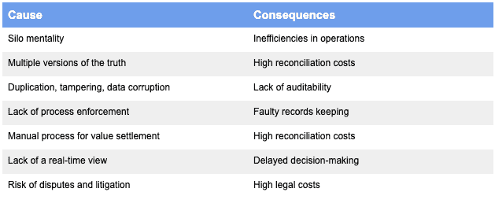
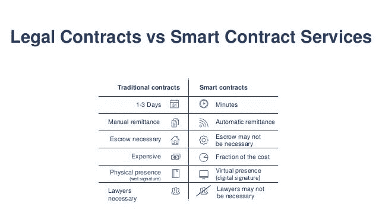
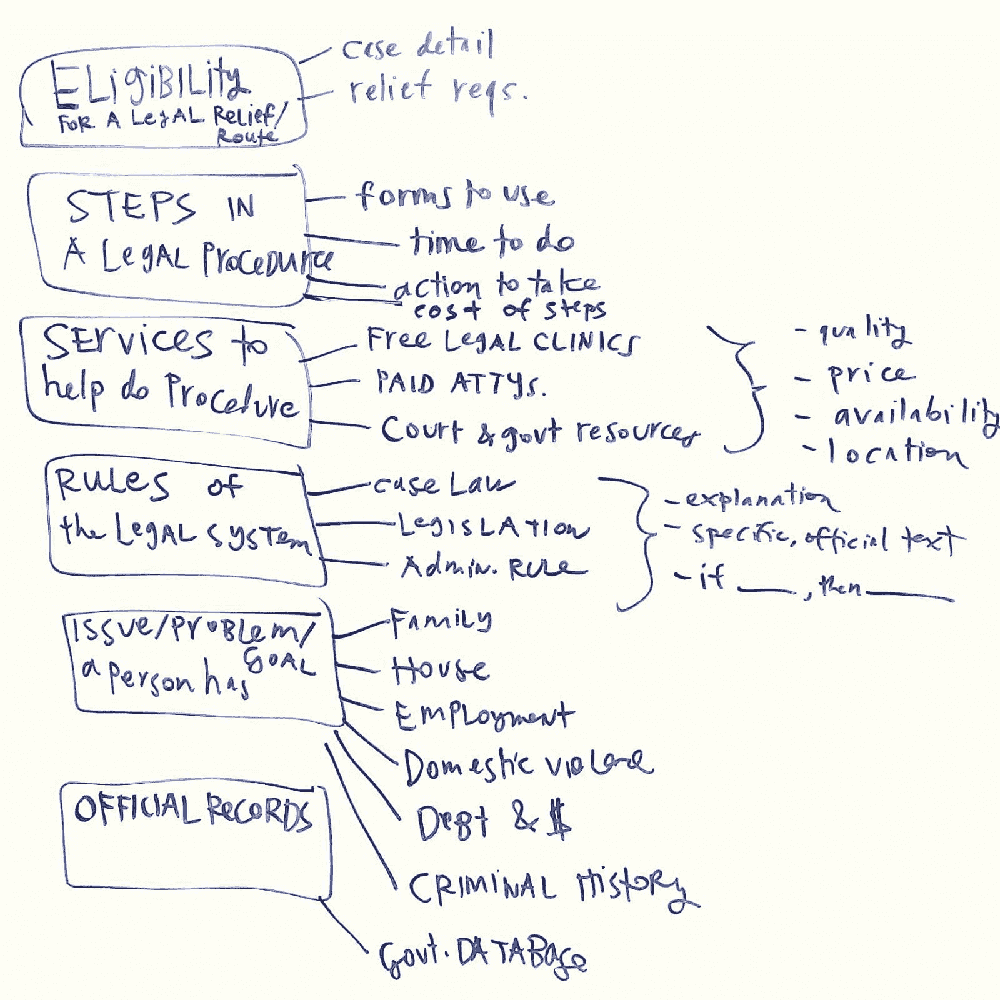
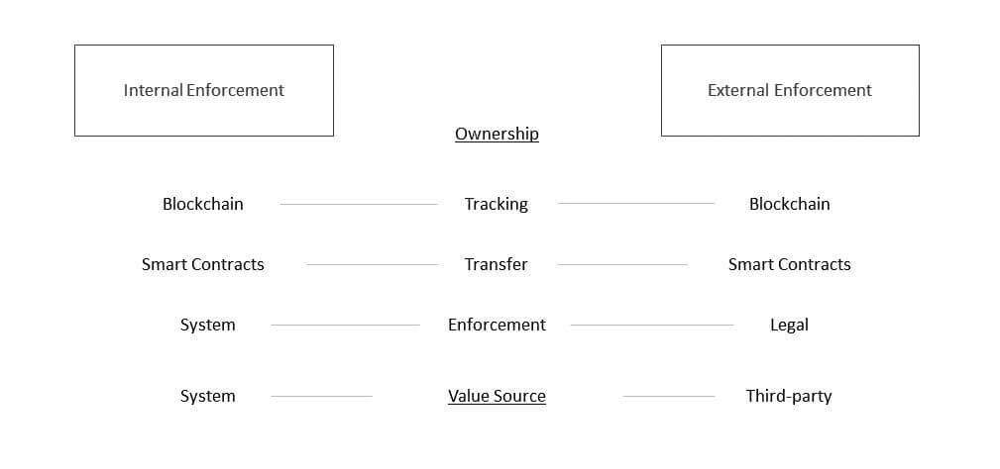

# 将智能合同嵌入我们的法律架构

> 原文：<https://blog.chain.link/embedding-smart-contracts-into-our-legal-fabric-2/>

*感谢* [*OpenLaw*](https://www.openlaw.io/) *审阅本文，并对智能合同与当前法律体系的交叉给出了深刻见解。*

[智能合同](https://chain.link/education/smart-contracts)通过使用可靠且防篡改的分散式基础设施提供数字化纸质合同和自动化业务逻辑的方法，可以彻底改变公司和个人之间的互动方式。

然而，尽管智能合同提供了巨大的商业利益，它们在法庭上有法律约束力吗？为了回答这个问题，我们探索当前法律协议的结构，以及它们如何演变为智能合同。概述这种转换的技术细节将作为解决其法律地位和其他关于智能合约开发未来的微妙讨论的基础。

## 了解法律协议的现状

根据康奈尔大学法学院的说法，合同是“私人当事人之间达成的协议，旨在创建可依法强制执行的相互义务。具有法律效力的合同的基本要素(在大多数司法管辖区)是:双方同意(没有胁迫/强制力的协议)；以有效要约和承诺表示(各方签字)；足够的对价(价值交换)；能力(年龄&心智健全)；和合法性(合法活动)。”

法律合同主要是基于各种标准行业模板的书面文档，可根据需要进行定制。公司通常不会为每笔标准交易起草新合同。相反，他们使用可信的行业模板，添加他们的修改或创建一组定制的协议，成为特定类型的业务关系的基础。

如今，大多数书面法律文件要么作为纸质合同存储在文件柜中，要么作为数字 pdf 存储在计算机硬盘上。书面合同需要所有当事人的书面签名才具有法律效力。数字合同(也称为电子合同)具有与书面合同相同的特征，只是签名是通过电子签名以电子方式完成的。

正如 Chainlink 的联合创始人谢尔盖纳扎罗夫(Sergey Nazarov)反复指出的那样，今天的合同是概率性的，因为每一方都可能遵守协议并按时付款。然而，在现实世界中，许多当事人根本不会有意或无意地履行他们的承诺。交易对手违约会导致一连串的不便，如现金流延迟、不可预见的费用、预算不准确、诉讼增加以及各种其他问题。

<figcaption id="caption-attachment-887" class="wp-caption-text">现行法律协议的一些问题和由此产生的后果。来源:Konfidio</figcaption>

合同之所以是概率性的，是因为合同过程需要双方之间的来回动作来执行和结算合同。每一方都必须等待并相信另一方会按时采取行动，然后他们必须进行对账以核实交易对手的行动。这涉及到一个电子邮件/电话标签的游戏，经常导致故作姿态和小动作，以测试对方的极限和/或迫使他们采取行动。大公司有某些优势，可以通过欺负小供应商来推迟付款。这种交易对手风险延伸到公司拖延或拒绝采取行动的国际协议中，由于国际诉讼的成本和复杂性，解决这一问题更具挑战性。

## 向智能合同过渡

一个[智能契约](https://chain.link/education/smart-contracts)是一个确定的、可靠的、防篡改的数字协议，运行在分散的基础设施上。一旦双方或多方同意合同条款，他们就将合同(或部分合同)转换成代码，并将其发送到共享基础设施，该基础设施为双方自动存储、维护、执行和结算合同。通过分布式分类帐(主要是区块链，但也包括有向无环图(DAG ),这是一种非区块链分布式分类帐，由于其独特的共识算法，可提供增强的可伸缩性)在共享基础架构上运行合同，为各方带来了新的好处。

使用分布式分类帐作为后端系统来运行和存储合同，合同变得确定(结果直接由数据决定)。智能合约会自动执行这些操作，而不是等待另一方采取行动、验证他们的行动以及手动输入数据。智能合同根据合同代码(条款)和它收到的有关合同事件的外部数据反馈之间的交互，自动执行(维护、数据输入、执行、结算)。任何一方都不能控制共享的基础设施或数据，因此任何一方都不能逃避合同义务，也不能篡改结果。

<figcaption id="caption-attachment-888" class="wp-caption-text">现行法律合同与智能合同的一些基本区别；来源:Everis</figcaption>

[正如 OpenLaw 在最近的一篇博客文章](https://medium.com/@OpenLawOfficial/introducing-openlaws-integration-framework-making-it-easy-to-integrate-third-party-services-into-f28eb779856b)中所述，“OpenLaw(通过智能合同)将法律协议转化为结构化的可计算文件——可以读取、写入或交互的数据对象。因此，法律协议不再需要困在布满灰尘的文件柜中，或者难以解析 Microsoft Word 文件或 pdf。它们可以像软件一样运行。”

本质上，智能合约就像运行在共享的、数据驱动的、分散的基础设施上的可编程软件。基于这种理解，让我们研究一个以当前合同格式和智能合同格式表示全球贸易的简化合同。

### 合同条款

这份合同是由欧洲制药公司诺华和美国零售商沃尔格林签订的，它概述了沃尔格林根据一系列条件向诺华支付医药产品的款项:1)货物按时到达 2)数量正确，3)状况良好。商品从诺华到沃尔格林的流动涉及几个中介:第三方检查员、海关、运输公司和融资公司。

***当前形式***
他们同意一份合同(发票)并来回传真以获得实物签名。两家公司及其银行合作伙伴都会审查发票副本，并将其存储在文件柜/数据库中。这种共同媒介的缺乏导致商品在中间商之间流通时有过多的检查点。运输路线中的每一步都涉及在不同的操作平台之间交换物理文档，并且通常需要某种形式的手动数据输入/验证。这最终会导致时间延迟、频繁的沟通失误、协调开销和纠纷增加。

***智能合同***
他们同意一份智能合同(编码发票)并用他们的电子签名签署。他们将发票发送给区块链，后者将在合同的剩余生命周期中一直携带该合同。每个中介通过电子签名(授权)、Web API(GPS 跟踪、海关)和物联网设备(用于质量控制和数量检查的温度传感器和 RFID 芯片)将他们的相关信息直接发送到智能合同(用私钥签名)。一旦合同启动，任何一方都不需要采取行动，因为一旦数据确认满足所有条件，付款就会自动释放。

## 将合同转变为合法的智能合同

根据国际互换和衍生品协会(ISDA)和年利达律师事务所(一家位于伦敦的跨国律师事务所)的联合文件，“法律协议可以被分析为包含操作性和非操作性条款。”

### 智能合同中的操作条款

操作性条款概述了合同的实际行动，例如如果发生了车祸，那么就提出索赔；如果索赔有效，则根据他们的保险范围发放[保险](https://blog.chain.link/blockchain-insurance/)赔付。智能合约可以完美地替代操作性条款，因为智能合约使用了表示布尔逻辑的代码(如果 x 发生，那么执行 y)。

[呼应 OpenLaw](https://twitter.com/OpenLawOfficial/status/1158590265390772224?s=20) 的思想，实现这一目标有三个核心要素:

1.  **智能合同启用区块链(或 DAG)** 存储合同条款(代码)并根据满足的条件执行合同。它还提供了一种使用私钥签署合同的方法，并为双方和监管机构提供了审计跟踪。具有智能合约能力的区块链平台有以太坊、Hedera、Polkadot、Tezos 等。
2.  **法律软件**包含用于创建和部署各种法律模板的库和工具。这些模板提供了以数字方式表示(编纂)法律合同重要部分(如当事人、条款和对价)的标准化方法。正如 OpenLaw 最近发表的一篇名为[智能合约栈](https://medium.com/@OpenLawOfficial/the-smart-contract-stack-5566ea368a74)的博客文章中所述，这是一种创建 Ian Gregg 所称的李嘉图合约的方式——一种“定义两个或更多对等方之间交互的条款和条件的数字协议，该协议经过加密签名和验证。重要的是，它既是人类可读的，也是机器可读的，而且是数字签名的。”该软件目前由诸如 [OpenLaw](https://medium.com/@OpenLawOfficial/openlaw-teams-with-chainlink-to-bring-real-world-info-to-smart-contracts-4e7a3dac80a8) 和 Clause(创建了一个名为 [Accord Project](https://twitter.com/AccordHQ/status/1031022745835003905?s=20) 的基金会用于开发法律模板)等初创公司提供。
3.  **[Oracle](https://chain.link/education/blockchain-oracles)**将(链上)smart contract 连接到其本地区块链(链外)之外的任何和所有系统。这包括连接到链外数据源(web APIs、物联网、云)以触发合同执行，用于链外结算的按需支付系统(银行、金融科技、其他区块链)，以及需要交易元数据的第三方实体(监管机构、审计机构、分析机构)。Oracles 还可以通过验证和认证触发和结算合同的数据来提高数据质量。Chainlink 是连接链上和链下世界的领先标准数据层。

<figcaption id="caption-attachment-889" class="wp-caption-text">Chainlink 将智能合约连接到任何输入和输出。</figcaption>

### 智能合同中的非操作性条款

非操作性条款代表了当事人之间更广泛的法律关系的上下文，例如本体论和形式语义学。

根据剑桥大学出版社的说法，“形式语义学是一种研究语义的方法，它植根于逻辑学、语言哲学和语言学。”

正如斯坦福法学院法律设计实验室主任 Margaret Hagan 所描述的，一个本体“是一个领域中所有人、事物、概念和关系的明确的、结构化的描述。它为在某个领域工作的所有人提供了一个通用的词汇表——比如在医学、法律或其他领域。这让他们对如何向机器展示自己的领域有了共同的理解。”

<figcaption id="caption-attachment-890" class="wp-caption-text">一个对法律数据进行分类的示例本体；来源:玛格丽特·哈根</figcaption>

将两者结合在一起，形式语义学为合同中的词语和概念提供逻辑意义，而本体通过提供结构和知识领域来帮助对法律概念之间的相互关系进行分类。例如，形式语义学可能会对“善意地”这样的陈述给出具体的解释，而本体识别赋予这种陈述意义的管辖权、法律、数据库和法院案例。

非操作子句更难简化为纯编码逻辑。主观事物的正式表述出现了问题，这种表述不容易像“善意地”那样编码，因为它需要主观解释或结构化知识的参考。虽然智能合同可能会有迫使各方消除主观细节的积极效果(随着时间的推移，使用参考本体数据库的机器学习软件应该会有所改善)，但在某些情况下它可能过于昂贵，不值得实施。这些主观条款是法院在出现分歧时可以发挥作用的地方。重要的是要明白，智能合同不会消除诉讼，但应该通过确定性自动化和对各方合同履行情况的验证，大大减少诉讼和其他管理费用。

## 智能合同的法律地位

根据卡多佐法学院题为[智能合同&法律可执行性](https://cardozo.yu.edu/sites/default/files/Smart%20Contracts%20Report%20%232_0.pdf)的研究报告，“鉴于该技术的新颖性，智能合同代码的可执行性问题尚未得到美国法院的审查。幸运的是，智能合同可执行性的问题在很大程度上可以根据《反欺诈法》、《统一商法典》(下称“U.C.C .”)、《全球和国家商务电子签名法》(下称“电子签名法”)以及以《统一电子交易法》(下称“UETA”)为范本的州法律的现有州法律实施情况来回答。”尽管还有许多工作要做，而且没有什么是确定的，但许多法律专家普遍认为，关于电子签名和电子合同/交易的现有法律可以适用于智能合同，以便赋予其法律可执行性。

为了确定法律可执行性，检查智能合同在法律文档中是如何表示的很重要。在 ISDA/年利达的联合文件中进一步阐明，代表法律智能合同归结为两种广泛的方法:外部和内部代表。

### 智能合同的外部表示

在外部表示中，契约是物理的，由自然语言表示，但是表示操作条款的一些业务逻辑是通过智能契约处理的。实际代码与合同互斥，因此不具有法律约束力。在这种模式下，如果代码触发了与错误一方的交易，那么将有一个明确的法律先例来起诉交易对手并获胜。这种模式在智能合约的早期提供了更多的安慰，因为它给了更多的回旋余地来合法地纠正错误。

智能合同中的外部表示通常围绕“索赔许可”展开，如事件发生时的数据驱动发票收据，而不是触发支付结算。例如，债券付款被记录为基于当前利率的付款要求，而不是债券发行人直接向债券持有人付款。索赔甚至可以在区块链上生成，以提供经过加密验证的收据(日期、支付金额、参与方、事件数据)，这些收据可以在法庭上用作证据。虽然内部表示可能最适合产权等所有权索赔，但人们不得不怀疑，鉴于你仍需要等待对手采取结算行动并进行支付，收据索赔是否与当前的数字合同有很大不同。

<figcaption id="caption-attachment-891" class="wp-caption-text">内部表象与外部表象的简单比较；资料来源:瓦伦丁诉荷兰法院</figcaption>

### 智能合同的内部表示

在内部表示中，契约仍然是自然语言，但是契约的某些部分引用了具有法律约束力的可识别的代码片段。在这种解释中，智能合同的结果将具有法律约束力，并直接给予"[使用](https://hackernoon.com/a-simple-framework-for-understanding-smart-contract-applications-18fd78080436)的许可，即使它是不正确的，因为支持操作条款的代码是有约束力的。在这种模式下，对于每一方来说，最重要的是事先让精通技术的人审计合同代码及其运行的平台，因为代码就是法律，所有权是转移的。然而，在有大量证据证明发生了错误的情况下，法律先例可能会推翻智能合同的结果。

智能合约的内部表示与合约的端到端执行或“自执行”更密切相关，其中付款是基于事件数据直接发出的。Chainlink 已经在与 SWIFT 的[概念验证中展示了其创建智能债券的能力。PoC 根据五大银行的平均利率自动支付债券，然后在 SWIFT 网络上触发支付消息。在这个例子中，从执行到结算不需要人工操作。](https://www.coindesk.com/swift-startup-winner-demos-smart-contract-trade-5-financial-firms)

## 进一步发展的领域

尽管许多行业领导者进行了开创性的工作，但法律智能合同仍处于发展的早期阶段。要实现大规模采用，仍有几个关键领域需要解决。

### 标准

许多行业的大规模采用通常取决于行业标准的建立。需要一种通用的编程语言来表示法律合同，使律师能够容易地理解、起草和检查具有法律约束力的智能合同代码。为了实现这一点，李嘉图契约是必要的，以使计算机编程语言能够容易地转换为自然法律语言。如果不是，那么每个律师事务所都有技术人员是绝对必要的。不幸的是，也有许多不同的方法(标记语言)来表示智能合同，这使得来自不同项目和管辖区的律师很难容易地理解协议的条款。将这些语言标准化到少数几个或启用通用转换工具可能是在全球范围内管理合同的唯一方法。

### 可信模板

与如今广泛使用的模板类似，智能合同需要可信任的模板，这些模板可以通过简单的拖放操作使用，然后进行修改。像 OpenLaw 和 Clause(通过 Accord 项目)这样的初创公司正在使用他们的标记语言来设计易于使用的开源模板，这些模板复制了常见的合同协议。随着时间的推移，企业和行业专家将完善这些协议，直到市场确定那些最安全、符合法律规定并满足市场需求的模板。一旦就简单业务流程的基本智能合同模板达成一致，就可能出现更复杂的高级业务模型设计。

### 诉讼程序

重要的是，在出现问题的情况下，建立正式的程序，例如对智能合同的结果有分歧。已经有许多政府机构和法律联盟围绕此类事件讨论后备程序和法律先例。这是一个很可能根据未来法庭案件发展的领域，在这些案件中出现了这种问题并作出了决定。不同的司法管辖区可能会有不同的解释，但标准程序应该扎根并为市场提供清晰度。

正如德国耶拿弗里德里希-席勒大学的国际私法教授 Giesela Rühl 所说的,“就像所有其他合同一样，聪明的合同要求法律来回答它们。因此，决定性的问题不是智能合同是否受法律约束，而是它们受哪部法律约束。”

### 数据安全

鉴于数据直接触发行动，代码就是法律，数据质量至关重要。如果合同继续向数据驱动的自动化发展，它们将需要比目前更高的数据安全和验证标准。考虑到与单点故障(oracle)相关的巨大腐败和停机风险，具有法律约束力的自动执行合同可能需要分散式 Oracle。Chainlink 提供了一个强大的工具集，用于为合法的智能合同消费开发经过身份验证、验证和防篡改的数据输入和输出。

## 将具有法律约束力的自动化引入合同生命周期

社会正在走向大规模自动化。除了广泛讨论的通过机器人实现人工劳动自动化之外，智能合同正在通过开源分散协议将自动化快速扩展到经济价值交换中。智能合同将大幅减少法律交易的繁琐后端流程。

企业/消费者采用的剩余障碍是双方同意的具有法律约束力的标准，这些标准已经取得了很大进展。年利达(Linklaters)等律师事务所正直接与 ISDA 合作，制定[衍生品](https://blog.chain.link/blockchain-insurance/)的智能合约法律标准，而[全球法律区块链联盟](https://legalconsortium.org/)和[数字商会](https://digitalchamber.org/policy-positions/smart-contracts/)正努力与利益相关方就法律标准达成共识。

一旦这些标准最终确定，智能合同将大幅提高涉及协调多方工作流的业务开展速度和成本。这些协议的分散验证将迎来一个向不信任社会的范式转变——与世界上任何人进行交易，而不用担心交易对手的风险。

### 加入社区，立即开始使用 Chainlink 进行构建

如果您想立即开始使用 Chainlink 进行构建，请访问[开发者文档](https://docs.chain.link/docs/getting-started)，加入关于[不和谐](https://discordapp.com/invite/aSK4zew)的技术讨论，和/或联系我们，了解如何安全地在 mainnet 上启动您的数据支持应用程序或 [Chainlink 价格参考数据合同](https://feeds.chain.link/)。

如果您想加入 Chainlink 社区，请访问我们的[活动页面](https://events.chain.link/)加入您当地的类似聚会。如果你想成为 Chainlink 大使并主持 meetup，[今天就报名](https://chain.link/community/advocates)！更多信息，请查看 [Chainlink 网站](https://slack-redir.net/link?url=https%3A%2F%2Fchain.link)或关注我们的 [Twitter](https://slack-redir.net/link?url=https%3A%2F%2Ftwitter.com%2Fchainlink) 或 [Reddit](https://slack-redir.net/link?url=https%3A%2F%2Fwww.reddit.com%2Fr%2FChainlink%2F) 。