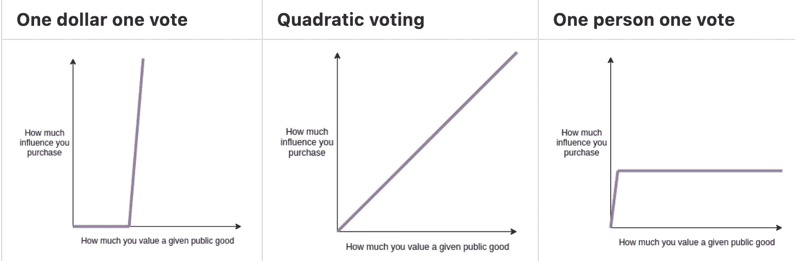

# Dao 和 Web3 治理的复杂性

> 原文：<https://blog.chain.link/daos/>

[Web3](https://chain.link/education/web3) 诞生于中央集权制度 [的失败](https://blog.chain.link/what-crypto-is-really-about/) 以安全、公平、透明的方式管理社会的金融和社会基础设施。Web3 建立在[信任最小化的](https://blog.chain.link/what-is-trust-minimization/)分布式网络 之上，例如 [区块链](https://blog.chain.link/what-is-blockchain/) 和 [神谕](https://chain.link/education/blockchain-oracles) ，它们利用密码学、共识协议和机制设计来管理数字基础设施——从对人类第三方的信任向技术强制保证的转变，这一概念被称为 [密码真理](https://blog.chain.link/what-is-cryptographic-truth/)

<figcaption id="caption-attachment-3876" class="wp-caption-text">Cryptographic truth combines cryptography and financially incentivized decentralized consensus to generate a golden record amongst a distributed set of entities and deterministically compute applications.</figcaption>

超越 [DeFi](https://chain.link/education/defi) 和 [NFTs](https://chain.link/education/nfts) ，信任最小化的数字基础设施使一种新型的基于区块链的社会结构成为可能，这种结构被称为道。Dao 授权独立实体共同治理开源基础设施和/或民主管理共享资产，特别是通过将特定流程编入由区块链强制执行的智能合同。本质上，Dao 的目标是将信任最小化的概念扩展到人类的集体决策。

下面这篇博客文章从一个细微的角度介绍了 DAO，首先介绍了 DAO 的基础知识，然后讨论了每种 DAO 要获得持续成功必须优化的优势和权衡。

# 道术基础

要理解 DAO 的好处和利弊，首先必须定义什么是 DAO，了解各种类型的 DAO，概述它们的职责，并展示当今存在的不同 DAO 工具和治理结构。

## 什么是刀？

道代表“去中心化的自治组织”DAO 的一般用途是以一种比传统组织更分散、透明和信任最小化的方式集体做出决策。简而言之，DAO 是一种新型的人类组织结构，它允许人们在所有参与者都能够独立验证组织如何运作的共同理解的基础上朝着共同的目标努力。

Dao 的一个独特之处是他们使用了基于区块链的智能合约，该合约将他们执行决策和分配所有权的部分或全部流程编成法典。智能合约的引入是其创新的基础，因为它允许管理 DAO 功能的规则对成员完全透明，并且高度抵抗成员或外部实体的篡改。这是因为在区块链(即 [【智能合约】](https://chain.link/education/smart-contracts) )上运行的代码是公开可审计的，并且由分散的节点网络保护。

应当注意的是，虽然“自主”一词是术语“道”的一部分，但“道”并不是完全自主的。Dao 由人类组成，因此需要用户的手动操作才能运行，例如需要用户进行投票、部署代码和讨论提案。术语 DAO 中自治的使用源于将 DAO 的特定功能硬编码为不可变智能契约的思想。然而，人类仍然需要与智能契约(代码)进行交互(提供输入)，以便执行操作(输出)。

## Dao 的类型

虽然 Dao 还处于起步阶段，但可以将其分为六大类:

协议 DAOs 支持分布式应用(dapp)或 dapp 所使用的基础设施的开发和管理。协议 Dao 主要关注管理开源技术，类似于公司或基金会。

*   [Tezos](https://tezos.com/) 是一个区块链，使用类似 DAO 的链上治理结构来激活协议升级，最显著的是通过基于代表的投票系统，该系统需要绝对多数的一致同意才能批准。
*   [马克尔道](https://makerdao.com/en/) 是管理分散的 [稳定的](https://blog.chain.link/what-are-stablecoins/) 戴的组织。DAO 参与者负责设置协议参数，如 调整利率、添加/删除担保品类型以及核心单元团队的入职/离职。

**投资道** 在道的控制下，利用国库中的资金进行投资和管理投资。投资 Dao 主要专注于为其成员创造利润，类似于私募股权基金或对冲基金。

*   [BitDAO](https://www.bitdao.io/) 是一种通过 BIT token 持有者投票的各种策略来增长其财富的 DAO。BitDAO 声称已经为 Web3 项目拨款超过 6 . 38 亿美元。
*   [【meta cartel Ventures(创投道)](https://metacartel.xyz/) 是一个以盈利为目的的道，对早期 dApps 进行投资。它专注于体现以社区为导向的成员结构，并提供比传统风险投资基金更灵活的参与。

基于事业的 Dao管理旨在支持特定事业的资金和计划。基于原因的 Dao 以实现慈善、政治和公共产品等领域的集体目标为中心，类似于慈善机构、游说团体和拨款项目等传统组织。

*   [Gitcoin](https://gitcoin.co/) 是一个 DAO，它管理一个平台，用户可以通过二次投票模型为以太坊和其他基于区块链的开源项目集体资助公共产品。
*   [大绿](https://biggreen.org/) 是一种为帮助学校、社区和家庭学习如何种植自己的食物而提供慈善赠款的刀。

社交道 管理共享的社交空间，集体拥有有艺术价值的东西，和/或为他们的成员培养文化和活动。社交 Dao 围绕娱乐、艺术、游戏和生活的其他社交方面将社交社区聚集在一起，类似于现代的社交俱乐部。

*   [【BAYC】](https://boredapeyachtclub.com/#/)百无聊赖的猿游艇俱乐部(BAYC)是一个有限的 NFT 集合，其中加倍成为 DAO 的会员，给予持有者特殊的津贴。
*   [克劳斯之家](https://www.krausehouse.club/) 是一个由篮球爱好者组成的社交道，他们的目标是有一天拥有一支 NBA 球队。克劳斯之家道已经拥有球猪队，这是三大篮球联盟中的一支球队。

**数据 DAO**在 DAO 的控制下开发和管理数据。数据 Dao 是围绕汇集用户数据或开发独特的数据产品而设计的，以便将其出售给想要使用它的第三方，例如创建人工智能算法或市场研究。

*   [dClimate](https://www.dclimate.net/) 是一个气候数据、预测和模型的市场，为想要出售新数据集的用户和想要购买它们的机构提供支持。DAO 评估来自出版商的数据，以帮助保持高质量和适当的网络激励。
*   [德尔菲亚](https://delphia.com/data) 是一个计划中的机器人顾问，它将以本地令牌为人们的个人数据付费。德尔福将汇集用户的个人数据，并使用它来设计投资策略，而原生令牌将让用户访问这些策略。

**网邦** ，由 [巴拉吉斯里尼瓦桑](https://balajis.com/) 创造的一个术语，是用于创建新的法律认可的社会的类似道的结构。正如巴拉吉在他的书 [中定义的那样，网络国家:如何开始一个新的国家](https://thenetworkstate.com/) ，

> *“网络国家是一个社会网络，具有道德创新、民族意识、公认的创始人、集体行动的能力、面对面的文明程度、集成的加密货币、受社会智能契约限制的合意政府、众筹的物理领土群岛、虚拟资本以及证明足够大的人口、收入和房地产足迹以获得外交承认的连锁人口普查。”T3】*

## Dao 的职责

Dao 最终可以被设计成执行任何类型的任务，但他们最常见的职责包括:

 ***   **批准对开源协议** 的升级，例如投票决定协议的代理契约是否可以升级以支持具有不同逻辑(即代码)的新实现，或者批准发布新的协议独立版本，用户可以在部署后迁移到该版本。
*   **调整 dApp** 中的参数，如改变分散稳定货币的利率或决定是否支持借贷市场中的新抵押品类型。
*   **提交改进提案并讨论其优点** ，例如创建一个正式提案来更改协议/DAO 的某些内容，或者在投票前质疑其他提案的前提。
*   **将议定书拥有的资金用于投资或外部账户** ，如从道的国库向接受者发放赠款，或决定道是否应投资于限量版的 NFT。
*   **管理领导** ，如投票决定人员进入或退出管理职位，推翻领导决定，或改变道的基本组织结构。
*   **仲裁因使用协议、dApp 或 DAO 管理的基础设施** 而产生的争议，例如确定用户是否应因协议中的意外攻击或漏洞而获得赔偿。
*   **确定协议** 的长期路线图和愿景，例如讨论 DAO 是否应在现有用例垂直基础上扩展，或者决定它应支持哪些区块链/第 2 层网络。
*   **校准** 协议的价值获取机制，如提取多少用户费用，是否烧令牌，或者 DAO 成员是否应该获得红利。

## 刀工装

DAO 使用一套标准化的工具来充分发挥功能，经常将下面列出的多种工具结合起来，形成多层的 DAO 结构。

*   **治理令牌:** 由 DAO 发行的加密货币令牌，授予持有者在 DAO 内的特定权力。最值得注意的是，DAO 成员通常需要治理令牌来投票(例如，1 个令牌= 1 票)。
*   **多签名钱包:** 需要*m-**-n*预定义地址签署消息的智能契约，直接实现对协议的更改。Dao 通常使用多 SIG 来实现基于较小的预定义委员会的链外快照的协议链上更改，或者在紧急情况下作为一种安全措施，例如减轻治理攻击。
*   **投票合同:** 一种智能合同，协调对提案的链上令牌加权投票，提案必须满足 DAO 成员或 DAO 代表预先定义的阈值(例如 66%是)和法定人数(例如 2%令牌持有者参与)，才能获得批准。结果可以通过多重签名或者通过提交为可执行代码的提议来实现，正如在 Compound 的治理 alpha 投票契约中所看到的。
*   委托系统 :一种允许治理令牌持有者将其投票权委托给代表他们投票的其他方的机制。
*   **链外快照:** 一个链外平台，通过已签名的链外消息进行令牌加权投票，其中链上余额和地址的快照被用来确定投票权。结果用于影响 DAO 定义的后续操作。这种方法是有利的，因为成员不必支付链上交易费来投票，从而增加了更强大的社区参与的机会。
*   论坛: 几乎所有的 Dao 都有一个社交层，允许成员们聚在一起，以开放的方式展示和讨论想法。最受欢迎的媒介包括专门的治理论坛网站，如 Discourse 或 Discord 服务器或 Telegram group。
*   **声誉系统:** 虽然仍处于早期阶段，但链上声誉正被探索作为一种方式，给予那些经常参与、提供宝贵见解或支持道的个人更多的权重。一种被提议的方法是[灵魂绑定令牌](https://papers.ssrn.com/sol3/papers.cfm?abstract_id=4105763)，它将非财务价值分配给用户地址作为令牌，给他们某种形式的链上声誉，或“灵魂”。

Dao 必须决定如何将这些工具和其他工具结合起来，以创建一个整体治理流程，满足其成员在效率、成本和信任最小化之间的期望平衡。基于成员的哲学和价值观以及 DAO 的明确目的，每个 DAO 都有不同的优化概念。

## 道治理结构

形成共识是任何一个"道"的最重要也是最具挑战性的方面之一，因为这是如何以分散的方式作出决定的。以下是目前用于形成共识的一些治理结构，包括上述一些工具的组合。

**直接链上民主** 是指成员直接在链上对一项提案进行投票，该提案必须达到一定的门槛才能获得批准。大多数采用直接链上民主的 Dao 使用令牌加权投票，用户持有的令牌越多，他们在投票中的权重就越大(通常 1 个令牌= 1 票)。鉴于其最小的复杂性和开销以及 Sybil-resistance 属性，这是在 DAO 中实现一致性的最常见和最简单的方法。

**直接链外民主** 是指一个 DAO 使用快照进行链外投票，必须达到一定的门槛才能获得批准。大多数直接链外民主也利用令牌加权投票，但需要可信实体的多重签名来忠实地推动链上提议的改变。因此，链外民主需要一种信任元素，即多重签名者将投票支持 DAO 的快照结果。

**代议制民主** 是指一个道利用在线投票的代表批准提交给道的提案。代表通常由 DAO 选举产生，可能会在部分或全部投票之前使用链外快照来衡量更广泛的 DAO 群体的兴趣。如果严重缺乏对其决定的支持或异议，DAO 还可纳入推翻或更换其代表的方法。

**二次民主** 是一种基于二次投票的治理结构，用等式表示: *投票人成本=(票数)* *2* 。例如，一个提案的一票可能需要一个成员拥有一个治理令牌，但是五票可能需要二十五个治理令牌。二次投票是一种防止"道"组织投票结果由具有最高令牌余额的少数成员决定的方法，从而形成一种动态，即大量个人在一致投票时可以变得同等或更有影响力。然而，需要一种 Sybil-resistance 机制来使二次投票可行，以防止欺骗和跨钱包分割令牌。

[D3LAB](http://d3lab.xyz/) 是一个专门为 Dao 开发的新的抗 Sybil 二次投票系统的项目，称为概率平方投票(PQV)。 [D3LAB 获得了 Chainlink grant](https://blog.chain.link/d3lab-chainlink-grant-probabilistic-quadratic-voting/) 来进一步开发这个系统。

<figcaption id="caption-attachment-4253" class="wp-caption-text">A [diagram from Vitalik Buterin](http://diagram from Vitalik Buterin) showcasing the difference in how one person can influence a vote based on a One Dollar One Vote, Quadratic Voting, or One Person One Vote mechanism.</figcaption>

虽然不在本文的讨论范围之内，但也存在许多分散的加密社区，它们通过令牌的所有权绑定在一起，但在技术上不是 Dao。这些社区通常由更传统的组织结构支持，如开发公司和开源基金会，它们贡献并维护协议。然而，它们也受益于将自己与区块链联系起来，以获得更强的激励一致性和透明度。

# DAOs 的好处

在经过长时间的大规模测试之前，很难真正了解 Dao 的长期优势，但它们的一些潜在优势包括:

## 透明度

DAO(开源代码)的规则及其参与者的活动(链上操作、论坛帖子)通常对所有人都是透明的，以供查看和审计，使人们能够充分了解决策是如何随着时间的推移做出的，以及权力是如何在成员之间分配的。这与传统组织形成对比，传统组织通常更加不透明，并且要求用户相信组织能够完整、准确且不变地记录其决策过程。

## 民主化

道组织通常授权任何成员提交提案，质疑提案的价值，并投票决定提案是否被接受，从而形成一个更加民主化的流程，成员们可以聚集在一起影响道组织的方向。这与传统组织不同，传统组织更倾向于等级结构，在这种结构中，首席执行官、所有者或董事会拥有执行大多数决策的专有权，而其他利益相关者表达意见的能力非常有限。

## 信任最小化

DAO 的结构、它如何形成共识以及如何将共识转化为行动通常被硬编码到部署在公共区块链上的开源智能合同中，使得任何单个实体或小团体都难以篡改达成一致的治理流程。这与传统组织不同，在传统组织中，管理流程通常由一个集中的实体来推动和执行，概述这些流程的规则表现为模糊、复杂且有时是私人的法律合同，这些合同的争议成本很高、执行缓慢或难以获得确定的结果。

## 全局

Dao 通常允许世界上任何有互联网连接的人参与，而不暴露他们身份的每一个方面，这导致社会结构可以固有地消除围绕性别、种族、社会经济地位、性取向、国籍和其他个人标识符的潜在偏见。这与传统组织形成了鲜明对比，在传统组织中，成员通常都是公众人物，因此很难有更纯粹的精英管理形式。

# 道的权衡

与其讨论 Dao 的缺点，不如透过他们必须面对的不同二分法来看看他们面临的权衡，这更有启发性。这些二分法没有正确或错误的实现策略，但是有利弊，必须单独权衡并决定是否适合每个 DAO 的优先级。有趣的是，几乎所有的传统治理结构都面临类似的权衡，因此 Dao 并不是唯一面临这些挑战的组织。

## 早期与后期成员

DAO 中的权力可能来自或落入少数大型令牌持有者手中，尤其是在实施令牌加权投票时。这种情况经常发生，因为一个 DAO 的创始人和/或早期投资者获得了更高比例的治理令牌供应。

虽然这引起了对集中化的担忧，但更困难的问题是早期创始人和投资者是否有理由拥有最大的投票权和影响力，因为他们创建了 DAO，并为其孵化投入了最多的时间和资源。如果有，合理的百分比是多少？面临的挑战是，在较晚阶段加入的机构群体成员可能会感到他们的声音被少数精选成员淹没，从而质疑他们参与的价值。

最终，这种二分法的核心是如何奖励和授权早期参与者，他们承担了更大的风险，提供了更多的资源，同时又不限制后来的参与者的能力，让他们的声音被听到。这与传统的社会结构没有什么不同，传统的社会结构不想惩罚投资和成功，但确实需要保持一定程度的向上流动。

## 权力下放与效率

为了使 DAO 保持信任最小化，必须对权力进行制衡，以减少不受更广泛机构群体支持的快速、情绪化或轻率的决策，并保护 DAO 免受外部人员的治理攻击和不良渗透。制衡是现代民主国家的一个关键设计决策，是一种防止权力过度集中的机制，特别是通过权力下放和明确界定各部分的范围和责任。

挑战在于，分散化通常会导致效率低下，从而阻碍 Dao 及时执行，例如限制其利用实时机会或快速修补意外漏洞的能力。无法做到敏捷，再加上伴随多层决策过程的时间和资源消耗，会使 Dao 更难与更集中的层级竞争对手竞争，尤其是在新的、快速变化的开源技术市场。

这里的二分法围绕着如何保持信任最小化的核心价值，这使 DAO 有价值，同时也使 DAO 能够有效地运作，而不是为每个决策制定漫长的流程。这引出了一个更广泛的问题，即随着时间的推移，协议是否可以从传统的集中式治理结构过渡到更加分散的 DAO 结构。如果是，什么是现实的时间框架，哪些组件应该优先考虑？传统政府在如何维护基本人权和根深蒂固的法律方面也面临类似的挑战，同时也足够灵活，以持续保持高水平的成功并迅速抵御新的威胁。

## 稳定与增长

当谈到分散的、信任最小化的技术时，一些人表达了“没有治理就是最好的治理”的观点其原因是，人类在维护公平、安全和稳定的治理体系方面的历史记录通常很差，这使得任何形式的治理都成为内部和外部腐败的攻击媒介。虽然这种说法有一定的道理，但现实是，几乎所有的社会结构本质上都是动态的，这意味着它们在不断演变，以满足其成员不断发展的需求。

DAO 的困难在于在两种矛盾的观点之间找到平衡:优先考虑僵化的协议规则并随着时间的推移慢慢移除 DAO 功能，还是继续发展协议并保持灵活性，这通常需要扩大 DAO 的使用。这是当今新出现的挑战，DAO 正在进行内部政治辩论，其根源在于对 DAO 的愿景应该是什么的分歧，主要是那些希望坚持对协议最初愿景的严格解释的人和那些希望扩展协议最初用例以占领更大市场的人之间的分歧。

二分法归结起来就是要有一个明确的宣言和基本的愿景，使道能够与之保持一致，同时还要包含一些结构，使其成员的价值观能够随着时间的推移而更新。这种动态贯穿整个历史，因为人口和背景的变化有时会导致关于一个社会的集体愿景是什么或未来应该是什么的有争议的意见分歧。

## 无领导与领导

也许是由于他们的分散化思想，许多人认为 Dao 应该没有领导。虽然一个无领导的社会可能在一些特殊的情况下发挥作用，但从历史上看，缺乏高质量领导的社会结构并不像那些有明确和受尊重的领导人的社会结构那样有效。无领导的社会易受众所周知的现象影响，如公地悲剧，公共利益被忽视，因为没有人承担管理它的责任；权力真空，权力的缺失导致内部冲突，急于填补空缺；或者仅仅是因为缺乏长期思考和纪律而停滞不前，而这是完全实现复杂愿景所必需的。

领导者的缺点是，当被赋予太多权力时，他们会变得恶毒，这就否定了分权自治组织的好处。这就是为什么一些 DAO 已经开始尝试代表性结构，例如 Synthetix 利用“ [”斯巴达理事会](https://blog.synthetix.io/spartan-council-proposal/)”——由 DAO 选出的七人小组，对用户提交的改进建议做出决定。Synthetix 对斯巴达议会进行了补充，在投票之前，通过离线快照投票来衡量 Synthetix 令牌持有者社区的情绪。

这里的二分法是如何提供足够的动力和自主权来吸引、授权和保护具有真正远见的道德领袖，同时在他们偏离道共识的情况下控制他们的权力。这是一个有趣的两极分化现象，因为传统政府的领导素质导致了历史上一些最好和最差的社会。

## 短期与长期优先事项

另一个突出的道动态是如何平衡成员的优先次序。例如，一些道成员主要关注短期增长，包括如何获取更多价值或吸引雇佣军资本，即使这牺牲了财政资源的长期灵活性。然而，其他 DAO 成员可能关注如何实现真正的采用和长期可持续性，这并不总是在中短期内直接惠及 DAO 参与者。

这种动态与无领导与领导、早期与晚期成员二分法交织在一起。最值得注意的是，领导者通常是已经存在一段时间的成员，或者可能是项目的创始人。因此，考虑到他们可能已经预先得到了很好的补偿，并且在协议的成功中有更多的利益——经济上和名誉上——他们通常倾向于采取更长远的观点。或者，新成员通常没有太大的利害关系，如果他们的愿望没有在某个时间表内实现，他们会优先考虑立即满足或者干脆离开。

这种二分法似乎往往归结为维持一个成功所必需的长期计划，即不要过度照顾每一项投诉，同时也不要忽视"一体行动"成员的任何适当关切。传统的治理系统在引入重大政策变化时会处理这一问题。一方面，当他们改弦更张时，他们需要考虑到一定程度的公民不满，但如果不能获得足够的支持并在此过程中取得切实成果，将确保政策变革永远不会有充分实施并取得成果所需的跑道。

## 有知识与无知识

基于区块链的技术是 DAOs 价值主张的基础。然而，只有少数人有知识完全理解支撑 DAO 功能的智能契约，以及它们所运行的区块链的技术复杂性。此外，需要考虑各种法律和商业因素，以便就某些"一体行动，履行使命"提议，如新的商业风险投资，作出明智的决定。这引入了对成熟成员(尤其是开发人员、律师、主题专家和创始人)的依赖，以在 DAO 进行投票之前分解提案的某些方面。

面临的挑战是，如果没有经验丰富的成员的帮助，大多数“道”成员将无法正确权衡风险和收益。例如，需要老练的成员来抽象出技术术语，或者对具体的法律和经济问题提供详细的见解。鉴于成熟成员的重要性，问题就变成了他们是否应该在决策中拥有更大的权重，或者至少应该得到道的奖励。

这就产生了一个二分法，即 Dao 需要激励成熟的成员保持活跃和可靠，同时又不造成过度依赖或过度授权，从而淹没其他选择不参与的成员。传统政府处理类似的问题，即如何在需要专家的情况下恰当地信任专家，而不淹没公民和其他专家的不同意见。

## 无风险与超金融化

所有 Dao 都必须确定正确的参与障碍。如果参与没有障碍，那么系统就容易受到 Sybil 攻击，任何人都可以影响决策，即使他们在 DAO 中没有历史活动或经济利益。然而，大多数 Dao 都有一些参与所必需的标准，比如持有本地治理令牌。

但问题是，有人可以获得很大比例的治理令牌，甚至临时借用令牌来获得对治理投票的影响力，从而向所谓的 [治理攻击](https://www.coindesk.com/tech/2020/03/17/steem-community-plans-hostile-hard-fork-to-flee-justin-suns-steemit/) 开放 Dao。这就产生了一种动态，Dao 希望在参与方面设置一些障碍，以防止 Sybil 攻击，但又不想将整个组织结构建立在金融资本的基础上。如果没有通过非财务优势纳入参与的方法，Dao 可能会被过度金融化——所有决策都归结于财务权力。幸运的是，这是以太坊联合创始人 Vitalik Buterin 等人正在探索的一个领域，他在一篇题为 [去中心化社会:寻找网络的灵魂](https://papers.ssrn.com/sol3/papers.cfm?abstract_id=4105763) 的论文中提出了创建灵魂绑定代币的想法，以奖励链上用户的非财务价值。

这就产生了一个二分法，即如何确保成员在不过度金融化"道"的情况下在"道"中拥有某种形式的利益和/或声誉。围绕金融资本应该在集体决策中发挥多大作用，当今社会也面临着类似的问题。

# 道的未来

最终，Dao 只是一种新的工具，可以用来以一种更加信任最小化的方式设计社会结构。然而，Dao 并不是修复困扰社会数千年的所有治理问题的神奇解决方案。

事实是没有完美的治理体系。然而，Web3 为构建者提供了更灵活地试验治理系统的能力，并为用户提供了更接近支持与他们自己的个人价值观和信念一致的治理系统的协议的机会。一些人可能喜欢没有治理，而另一些人可能选择支持更复杂的系统所需的更实际的治理——这完全没问题。随着时间的推移，人们的观点也将发生变化，因为一些 DAO 结构失败了，根本没有被采用，而另一些 DAO 却成功并蓬勃发展。

这是一个令人兴奋的设计领域，但仍处于起步阶段。目前还不清楚 DAOs 将来会如何发展，所以 Web3 的开发者不需要急于推出一个。希望通过足够的实验，出现一个支持广泛价值观的多样化的刀设计市场。与此同时，市场作为一个整体体现了治理透明度和信任最小化的整体增长，同时仍然具有足够的动态性来与 Web2 系统竞争。

要了解更多关于 Chainlink 的信息，请访问 [Chainlink 网站](https://slack-redir.net/link?url=https%3A%2F%2Fchain.link) 并关注官方[Chainlink Twitter](https://twitter.com/chainlink)以了解最新的 chain link 新闻和公告。**