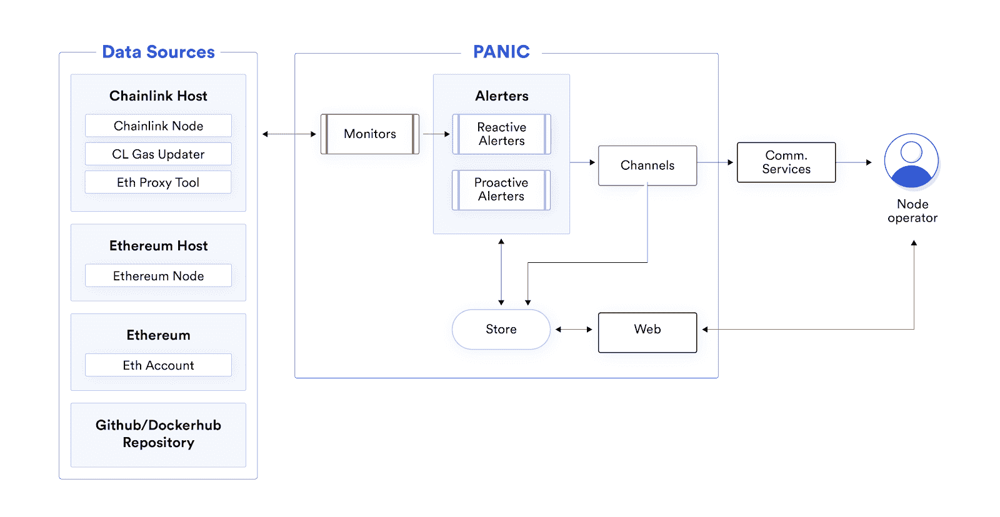

# 只是 VC 收到了 Chainlink 社区赠款

> 原文：<https://blog.chain.link/simply-vc-receives-chainlink-community-grant/>

为了进一步支持 Chainlink 所依赖的更大的区块链生态系统的快速增长，我们最近发布了 [Chainlink 社区资助计划](https://blog.chain.link/introducing-the-chainlink-community-grant-program/)，作为向许多帮助围绕 Chainlink 构建关键系统的开发团队提供重要财政资源的一种方式，以及许多能够轻松访问网络的额外开发人员资源。我们资助计划的目标是将大量财政资源用于创建关键的开发工具、添加更多高质量的数据以及围绕 Chainlink 网络推出关键服务。我们很高兴开始宣布我们的 Chainlink 社区资助奖，并鼓励我们社区中所有有才华的个人开发人员和开发团队在这里向[申请资助计划。](https://chainlinkgrants.typeform.com/to/efEbsq)

我们很高兴地宣布，区块链领先的基础设施提供商和开发团队 Simply VC 被选为 Chainlink 社区资助计划的接受者。简单来说，VC 获得了一笔拨款，用于为 [Chainlink 网络](https://chain.link/)构建其紧急监控和警报系统，因此 Chainlink 节点可以利用该系统作为一种机制来了解各种网络活动的最新情况。PANIC 将为 Chainlink 网络提供的一些关键功能包括:

*   PANIC 将监控大多数典型的 Chainlink 设置，首先包括 Chainlink 节点和工具，但也包括底层系统、以太坊节点和帐户以及存储库。基于来自这些来源的数据，警报将通过各种渠道发送到节点，如电子邮件、Twilio、电报、Slack、Opsgenie 和 Pagerduty。
*   监控数据将与历史和实时警报日志一起存储并呈现在仪表板用户界面中。除此之外，UI 将允许操作员重新配置他们的 PANIC 实例，例如添加或删除节点、添加新通道等等。

PANIC 是一款针对验证机的监控和警报解决方案，可密切关注操作员的设置，并通过多个警报通道快速发送相关警报。PANIC 的主要目的是消除节点操作员对其节点设置状态的盲目性，并使操作员能够及时有效地获得任何可能危及其节点可用性的通知。

PANIC 等监控和警报工具是 Chainlink 网络基础设施的关键部分，因为它们为 Chainlink 节点提供各种实时信息，从而增强其做出及时和明智决策的能力。拥有可靠的自动响应系统可提高 Chainlink 网络的整体安全性，并在出现任何异常情况时快速恢复。这为依赖于 [oracle](https://chain.link/education/blockchain-oracles) 服务的智能合约应用程序带来了更多可用性保证，进一步保护了用户资金。

作为一种开源技术，任何 Chainlink 节点都可以利用它来提高服务的可靠性，Simply VC 的 PANIC system 值得通过社区资助计划进行资助，作为一种增加创新功能的手段，使整个 Chainlink 网络受益。支持优秀的社区资源(如 Simply VC 的 PANIC system)符合社区资助计划的目标，即提供工具和服务，在所有区块链环境中发展 Chainlink 网络、DeFi 生态系统和 [smart contract](https://chain.link/education/smart-contracts) 经济。

“我们很高兴收到 Chainlink 社区赠款，通过我们的开源应急系统为 Chainlink 节点运营商带来额外的安全功能，”Simply VC 首席执行官 Matthew Felice Pace 表示。“Chainlink Community Grant 将允许我们构建一个根据 Chainlink 网络需求定制的监控和警报系统，并通过简单的用户界面和各种流行的警报渠道将数据提供给所有 Chainlink 节点。”

通过 Chainlink 社区资助计划，我们期待继续为越来越多的 Chainlink 生态系统团队提供支持，这些团队正在构建关键工具和基础设施，以加速开发[混合智能合同](https://blog.chain.link/hybrid-smart-contracts-explained/)和安全的 oracle 节点基础设施。我们将继续支持社区，将其作为 Chainlnk 快速增长的关键驱动力，因为只有团结起来，我们才能使混合智能合同成为数字协议的主导形式。

## 关于 Chainlink 资助计划

如果你想了解更多关于资助项目的信息，请查看我们最近的博客文章,它进一步阐述了资助项目的目标和提交标准。如果您想参与 Chainlink Grant 计划，请[在此](https://chainlinkgrants.typeform.com/to/efEbsq)申请。Chainlink 社区赠款以现金和/或 link 形式提供。

### 关于单纯 VC

Simply VC 成立于 2013 年，旨在帮助支持区块链生态系统的发展，并坚信未来的愿景，即分散的组织、货币、经济和网络将成为更好、更平等的社会的支柱。目前，Simply VC 为 15 个以上的区块链基础设施网络运行高度可靠和安全的验证器和节点，还有更多正在开发中。他们还通过开发开源生态系统工具和核心区块链模块，如他们的 PANIC system，为他们支持的网络做出贡献。要了解更多，请访问他们的[网站](https://simply-vc.com.mt/)，在[推特](https://twitter.com/Simply_VC)上关注他们，或者加入他们的[电报](https://twitter.com/Simply_VC)。