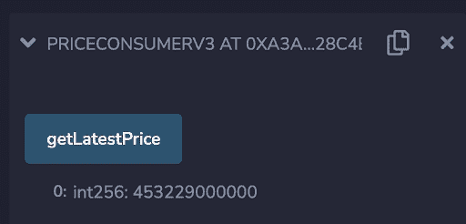

# 如何获取以太坊、比特币和其他加密货币的当前价格

> 原文：<https://blog.chain.link/fetch-current-crypto-price-data-solidity/>

***2021 年 11 月 5 日更新***

将价格数据提取到 Solidity [智能合约](https://chain.link/education/smart-contracts)中是 [DeFi 应用](https://chain.link/education/defi)的常见需求。要获得以太坊、比特币或其他加密货币的当前价格，您可以:

*   使用链接价格源获取价格数据
*   通过 Chainlink oracle 使用外部 API 获取价格数据

在本技术教程中，我们将介绍这两种方法并分享代码示例，以帮助您构建、部署和测试您的智能合约。首先，让我们快速了解一下在将外部输入输入到您的智能合约中时，数据质量和端到端去中心化的重要性。

## 智能合约需要准确可靠的价格

今年，DeFi 协议出现了爆炸性增长，DeFi 协议锁定的总价值(TVL)从 1 月份的 260 亿美元飙升至现在的 1000 多亿美元。这些 DeFi 协议依赖外部价格数据作为其数据源，因为区块链[不能本地访问外部数据](https://blog.chain.link/what-is-the-blockchain-oracle-problem/)。除此之外，这些应用程序需要提供[数据质量保证](https://blog.chain.link/the-importance-of-data-quality-for-defi/)来保护它们的应用程序免受诸如 [price oracle 攻击](https://blog.chain.link/flash-loans-and-the-importance-of-tamper-proof-oracles/)之类的攻击。

[Chainlink Price Feeds](https://feeds.chain.link/) 通过提供来自各种高质量数据提供商的聚合数据来降低这些攻击的风险，这些数据由 Chainlink 网络上的分散 oracles 在链上提供。Chainlink 的分散 oracle 机制可确保最终价格值反映广泛的市场覆盖范围，这意味着最终价格是在汇总整个市场的各种价格后确定的，而不仅仅是一个小的子集，同时还考虑了交易量和流动性等其他方面。

现在，我们已经了解了 Solidity 智能合约中对准确可靠价格数据的需求，以及 Chainlink 价格馈送 oracles 所扮演的重要角色，我们将通过一个示例来了解如何使用 Chainlink 价格馈送来获取 Solidity 智能合约中以太坊的最新价格。以下步骤也适用于比特币和其他加密货币。

## 使用以太坊上的链接价格源

[Chainlink 价格反馈](https://data.chain.link/)使用多个高质量的数据输入，并通过一个分散的 Chainlink oracles 网络将它们聚合起来，这些 oracles 将价格数据反馈到参考合同中，结果在聚合器智能合同中再次聚合，作为最新的可信答案。通过使用由多个节点聚合的多个数据源，我们可以确保我们的价格数据具有最高质量，并且不会受到漏洞利用或 price oracle 攻击。

## 创建智能合同

第一步是[获得 testnet ETH](https://faucets.chain.link/) 以在您的智能合约中用作 gas。一旦你有了一些 ETH，开始建立一个使用 Chainlink 价格馈送的智能合同的最简单的方法是从标准的[价格消费者](https://remix.ethereum.org/#version=soljson-v0.6.7+commit.b8d736ae.js&optimize=false&evmVersion=null&gist=0c5928a00094810d2ba01fd8d1083581)合同开始。这是启动链接价格源请求的基本合同。出于本演示的目的，我们将使用已经在标准价格消费者合同中定义的 [ETH/USD 价格馈送](https://feeds.chain.link/eth-usd)，但是我们将遍历代码的每个部分，以便您理解它是如何工作的。

首先，我们可以看到 [AggregatorV3Interface](https://github.com/smartcontractkit/chainlink/blob/develop/contracts/src/v0.8/interfaces/AggregatorV3Interface.sol) 契约接口被导入。这允许我们的智能合约引用 Kovan testnet 上的链上价格源。然后在局部变量中创建它的一个实例。

```
import "@chainlink/contracts/src/v0.8/interfaces/AggregatorV3Interface.sol";
```

```
AggregatorV3Interface internal priceFeed;
```

接下来，我们可以看到一个[价格反馈参考契约](https://docs.chain.link/docs/ethereum-addresses)在我们的构造函数中被初始化。Kovan Testnet 上的 [ETH/USD](https://kovan.etherscan.io/address/0x9326BFA02ADD2366b30bacB125260Af641031331) 价馈参考合约部署在地址*0x 9326 BFA 02 add 2366 b 30 bacb 125260 af 641031331。*

```
priceFeed = AggregatorV3Interface(0x9326BFA02ADD2366b30bacB125260Af641031331);
```

然后，我们可以看到已经定义了一个函数，用于从上面的构造函数中实例化的价格提要聚合器契约中获取最新价格。为此，定义了一个新函数，它从聚合器代理契约中调用 [latestRoundData](https://docs.chain.link/docs/price-feeds-api-reference#latestrounddata) 函数。这是返回代理契约当前状态的函数，在本例中，我们获取当前价格并将其返回到消费函数中。

```
function getLatestPrice() public view returns (int) {
    (
        uint80 roundID, 
        int price,
        uint startedAt,
        uint timeStamp,
        uint80 answeredInRound
    ) = priceFeed.latestRoundData();
    return price;
}
```

## 部署和测试智能合约

现在我们已经准备好部署和测试我们的契约了。在 Remix 中编译合同，然后在 deployment 选项卡上，将环境更改为“Injected Web3”，并确保下面的 wallet 地址是您的 MetaMask wallet 中包含一些之前获得的 ETH 的地址，按 deploy 按钮，然后按照步骤操作。最终结果是您将智能合约部署到了 Kovan testnet。您应该通过 Remix 控制台中的事务输出注意到部署的契约地址。

部署完成后，我们只需执行“getLatestPrice”函数。结果应该是该函数返回 ETH/USD 代理合约的最新价格，然后可以在我们的智能合约中使用。请注意，我们不需要为请求发送任何链接，我们甚至也不需要花费任何 ETH，该事务是链上 ETH-USD 聚合器合同中数据的纯读取。



<figcaption id="caption-attachment-2849" class="wp-caption-text">ETH/USD Price Feed result.</figcaption>


## 在 Solidity 中获取其他价格数据

Chainlink 价格馈送为顶级 DeFi 价格对提供了大量价格数据。如果您需要在 Solidity smart contract 中获取现有价格源未涵盖的资产的价格数据，例如特定股票的价格，您可以定制 Chainlink oracles 来调用任何外部 API。

使用 Chainlink oracles 获取外部价格数据的最简单方法是从标准 Chainlink [APIConsumer](https://remix.ethereum.org/#url=https://docs.chain.link/samples/APIRequests/APIConsumer.sol) 合同开始。这是一个标准化的合同，用于通过链接 oracle 发起对外部数据的请求。

一旦创建了 APIConsumer 契约，就可以找到想要从中获取价格数据的 API。

一旦有了 API 端点，您只需在契约中设置正确的参数，然后将请求发送给 Chainlink oracle。关于这一点以及如何使用标准 APIConsumer 契约的更多信息可以在 [Chainlink 文档](https://docs.chain.link/docs/make-a-http-get-request)中找到。

请记住，当您进入生产阶段时，您将希望分散这种方法，或者在价格提要本身上获取这种特定的数据。

## 摘要

Chainlink 价格馈送提供了一种可靠的方式来将高质量的比特币、以太坊和其他加密货币价格数据纳入 Solidity 智能合约。除此之外，Chainlink 的 oracle 框架提供了快速、轻松获取股票、商品和其他资产的其他价格数据的灵活性。

如果您是一名开发人员，并希望快速将您的应用程序连接到 Chainlink 价格参考数据，请访问[开发人员文档](https://docs.chain.link/)，并参加 [Discord](https://discordapp.com/invite/aSK4zew) 中的技术讨论。