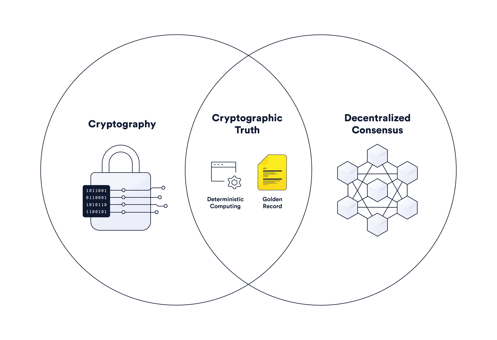
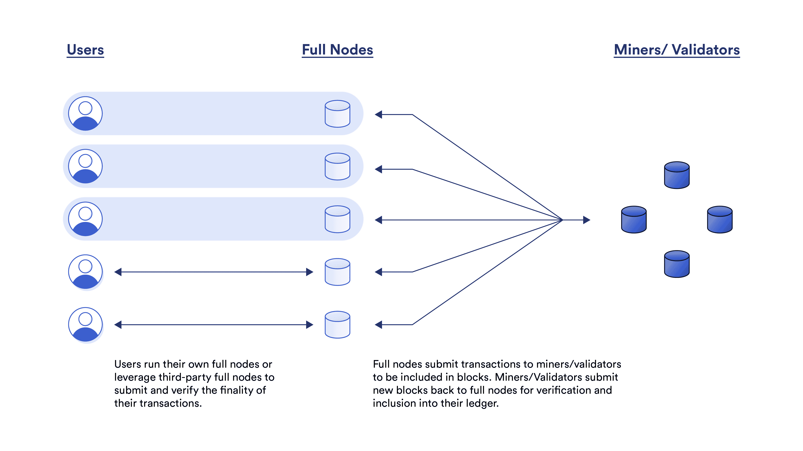
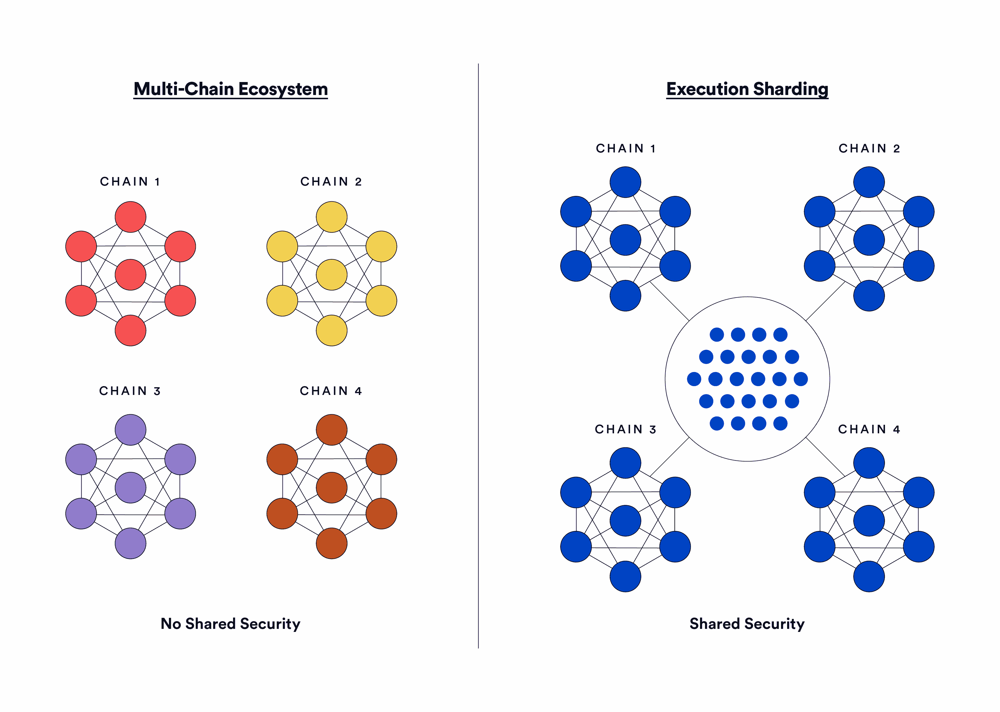
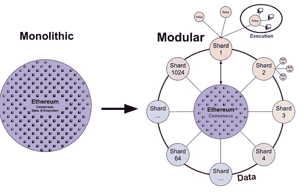
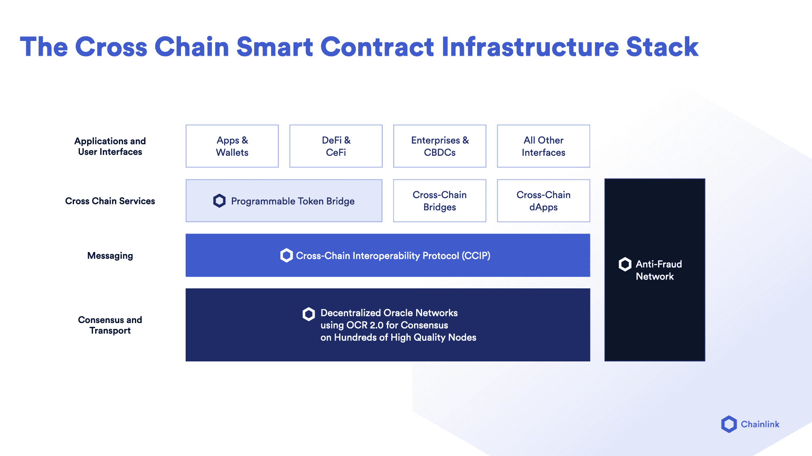

# 区块链可扩展性:执行、存储和共识

> 原文：<https://blog.chain.link/blockchain-scalability-approaches/>

信任最小化是 [区块链科技](https://blog.chain.link/what-is-blockchain/) 独特定位于生成的有价值的安全属性——用基于计算机代码、密码术和分散共识的保证来代替握手、品牌声誉和纸质合同。区块链提供的这些高级保证构成了[密码真实性](https://blog.chain.link/what-is-cryptographic-truth/)的基础。

<figcaption id="caption-attachment-3876" class="wp-caption-text">Cryptographic truth brings trust minimization to backend computing of applications and record keeping.</figcaption>

区块链已经成功地将信任最小化引入到包括货币政策(如比特币)和数字资产交易(如[dex](https://blog.chain.link/dex-decentralized-exchange/))在内的新用例中。然而，区块链在历史上一直在努力为需要与传统计算系统相当的速度和成本的用例保持信任最小化。用户可以通过高交易成本的形式感受到这些可扩展性限制，并导致开发人员怀疑区块链是否能够支持依赖于实时处理数据的高价值用例。

区块链的最终目标是为所有用户和使用案例开启区块链技术，可扩展性作为关键要素在 [智能合同](https://chain.link/education/smart-contracts) 中处于研发前沿，成为金融、供应链、游戏等主要行业的首选后端。以下帖子提供了区块链可扩展性的概述，重点关注区块链与传统计算的不同之处，然后概述了扩展区块链的执行、存储和共识层的不同方法的优势和权衡。

***** ***注意:*** *本博客并未详尽列出区块链可扩展性的每一种方法和各个方面，因为由于区块链研发的前沿性，解决方案不断被研究、测试、部署和更新。T11】*

# **区块链与传统计算**

在讨论如何扩展区块链之前，重要的是先了解为什么区块链计算与传统计算有着根本的不同。一般来说，区块链有价值的原因有三:

*   **确定性计算**—预定义的编码逻辑以非常高的确定性完全按照编写的方式执行。
*   可信中立—没有中央管理员，也没有特殊的网络特权，这意味着任何人都可以提交交易，而不用担心审查或歧视。
*   **最终用户验证**—区块链总账的历史和当前状态以及支撑客户端软件的代码可被世界上的任何人审计。

从更高的技术层面来看，区块链负责管理内部数据分类账，这些数据可以代表资产所有权、合同状态或简单的原始信息。大多数区块链网络由两组重叠但不同的参与者管理:块生产者和完整节点。

块生产者收集用户提交的未确认交易，检查它们的有效性，并将它们放入称为块的数据结构中。区块生产商通常被称为工作证据(PoW)链中的矿工或利益证据(PoS)链中的验证者，PoW 和 PoS 充当 Sybil-resistance 机制，以确保区块链分类账保持活跃并免受审查。

区块生产商提交的区块随后由 [全节点](https://en.bitcoin.it/wiki/Full_node) 接受或拒绝——这些实体独立存储链分类账的完整副本，并不断验证新区块，但不需要参与区块生产。完整节点由大多数大宗商品生产商运营，但也包括最终用户和关键经济参与者，如交易所、RPC 提供商和稳定的硬币发行商。最终，完整节点通过拒绝无效块来保持块生产者诚实，即使在大多数块生产者是恶意的情况下。假设存在足够数量的诚实完整节点，这使得创建无效块浪费时间和金钱。

<figcaption id="caption-attachment-3870" class="wp-caption-text">Users leverage full nodes to submit transactions to blockchains while miners/validators submit blocks to full nodes for validation.</figcaption>

此外，完全节点和块生产者的分离防止了挖掘者/验证者通过任意改变协议的规则来破坏区块链。这是制衡体系的一部分，大宗商品生产商只有权下令交易，但无权决定区块链的规则。规则由完整的节点社区管理，理想情况下，任何人都可以轻松参与其中。要更深入地了解区块链的底层架构，请查看 [【密码真相:信任最小化计算和记录保存的未来】](https://blog.chain.link/what-is-cryptographic-truth/) 。

降低硬件要求对于 [降低运行完整节点](https://vitalik.ca/general/2021/05/23/scaling.html) 的准入门槛至关重要，这是区块链历史上保持分散化的方式，是产生信任最小化的关键组成部分。然而，分散也是通常使区块链变慢的属性，因为网络在大多数情况下只能以最慢节点的速度运行。这种动态由“区块链三难困境”来描述，也称为 [可伸缩性三难困境](https://vitalik.ca/general/2021/04/07/sharding.html)——传统的区块链只能最大化三个属性中的两个:可伸缩性、分散性和安全性。

<figcaption id="caption-attachment-3871" class="wp-caption-text">The blockchain trilemma showcases the tradeoff that has to be made by traditional blockchains when attempting to maximize scalability, security, and decentralization.</figcaption>

传统区块链模型的一个局限性是，实现可扩展性通常需要牺牲去中心化、安全性或两者的某种程度。例如，一个可扩展的分散式网络需要激励大量的积极参与者来实现高安全性。可扩展且安全的网络通常会以分散化为代价来提高运行节点的成本。此外，分散且安全的网络保持了较低的节点需求和较高的攻击成本，但最终会出现可扩展性瓶颈。

与区块链不同，传统计算环境不必担心分散化，因为最大化信任最小化不是它们的主要目标。这就是为什么传统计算网络通常由盈利性公司集中和运营，自然降低了成本并提高了速度，因为网络由单个实体管理，不必围绕最终用户独立验证其计算进行设计。

因此，传统计算环境的信任模型基于品牌和法律契约。相比之下，区块链信任模型依赖于密码学和博弈论，提供独立的可验证性，并且通常支持用户直接参与。传统计算环境的信任模型与区块链网络完全不兼容，因为它们受到诸如外部影响、单点故障和控制以及用户无法审计的过程等瓶颈的制约。

这些动态抓住了区块链可扩展性的本质:区块链如何实现传统计算环境的速度和成本，同时仍然保持强大的安全性和分散性的信任最小化属性？

# **区块链扩展的三个关键属性**

区块链扩展可以分为三大类:执行、存储和共识。下面，我们定义每个属性，看看它寻求解决的核心问题。实际上，缩放一个属性通常依赖于或导致一个或两个其他属性的缩放。

## 区块链执行

区块链执行是执行交易和执行状态变化所需的计算。事务执行包括检查事务的有效性(例如验证签名和令牌余额)以及执行计算状态变化所需的链上逻辑。状态改变是当完整节点更新它们的分类帐副本以反映新的令牌转移、智能合同代码更新和数据存储时。

区块链执行的可伸缩性通常被认为是指每秒的事务数(TPS ),但在更一般的层面上，它指的是每秒的计算次数，因为事务的复杂性和成本可能会有所不同。网络中传输的事务越多，任何时候需要执行的计算就越多。

在扩展执行层时，要解决的主要问题是如何实现每秒更多的计算，而不显著增加验证块中事务的单个完整节点的硬件要求。

## 区块链存储

区块链存储是指全节点的存储需求，维护并存储一份账本。区块链有两种一般的存储形式:

*   **历史数据** 包含所有的原始交易和块数据。交易数据包括每笔交易的起始地址和目的地址、发送金额和签名。块数据包括来自特定块的事务和元数据的列表，例如它的 Merkle 根、nonce、以前的块散列等。历史数据通常不需要快速访问，只需要至少一个诚实的实体提供下载即可。
*   **全局状态** 是智能合约可以读取或写入的所有数据的快照，例如所有智能合约中的账户余额和变量。全局状态通常可以被认为是区块链的数据库，需要它来验证传入的事务。状态通常存储在树形结构(例如 Merkle 树)中，在这种结构中，一个完整的节点可以方便快捷地进行访问和修改。

完整节点需要访问历史数据，以便首次同步到区块链和全局状态，从而验证新数据块并执行新的状态更改。随着分类帐和相关存储的增长，状态的计算变得更慢和更昂贵，因为节点需要更多的时间和计算来读取和写入状态。如果节点的内存存储变满，它将需要使用磁盘空间存储，这将进一步降低计算速度，因为节点需要在执行期间在存储环境之间交换。

存储需求不断增加的区块链经常会遇到状态膨胀的情况，在这种情况下，如果没有硬件升级，完整节点将更难与当前版本的分类帐(即链端)保持同步，用户也更难同步新的完整节点。可能影响区块链是否经历状态膨胀的一些因素包括分类帐的历史长度、新块添加的频率、每个块的最大大小，以及必须存储在链上以验证交易和执行状态改变的数据量。

在扩展存储层时，要解决的主要问题是如何在不增加满节点存储需求的情况下，允许区块链处理和验证更多的数据；也就是说，在不改变区块链信任假设的情况下，数据可以长期存储在哪里？

## 区块链共识

区块链共识(Blockchain consensus)是一种分散网络中的节点就区块链的当前状态达成一致的方法。共识主要关注的是在恶意行为者达到一定门槛时实现诚实的多数，并达成最终结果；即交易被准确地处理并且极不可能被撤销。区块链共识通常围绕最小化通信开销来设计，以便增加去中心化的上限，从而实现更强的拜占庭容错，并降低终结时间，从而实现更快的结算。

在缩放共识层时， 要解决的主要问题是如何更快、更便宜、更信任最小化地达成最终结果——所有这些都以可预测、稳定和准确的方式进行。

# **缩放执行层**

以下是目前用于扩展区块链执行层的五种不同方法，以及每种方法的优缺点。在实践中，这些方法中的一些被组合以获得更大的执行能力。

## 验证器硬件要求的垂直缩放

区块链执行可以通过提高对区块生产者的硬件要求来实现规模化。更高的硬件要求导致每个验证器每秒能够执行更多的计算。

**优势:** 拥有一个由高计算能力验证器组成的单一分散网络，可以实现区块链，支持更大的块、更快的块时间和更低的交易成本，同时仍然保持智能合约之间的链上可组合性，以及比传统计算模型潜在更高的信任最小化。这种区块链对于高频交易、游戏和其他对延迟敏感的用例尤其有用。

**权衡:** 考虑到运行验证器或完整节点的较高成本，验证器的垂直扩展将限制网络分散。节点成本通常会随着时间的推移而增加，这使得大多数用户很难参与其中。剩余的分散将变得依赖于 [摩尔定律](https://en.wikipedia.org/wiki/Moore%27s_law) ，该定律指出，微芯片上的晶体管数量每两年翻一番，而计算机的成本减半。更高的全节点成本也会增加希望直接验证链上发生的活动的最终用户的成本，降低信任最小化。

## 通过多链生态系统进行水平扩展

垂直扩展的替代方案是通过在单个生态系统中使用多个独立的区块链或侧链进行水平扩展。水平扩展将生态系统中的事务计算分散到许多独立的区块链中，每个链都有自己的块生成器和执行能力。

**优势:** 多链生态系统使每个单独链的执行层具有完全可定制的功能，如节点硬件要求、隐私功能、gas 令牌使用、虚拟机(VM)选择、权限设置等。这种设计就是为什么多链生态系统有时会产生 dApp 链，其中单个区块链专门支持单个 dApp 或小群 dApp。自主区块链还有助于隔离安全风险，一个链的安全设计选择并不总是影响生态系统中的其他链。

**权衡:** 多链生态系统要求每个区块链通过以膨胀方式发行的本地令牌来引导其自身的安全。尽管这是区块链早期增长阶段的标准，但事实可能会证明，要转向一个稀释性更小、更可持续的基于连锁用户付费的经济模式是困难的，因为用户付费将被分散到许多独立的区块链。还有可组合性的挑战，因为想要互操作的 dApps 和令牌并不总是存在于同一个区块链上。

## 通过执行分片进行水平缩放

一种类似但独特的多链扩展方法是使用单个区块链支持跨许多不同碎片的并行执行。每个碎片本质上充当自己的区块链，这意味着许多区块链可以并行执行。还有一个主链，它的唯一目的是保持所有碎片同步。

在执行分片中，有一个验证器池，它被分割成多个分片来执行事务。节点是随机和定期轮换的，因此它们不会总是执行/验证同一个碎片，碎片的数量被配置为使破坏任何单个碎片的风险在统计上不显著。

**优点:** 所有的执行碎片都来自同一个节点池，因此不需要在新的碎片上引导安全性。假设有一个大型节点池，每个执行环境都可以达到相同的安全级别。执行分片也不需要提高对节点的硬件要求，因为节点一次只在一个分片上执行。碎片还可以在相同的虚拟机上运行，或者使用不同的配置来满足特定用例的独特需求。

**权衡:** 考虑到所有节点必须能够支持每个分片的计算，每个分片的灵活性有限。由于主链上不断增加的计算需求和每个分片节点太少的风险，一个区块链可以支持的分片数量通常也是有限的。此外，当涉及到负载平衡和实现风险时，会有摩擦，因为共享的安全模型意味着所有的碎片都可能受到相同的漏洞的影响。

<figcaption id="caption-attachment-3872" class="wp-caption-text">Multi-chain ecosystems generally do not share security across blockchains while execution sharding distributes security across shards from one pool of node operators.</figcaption>

## 通过模块化实现水平扩展

水平扩展的另一种方法是 [模块化区块链](https://polynya.medium.com/rollups-data-availability-layers-modular-blockchains-introductory-meta-post-5a1e7a60119d) ，其中区块链的架构被分成多个不同的层；即隔离执行、数据可用性(DA)和共识组件。模块化区块链实现中最流行的执行方式是通过 [汇总](https://vitalik.ca/general/2021/01/05/rollup.html) ，将计算和状态从链外移动到链外网络，同时将事务数据存储在链上。然后，使用零知识证明(ZK-roll up)在链上主动证明链外计算的状态变化是有效的，或者使用欺诈证明(乐观 roll up)追溯证明是无效的。

**优势:** 模块化区块链将交易执行和状态卸载到更便宜、更精简、更高吞吐量的计算环境中，同时仍然继承用于结算的底层区块链的安全性。这是因为一致性过程(其中由执行层执行的链外计算的有效性被验证)是由现有的分散式基础层(即 L1)区块链执行的。直观地说，这意味着可以更有效地利用基础层区块链的计算带宽，因为完整节点不需要执行每个事务。全节点只需要验证简洁的证明，存储少量的交易数据。

汇总还可以支持用于信任最小化的逸出舱口；即，如果汇总网络不能正常工作，用户可以撤销他们的密码并将其提交给基础层区块链。许多模块化网络也可以分摊用户成本；即，在基础层区块链上验证 zk-rollup 的证据有固定成本，这意味着共识成本可以随着使用的增加而降低，因为它们在大量用户之间共享。此外，rollups 具有 1-of-n 信任模型——只需要一个诚实的节点来确保计算的正确性和活性。

**权衡:** 模块化区块链可能不像侧链或独立链那样快速或廉价，因为大多数方法利用了基础层区块链有限且有时昂贵的安全块空间。模块化网络的当前方法还通常具有需要治理干预的可升级性风险(在不可变的规定汇总之外),并且如果一些 dApps 保持在基础层区块链上，而其他 dApps 跨不同的链外执行层运行，则可能导致流动性碎片和可组合性挑战。最后，与推出新的独立区块链相比，实施汇总或其他模块化区块链设计是一个更新、更复杂的过程。

<figcaption id="caption-attachment-3873" class="wp-caption-text">A proposed way to scale Ethereum is modular blockchains, separating the execution, data availability, and consensus layers ([source](https://coinyuppie.com/read-the-ethereum-era-of-modularity-in-one-article/)).</figcaption>

## 支付和状态通道

通过允许用户将加密货币锁定到与其他方的 multisig 智能合同中，然后在链外交换代表资产所有权转移和/或状态变化的签名消息，而无需进行任何链上交易，支付和状态通道可用于区块链扩展。用户只需要在开通频道和关闭频道时进行链上交易。

multisig 合同用于确保渠道的正确结算，方法是让用户对每次交互进行加密签名，每个签名都附有一个随机数，因此智能合同可以验证交易的正确顺序。

**优势:** 支付和国家渠道允许加密货币的转移以零成本和近乎即时的延迟实时发生。支付渠道使得小额支付成为可能，而这在底层区块链上通常是不可能的。如果双方合作，它们还允许锁定在渠道中的加密货币在链上迅速结算。

**权衡:** 国家/支付渠道要求渠道的每个参与方连接到互联网，以确保他们的交易对手不会试图使用旧消息在链上结算渠道。这通常需要使用了望塔来持续监控渠道和保护用户资金。支付渠道还需要预先注入流动性，这可能导致大额支付困难，并导致资本效率低下。

在渠道网络中高效地路由支付是一个 [难题](https://en.wikipedia.org/wiki/Travelling_salesman_problem) 这可能会导致转账失败或创建一个更集中的轴辐式模型，以确保参与者获得足够的流动性和短路线。一般来说， 国家/支付渠道在一组已知的静态参与者之间工作得最好，但在一组动态或无限的参与者之间工作得不好。还有一个所有权问题，通道很难或者通常不可能表示没有明确逻辑所有者的对象(例如，DEX 流动性池)。

# **缩放数据存储**

以下是目前用于扩展区块链存储层的六种不同方法。在实践中，这些方法中的一些被结合起来以获得更大的存储改进。

## 区块链节点的垂直扩展

与区块链执行的垂直扩展类似，区块链存储的垂直扩展涉及提高运行完整节点的硬件要求。

**优势:** 满节点存储限制较高的区块链可以提供大量廉价存储；即，完整的节点可以存储更多的历史数据和更大量的状态。如果没有额外的存储层或外部依赖性，直接全节点存储可以更轻松地访问链上数据。

**权衡:** 随着时间的推移，要存储的数据越来越多，随着运行完整节点的成本增加，区块链的分散化变得越来越危险。随着分散的减少，可以向用户提供的关于数据将是可用的和正确的信任最小化的保证越少。随着时间的推移，状态膨胀还会导致块的执行速度变慢，增加整个网络的压力。

## 第一层区块链上的数据分片

扩展区块链数据存储的另一种方法是 [数据分片](https://vitalik.ca/general/2021/04/07/sharding.html) 。数据分片将分类帐和/或用于重新创建分类帐的数据的存储拆分到多个分片上，从而在任何给定时间将单个节点的存储需求减少到单个分片或一小组分片。

**优势:** 数据分片使区块链能够在不增加单个节点硬件要求的情况下，以更低的成本增加存储数据的能力。这种方法有利于保持去中心化，因为它增加了用户运行他们自己的节点的能力。数据分片还为在基础层区块链上存储事务数据的汇总提供了更大的存储容量，这是重建汇总状态的一项要求。此外，Danksharding 等方法允许合并收费市场，以实现更好的负载平衡和数据包含。

**权衡:** 由于主链负载增加，一个区块链可以支持的碎片数量可能会有限制。还需要 [数据可用性采样](https://hackmd.io/@vbuterin/sharding_proposal) (DAS)，其证明重建部分分类帐所需的历史数据在某一点(即当产生块时)是可用的，而节点实际上不必自己下载所有数据。此外，当将节点轮换到不同的分片时，数据分片需要通信开销来在节点之间传递存储。它还需要大量的节点来维护高安全性——每个碎片必须有一定程度的分散，因此节点的总池需要很大，因为它分散在所有碎片中。

## 采用模块化区块链的压缩链上数据存储

模块化区块链离线执行计算，然后在线或离线存储交易数据或状态差异。该数据允许其他节点或用户重建分类帐的当前或历史状态。当汇总采用链上数据存储时，事务数据通常在链上存储之前被离线压缩。

**优势:** 压缩链上数据存储是模块化区块链最安全的数据存储形式，因为数据是由网络上的所有完整节点存储的。它还降低了在第一层区块链上存储数据的成本。当与数据分片结合使用时，rollups 可以访问更高效、更便宜的事务数据链上存储环境，该环境可以随着使用量的增加而更好地扩展。

**权衡:** 链上存储的可用性比链下存储更昂贵，这可能会抑制模块化区块链匹配分散性较低的存储选项的可扩展性的能力。压缩数据还可能会丢弃验证不严格要求的部分数据，这可能会抑制基于该数据对链活动进行更精细的分析。

## 模块化区块链设计中的链外数据存储

模块化区块链可以离线存储交易数据，以进一步降低在线存储需求。这包括“验证”，它在链上发布零知识证明，同时在链外存储数据。模块化区块链有四种主要的离线数据存储方法:

*   **集中存储** 由集中平台上的链外存储组成。虽然这是最便宜的数据存储方式，但它可能会受到数据扣留和安全问题的影响，如集中式存储平台修改数据或离线。
*   **许可的 DAC**离线存储数据，但使用来自可信节点的小型委员会(称为数据可用性委员会(DAC ))的签名方案提供数据被正确发布的链上证明。优势和权衡类似于集中式存储解决方案，但在可用性方面有更好的信任假设。
*   **无权限 DAC**存储链外数据，但使用无权限 DAC 提供链上证据，并以加密经济激励诚实行事。免许可 DAC 比链上存储解决方案更便宜，但比其他链外解决方案更安全。权衡的结果是，这仍然不如链上存储安全，并且还没有在可持续经济的规模生产中实现。
*   **意志** 使用户能够选择是将他们的交易数据存储在链上还是链下。意志是新颖的，因为它们在单个事务级别启用数据可用性解决方案选项，同时允许所有事务共享相同的状态根和共识成本。然而，这种方法比上面列出的其他方法更复杂，并且还没有在生产中实现。

## 数据修剪

[数据修剪](https://eips.ethereum.org/EIPS/eip-4444)是一种使区块链全节点能够丢弃超过特定块高度的历史数据的技术。数据修剪通常与证据检验检查点结合使用，在这种情况下，检查点之外的块中的事务被视为最终事务；也就是说，如果没有主要的社会共识或硬分叉，它们是无法逆转的。

**优点:** 数据修剪减少了节点在参与共识时需要存储或引用的数据量——由于历史数据已经过验证，所以分类帐更小，因此被修剪是安全的。因为历史数据已经过验证，如果操作完整节点的目的只是为了验证未来的数据块，而不是提供历史回顾，则不再需要历史数据。

**权衡:** 数据修剪依靠第三方(例如，交换、块探索者等)来永久存储历史数据，以便将状态重建回起源块。然而，这是一个 1/n 的信任模型，因此只有一个第三方需要诚实地存储数据，以便整个节点能够重新创建所有历史状态。有了股权证明提供的关卡和的弱主观性，这个假设就变得不那么相关了。然而，这样的数据对于链上分析和块探索者仍然很重要。

## 无国籍、状态终止和状态租金

还存在集中于限制完整节点必须存储的状态数量的方法，特别是通过状态期满、、或状态租用实现。

*   **状态过期** 设计允许节点删除在一定时间内未被访问的状态，但如果需要，利用一种 merkle 证明(称为“见证”)来恢复过期状态。
*   **无状态** 设计是指完全节点不需要存储状态。完整节点只需要验证包含见证的新数据块。弱无状态是指只有块生产者需要存储全局状态，而所有其他节点可以验证块而不存储状态。
*   国家租金 设计要求用户付费来维持有限的国家存储。不再付费的状态被回收并出租给新用户。

**优点:** 限制状态存储需求的方法最终有助于限制单个节点必须存储的状态数量。这有助于减轻状态膨胀，即使在不断增长的分类帐或不断增加的链上事务中。限制状态存储对于维持长期的最终用户验证，同时仍然维持实际的硬件需求是至关重要的。

**权衡:** 限制状态存储是一种相当新颖的方法，它消除了用户支付一次性费用让网络中每个完整节点永久存储其状态的想法——这与区块链今天处理状态的方式形成鲜明对比。此外，将使用传统状态存储模型的区块链升级到更受限的状态存储模型是困难的，并且可能会破坏在开发期间做出关于状态总是可访问的特定假设的应用程序。新的状态存储模型也可能使特定的应用程序比以前更加昂贵。

# **缩放共识**

下面是在尝试扩展区块链共识机制时的四个一般目标，它们涉及更频繁的阻塞时间、更快的终结以及针对停机时间或恶意攻击的增强的健壮性。请注意，达成共识不仅关乎速度，还关乎准确性、稳定性和安全性。

## 提高执行和存储能力

扩展区块链共识机制的一个基本组成部分是增加其计算和存储容量，而不显著提高完整节点的硬件要求。这将允许更多的节点参与共识，或者至少防止现有节点随着分类帐的增长而脱离网络——有助于在正常运行时间、审查阻力、准确性和安全性方面保持强有力的共识保证。如果执行和存储容量提高到一个显著的水平，而不会对完整节点产生有意义的影响，区块链甚至能够以稳定的方式支持更快的数据块时间和/或更大的数据块大小，而不会牺牲其分散化的核心属性。

## 降低网络带宽

另一种扩展区块链共识机制的方法是减少网络带宽；即为了达成一致，在全部节点之间所需的通信开销(发送和接收消息)。区块链共识不是要求节点能够在所有其它节点之间通信(即，全对全投票)，而是可以设计成使得节点在任何时刻只需要与一小部分其它节点通信(例如，子采样)。一些共识设计不使用多轮投票或通信方案，因此所需的唯一通信是块的传播，但这通常以概率终结性为代价。

## 增加网络延迟

也有一些方法致力于在达成共识的过程中减少网络延迟，特别是当它涉及到缩短结束时间时。一些区块链共识机制通过多轮子抽样或全体对全体投票轮数具有即时终结性。其他区块链在一段时间后实现由验证者的绝对多数共识保护的检查点，这意味着块被认为是通过检查点的最终块，因为在它之外不再有协议内重组。通常必须在网络延迟和网络带宽之间进行权衡，尽管一些混合方法已经针对这两者进行了优化。

## 增加安全预算

共识的信任最小化也可以通过增加资助参与共识的节点的安全预算来缩放。这通常是通过实现货币溢价、具有通货膨胀的象征性奖励和/或由于块空间的需求超过供应而增加交易费收入来实现的。更高的安全预算为参与者打开了更多的潜在收入，这可能会增加网络的分散性，因为更多的节点被激励加入。区块链还可以要求节点提供更多的股份或计算能力来参与共识，尽管如果要求太高，这有增加网络集中化的风险。

# **可扩展且安全的跨链未来**

区块链的可扩展性正处于其发展的激动人心的时刻，大量正在构建、测试和投入生产的解决方案证明了这一点。凭借在保持信任最小化的同时对扩展的强烈关注，区块链准备巩固自己作为各种行业和用例的首选后端的地位。

为了支持不断扩大的多链生态系统，跨链互操作性协议(CCIP)正在 Chainlink 之上积极开发，以使用户能够基于用户定义的逻辑在不同的区块链之间安全地交换数据和令牌。正如反欺诈网络的发展所证明的那样，CCIP 的建设非常注重安全性，以不破坏区块链信任假设的方式实现跨链智能合同和安全令牌桥接。更多 CCIP 资讯，请查看: [与 CCIP](https://blog.chain.link/unlocking-cross-chain-smart-contract-innovation-with-ccip/) 解锁跨链智能合约创新。

<figcaption id="caption-attachment-3874" class="wp-caption-text">The proposed architecture of CCIP</figcaption>

要了解更多关于 Chainlink 的信息，请访问 [Chainlink 网站](https://chain.link/) 并关注官方[Chainlink Twitter](https://twitter.com/chainlink)以了解最新的 chain link 新闻和公告。