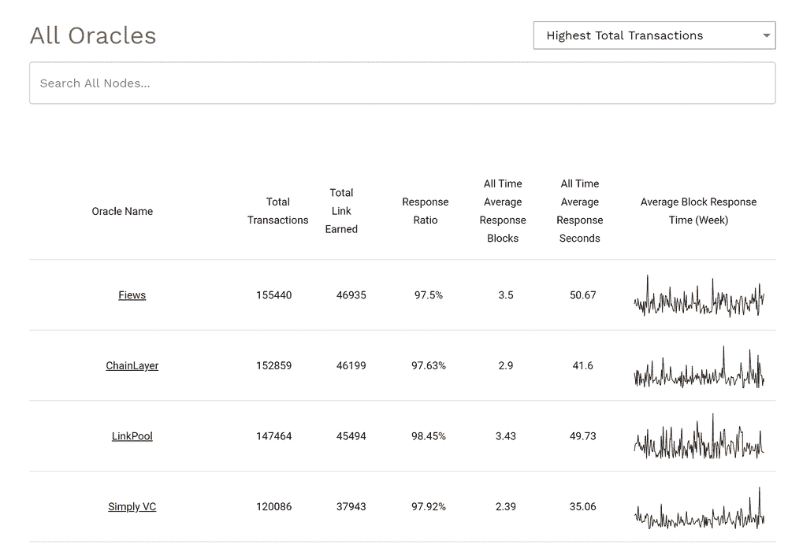

# 安全数据链接获得 Chainlink 社区资助

> 原文：<https://blog.chain.link/secure-data-links-awarded-chainlink-community-grant/>

为了进一步支持 Chainlink 生态系统的快速增长，我们最近发布了 [Chainlink 社区资助计划](https://blog.chain.link/introducing-the-chainlink-community-grant-program/)，作为一种为许多开发 Chainlink 的开发团队提供重要财政资源的方式，以及许多能够轻松访问网络的额外开发人员资源。我们资助计划的目标是部署大量的财政资源，用于创建关键的开发工具、添加更多高质量的数据以及围绕 Chainlink 网络推出关键服务。我们很高兴开始宣布我们的 Chainlink 社区资助奖，并鼓励我们社区中所有有才华的个人开发人员和开发团队在这里向[申请资助计划。](https://chainlinkgrants.typeform.com/to/efEbsq)

我们很高兴地宣布，Chainlink 网络产品和服务的领先提供商 [Secure Data Links](https://www.securedatalinks.com/) 被选为 Chainlink 社区资助计划的接受者。Secure Data Links 获得了一笔赠款，用于为 Chainlink 生态系统创建一个更高级的 oracle explorer，作为其名为[Chainlink oracle Reputation(COR)——](https://reputation.link/)的第三方信誉系统的一部分，这是一个数据可视化工具，显示 Chainlink Oracle 报告的端到端生命周期，特别侧重于提供关于 API 提供商、Oracle、Chainlink 参考数据契约以及各种以太坊智能契约如何与 chain link 网络交互的清晰见解。

类似于今天 Etherscan 探索以太坊合约的工作方式，COR 是一个区块链不可知的智能合约和 oracle explorer，允许用户了解 Chainlink [oracle](https://chain.link/education/blockchain-oracles) 网络的细节以及它们与依赖它们的各种智能合约的交互。有了这笔赠款，COR 将扩展其可视化功能，使用户能够识别哪些 oracle 网络使用哪些合同、高级网络性能详细信息、单个 oracle 性能详细信息以及各种其他独特的数据点，从而提高生态系统识别关键连接的能力。

COR 向用户提供关于 [Chainlink 网络](https://chain.link/)的原始数据和精确统计数据，以及关于每个 oracle 节点的特定数据，其中包括:

*   事务计数(生存期、一年、一个月)
*   以块为单位的平均响应时间
*   平均响应时间(秒)
*   链接获得的付款
*   完成比率(成功/失败的交易)
*   还有更多

<figcaption id="caption-attachment-644" class="wp-caption-text">Chainlink oracle nodes on reputation.link can be compared against one another using on-chain data</figcaption>

鉴于以太扫描对以太坊的重要性，我们认为 COR 是扩展 Chainlink 网络的重要组成部分，值得 Chainlink 社区资助。由于这笔拨款，COR 的一些预期改进包括:

*   开发一个实时 oracle 资源管理器，用于管理 Chainlink 节点、Chainlink oracle 网络以及用户合同与这些 oracle 的交互
*   提醒用户他们选择的 oracle 网络运行正常
*   一个免费的 API，用于连接信誉链接的数据及其相关服务
*   对新的 [oracle networks](https://blog.chain.link/what-is-the-blockchain-oracle-problem/) 或区块链的额外网络支持
*   使用实时数据跟踪和分析深入的链接网络统计数据

此外，reputation.link 将寻求利用这笔赠款将其分析扩展到众多其他区块链环境，本地集成 Chainlink 网络，提供对其他各种区块链网络上 Chainlink 特定交易的见解。

COR 的联合创始人 Patrick McNab 表示:“我们很高兴获得 Chainlink 社区资助，并很高兴采取下一步措施来提高网络内交易的透明度。“DeFi 每月锁定的数十亿美元表明 oracle 安全性至关重要。现在，向由 Chainlink 提供支持的应用程序的开发者和用户提供见解比以往任何时候都更加重要。Chainlink 社区授权将允许[reputation . link](https://slack-redir.net/link?url=http%3A%2F%2Freputation.link)扩展并提高其捕获和显示所有与 Chainlink 相关的信息的能力，包括访问更多实时信息、扩展到其他区块链、在特定网络活动发生时提供用户警报等。”

通过 Chainlink 社区资助计划，我们期待继续为越来越多的 Chainlink 生态系统团队提供支持，这些团队正在构建关键工具和基础设施，以加速通用智能合同和安全 oracle 节点基础设施的开发。我们将继续支持社区，将其作为 Chainlnk 快速增长的关键驱动力，因为只有团结起来，我们才能让普遍连接的智能合同成为数字协议的主导形式。

## 关于 Chainlink 资助计划

如果你想了解更多关于资助项目的信息，请查看我们最近的博客文章,它进一步阐述了资助项目的目标和提交标准。如果您想参与 Chainlink Grant 计划，请[在此](https://chainlinkgrants.typeform.com/to/efEbsq)申请。Chainlink 社区赠款以现金和/或 link 的形式提供。

### 关于安全数据链接

Secure Data Links 是一家基础设施公司，运营和管理高正常运行时间 Chainlink & Ethereum 节点。SDL 专注于为区块链网络，特别是以太坊提供高质量、可靠的数据。 [Secure Data Links oracle](https://www.reputation.link/oracle/0x2ed7e9fcd3c0568dc6167f0b8aee06a02cd9ebd8) 是 Chainlink 网络上性能最好的 oracle 之一，由于为最高数量的参考数据合同之一提供服务的高正常运行时间&，它保持了较高的作业完成率。