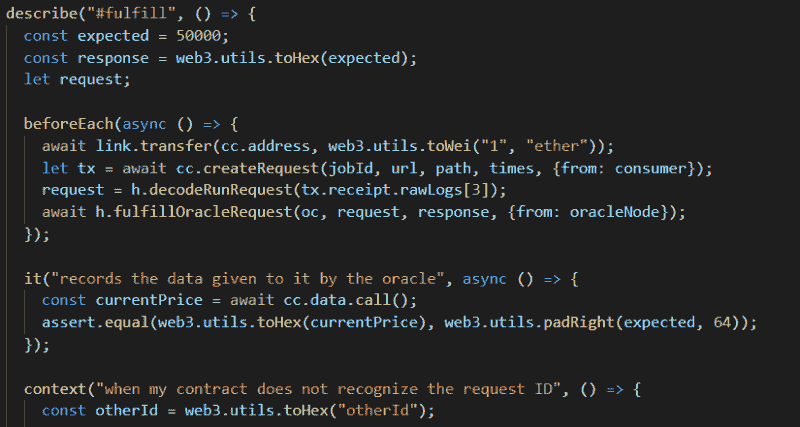

# 如何使用松露链节

> 原文：<https://blog.chain.link/how-to-use-chainlink-with-truffle-2/>

在使用 [Chainlink](https://chain.link/) 时，强大的开发环境对于确保您的[智能合约](https://chain.link/education/smart-contracts)在链上成功且安全地部署至关重要。 [Truffle](https://truffleframework.com/) 的目标正是如此，提供一个易于使用的 dApp 框架来帮助你的开发者生活变得更加易于管理。

使用松露很简单，这要感谢 [*松露盒*](https://truffleframework.com/boxes) 功能，它允许你直接从你的终端下载样本 dApp 样板文件。为了帮助你开始，我们为你准备了一个链式松露盒。里面是一个名为“MyContract”的链式智能合同示例以及一个预先制作的测试套件。要获得它，打开你选择的终端并安装松露。

*npm 安装 truffle -g*

接下来，创建一个新目录，并通过以下命令获取该框:

*mkdir chain link*
*CD chain link*
*松露拆箱 smartcontractkit/box*

成功取消装箱后，您会注意到添加了一些新目录。这些包含有用的样板代码和模块，帮助您开始使用链式智能合约。出于本文的目的，我们将关注的智能合同是“MyContract ”,它可以在 *contracts* 目录下找到。这包含了一些基本的链接功能，帮助我们更好地理解链接合同是如何工作的。

### **测试**

首先，测试您的契约以确保正确的功能总是一个好主意。您可以通过以下命令来实现:

*npm 测试*

这将在我们的样本契约上运行各种测试用例，例如创建带有和不带有链接令牌的请求，将这些请求发送到 oracle 契约地址，以及测试契约所有权。

***注意:**在处理各种链接令牌契约时，您可能会遇到一些编译警告。这是因为我们使用的是 Solidity 编译器的更新版本，而不是最初创建这些合同时使用的版本。因此，可以忽略这些警告。链接令牌已经部署，我们只是让这些合同可用于本地测试。*

值得注意的是，在每个测试运行之后，我们重新部署每个契约。这允许我们进行真正的单元测试，因为我们不希望我们的测试依赖于其他测试的输出。此外，重新部署每个契约需要时间，但这只是出于测试目的，并不影响我们的实际性能运行时间。

现在让我们更详细地查看“MyContract”的这些测试用例，您可以在 *test/MyContract_test.js.* 下找到这些测试用例。如果您以前使用过 Mocha.js 进行测试，您会注意到语法很熟悉。Truffle 基于 Mocha 测试框架，具有处理智能合约的附加功能。让我们回顾一下这些新功能。

<figcaption>Defining the variables to be used for MyContract. In particular, the jobId value used for MyContract is never actually validated and is strictly a placeholder for demonstration purposes. If you would like to use actual jobId values, you can find them [here](https://docs.chain.link/docs/addresses-and-job-specs) </figcaption>

*contract()* 函数的行为类似于摩卡的 *describe()* ，但是它结合了松露的[洁净室特性](https://truffleframework.com/docs/truffle/testing/testing-your-contracts#clean-room-environment)。从[松露文档](https://truffleframework.com/docs/truffle/testing/writing-tests-in-javascript)来看，它是这样工作的:

*   在每个 *contract()* 函数运行之前，您的契约被重新部署到正在运行的 Ethereum 客户端，以便其中的测试以干净的契约状态运行。
*   *contract()* 函数提供了您的以太坊客户端提供的帐户列表，您可以用它来编写测试。

此外，我们的示例“MyContract”需要来自其他智能合约的工件。为此，我们将利用 *artifacts.require()* 方法，该方法本质上是将特定智能合约的工件作为合约抽象导入。这些数据被存储为一个 JSON blob， [Truffle 可以与](https://github.com/trufflesuite/truffle-contract#usage)一起工作，并且可以很容易地在 *build/contracts/下查看。*在这里阅读更多关于 *artifacts.require()* 如何工作[的信息。](https://truffleframework.com/docs/truffle/testing/writing-tests-in-javascript)

<figcaption>Testing contract fulfillment requirements</figcaption>

我们的助手契约现在被存储为常量引用，我们现在可以开始创建测试用例了。为此，我们需要正确理解关键的测试方法，如 *describe()、beforeEach()、it()、*和 *context()。*

*   允许我们将测试用例分组在一起。它有两个参数，第一个是测试组名称的字符串，第二个是回调函数。您会注意到，在我们的代码示例中，所涉及的测试用例包括创建请求、完成请求、取消请求和撤销链接。
*   *beforeEach()* 在其块范围内的每个单独测试之前运行。对于许多测试来说，在我们运行测试用例之前，某些动作必须首先发生(比如等待链接的转移)。
*   *it()* 用于一个单独的测试用例。这些用于在不同的状态下测试我们的合同，并且应该清楚地表明他们试图完成什么。您会注意到，当我们运行 *npm 测试*时，每个 *it()函数的*参数中的字符串被输出为日志，帮助我们清楚地看到我们的测试时间表。
*   *context()* 是 *describe()* 的别名，但意在用于合同执行的更具体的状态。简而言之，它提供了另一种使测试更容易阅读和更有组织的方法。

### **最终想法**

Truffle 提供了一个强大的工具箱，帮助确保您的链式智能合约按预期工作。多亏了它基于流行的、文档完善的 Mocha.js 的世界一流的测试框架，许多开发人员会发现与它一起工作是友好和熟悉的，有助于您立即投入工作。有了块菌盒子，dApp 公司能够很容易地为他们的开发者伙伴提供有用的例子，帮助发展区块链生态系统。我们 Chainlink 计划在不久的将来为您提供更多的 chain link 智能合约。敬请关注。

如果你想了解更多关于如何在 Chainlink 上开发的信息，请访问[开发者文档](https://docs.chain.link/)或者加入关于[不和谐](https://discordapp.com/invite/aSK4zew)的技术讨论。