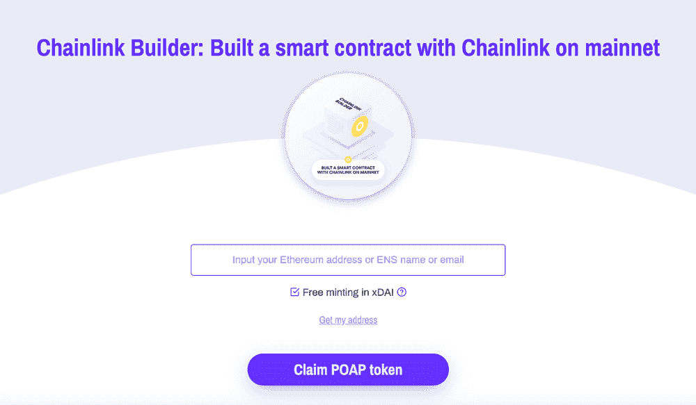
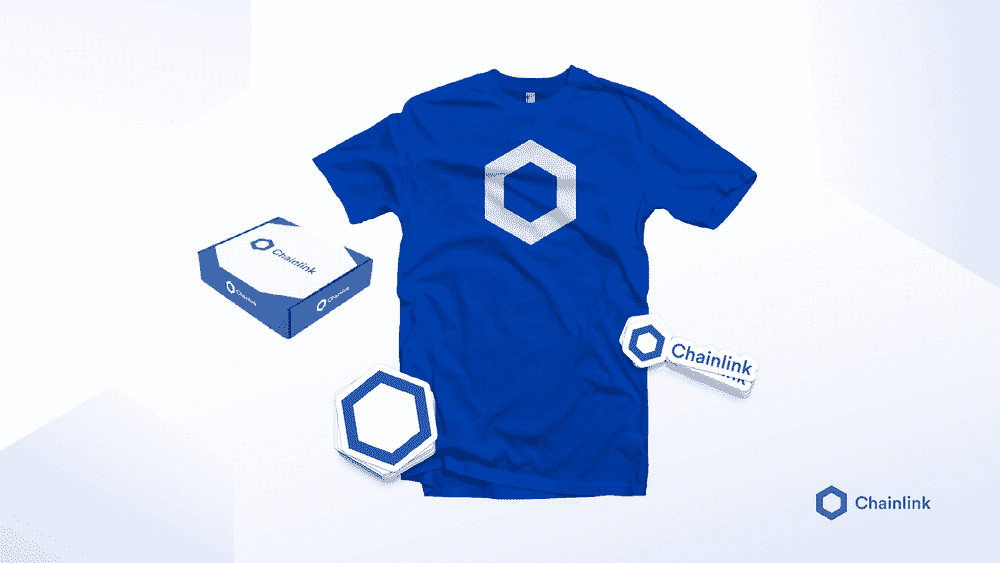
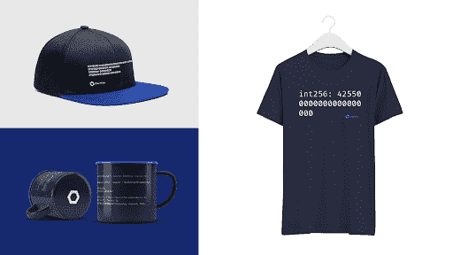

# 宣布链环制造商计划

> 原文：<https://blog.chain.link/announcing-the-chainlink-builders-program/>

更新:链环制造商计划已经结束。查看 [Chainlink 开发者专家计划](https://chain.link/developers/experts)，了解如何支持 Chainlink 生态系统并获得 Chainlink 活动和机会的独家访问权。

我们要感谢我们充满激情的开发者社区，他们为扩展和加强 Chainlink 网络付出了惊人的努力。Chainlink 是最广泛使用的[区块链甲骨文](https://chain.link/education/blockchain-oracles)因为你努力建立分散的网络。我们人才济济的社区是帮助开发基础设施、[用例](https://blog.chain.link/44-ways-to-enhance-your-smart-contract-with-chainlink/)和文档的关键，使[智能合同](https://chain.link/education/smart-contracts)成为数字协议的主导形式。正因为如此，我们宣布了 Chainlink Builders 计划，以表彰和感谢 Chainlink 社区中的开发者构建、记录和帮助他人。

建设者计划有三层徽章，社区成员可以获得和收集。该计划使用[出勤证明协议 POAP](https://www.poap.xyz/) 来帮助跟踪可兑换为奖品、独家[NFT](https://chain.link/education/nfts)和其他基于社区的奖励的徽章。

## 如何获得建筑商计划徽章

### 一级

通过完成以下任务获得第 1 级徽章:

*   在黑客马拉松中使用 Chainlink
*   写一篇链接相关的技术博客
*   使用 Chainlink 构建 testnet 智能合约
*   在 Discord*上问一个合理的技术问题

*当有人帮助回答您的问题时，回复 Thank you @name

### 第二级

通过完成以下任务获得第 2 级徽章:

*   在 testnet 上与 Chainlink VRF 建立智能合同
*   使用 Chainlink 构建 mainnet 智能合约
*   回答关于 Discord 的技术问题**
*   回答关于堆栈溢出的问题
*   从新数据源构建一个新的外部适配器，将其发布到 market.link 上，并将其托管在一个调用过它的节点上
*   找到一个 NFT 链环复活节彩蛋

* *必须在[不和](https://discord.gg/DAZDVKda6V)中提到@的名字

<figcaption id="caption-attachment-409" class="wp-caption-text">Chainlink Builder Program NFT: Build a smart contract on mainnet badge.</figcaption>

### 第三级

通过完成以下任务获得第 3 级徽章:

*   使用 Chainlink 建立一个总价值为 100 万美元的 [DeFi](https://chain.link/education/defi) 协议(TVL)
*   与 VRF 建立智能合同+超过 1，000 次 VRF 通话
*   构建一个 mainnet 智能合约+超过 1K 个 API 调用

随着时间的推移，Chainlink Builders 计划将增加额外的层级和生态系统挑战。这些是开始该计划的最初阶段，但我们正在为未来开发更多的活动和奖励。

要提交您的作品，请填写[这份建筑商计划提交表](https://chainlinkcommunity.typeform.com/to/WSegvnv8)。如有疑问，发邮件 [【邮件受保护】](/cdn-cgi/l/email-protection#f5969a9898809b9c818cb5969d949c9bdb999c9b9e) 。

## 用徽章兑换奖励

获得并收集建设者计划徽章的社区成员可以用徽章兑换各种奖励，如奖品、NFTs 和 Chainlink 社区活动的首次访问权。

### 开发者包:来自任何层的 3 个徽章

*   蓝色链节 t 恤+贴纸的原始赠品包
*   不和谐的“开发商”标签

<figcaption id="caption-attachment-410" class="wp-caption-text">The Chainlink Original Swag Pack.</figcaption>

### 建造者包:任何等级的 6 个徽章(包括至少两个 2 级徽章)

*   建筑商标签和私人频道不和谐
*   邀请参加专门为建筑商举办的月度特别介绍会
*   优先应对新的生态系统挑战
*   独家建筑赠品
*   独家 NFT

<figcaption id="caption-attachment-411" class="wp-caption-text">Redeem your badges for exclusive items from the exclusive Builders Program swag pack.</figcaption>

### 其他奖励包即将推出

我们的社区团队将与建设者合作，分发奖励并保持挑战的趣味性。还有一些你可以收集的隐藏徽章——你只需要在 [Chainlink 开发者文档](https://docs.chain.link/docs)中寻找线索。

## 生态系统挑战

建设者计划还将与 Chainlink 生态系统项目合作赞助间歇性挑战。这些挑战将在 Chainlink developer Discord 和 Chainlink 社交媒体渠道上公布。

### 第一个生态系统挑战——由 LinkPool 提供

LinkPool 提出了第一个生态系统挑战:

> “开发人员是 Chainlink 网络的核心，随着我们行业的发展，他们对于采用外部连接的智能合同将变得越来越重要。在 LinkPool，我们用像 [market.link](https://market.link/) 和 [Bridges](https://github.com/linkpoolio/bridges) 这样的产品和工具来支持开发者，但我们想做得更多。
> 
> 我们很高兴加入 Chainlink Builders 计划，并向两家开发商提供我们的 Chainlink 基础设施，这两家开发商通过构建适配器并在 [市场上市展示了他们对生态系统的承诺。link](https://market.link/) 。为了鼓励持续的外部适配器开发，每个接收者将获得三个月的时间访问他们选择的受支持网络上的 Chainlink 节点，该节点托管在 LinkPool 的企业级基础设施中。”

两名开发人员将通过完成以下挑战获得生态系统挑战徽章和 LinkPool 为期三个月的 Chainlink node 奖励:

*   在 testnet 上建立智能合同，并计划进入 mainnet
*   在连接池节点访问过程中添加 2 个外部适配器
*   每月与 LinkPool 团队联系

## 开始赢取奖励

如果您已经完成了上述不同层级的一些任务，并希望兑换徽章，我们将为自 2020 年 9 月 27 日最近一次 [Chainlink 虚拟黑客马拉松](https://hack.chain.link/)结束以来完成的任务追溯授予徽章。要提交您的社区贡献以供考虑，请填写[这个建设者计划提交表格](https://chainlinkcommunity.typeform.com/to/WSegvnv8)。如有疑问，发邮件 [【邮箱保护】](/cdn-cgi/l/email-protection#14777b7979617a7d606d54777c757d7a3a787d7a7f) 。

我们将继续为建设者计划增加奖励和挑战，以确保社区有发展空间。如果 Chainlink 社区教会了我们什么，那就是我们总是很兴奋地想看看你接下来会做什么。

最好的开始方式是在 [Discord](https://discordapp.com/invite/aSK4zew) 中加入技术讨论。如果你已经不同意，访问[开发者文档](https://docs.chain.link/)，并开始将你的应用连接到 [Chainlink 价格馈送](https://docs.chain.link/docs/using-chainlink-reference-contracts)、 [Chainlink VRF](https://docs.chain.link/docs/chainlink-vrf) 或[任何外部 API](https://docs.chain.link/docs/request-and-receive-data) 。

你也可以访问 [chain.link](https://chain.link/) ，订阅 [Chainlink 简讯](https://chn.lk/newsletter)，在 Twitter 上关注 [@chainlink](http://www.twitter.com/chainlink) 。