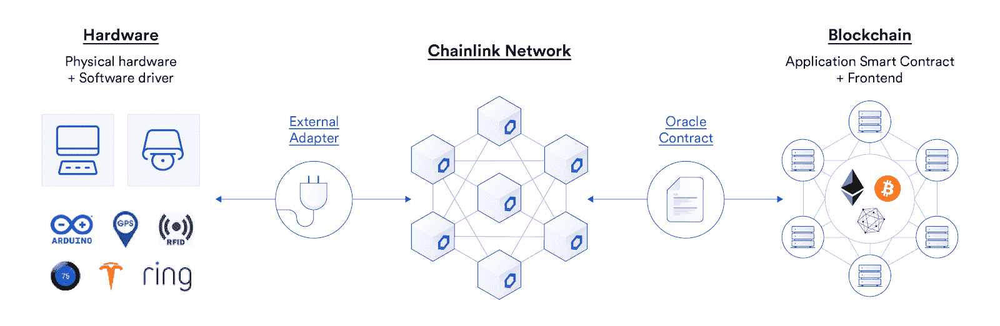
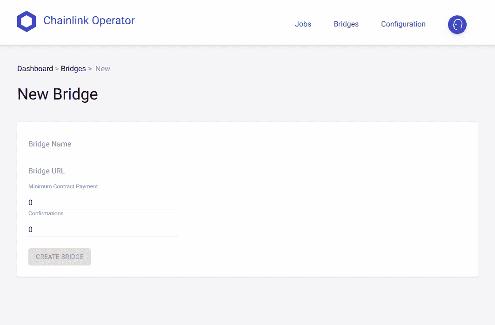

# API、智能合约以及如何连接它们

> 原文：<https://blog.chain.link/apis-smart-contracts-and-how-to-connect-them/>

通过与 chain link[Oracle](https://chain.link/education/blockchain-oracles)集成，任何区块链上的智能合约都可以连接到任何 API。自从 Chainlink 作为 oracle 解决方案进入这个领域以来，我们已经看到了 Solidity 中 API 和链外数据使用的大规模增长。现在，这个列表正在快速增长，包括 Polkadot、Avalanche、币安智能链、RSK 比特币等等，因为所有这些链都受益于 API 对外部世界的访问。众所周知，Chainlink 是 [DeFi Price Feeds](https://chain.link/solutions/defi) 的领先框架，该框架目前确保了数十亿的 DeFi 价值。虽然 Chainlink 价格馈送是一项重要的功能，可以增强用户了解和喜爱的众多 DeFi 平台，但这本身并不能彻底改变智能合约的功能。

Chainlink 的设计有一个更广泛的目标:成为智能合约的标准数据中间件层，并释放智能合约的功能，以可靠地触发外部世界的事件。为了实现这一点，Chainlink 为 Solidity 开发者和其他智能合约开发者提供了一个与任何外部 API 交互的框架。今天，这个指南将在以太坊主网上向你展示如何做到这一点。

## 快速入门指南

这里总结了使用 Chainlink 安全 API 数据启动和运行智能合约的最快方法，从我们的[Make a API GET Request Remix](https://remix.ethereum.org/#url=https://docs.chain.link/samples/APIRequests/APIConsumer.sol&optimize=false&runs=200&evmVersion=null&version=soljson-v0.8.7+commit.e28d00a7.js)要点开始。

*   **选择您的退货类型:**
*   根据你所请求的数据，string，uint 等，定义你的返回数据全局变量。示例代码中的“卷”。
*   更新履行职能分配。
*   **选择您的 oracle 和 job:**
*   使用 oracle 列表服务，如 [market.link](http://market.link/) ，找到您选择的 oracle 并更新 oracle 地址和作业 ID。
*   **向请求添加 API 调用:**
*   更新请求结构，以包含所需的 API 命令和 URL。
*   解析要返回的 JSON 数据的更新路径。
*   **编译、部署和拨款:**
*   在 Remix 中，编译契约，将注入的 Web3 部署到您想要的 testnet，然后发送链接到契约地址，这样它就能够为请求付费。

就是这样！在大约 15 分钟内，您可以将自己的外部感知契约部署到链上并发出 API 请求。您可以在我们的[使用任何 API 的介绍](https://docs.chain.link/docs/request-and-receive-data)页面上了解更多关于连接您的智能契约的信息，并在下面继续进行更深入的 HTTP GET 请求分析。

链节适配器
首先介绍的概念是[链节适配器](https://docs.chain.link/docs/adapters)。适配器是每个 Chainlink 节点默认支持的数据操作功能。通过这些适配器，所有开发人员都有一个标准接口来发出数据请求，节点操作者也有一个标准来提供数据。这些适配器包括诸如 HTTP GET、HTTP POST、Compare、Copy 等功能。适配器是 dApp 与外部世界数据的连接。

例如，下面是 HttpGet 适配器的参数:

*   **get** :获取一个字符串，该字符串包含要向其发出 get 请求的 URL。
*   **headers** :将包含键的对象作为字符串，将值作为字符串数组。
*   **queryParams** :接受一个字符串或字符串数组作为 URL 的查询参数。
*   **extPath** :获取一个斜杠分隔的字符串或字符串数组，附加到作业的 URL 上。

## **链接请求**

为了让您的智能契约与这些适配器进行交互，我们需要引入另一个元素:请求。从 [ChainlinkClient](https://github.com/smartcontractkit/chainlink/blob/develop/evm-contracts/src/v0.6/ChainlinkClient.sol) 继承的所有契约都可以创建一个 Chainlink。允许开发人员形成对链接节点的请求的请求结构。提交此请求需要一些基本字段，例如您希望用作 oracle 的节点的地址、作业 ID 和商定的费用。除了这些默认字段之外，还必须将所需的适配器参数添加到请求结构中，如下所示:

```
// Set the URL to perform the GET request on
request.add("get", "https://min-api.cryptocompare.com/data/price?fsym=ETH&tsyms=USD");

```

通过这种方式，请求是灵活的，并且可以被公式化以适应各种情况，包括获取、发布和操作任何 API，因为请求可以包含任何适配器函数。有关请求的构造以及在 ChainlinkClient 契约中提交请求和接收响应所需的函数的更多信息，请参见我们完整的 [HTTP GET 请求示例](https://docs.chain.link/docs/make-a-http-get-request)。

## **现有链环作业规格**

对于某些常见的请求，节点操作符可能已经配置了一个现有的 oracle 作业，在这种情况下，请求变得简单多了。您只需要创建默认的请求结构，而不是用必要的适配器构建请求结构。不需要额外的适配器参数，您选择的 oracle 将知道如何根据创建请求结构时提供的 jobId 进行响应。

下面给出了一个例子，摘自完整的 [CoinGecko API 消费者示例](https://docs.chain.link/docs/existing-job-request)。



## **链环外部适配器**

外部适配器是 Chainlink 的“无论您需要什么数据，我们都能处理”。因为它们是与 Chainlink 节点脱离链的代码片段，所以它们可以用您选择的任何语言编写，并执行您能想到的任何功能，只要数据输入和输出符合适配器的 JSON 规范。这些外部适配器打开 Chainlink 请求，以执行独特的新操作，如[将特斯拉连接到智能合约](https://blog.chain.link/create-tesla-smart-contract-rental/)或[在智能合约](https://blog.chain.link/oauth-and-api-authentication-in-smart-contracts-2/)中验证您的 Reddit 帐户。外部适配器充当 Chainlink 节点和外部数据之间的接口，让节点操作者知道如何请求和接收 JSON 响应，然后在链上使用这些响应。通过外部适配器在链外定义这个接口规范带来了巨大的可能性:您现在可以以任何您认为合适的方式在链外存储您的 API 凭证，可以以任何您选择的语言编写代码的方式操作数据，并且所有这一切都在不使用任何 gas 的情况下发生。从某种意义上说，外部适配器就像一个第 2 层 oracle，它在区块链之外快速、低成本地打包数据，并将其放入一个整洁的 JSON 格式，以便由 Chainlink 节点在链上可验证地提交。

外部适配器是使 Chainlink 成为如此多才多艺的 oracle 中间件的主要原因。合同开发者可以根据需要自由实现这些适配器，或者他们可以从 Chainlink 市场上的现有适配器中进行选择。如果您是一名希望创建外部适配器的智能合约开发人员，Chainlink 只要求您为数据请求和返回数据指定 JSON 接口。在这两个接口之间，开发人员可以自由地创建和操作数据，以适应他们的精确用例。作为节点操作员，为了支持外部适配器并处理额外的请求，您必须[在您的节点 UI 中为它创建一个桥](https://docs.chain.link/docs/node-operators#config)，将适配器的桥名添加到您支持的任务中，并为它定义一个作业规范。




<figcaption id="caption-attachment-1162" class="wp-caption-text">链节节点新建桥梁配置页面</figcaption>


```
{
  "initiators": [
    { "type": "runLog" }
  ],
  "tasks": [
    { "type": "randomNumber" },
    { "type": "copy",
      "params": {"copyPath": ["details", "current"]}},
    { "type": "multiply",
      "params": {"times": 100 }},
    { "type": "ethuint256" },
    { "type": "ethtx" }
  ]
}

```

有关创建外部适配器的完整示例，请参见我们的[外部适配器开发人员](https://docs.chain.link/docs/developers)页面。

Chainlink 正努力为区块链和智能合约开发商提供工具，以真实世界的数据为智能合约提供支持，这正是他们所需要的。Chainlink 的设计结合了通过默认适配器和可扩展外部适配器对任何 API 的直接调用，为开发人员提供了一个灵活的平台来创建他们认为合适的任何数据。如果您是一名智能合约开发人员，希望通过外部数据增加智能合约的效用，或者只是希望了解更多关于 Chainlink 的信息，请查看下面列出的资源。

## 今天就开始用 Chainlink 建造吧

**想试试 Chainlink out 吗？按照我们的** [**示例演练**](https://docs.chain.link/docs/example-walkthrough) **，轻松部署您的第一个与链外数据交互的智能契约。**

如果你正在开发一个可以从 Chainlink oracles 中受益的产品，或者想要帮助 Chainlink 网络的开源开发，请访问[开发者文档](https://docs.chain.link/)或者加入关于 [Discord](https://discordapp.com/invite/aSK4zew) 的技术讨论。