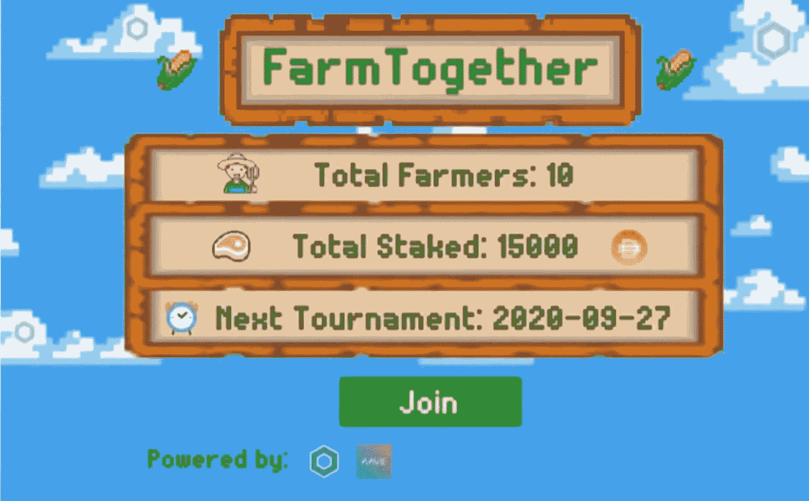
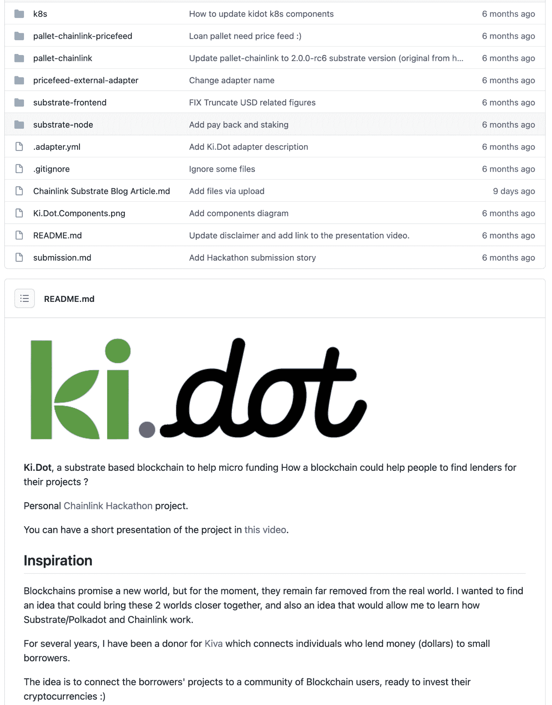
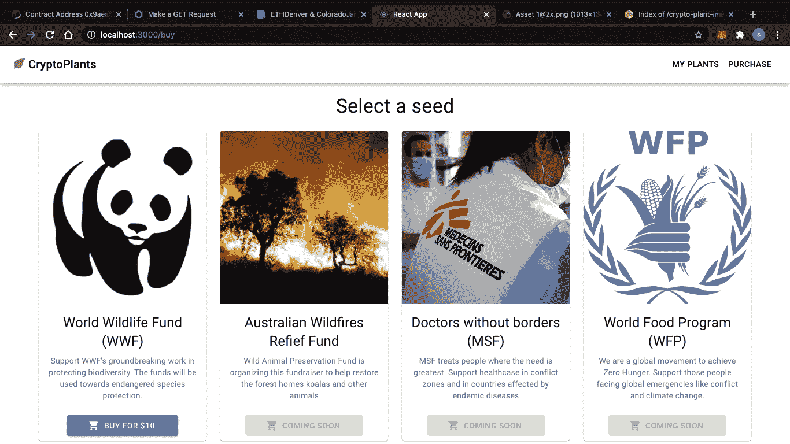

# 区块链黑客马拉松构建获胜提交的技巧

> 原文：<https://blog.chain.link/blockchain-hackathon-tips/>

2021 年春季 Chainlink 虚拟黑客马拉松正在进行中，数千名 dApp 开发者正在建设各种各样的项目，推动[智能合同](https://chain.link/education/smart-contracts)生态系统的创新。

中途签到点就在我们身后，许多团队和个人黑客现在希望将他们的项目改进为精美的提交材料，以吸引评委的注意，并在 125，000+美元的黑客马拉松奖金池中分得一杯羹。在这篇文章中，我们将介绍制作一个获胜的 hackathon 提交的一些细微差别，并指出一些可以实现的小事情，以使您的项目从竞争中脱颖而出。

[https://www.youtube.com/embed/mH0kBcfqLQA?feature=oembed](https://www.youtube.com/embed/mH0kBcfqLQA?feature=oembed)

<figcaption>Blockchain Hackathon Tips Winning Submission Guidelines livestream</figcaption>

## 一定要提交

一般来说，提交是黑客马拉松最重要的部分。即使你不能解决本文中的所有问题，或者即使你还没有完成你的项目，你仍然应该提交你所拥有的。不要害怕把你自己或者你的团队的工作展示出来。提交并获得反馈会让你对未来的黑客马拉松更有信心。您甚至会发现，在黑客马拉松之后，其他人看到了您的想法，并向您伸出援手，共同努力将其完善为一个功能完整的 mainnet 项目。

## 你的用户界面是你的第一印象

用户界面可以被认为是你提交的黑客马拉松的门面。一个精致、光滑的用户界面总是能帮助你的作品脱颖而出，从而吸引评委的注意。前端用户界面和用户体验设计并不总是开发人员的强项，尤其是在智能合约开发人员中，他们的强项通常在于较低级别的区块链层。

<figcaption id="caption-attachment-1681" class="wp-caption-text">When a backend developer builds a front end</figcaption>

如果你或你的团队没有信心为你的提交制作一个完美的前端，你可以尝试通过 [Chainlink Discord](https://discord.gg/7W4JCt2A) 中的“寻找队友”频道，或者通过其他 Chainlink 社交频道，如 [Twitter](https://twitter.com/chainlink) 或 [Reddit](https://www.reddit.com/r/Chainlink/) ，找到一个新的团队成员，他可以专注于为你的项目构建一个用户界面。这种方法允许您的团队将前端和后端任务分开，这样每个成员都可以专注于他们最了解的事情。

如果您正在单独处理一个项目，并希望构建一个用户界面，但不知道从哪里开始，有一些常用的模板启动项目，如 [Create-Eth-App](https://github.com/paulrberg/create-eth-app) 和 [Create-React-App](https://create-react-app.dev/) ，它们允许您快速实现一个单页用户界面，然后您可以定制并集成到您的后端智能合同中。

用户界面不必太大。它应该简单、直观，并允许其他人成功地与您的智能合约和其他后端组件进行交互。如果你正在努力为你的用户界面寻找一些艺术品，不要害怕联系 Twitter 上的 Chainlink 社区、T2 的 Reddit 或 T4 的 Discord。我们社区里有一些了不起的艺术家，他们很乐意为 Chainlink hackathon 投稿制作艺术品。

<figcaption id="caption-attachment-1682" class="wp-caption-text">FarmTogether User Interface, Best Gaming/NFT Project from the [2020 Chainlink Virtual Hackathon](https://blog.chain.link/congratulations-to-the-winners-of-the-chainlink-virtual-hackathon-2020/)</figcaption>

## 易于理解的代码和文档

代码显然是黑客马拉松提交中最重要的可交付成果。除了它是完整的和有效的，还有一些事情可以帮助提交脱颖而出，看起来像一个真实世界的 mainnet 就绪项目。

代码可以被认为是一件艺术品，所以它应该以最好的方式呈现。它应该是干净的，清晰的，易于理解的。确保包含注释，以帮助法官和其他开发人员跟进。

当涉及到您提交的实际代码库时，越少越好。不要包含不必要的文件和文件夹，如库文件夹，并且确保使用环境变量或环境文件作为密码和密钥。此外，一些更有技术头脑的评委会欣赏一些小事情，比如合并测试，或者使用开发工具，比如 [Chainlink Truffle box](https://github.com/smartcontractkit/box) 、 [Chainlink Hardhat box](https://github.com/smartcontractkit/chainlink-hardhat-box) 或者 [Chainlink Eth-Brownie Mix](https://github.com/smartcontractkit/chainlink-mix) 。

对于文档，每次提交都应该有一个格式良好且易于理解的自述文件。这非常重要，因为这是法官和其他开发人员在查看您的代码库时首先会看到的。以下是一些要包含在您的自述文件中的内容:

*   项目概述和描述
*   链接到演示视频
*   链接到已部署的实时演示(如果您有)
*   架构图(如果有)
*   构建、部署和运行代码每个部分的简单步骤

如果您不确定如何展示这些信息，可以查看[以前的获奖作品](https://github.com/pappas999/Link-My-Ride/blob/master/README.md)中 README 文件的原始标记代码作为指导。

<figcaption id="caption-attachment-1685" class="wp-caption-text">Ki.Dot, runner-up prize winner in the [2020 Chainlink Virtual Hackathon](https://blog.chain.link/congratulations-to-the-winners-of-the-chainlink-virtual-hackathon-2020/) had a clean repository and well-presented README.</figcaption>

## 录制您的项目正在进行的视频

视频是黑客马拉松提交的一个极其重要的部分，因为它本质上是向黑客马拉松评委和其他开发者展示你的项目。这证明了这个项目是真实的，并且是可行的。

至少，视频应该是一个 3-5 分钟长的剪辑，展示你的提交，有人通过每个步骤说话，并解释他们在与项目互动时正在做什么。请注意，评委将会观看许多这样的视频，所以你应该添加一些让视频脱颖而出的元素，例如[快速视频介绍](https://www.youtube.com/watch?v=e06MmL6IpLQ&t=1s)、[图形、](https://www.youtube.com/watch?v=p_lVROj0t58&t=1s)和[音乐](https://www.youtube.com/watch?v=yFnXwSGstus)。

视频的大部分应该集中在你的项目上，但是不要害怕从中获得乐趣。创意和幽默会吸引评委。对于本演练，如果您或您的团队对在录制的视频上发言没有信心，您可以随时联系 Chainlink 社区，请人为您录制脚本式画外音。

[https://www.youtube.com/embed/bqn3MsZWqCI?start=1&feature=oembed](https://www.youtube.com/embed/bqn3MsZWqCI?start=1&feature=oembed)

[威士忌做市商](https://hack.ethglobal.co/showcase/whiskeycoin-recf6yNOpPUTO0KM6)，2021 年全球做市商黑客马拉松[的获胜者](https://blog.chain.link/chainlink-bounty-winners-ethglobal-2021-marketmake-hackathon/)

## 运行现场演示

通过向评委和其他开发人员提供您提交的作品的实时工作演示，您可以做得更好。这使得他们可以浏览用户界面，对你的项目有一种更加个人化的感觉，而这种感觉是你仅仅通过观看视频或截图无法获得的。

如果你不确定你能在哪里主持你的现场演示，有许多免费或基于试用的主持选择。你也可以走完全分散的路线，使用 [IPFS](https://ipfs.io/) 和 [ENS](https://ens.domains/) 来主持你的演示。如果您需要 Chainlink 基础设施来托管诸如作业或外部适配器之类的东西，您可以联系到 [Chainlink Discord](https://discord.gg/7W4JCt2A) 中的“节点-运营商-请求”通道，询问是否有人可以为您托管它们，或者随意[在自由层云环境](https://medium.com/alpha-vantage/how-to-build-a-simple-chainlink-node-on-the-gcp-62df9e7801a2)如 Google 云平台或 Amazon Web Services 上自己托管一个。

<figcaption id="caption-attachment-1686" class="wp-caption-text">[Link My Ride live demo](https://linkmyri.de/), grand prize winners from the [2020 Chainlink Virtual Hackathon](https://blog.chain.link/congratulations-to-the-winners-of-the-chainlink-virtual-hackathon-2020/)</figcaption>

## 解释为什么你的项目很重要

我们已经讨论了如何改进有形的项目交付成果，如用户界面、代码和视频，但提交的另一个方面最能引起评委的共鸣:它如何回答为什么。

以下是每个团队或个人参与者应该就他们的项目问自己的一些问题，以便他们能够讲述一个更有说服力的故事，说明他们提交的内容的重要性:

*   你提交的重点是什么？
*   它解决什么问题？
*   它如何让其他人的生活变得更好？
*   它解决了当前的社会或经济问题吗？
*   它是否促进了经济的公平、透明和效率？
*   这个项目在现实世界中有多大用处？

法官将会支持以具体、积极和有意义的方式明确解决这些问题的提交材料。你可以在你的 [Devpost](https://chainlink-2021.devpost.com/) 提交中或者在你的代码库中的自述文件的开头添加一些关于你的项目的更大影响的观点。

<figcaption id="caption-attachment-1687" class="wp-caption-text">Crypto Plants, Chainlink bounty winners in the ETHDenver 2021 Hackathon, encourages environmentally and socially conscious giving by rewarding people with verifiably unique NFTs.</figcaption>

## 摘要

在 Chainlink Hackathon 的最后几天，上面的六个专业技巧应该可以帮助你和你的团队完善你的项目。如果你以前参加过黑客马拉松比赛，你会知道在最后冲刺阶段会有很多东西聚集在一起。记住: **[提交的截止日期是 4 月 11 日星期日](https://chainlink-2021.devpost.com/)。**评委、赞助商、其他参与者以及更广泛的区块链社区都渴望看到你的成果。

### 关于这个话题的更多信息

*   [优秀提交指南| Chainlink 黑客马拉松研讨会](https://www.youtube.com/watch?v=mH0kBcfqLQA&ab_channel=Chainlink)
*   [宣布 2021 年春季 Chainlink 虚拟黑客马拉松](https://blog.chain.link/chainlink-virtual-hackathon-spring-2021/)
*   [chain link 2021 年春季黑客马拉松 Youtube 播放列表](https://www.youtube.com/watch?v=xvnDeMDnYik&list=PLVP9aGDn-X0Shwzuvw12srE-O6WKsGvY_)

[网站](https://chain.link/) | [推特](https://twitter.com/chainlink)|[Reddit](https://www.reddit.com/r/Chainlink/)|[YouTube](https://www.youtube.com/channel/UCnjkrlqaWEBSnKZQ71gdyFA)|[电报](https://t.me/chainlinkofficial) | [事件](https://blog.chain.link/tag/events/) | [GitHub](https://github.com/smartcontractkit/chainlink) | [价格供稿](https://feeds.chain.link/) | [DeFi](https://www.chain.link/solutions/defi)