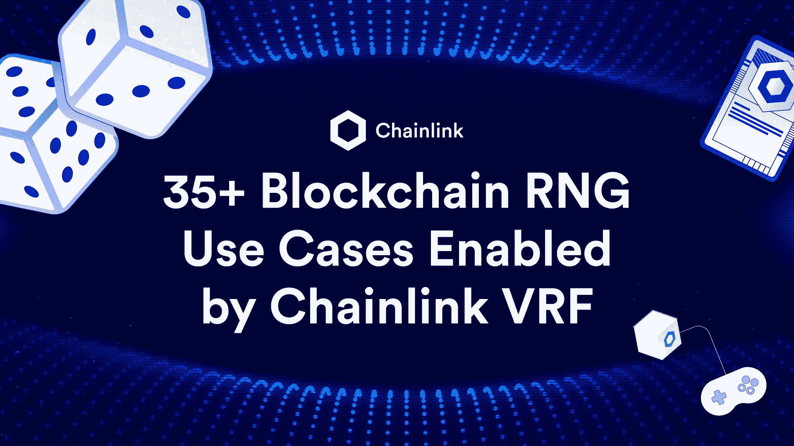
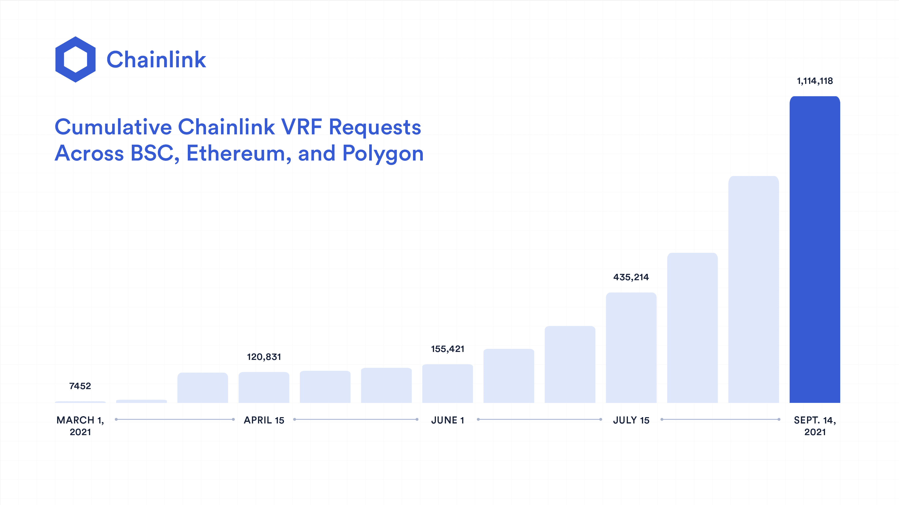
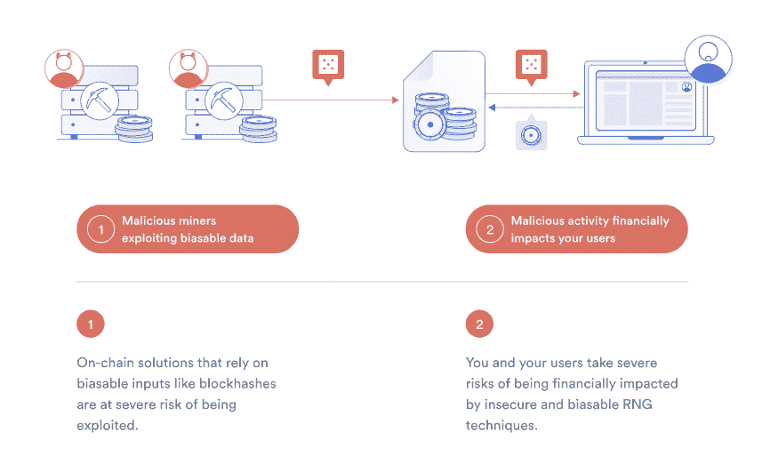
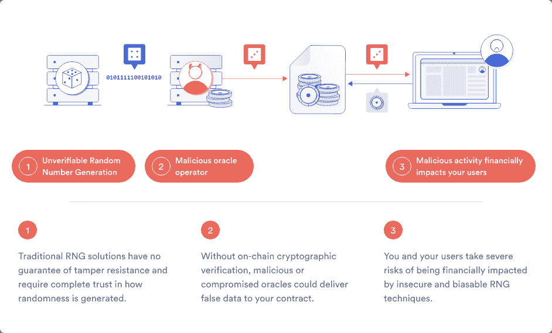
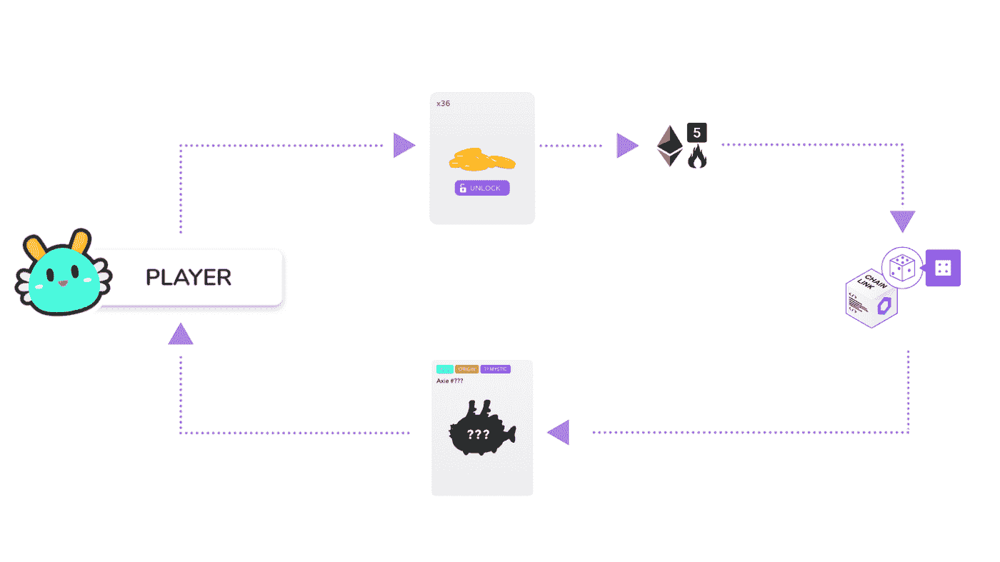
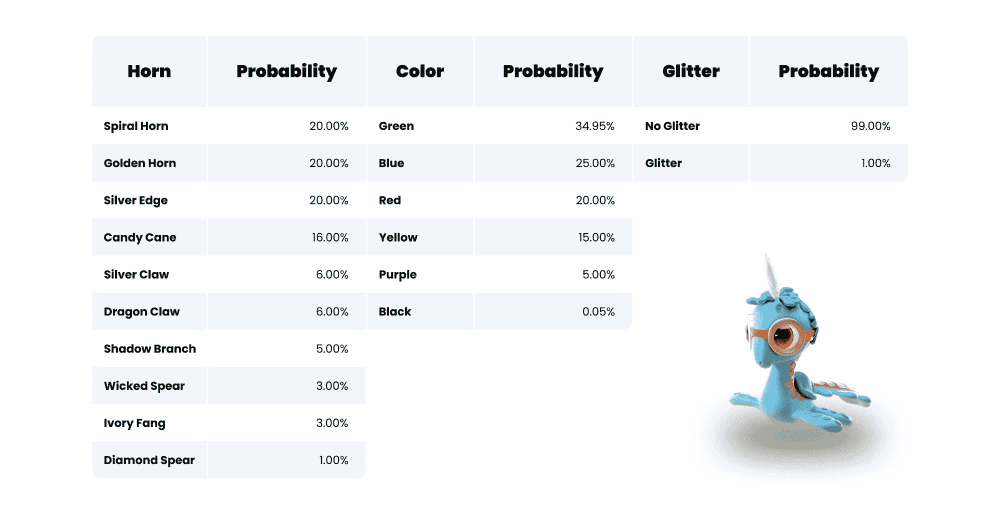
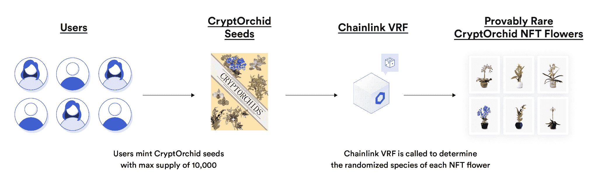
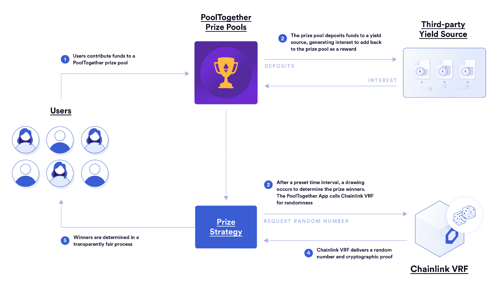
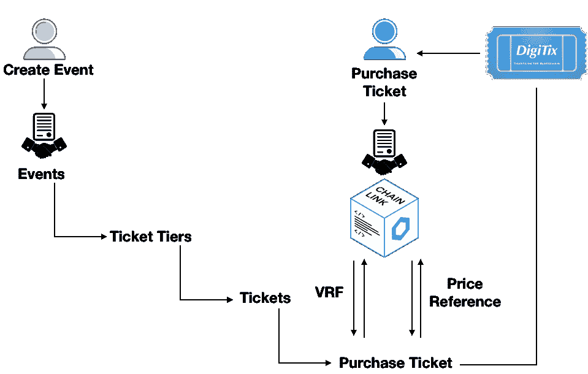

# VRF chain link 支持 35 个以上区块链 RNG 用例

> 原文：<https://blog.chain.link/blockchain-rng-use-cases-enabled-by-chainlink-vrf/>

## 快速链接:

*   [区块链游戏和元宇宙](#blockchain-gaming-metaverse)
*   [NFT 创作与发行](#nft-creation-distribution)
*   [抽奖和抽奖](#lucky-draws-defi)
*   [营销活动和忠诚度奖励](#marketing-and-loyalty)
*   [公平选择和排序流程](#fair-selection-ordering)
*   [认证和安全](#authentication-and-security)

[Chainlink VRF](https://chain.link/solutions/chainlink-vrf) 是业界领先的安全随机数生成器(RNG)，使[智能合约](https://chain.link/education/smart-contracts)和链外系统能够访问可验证的防篡改随机源。自 2020 年 10 月 mainnet 推出以来，Chainlink VRF 公司已经为以太坊、多边形和币安智能链上超过一百万个公平、公正的随机数请求提供了服务。这些随机数已被用于区块链游戏、NFTs 和 [DeFi](https://chain.link/education/defi) 中的各种用例。

在这篇博文中，我们将简要探讨 VRF 链家的工作方式及其相对于现有 RNG 解决方案的优势，然后看看由 VRF 链家提供支持的 35 个独特的使用案例，这些案例正在由顶级项目进行生产，或者正等待创新开发人员进行开发。

<figcaption id="caption-attachment-2555" class="wp-caption-text">The number of Chainlink VRF requests is rapidly increasing.</figcaption>

## 为什么选择 VRF 链家

当人们最初想到游戏、NFTs、艺术甚至科学时，他们往往忽略了随机性在决定结果中的重要性。从在随机对照试验中选择病人，到在游戏中确定获胜者，再到在数字艺术品中产生变化，熵是使这些过程公平、令人兴奋和安全的核心要素。然而，访问一个防篡改、不可预测、可被所有参与者审计的随机性来源并不是一件容易的事情——尤其是在将熵引入高度确定性的区块链网络时。

例如，源自区块链本身的 RNG 解决方案，例如使用块散列，引入了攻击漏洞，其中区块链矿工/验证者可以选择仅当块产生对他们更有利的结果时才发布块。本质上，挖掘者/验证者有能力重新掷骰子来获得一个新的随机性来源。

<figcaption id="caption-attachment-2561" class="wp-caption-text">Blockchain miners/validators can exploit blockchain-based RNG solutions.</figcaption>

另外，从外链 API 提供者得到的 RNG 解决方案是不透明和不可验证的，所以用户没有证据证明随机性没有被操纵。没有办法区分真实的或被操纵的随机性，导致信任度大打折扣。随着 RNG 解决方案所保证的价值的增加，这两种解决方案都变得越来越令人担忧。

<figcaption id="caption-attachment-2562" class="wp-caption-text">Off-chain RNG solutions from traditional APIs don’t provide proof of integrity and tamper resistance, allowing for manipulation.</figcaption>

[【链式可验证随机函数(VRF)](https://chain.link/solutions/chainlink-vrf) 使用链外 oracle 计算和链上密码术克服了这些限制。Chainlink VRF 的工作原理是将发出请求时未知的块数据与 oracle 节点预先提交的私钥相结合，以生成一个随机数和一个加密证明。消费应用程序只有在具有有效的密码证明的情况下才会接受随机数输入，并且密码证明只有在 VRF 过程是防篡改的情况下才能生成。

<figcaption id="caption-attachment-2563" class="wp-caption-text">Chainlink VRF uses open-source code and cryptography to create a tamper-proof source of randomness that users can verify as fair and unbiased.</figcaption>

因此，Chainlink VRF 公司为用户提供了自动的、可公开验证的证据，证明所提供的随机性是可证明公平的，并且没有被[甲骨文](https://chain.link/education/blockchain-oracles)、区块链矿工、外部实体或应用程序开发团队篡改或预测。此外，Chainlink VRF 由完全开源的代码提供支持，所有加密证明都可以由任何人在链上验证。如果你想了解更多关于其背后的数学和密码学知识，请查看 [Chainlink VRF 技术博客文章](https://blog.chain.link/chainlink-vrf-on-chain-verifiable-randomness/) 。

最终，以 **可验证的安全方式** 访问 **公平** 和 **公正** 随机来源的能力使区块链开发者能够为区块链博彩、NFTs、幸运抽奖、营销活动、粉丝奖励以及公平选择和安全流程构建一整套全新的应用。

[https://www.youtube.com/embed/DvBVlOLpPNg?feature=oembed](https://www.youtube.com/embed/DvBVlOLpPNg?feature=oembed)

为了向开发者展示如何在应用程序中应用可证明的公平随机性，下面列出了使用 VRF 链的 35 种方法。如果这些想法引起了你的共鸣，或者你想了解更多，请在 [Discord](https://discordapp.com/invite/aSK4zew) 上找到我们，并查看 [开发者文档](https://docs.chain.link/docs/chainlink-vrf/) ，立即开始使用 Chainlink VRF 进行构建。

## 区块链游戏和元宇宙

基于区块链的游戏正在重新定义[【1750 亿美元】的传统游戏产业](https://www.mordorintelligence.com/industry-reports/global-gaming-market) 因为它们建立在安全、防欺诈的基础设施之上，同时保留了尖端的功能和图形。区块链博彩业由于其全球可访问性、 [即玩即赚机会](https://blog.chain.link/the-economic-impact-of-random-rewards-in-blockchain-video-games/) 以及可证明的公平游戏方式而开始变得越来越受欢迎，带来了更具竞争力、经济回报更高、更有意义的用户体验。VRF 链家酒店为区块链奥运会和不断发展的元宇宙带来了安全熵。

**以透明的随机性开始建造**

[Go to Docs](https://docs.chain.link/docs/chainlink-vrf/)

### 分发字符

大多数游戏都有不同的角色，每个角色都有自己独特的特质。有些字很常见，而有些很少见。决定新角色如何分配给用户对公平游戏至关重要，特别是在区块链游戏中，某些角色可以为用户赢得更高的经济回报。

[Axie Infinity](https://axieinfinity.com/) 是最受欢迎的“玩赚”区块链游戏之一，用户在这里对战、饲养和交易被称为 Axie 的 NFT 角色。每个轴由六个部分组成——背部、耳朵、眼睛、角、嘴和尾巴——每个部分都有不同的基本统计数据和可能的特征。由于某些特征比其他特征更有价值， [Axie Infinity 集成链节 VRF](https://axie.substack.com/p/axiechainlink) 帮助确保 4088 个原始轴中的每一个都有一组真正随机的特征，这些特征基于它们的智能合同中预先定义的赔率。

<figcaption id="caption-attachment-2564" class="wp-caption-text">Axie Infinity used Chainlink VRF to mint provably rare Origin Axie NFTs.</figcaption>

[【链卫士】](https://chainguardians.io/) 是另一款以科幻密码体为背景的“玩赚”区块链游戏。玩家可以收集守护者 NFT，组成联盟，并在一个新颖的角色扮演游戏(RPG)中相互战斗。 [链节卫士集成链节 VRF](https://www.chainlinkecosystem.com/ecosystem/chain-guardians/) 使玩家能够随机铸造 16 个不同颜色的独特链节卫士 NFT 中的一个。这些定制的角色需要一点机会来获得，但为玩家创造了更个性化的游戏体验。

### PVP 战斗和比赛中的配对玩家

配对是涉及玩家对玩家(PvP)战斗的多人游戏的重要组成部分，无论是单人、一次性战斗还是锦标赛形式。玩家的成功和他们获得奖励的机会可以归结为他们被分配到战斗中的对手的能力，这使得从匹配算法中消除偏见和可预测性变得非常重要。

crypto blades 是一款身临其境的 NFT 区块链游戏，用户可以在其中制作独特的物品，击败怪物，参与突袭，并在 PvP 战斗中相互战斗。VRF 利用链节的众多方法之一是建立不可预测的战斗配对，胜利者将技能令牌奖品带回家。感谢 Chainlink VRF，玩家有信心没有特殊的后门特权或操纵配对任何一个玩家的优势。

### 生成战利品箱内容

战利品盒是玩家获得强大武器、限量版装备、特殊装备和其他稀有物品的独特方式。战利品盒是一种可消耗的虚拟物品，用户可以用他们的真实货币或游戏中的货币来换取赢得新物品的机会。战利品箱可能包含非常抢手的物品，所以防篡改随机性对于公平的战利品箱分配模型非常重要。

[MTVE](https://mtve.finance/) 是一款大型多人在线角色扮演游戏(MMORPG)，发生在科幻设定中。玩家可以控制宇宙飞船，拥有行星，探索广阔的元宇宙，相互战斗，并与他人交易游戏中的物品。 [MTVE 集成链环 VRF](https://www.chainlinkecosystem.com/ecosystem/metaverse/) 分配船只初始特征，创建随机战利品箱，为用户提供获得高价值装备的机会。

[进化之地](https://www.evolution.land/) 是由达尔文网络公司开发的一个庞大的元宇宙，游戏玩家可以在这里开采资源，与其他用户进行交易，统治不同的大陆，并拥有被称为使徒的 NFT 人物。 [进化之地集成链环 VRF](https://www.chainlinkecosystem.com/ecosystem/evolution-land/) 公平分配游戏内奖品，作为玩家打开宝箱或繁殖使徒时的随机奖励。

> “我们很高兴能让 Chainlink VRF 成为进化之地的一部分，并相信这种随机性的整合将有助于我们创造一种复杂、经济的游戏体验，用户可以独立地验证这种体验的真实性和公正性。”T3】
> 
> *——丹尼·王，达尔文网络联合创始人*

### 尊重基于赔率的游戏

某些类型的游戏纯粹基于赔率和机会，而不是用户的投入、技能或经验水平。例如，[Blockmine integrated chain link VRF](http://chainlinkecosystem.com/ecosystem/blockmine/)来支持他们即将推出的游戏 Next Card，在这个游戏中，人们试图确定下一张牌将被抽出，以获得赢得奖品的机会。

此外，赛车游戏也经常混合了几率和随机性。 [DeRace](https://www.derace.com/) 是一款在线虚拟游戏，用户在这里收集、繁殖和比赛 NFT 的马匹以赢得奖品。不是最好属性的马总是赢得比赛， [DeRace 是整合链环 VRF](https://www.chainlinkecosystem.com/ecosystem/derace/) 来随机化比赛结果。在比赛开始前，智能合同将比较每匹马的特征，以计算它们获胜的几率。Chainlink VRF 公司将根据这些概率随机选择一名获胜者，以获得更加有趣和不可预测的体验。

### 升级字符

随着玩家在游戏中达到目标并取得进展，他们通常会获得升级机会，作为对他们成就的奖励。游戏可以通过引入一系列随机决定的升级来创造不可预测性，而不是在共同的里程碑之后为每个用户提供相同的升级。

游戏平台 [博拉](https://www.boraecosystem.com/) 将在其即将发布的博拉岛 2.0 中以 NFT 的形式表现所有游戏内物品、土地和角色。 [BORA 计划利用 Chainlink VRF](https://www.chainlinkecosystem.com/ecosystem/bora/) 通过社区奖励计划，当用户通过特定目标甚至全新升级的角色时，随机奖励他们独特的游戏内物品。有了 Chainlink VRF，宝来岛 2.0 玩家可以放心，每个满足指定要求的参与者都将有公平的机会获得最好的游戏内升级。

### 生成地图并在地图上放置项目

虽然许多游戏都有固定的地图，但算法有新的机会在一个景观中生成新的土地和各种特征。随机性可以应用于这些算法，以从可能的结果列表中进行选择，甚至在增强和虚拟现实中的项目放置和背景显示中发挥作用。物品如何分配给玩家在很大程度上有助于公平游戏，这是培养活跃玩家的全球生态系统的关键因素。

[【OVR】](https://www.ovr.ai/)是一款开源的增强现实(AR)游戏，玩家可以将他们的现实世界与虚拟世界融合，在不同的地理位置解锁独特的体验、可视化和奖励。OVR 的 AR 世界被分割成 300 个 OVRLand NFTs，代表现实世界中的 300 平方米。这些 NFT 的所有者可以为发生在其领域内的其他用户定制体验和可视化。与此同时，玩家在探索元宇宙时还可能会遇到宝箱和其他独特的事件。

其中一个主要原因 [OVR 综合链环 VRF](https://www.chainlinkecosystem.com/ecosystem/ovr/) 是为了在不可预知的地点催生特殊物品和体验。OVR 在他们最近的寻宝游戏中使用了 VRF 链，在奥弗兰随机放置宝箱，帮助创建了一个每个人都有公平机会收集奖品的元宇宙。

### 为致命一击提供动力

开发者通常会根据玩家和对手的技能水平、装备、性格特征、环境等因素，为某些动作设定赔率，而不是将游戏纯粹建立在确定性的输入和输出之上。这在格斗游戏中尤其常见，在格斗游戏中，玩家有机会击中对手，也有致命一击，玩家会受到更具破坏性的攻击。

例如，一个弱小的对手可能只有 15%的机会攻击一个强大的对手，而一把特殊的剑可能会增加他们 5%的机会。最具竞争力和回报的游戏会产生输入和输出的随机性，因此即使是最有经验的玩家也有可能运气不佳。链环 VRF 提供了一种基于预先指定的打击和临界命中率来确定结果的方法。

<figcaption id="caption-attachment-2565" class="wp-caption-text">Chainlink VRF enables input/output randomness for more competitive gameplay.</figcaption>

### 确定转弯顺序

虽然看起来无伤大雅，但玩家可以在基于玩家顺序的回合制游戏中获得优势，特别是当更多玩家参与进来时。即使优势很小，基于玩家顺序的赔率的微小变化也会有所不同，因为更多的价值处于线上。随机性提供了一种平等竞争的方式，把排序留给机会。

在雪崩区块链上推出的首批游戏之一是[avax cells](https://avaxcells.com/)——玩家可以在 1v1 PvP 战斗中使用的 NFT 交易卡。每件 Avaxcell NFT 铸币都有 8 种元素中的 1 种，比如火、水和风，相对于其他元素，它们有着独特的优势和劣势。每张卡也有一个细胞类型，如普通，特殊，稀有，史诗和传奇，这表明了 NFT 的力量和稀有性。 [Avaxcells 集成了 Chainlink VRF](https://www.chainlinkecosystem.com/ecosystem/avaxcells/) 来公平地决定在 PvP 决斗中哪个玩家先攻击，消除了任何关于排序的潜在争议。

### 生成角色位置

当一个玩家在许多第一人称射击游戏中死去时，他们会被重新映射到地图上的某个地方，通常是几个固定的位置。此外，游戏中的入口可以将玩家带到新的地方，根据他们的位置，这些地方可能会提供一些优势。随机性提供了一种在确定新字符位置时注入不可预测性的方法。

[Fabwelt](https://www.fabwelt.com/) 是一个区块链游戏平台，以一款名为阿森纳的 FPS 游戏和一款名为 Fanwelt 的奇幻体育游戏为特色。Fabwelt 游戏的一个独特之处在于，用户可以通过获得 NFT 代币来影响游戏，然后改变规则和设置，并授予特殊的能量和能力。在阿森纳等第一人称射击游戏中，角色放置是一个 [出了名的复杂过程](https://ieee-cog.org/2019/papers/paper_59.pdf) ，因为更有经验的游戏玩家可以记住产卵点，并在它们附近安营扎寨，以便在玩家一重生就攻击他们。由于这是一个没有竞争力的游戏动态， [Fabwelt 正在整合 Chainlink VRF](https://www.chainlinkecosystem.com/ecosystem/fabwelt/) 以确保角色的位置和起点是任意的和不可预测的。

### 创建不可预测的游戏和增强现实场景

不可预测性是游戏有趣的主要原因——如果用户能够准确知道每种情况下会发生什么，他们就不太可能继续玩游戏。因此，元宇宙不可预测的事件或需要击败的意想不到的老板增加了游戏的刺激因素。

[Sportemon Go](https://www.sportemongo.com/) 是一个面向一切运动、游戏和 NFTs 的互动生态系统。Sportemon Go 拥有一个 AR 世界，用户可以收集、交易和发现代表各种职业联赛中他们最喜爱的体育英雄的 NFT 交易卡。 [Sportemon Go 集成了 Chainlink VRF](https://www.chainlinkecosystem.com/ecosystem/sportemon-go/) ，在用户探索周围环境和参与平台时，向他们随机分发 NFT，为他们的 AR 世界带来更多刺激。

欲了解 Sportemon Go 如何在其体育应用中使用 Chainlink VRF 的更多信息，请观看他们的 Chainlink 现场采访:

[https://www.youtube.com/embed/bdh8H-KM49Q?feature=oembed](https://www.youtube.com/embed/bdh8H-KM49Q?feature=oembed)

## NFT 创作和发行

NFT 已经成为区块链行业的领先用例之一，这主要是由于其新颖的所有权功能，用户可以完全控制和拥有独特的数字资产。尽管许多第一代 NFT 围绕着数字艺术品，但通过使用神谕，NFT 正迅速变得更加游戏化，神谕使它们能够使用外部数据和计算来影响它们的生成、分发和正在进行的外观。下面是这些“ [动态 NFT](https://blog.chain.link/create-dynamic-nfts-using-chainlink-oracles/)”中的几个，它们利用 Chainlink VRF 来增强效用和公平性。

**将您的 NFT 与可验证的随机性联系起来**

**[转到文档](https://docs.chain.link/docs/chainlink-vrf/)**

### 使用概率分配无上限 NFT 性状

与 Axie Infinity 类似，NFT 通常基于从一组特征中接收某些特征的概率在铸造时生成。 例如， [多链怪兽](https://polkamon.com/) 是一款基于区块链的游戏，居住在 NFT 的怪兽具有三种截然不同的特征类别——颜色、角类型和闪光——以及每一类别中不同稀有程度的几个特征。所有这三个类别的特征组合最终定义了多链怪物的稀有性。

<figcaption id="caption-attachment-2566" class="wp-caption-text">Polychain Monster NFTs each have three characteristics, with various potential traits for each characteristic based on probability and randomness from Chainlink VRF.</figcaption>

由于多链怪物的稀有性决定了它在多宇宙战斗中的力量，所以在多链怪物的战斗中拥有一个公平透明的随机来源是至关重要的。这也是为什么 [Polychain 怪物集成 Chainlink VRF](https://www.chainlinkecosystem.com/ecosystem/polkamon/) 这样当用户购买升压包的时候，他们收到的 Polychain 怪物 NFT 是完全随机生成的。鉴于没有固定的供应，VRF 链不仅创建了一个公平的分配模型，而且保护了性状概率的完整性。因此，没有人能够利用铸币算法生成最罕见的多链怪物，如超罕见的比特币龙，下降率仅为 0.01%。

Polychain Monsters 创造了一个项目最多的 Chainlink VRF 调用记录，在不到 14 天的时间里生成了超过 520，000 个 NFT。

了解更多关于 Polychain Monsters 如何使用 Chainlink VRF 创建可证明是稀有的数字收藏品:[https://chain.link/case-studies/polychainmonsters](https://chain.link/case-studies/polychainmonsters)T3】

<figcaption id="caption-attachment-2567" class="wp-caption-text">Polychain Monsters uses Chainlink VRF to mint provably random NFTs.</figcaption>

这些特征不仅适用于游戏中的角色，也适用于艺术的特征。 隐睾是一个动态的 NFT 艺术项目，其中的 NFT 可以随着时间的推移而变化，以反映现实世界中花朵的生长和无常。用户需要每周在特定的 3 小时时间窗内用 T4 给他们的隐睾浇水，否则他们的花 NFT 就会死去。 [隐睾使用链状 VRF](https://cryptorchids.io/almanac/blog/chainlink-vrf) 来确定新造花朵 NFTs 的种类，每个品种都有一个设定的稀有度。比如 深圳农科兰花，被铸造的几率是万分之一，由于隐睾的总收集量是以万为上限，所以这种几率是极其罕见的。但是，利用概率手段超过一个深圳农科兰还是有可能的。

<figcaption id="caption-attachment-2568" class="wp-caption-text">CryptOrchid uses Chainlink VRF to mint provably rare NFTs.</figcaption>

### 分配一个固定的性状供给上限

虽然一些项目对每种特征都有一个开放式的供应，并依靠概率来保持这些特征的稀缺，但其他项目实现了 NFT 特征的固定供应，一旦它们被创造出来，最终就会耗尽。通过限制供应，引入了一种真正的稀缺感，随着剩余的非铸造 NFT 供应的减少，这种稀缺感甚至会随着时间的推移而增加。Chainlink VRF 可用于维持接收稀有物品的概率，从而为固定供应的 NFT 创建高完整性分配方法。

### 向 NFT 奖持有者颁发真实世界的奖项

NFT 还可以代表对真实世界奖品和奖励的独家访问，只有 NFT 持有者才有资格获胜。通过与以太卡的合作， [【拉梅洛·鲍尔】](https://lameloball.io/#/) 成为首批向其粉丝群提供动态 NFT 交易卡的职业运动员之一。他在 NFT 发行的最高级别的 Gold Evolve 卡会自动让持有者参加随机抽奖，以赢得纪念品，如他的游戏鞋、定制袖套和他的高中冠军戒指。

[拉梅洛的 NFT 系列使用 Chainlink VRF](https://blog.ether.cards/lamelo-ball-nft/) 来选择这些抽奖和 Chainlink 甲骨文的获胜者，以创造特殊的 NFT，取决于他是否获得 2021 年 NBA 年度最佳新秀奖。拉梅洛确实赢了，Chainlink oracles 在链上发布了结果，为 Gold Evolve 持有者触发了年度最佳新秀奖。

自从整合 Chainlink VRF 公司以来，Ether Cards 的总销售额已超过 2400 万美元，其中包括购买的 6K+独特的 chain link NFT。

阅读更多关于以太卡如何通过 Chainlink VRF 防篡改 RNG 增强其 NFT 平台的信息:

### 奖励社区成员和庆祝里程碑

使用 NFTs 的另一种方法是创建由 NFT 所有者组成的社区，这在有固定供应时特别有用。为了促进社区和共同的目标，NFT 项目只能向社区成员发布随机的 NFT 奖励或升级。这些奖励也可以基于达到某些里程碑或纪念特殊事件。

百无聊赖的猿游艇俱乐部(BAYC)，NFT 十大项目之一 [根据 DappRadar](https://dappradar.com/nft) 在撰写本文时，收集了 10，000 件代表猿启发的艺术作品。BAYC NFT 的持有者还可以使用会员专用的俱乐部设施，比如浴室，一个合作涂鸦板。 [BAYC 使用 Chainlink VRF](https://www.chainlinkecosystem.com/ecosystem/bored-ape-yacht-club/) 向当前 BAYC NFT 持有者随机分发他们的新突变血清 NFT，使用户能够将他们的无聊猿突变成新的限量版 NFT。当被问及为什么 Chainlink VRF 工作时，BAYC 团队表示:

> *T3】*

波尔卡瓦 是一个游戏平台，以本土格斗游戏和 NFT 市场为特色，用户可以在这里买卖物品、武器和装备，帮助他们成为最强的战士。目前，用户可以选择 NFT 的战士、魔术师或弓箭手等角色，并为他们配备不同的武器，包括剑、棋盘和权杖。 [Polkawar 正在整合 Chainlink VRF](https://www.chainlinkecosystem.com/ecosystem/polkawar/) ，以一种可验证的公平方式向参与空投计划的用户分发最初的 10 件物品，帮助确保每个人都有平等的机会收到最稀有的物品。

### 为慈善机构筹款

NFT 为慈善筹款提供了一个很好的机制，因为用户可以根据他们的贡献获得限量版的 NFT，从而有机会赢得奖品。NFT 的独特优势之一是，它们可以很容易地在二级市场上出售，或者简单地转让给可能对奖励更感兴趣的朋友。

NFT 站台[UREEQA integrated chain link VRF](https://www.chainlinkecosystem.com/ecosystem/ureeqa/)发布一套限量版的棒球交易卡 NFTs，灵感来自 MLB 棒球运动员、癌症幸存者特雷·曼奇尼。销售所得全部直接捐给特雷曼奇尼基金会，以支持癌症患者。Chainlink VRF 被用来从总共 500 个 NFT 中随机分配 100 个来获得特殊津贴，如游戏门票和纪念品。

<figcaption id="caption-attachment-2569" class="wp-caption-text">UREEQA used Chainlink VRF to mint Trey Mancini NFTs to support cancer research.</figcaption>

### 促进无损皇家战役

在迷你游戏中，项目可以通过不损失皇室成员的方式将稀有 NFT 角色的分配游戏化，而不是有各种各样的概率。一个没有损失的皇家战役是一个游戏，其中 NFT 持有者战斗锦标赛风格，看看哪个 NFT 是最后一个站着的，获胜者可以获得升级到他们的 NFT。每轮挑选获胜者需要相当大的随机性，尤其是当获胜增加了 NFT 的价值时。

Nifty Royale 是一个游戏化的 NFT 平台，使用户能够购买限量版原创作品，并在激动人心的皇家战役中与对手对抗，以有机会赢得额外或升级的作品。在 Nifty Royale 中，用户在多轮淘汰赛中竞争，每个玩家都有 50%的机会获胜，直到只剩下一个 NFT，游戏才会停止。 [俏皮的皇家 VRF](https://www.chainlinkecosystem.com/ecosystem/nifty-royale/) 摆平每一回合。

> *“我们最初在 2021 年春季 Chainlink 虚拟黑客马拉松期间建造了 Nifty Royale，作为挑战现有 NFT 的传统稀有品质的想法。通过 Chainlink VRF，我们现在有了一个防篡改的链上随机性来源，使用户能够通过一个可证明公平和公正的最后 NFT 站皇家之战赢得罕见的 NFT。”T3】*
> 
> *–**Tim Nan，Nifty Royale* 联合创始人

## 幸运抽奖和定义

幸运抽奖是区块链博彩业的核心部分，也越来越多地在 DeFi 协议中使用，以引导额外的游戏化功能。它们是一种向社区成员发放随机奖励的方式，或者只是提供一种娱乐形式。以下是项目使用 Chainlink VRF 进行可证明公平的幸运抽奖和将 DeFi 游戏化的各种方式。

### 在无损失有奖游戏中挑选赢家

无损失有奖游戏与 [有奖储蓄账户](https://www.thebalance.com/what-are-prize-linked-savings-accounts-4587608) 类似，它们为用户提供了存钱的机会，同时有可能赢得有价值的奖品，而没有损失存款的风险。通常情况下，无损失有奖游戏会吸收用户存款，并将其投资于有息工具，这些工具会在一段时间内收取利息。累积的利息随后被随机分配给少数用户，其他人可以提取他们的原始存款。

[PoolTogether](https://pooltogether.com/) 是一个去中心化的开源协议，提供新颖的无损抽奖，类似于与奖金挂钩的储蓄账户(PSLAs)。通过 PoolTogether，用户可以参与 PoolTogether 的 DAO 管理的无损失游戏，也可以在没有任何许可的情况下创建自己的游戏。[pool together integrated chain link VRF](https://www.chainlinkecosystem.com/ecosystem/pooltogether/)从每周无损失池中选择赢家，帮助确保根据他们的初始存款金额公平地选择赢家。整合 Chainlink VRF 后，PoolTogether 向 20，000 多名玩家颁发了超过 500 万美元的奖金。

探索 PoolTogether 案例研究，了解他们如何使用 Chainlink VRF 进行有趣、公平、安全的无损失有奖储蓄游戏:[【https://chain.link/case-studies/pooltogether】](https://chain.link/case-studies/pooltogether)

<figcaption id="caption-attachment-2570" class="wp-caption-text">PoolTogether uses Chainlink VRF to select random winners of the weekly prize draw.</figcaption>

### 用 Staked DeFi 令牌生成随机 NFT

DeFi 项目从随机性中获益的一种方式是以游戏化的方式使用代币，同时仍允许用户保留资产敞口并获得收益。 [用户可以购买门户网站，根据 Chainlink VRF](https://aavegotchi.com/) 提供的 [随机性，生成十种不同 Aavegotchi NFTs 中的一种。不过，Aavegotchi 是独一无二的，因为他们所有的 NFT 都被标桩 aTokens (Aave 流动性池令牌)所声称，创造了一种新颖的游戏体验，用户在与生态系统互动时会产生兴趣。Aavegotchi 的所有者可以在各种游戏中使用他们拥有不同力量的 NFT 来获得额外的奖励，如 gotchi 塔防和 SushiVader。](https://www.chainlinkecosystem.com/ecosystem/aavegotchi/)

在整合 Chainlink VRF 公司后不久，根据 DappRadar 的数据，Aavegotchi 成为 NFT 十大项目之一，在其平台上注册了超过 500，000 个用户交易，交易额达到 1，400 万美元。

查看 Aavegotchi 案例研究了解更多:[【https://chain.link/case-studies/aavegotchi】](https://chain.link/case-studies/aavegotchi)

### 在双赢的游戏化 DeFi 协议中选择赢家

团队实施幸运抽奖的另一种方式是在 DeFi 协议范围内，例如完全根据机会给予精选参与者额外的收益奖励。一个使 DeFi 游戏化的这样的协议是 [健壮的金融](https://www.beefy.finance/) ，一个多链产量优化协议。Beefy Finance 提供了一个双赢的奖池游戏，名为[Moonpot](https://moonpot.com/)，用户可以购买门票，除了他们的资产收益率之外，还可以从各种池中赚取一定比例的总收益率。 [月球车综合链环 VRF](https://www.chainlinkecosystem.com/ecosystem/moonpot/) 公平分配额外的产量奖励。

### 确定保管抽奖的获胜者

在保管抽奖中，用户将他们的资产交给保管人，保管人在最后分发奖品。由于保管抽奖历来是不透明的，一个密码学上可证明的随机性来源可以给这个过程带来前所未有的透明度，包括在州彩票甚至国家绿卡彩票中。

[Bitrue](https://www.bitrue.com/) 是一个数字资产交易所，提供 [每日 XRP 抽奖](https://www.bitrue.com/activity/guess) 。用户通过购买门票，选择 5 个号码，并希望它们与中奖号码匹配来参与。即使玩家无法匹配所有 5 个数字，他们仍然会因为答对 3-4 个数字或猜出最终数字而获得奖励。[Bitrue integrated chain link VRF](https://bitrue.zendesk.com/hc/en-001/articles/360058106154-Bitrue-Integrates-Chainlink-VRF-to-Select-Winners-in-its-Daily-Raffle)将其 RNG 外包给一家位于区块链的解决方案，将公众审计能力提升至集中抽奖的新水平。

### 在非监护抽奖中选择获胜者

非托管提款并不涉及托管人，而是使用区块链的分散智能合约来托管资金，并在满足特定参数时释放资金。对于非托管型抽奖，随机性通常用于直接确定如何将锁定的资金分配给用户，不涉及人工输入。非监护抽奖可以使用 Chainlink VRF 来帮助确保以透明和公正的方式确定每个获胜者。

### 随机化重定基数时间

能够从随机性中获益的一种特殊类型的 DeFi 项目是重定基础代币，这种代币根据特定条件定期增加或减少它们的供应。重定基准通常是为了激励某些市场活动，比如对稳定的货币进行再平衡，使其保持盯住汇率。然而，当重定基数的时间总是已知时，它可能会助长不必要的投机和短期波动。取而代之的是，重定基数代币可以加入一些随机性元素，通过使重定基数的确切时间不可预测，但仍保持相对时间表，来消除一些波动性。

### 游戏化生产农业奖励

在大多数产量农业协议中，用户将流动资金存入池中，并获得估计的年百分比产量(APY)。池中所有用户的 APY 通常是相同的，取决于池中存款的总规模。然而，一些产量农业协议正在将他们的奖励系统游戏化，以在用户之间建立不同的 apy，通常通过随机性元素为用户创造刺激。

[方块猿剪](https://www.blockapescissors.com/) 是一种新颖的产量农业和游戏协议，用户可以将资金存入赌注池或参加像石头剪刀布这样的即玩即赚游戏，以赚取专属奖励和 NFT。 [拦猿剪是整合了链节的 VRF](https://medium.blockapescissors.com/?p=8326d5369e7a) 将利息奖励随机分配到他们的产量养殖池中。一旦用户将资金存入池中，Block Ape 剪刀智能合约就会调用 Chainlink VRF 公司为用户分配一个可证明的随机日收益率(DPY)。

## 营销活动和忠诚度奖励

对于 NFT 项目和传统公司来说，使用随机性的另一个有趣的方法是随机奖励客户忠诚度计划的参与者，或者当达到一定的营销成就时。忠诚度奖励计划激励回头客，而激励营销活动有助于围绕特定的里程碑关注社区，使公司和客户受益。VRF 链家可以帮助分发随机奖励，以推动更有针对性的市场活动，并保持现有客户群的参与。

### 向活动参与者发放随机赠品

公司还旨在通过向那些亲自出席或只是在网上参与活动的人提供随机奖励来提高参与度。有了 VRF 链家，参与者可以在这个过程中获得额外的信任，最终提高活动的兴奋度和参与度。

[Illuvium](https://www.illuvium.io/) 是一款开放世界的冒险游戏，允许玩家探索一个庞大的科幻宇宙，并使用他们的可收集角色 NFTs(称为 Illuvials)参与 PvP 战斗。每个伊鲁维生物可以是 5 个职业中的一个，包括移情、战斗、守护、游荡和心灵术士，也有 5 个亲缘关系中的一个，包括气、土、火、自然和水。为了在即将到来的高产农业活动开始前吸引粉丝，[Illuvium integrated chain link VRF](https://www.chainlinkecosystem.com/ecosystem/illuvium/)向一名幸运的社区成员奖励限量版 Illuvium。

观看 Illuvium 在 Chainlink Live 上的采访，了解更多关于他们的游戏以及他们如何利用 Chainlink VRF:

[https://www.youtube.com/embed/xC85WhZ-T5o?feature=oembed](https://www.youtube.com/embed/xC85WhZ-T5o?feature=oembed)

### 向忠诚俱乐部会员提供随机奖励

促进忠诚度奖励计划的一种常见方法是建立一个会员俱乐部，提供各种额外津贴和奖励，如参加独家活动、产品折扣或商品。公司可以利用随机性，不带偏见地颁发奖项。

[ApeSwap](https://apeswap.finance/) 是一个多用途的 DeFi 平台，为用户提供 DEX，流动性金库和农场，以及不可替代的 ape(NFA)，他们自己版本的 NFTs。作为奖励其社区成员的一种方式，ApeSwap 将所有 NFA 的持有人纳入他们的“星期六为 NFA”计划，所有 NFA 持有人都自动有资格在每周抽奖中赢得香蕉奖励。ApeSwap 团队通过 [外包给 Chainlink VRF](https://www.chainlinkecosystem.com/ecosystem/apeswap/) ，将他们自己从获胜者的选择过程中抽离出来，这导致了更快乐、更投入的猿类。

### 达到营销目标时分配随机奖励

营销活动的成功和失败通常是通过量化来判断的，例如参与帖子的用户数量、“喜欢”或“不喜欢”的数量，或者关注者是否有所增加。公司可以通过发放基于结果的奖励来提高营销活动的参与度，甚至可以设置多个层级来提高获得更高奖励的兴趣。然而，人们通常不清楚活动结束时的奖励是否真正公平，或者内部人士的概率是否增加— [麦当劳的垄断游戏就是一个这样的例子](https://www.cnbc.com/2020/02/07/how-mcmillions-scam-rigged-the-mcdonalds-monopoly-game.html) 。

然而，如果个人知道活动被迫诚实进行，他们会看到用户参与度的提高。Chainlink VRF 公司提供了一个透明的加密 RNG 解决方案，通过为所有参与者创造一个公平的竞争环境，可以在营销活动中重新建立信任。

### 在可能的事件地点和细节之间进行选择

受欢迎的活动吸引了来自世界各地的兴趣，用户经常争相影响活动细节，比如让活动地点离家更近。虽然活动组织者可能会将选择缩减到几个选定的地点或细节，但他们可以使用随机性在剩余的选项中进行选择，以确保选择中没有偏见。例如，流行音乐活动可以每年切换城市，随机性可用于从 5 个选项列表中选择下一个位置。为了进一步吸引粉丝，他们可以在选择之前投票看看哪 5 个选项组成了名单。活动组织者可以更进一步，随机选择主题和主题发言人。

## 公平选择和订购流程

随机性是公平选择和订单流程的一个关键输入，尤其是当需求超过供应或供应高于感兴趣的参与者时。项目可以使用 Chainlink VRF 挑选少数用户参加高需求活动，挑选少数不幸的人参加低需求活动，或对参与者进行排序——所有这些都是以完全可审计的方式进行的。

**轻松整合可验证的随机性**

**[转到文档](https://docs.chain.link/docs/chainlink-vrf/)**

### 将用户列入 IDO 分配的白名单

初始 DEX 发行(ido)使项目能够为项目开发筹集资金，并通过分散式交易所向公众发行代币。热门项目的 ido 可以获得很高的需求，并很快销售一空，有时很难参与。Launchpads 试图通过汇集资金参与 IDOs 来使这一过程民主化，但是，仍然没有足够的空间让所有社区成员获得分配。因此，随机性可以帮助确定哪些用户从特定的 ido 接收分配。

多个项目都集成了 Chainlink VRF 为其 launchpad 提供动力，包括:[Cardence](https://www.chainlinkecosystem.com/ecosystem/cardence/)[card Starter](https://www.chainlinkecosystem.com/ecosystem/cardstarter/)[matic launch](https://www.chainlinkecosystem.com/ecosystem/maticlaunch/)[Poolz](https://www.chainlinkecosystem.com/ecosystem/poolz/)[raini corn，](https://www.chainlinkecosystem.com/ecosystem/rainicorn/) [Synapse Network，](https://www.chainlinkecosystem.com/ecosystem/synapse-network/)[trust pad，](https://www.chainlinkecosystem.com/ecosystem/trustpad/)[Zero Exchange](https://www.chainlinkecosystem.com/ecosystem/zero-exchange/)，[Zero swap](https://www.chainlinkecosystem.com/ecosystem/zeroswap/)。

> *“在传统的 launchpad 发行版中，根本不存在可审计性和公平性。现在 Chainlink 是 0 的基础组件。交换生态系统，我们可以为用户提供分配的无偏和不可博弈分布的加密保证。”T3】*
> 
> *T3】*
> 
> *–**克零交换负责人*

### 挑选陪审员

据估计，每年约有 15%的美国成年人口被召唤去担任陪审员。在世界各地，包括今天的美国，陪审员仍然是通过不透明的手工程序选出的，例如 [蒙住一名书记员的眼睛，从一个盒子里抽出名字](https://www.juryduty101.com/states/illinois) 。虽然一些司法管辖区使用计算机，但这仍然是一个不透明的过程，很难验证是否存在偏袒或偏见——这是一个严重的问题，因为只有陪审员才能在法庭上决定个人的命运。

[付费网络](https://paidnetwork.com/) 为企业和个人提供了一个法律工具包，以创建智能协议，实现业务流程自动化。付费网络不依赖中介签署法律协议，而是使用真实世界的数据来证明某些合同条件并自动产生结果。然而，一些合同以争议告终，因此付费网络实施了托管和仲裁制度。为了帮助减轻 Sybil-attack， [付费网络计划使用 Chainlink VRF](https://www.chainlinkecosystem.com/ecosystem/paid-network/) 从总组的 staked 仲裁员中选择三名陪审员对争议做出判决。

> *“付费网络必须使用随机数生成器来随机选择我们的仲裁员，但很难找到完美的解决方案。现在，有了 Chainlink VRF，我们有了一个专为满足智能合约的安全性和透明度要求而构建的理想解决方案。”T3】*
> 
> *——凯尔·查塞，付费网络创始人&CEO*

### 加入新的 DAO 成员并打破联系

分散自治组织(Dao)由个人和团队组成，他们一起为组织或实体做出关键决策。Dao 越来越受欢迎，因为他们能够以分散化和民主化的方式管理 dApps。虽然拥有一个大型机构群体是件好事，但有时 Dao 可以通过一个较小的董事会更好地运作，以更高效、更有效地代表机构群体执行日常决策。

管理董事会的一部分包括在席位空缺或需要替换时投票选举新成员。虽然不是决策的主要手段，但 Chainlink VRF 的公平随机性可以用来打破关系或公平地从希望加入的潜在成员名单中选择个人。

### 选择评估人

鉴于金融市场上的资产种类繁多，很难对没有大量交易量或流动性的长尾资产或稀有资产进行定价。对非流动资产等非流动资产进行定价，可以受益于行业专家担任评估员。例如， [结果](https://upshot.io/) 是一个分散的平台，专门使用分散的和金融激励的评估师小组对 NFT 估价给出第二意见。 [Upshot 集成 Chainlink VRF](https://www.chainlinkecosystem.com/ecosystem/upshot/) 随机选择评估师，帮助消除像最高硬币持有者总是被选中或精明的评估师预测何时轮到他们并操纵结果对他们有利这样的情况。

查看 Chainlink Live 上 Upshot 的采访，了解更多:

[https://www.youtube.com/embed/q8OirKDmewA?feature=oembed](https://www.youtube.com/embed/q8OirKDmewA?feature=oembed)

### 随机审计

税务组织、会计事务所和其他公司使用随机审计来确保记录保存过程的准确性。虽然这些审计系统在很大程度上是自动化的，但它们通常是不透明的，这意味着被审计方不清楚为什么他们被选中而不是其他实体。这里的 [被称为](https://www.theregreview.org/2019/11/21/wood-grose-random-audits-regulatory-compliance/) 创造了一个更加透明的过程，每个人都可以验证选拔过程的客观性和公正性。通过使用 Chainlink VRF 作为随机审计的 RNG 解决方案，政府和组织可以向其选民证明该过程对每一方都是公平的。

<figcaption id="caption-attachment-2571" class="wp-caption-text">Chainlink VRF brings transparency to previously opaque selection processes.</figcaption>

### 排序队列

人们兴奋地等待他们最喜爱的音乐会或体育赛事门票在网上发售，却发现所有的门票都在几秒钟内被抢购一空，这种情况太普遍了。据估计，机器人不仅产生了 40%的票务流量，而且还不清楚与发起人关系密切的人是否能通过后门获得高需求活动。一个安全且可验证的随机来源可以改变售票订单队列，使大众活动的访问民主化。

[获取协议](https://www.get-protocol.io/) 是一个总部位于区块链的赛事解决方案平台，为票务行业带来公平。 [GET 协议整合了 Chainlink VRF](https://www.chainlinkecosystem.com/ecosystem/get-protocol/) 技术，根据事先报名参加的参与者人数随机安排购票队列，而不是以先到先得的方式发放门票。通过 Chainlink VRF，GET Protocol 可以让每个人都有平等的机会参加自己喜欢的活动。

### 民意测验和临床试验中的抽样

无论是进行民意调查、组织人口普查，还是选择临床试验的参与者，抽样都是产生结果的重要部分。比如美国人口普查局 [每年从 350 万个地址中进行科学抽样](https://www.census.gov/programs-surveys/acs/about/top-questions-about-the-survey.html) 。然而，取样中的偏差确实会妨碍样本的客观性，缺乏透明度会使研究的完整性受到质疑。一种增强问责制和帮助防止抽样欺诈的方法是使用 Chainlink VRF 来公正地选择研究参与者。

## 身份验证和安全性

身份验证和安全性对任何在线流程都很重要，尤其是当大量价值面临风险时。仅加密货币市场就已经 [超过 2 万亿美元](https://www.coingecko.com/en) 。安全性的一个基本方面是不可预测性，因为恶意实体无法攻击他们不容易预测的东西。随机性是不可预测性的根源，这意味着 Chainlink VRF 可以帮助用户验证和保护流程。

### 鉴定门票

票务行业的另一个问题是欺诈，如假票、倒票、诈骗等等。事实上， [超过 12%购票的美国人被骗](https://www.cnbc.com/2018/09/13/about-12-percent-of-people-buying-concert-ticketsget-scammed-.html) 。为了缓解这些问题，总部位于区块链的票务平台[DigiTix](https://www.digitix.io/)将每张票作为 NFT 发行，这意味着任何人都可以在链上验证票的来源，以避免伪造。除了使用 [Chainlink 价格馈送](https://chain.link/solutions/defi)获取汇率之外， [DigiTix 还集成了 Chainlink VRF](https://www.chainlinkecosystem.com/ecosystem/digitix/) 以一种不可预测的方式验证门票，有助于消除反向工程门票验证的能力。

<figcaption id="caption-attachment-2572" class="wp-caption-text">DigiTix uses Chainlink VRF to authenticate tickets in a provably random manner.</figcaption>

### 共识机制中的抽样

区块链通过一个分散的节点网络达成共识，所有节点都同意添加到分类账中的新交易的状态。虽然增加权力下放可以带来更大的安全性，但也可能会降低效率。因此，为什么一些区块链共识机制从全部节点池中采样以更快地达成共识，同时降低挖掘器/验证器预测排序的能力。Chainlink VRF 可用作输入，用于对区块生产的随机挖掘器/验证器进行抽样，或以公平和可验证的方式随机选择新的区块领导者。

## 结论

虽然已经列出了大量的使用案例，但重要的是要记住，每天都会发现 VRF 链家的新使用案例。对公平、安全和透明的渴望是使基于区块链的应用程序在与 Web 2.0 替代方案的比较中脱颖而出的基本美德，对于希望通过可证明的公平和防篡改的随机性实现这些理想的开发人员来说，VRF 链是一个必不可少的构建块。

如果你是一名开发人员，想要快速将你的应用程序连接到 [【链接 VRF](https://chain.link/solutions/chainlink-vrf) ，请访问 [开发人员文档](https://docs.chain.link/docs/chainlink-vrf/) ，并加入 [不和谐](https://discordapp.com/invite/aSK4zew) 中的技术讨论。如果您想安排一次电话会议来更深入地讨论整合事宜，请点击 [这里的](https://chainlinkcommunity.typeform.com/to/OYQO67EF?page=announcement) 。

## 关于这个话题的更多信息

*   [通过 Chainlink](https://blog.chain.link/44-ways-to-enhance-your-smart-contract-with-chainlink/) 实现的 77+智能合约用例
*   [链环 VRF:链上可验证的随机性](https://blog.chain.link/chainlink-vrf-on-chain-verifiable-randomness/)
*   [如何在多边形上得到一个随机数](https://blog.chain.link/how-to-get-a-random-number-on-polygon/)