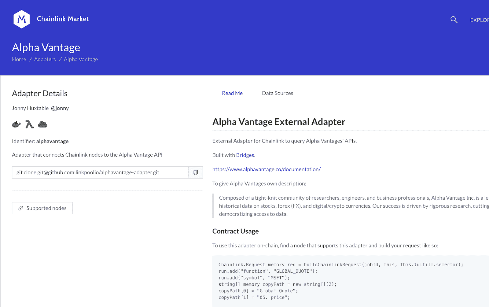

# 构建和使用外部适配器

> 原文：<https://blog.chain.link/build-and-use-external-adapters/>

## 介绍

以太坊的本地语言 solidity 中的 API 调用是将外部数据从链外导入基于智能合约的应用程序的一个很好的方式。Chainlink 的区块链不可知论者和[去中心化的神谕](https://chain.link/education/blockchain-oracles)让各地的开发者可以轻松地将现实世界的数据和事件与区块链世界联系起来。Chainlink 内置核心适配器使得从任何期望的开放 API 配置和验证数据变得容易。

然而，开发人员通常需要额外的灵活性和功能，这是本机核心适配器所不具备的，例如:

1.  API 认证(保持私有 API 密码密钥私有)
2.  私有、低延迟和/或高吞吐量的离线计算以节省气体
3.  将数据写入其他区块链(互操作性)
4.  核心适配器未涵盖的任何所需功能

[外部适配器](https://docs.chain.link/docs/external-adapters)允许访问高质量的数据，并实现将智能合约连接到高级 web APIs 的极大灵活性，并且已经在高度可靠和安全的 oracle 网络中使用，例如在 DeFi 经济中通过 3B+保护的 35+ [价格参考源](https://data.chain.link/)。在本文中，我们将回顾:

1.  什么是外部适配器
2.  如何建立一个
3.  谁应该主持它
4.  如何使用一个

## 什么是外部适配器？

当我们谈到适配器/任务时，有两种类型:

1.  核心适配器
2.  外部适配器

核心适配器是 chainlink 核心节点客户端自带的功能。Httpget、Copy 和 Jsonparse 都是这些核心适配器的例子。在外部适配器中，您可以随意定制 Chainlink oracle networks 的功能。在本文中，我们不会深入讨论连接其他区块链，但是 Chainlink 外部适配器和[外部启动器](https://github.com/smartcontractkit/chainlink/wiki/External-Initiators)的可定制性使得 Chainlink 如此通用，因为它可以配置为与任何区块链一起工作，并且是两个关键组件之一。

现在，请记住，如果我们希望我们的智能合约保持端到端的分散，我们必须记住，其他 oracle 节点也应该能够运行这个外部适配器。可以把外部适配器想象成一个开源包，但是是针对 Chainlink 节点的。这意味着，如果您不想运行某个节点，您可以不运行，但您仍然可以让您的智能合约使用可定制的功能。您可以让其他节点为您托管外部适配器，并且您将看到许多利用 Chainlink 的项目本身不需要运行节点。通过这种方式，智能合同工程师可以专注于分散应用程序的业务逻辑，而让节点操作员专注于运行节点。您可以将您的外部适配器添加到第三方节点列表服务，如 [market.link](https://market.link/) ，或者您可以只通过 [#ask-a-node-operator](https://discord.gg/FSVmJ9p) 来托管您的外部适配器，以便您可以使用它进行测试和构建。

当然，如果你也想[运行你自己的节点](https://docs.chain.link/docs/running-a-chainlink-node)，那么你绝对可以！

## 如何构建外部适配器

### 快速启动

制作外部适配器的最简单的方法之一是让它本身成为一个 API。这样，我们可以使用任何语言以任何我们喜欢的方式定制离线计算，然后您可以简单地进行 API 调用来转换和接收数据。关于如何[制作自己的 API](https://www.codementor.io/@olatundegaruba/nodejs-restful-apis-in-10-minutes-q0sgsfhbd) 有大量的教程，我们将在 nodejs 中查看一个简单的 [Chainlink adapter](https://github.com/thodges-gh/CL-EA-NodeJS-Template) 模板。如果你想从这里开始，我们还有一个 [Python 例子](https://github.com/thodges-gh/CL-EA-Python-Template)。我们将以这次回购为起点。它是一个完全工作的外部适配器，很容易定制成你想要的任何数据。欢迎您从头开始编写自己的代码，但这样会方便很多。

你需要[纱线](https://classic.yarnpkg.com/en/docs/install/#mac-stable)和[节点](https://nodejs.org/en/download/)跟随。首先，将 repo 和 cd 克隆到项目中。

```
git clone https://github.com/thodges-gh/CL-EA-NodeJS-Template.git ExternalAdapterTemplate
cd ExternalAdapterTemplate
```

然后我们安装软件包并启动 API 服务器。

*纱线*

*纱线开始*

这将启动我们的 API/外部适配器服务器。它现在正在监听实体对它的调用。

```
[email protected]: [~/code/ExternalAdapterTemplate -  (master)] $ yarn start
yarn run v1.22.4
$ node app.js
Listening on port 8080!
```

请记住，Chainlink 节点通过一系列适配器运行。一旦它到达它的[适配器/任务列表](https://docs.chain.link/docs/job-specifications#config)中的外部适配器，它将调用正在监听的外部适配器/这个 API。我们可以通过自己调用一个链接节点来模仿它发出请求。

这是一个 [curl](https://curl.haxx.se/docs/httpscripting.html) 命令，它将向我们现在运行的 API 服务器发出一个 Httppost 请求。您可以在本地机器上的新终端窗口中亲自尝试。

```
curl -X POST -H "content-type:application/json" "http://localhost:8080/" --data '{ "id": 0, "data": { "from": "ETH", "to": "USD" } }'
```

*http://localhost:8080/* 是 API 服务器正在监听的 url，*–data*标志旁边的数据是我们需要发送给 Chainlink 节点以理解请求的参数。Chainlink 节点发送具有以下内容的 json 请求:

1.  一个 **id**
2.  一个*数据*对象

它可以简单到:*{ " id ":" 0 "," data ":{ } }*

在我们的*数据*对象中，我们可以清楚地看到我们正在寻找从和*到*的*参数。这些是我们设置的可定制参数，因此外部适配器可以获得大量不同的价格。我们可以看到，当我们运行 curl 脚本时，我们得到了输出:*

```
{"jobRunID":0,"data":{"USD":441.49,"result":441.49},"result":441.49,"statusCode":200}
```

*注意:由于 ETH 的价格会随着时间的推移而变化，因此一些数字会有所不同！*

所有外部适配器都需要用一个 json 对象来响应，该对象至少包含一个:

1.  *jobRunID*
2.  *数据*对象

理想情况下，您还会有一个*状态*和*结果*字段，以使错误处理和获得您想要的结果更容易。在我们的例子中，结果是 *441.49* ，它代表以太坊的当前价格。我们获得这些数据是因为我们的外部适配器实际上也在调用一个 api。它调用的 API 在这里:

*[https://min-api.cryptocompare.com/data/price?fsym=ETH&tsyms =美元](https://min-api.cryptocompare.com/data/price?fsym=ETH&tsyms=USD)T3】*

这个外部适配器实际上是一个包装在 API 周围的 API，API 是外部适配器的通用框架。现在我们知道了它是做什么的，让我们看看它是怎么做的。

### 获取天气数据

*完整的代码和最终解决方案可以在 [PatrickAlphaC 的 Github repo](https://github.com/PatrickAlphaC/openweathermap_cl_ea) 中找到。*

现在让我们开始编辑代码，这样我们就可以从一个新的 API[OpenWeatherMap](https://openweathermap.org/)中获取天气数据。接下来，我们可以通过[在这里免费注册](https://home.openweathermap.org/users/sign_up)来获得一个免费的 API 密匙。一旦我们验证了我们的帐户，我们就可以在这里找到我们的 [API 关键字](https://home.openweathermap.org/api_keys)，以及我们将用于获取一个城市的[当前天气数据](https://openweathermap.org/current)的 API 文档。*注意:注册后，您的密钥可能需要大约 10 分钟才能完全发挥作用。*

我们现在将把当前获取以太网价格的外部适配器调整为获取城市当前温度的外部适配器。

我们将要编辑的 1 个文件是 *index.js* (以及 *test/index_test.js* ，当您进入生产时)。 *app.js* 定义了外部适配器/api 服务器将如何监听请求，我们现在可以忽略它。在我们之前的*数据*对象中，我们使用了从和*到*的 2 个参数*。我们可以通过更新 *customParams* 来选择我们的自定义参数列表:*

旧自定义参数:

```
const customParams = {
 base: ['base', 'from', 'coin'],
 quote: ['quote', 'to', 'market'],
 endpoint: false
}

```

新的自定义 Parmas:

```
const customParams = {
 city: ['q', 'city', 'town'],
 endpoint: false
}
```

这样，我们可以输入*城市*、*城镇*或 *q* ，它们都表示*城市*。

createReqeust 常量是最神奇的地方，也是我们需要获取 URL 的地方。如果我们查看[天气数据文档](https://openweathermap.org/current) n，我们可以看到一个示例字符串看起来像是【https://api.openweathermap.org/data/2.5/weather?q=】T4<城市名称>T8】appid =<YOUR _ API _ KEY>T5】

我们可以通过输入您的 [API 键](https://home.openweathermap.org/api_keys)并让城市名类似于 *boston* 来测试这个 API，然后将 URL 粘贴到您的浏览器中(如果您得到错误消息说您的 API 键无效，请再等几分钟)。

有了这个网址，我们现在知道了我们需要更新的几件东西:

旧:

*const endpoint = validator . validated . data . endpoint | | ' price '*

新:

*const endpoint = validator . validated . data . endpoint | | ' weather '*

旧:

*const URL = ' https://min-API . crypto compare . com/data/$ { endpoint } '*

新:

*const URL = ' https://API . openweathermap . org/data/2.5/$ { endpoint } '*

现在我们要添加我们的参数。我们的两个参数将是我们想要的城市(根据文档，这是 *q* )和我们的 API 键(` appid `)。

对于城市，我们可以只编辑旧行:

*const fsym = validator . validated . data . base . toupper case()*

收件人:

*const q = validator . validated . data . city . toupper case()*

然而，我们不想将 API 键硬编码到我们的代码中。

### API 认证

相反，我们想要做的是改变这条旧路线:

*const tsyms = validator . validated . data . quote . toupper case()*

这一新系列:

*const appid = process . env . API _ KEY；*

并将我们的 API 密钥放入一个*中。envrc* 文件。我们想把我们的 API 密匙放在源代码之外，所以我们创建了一个*。envrc* 文件如下所示:

*导出 API _ KEY =<YOUR _ KEY _ HERE>T1】*

记得加到*里。gitignore* ！如果您在运行下面的 curl 进行测试时遇到问题，您也可以在您的终端中运行*export API _ KEY =<API _ KEY>*。

*注意:你可以在找到更多关于[环境变量的信息。](https://www.twilio.com/blog/2017/01/how-to-set-environment-variables.html)*

然后，我们只需要从以下位置更新参数:

```
const params = {
   fsym,
   tsyms
}
```

收件人:

```
const params = {
  q,
  appid
}

```

并更新我们的结果:

*response . data . result = requester . validate result number(response . data，[tsyms])*

收件人:

*response . data . result = requester . validate result number(response . data，['main '，' temp'])*

我们都完成了！天气 API 的输出将温度映射到*主*对象的 *temp* 键中，这就是为什么我们有这样的 *response.data.result* 变量。

就这样，您现在有了一个工作的 API 密钥认证的外部适配器！

现在让我们试着调用我们的 api。*curl-X POST-H " content-type:application/JSON " " http://localhost:8080/"–data ' { " id ":0，" data": { "city": "Boston"} }*

样本响应:

*{"jobRunID":0，" data":{"coord":{"lon":-71.06，" lat":42.36}，"天气":[{"id":804，" main":"Clouds "，" description ":"阴云"，" icon":"04d"}]，" base":"stations "，" main":{"temp":296.81，" feels_like":298.49，" temp_min":295.15，" temp _ max ":297.7*

厉害！看起来成功了！为了理解它，我们这里有了链节节点需要的所有关键部分。你可以清楚地看到，这是一个伟大的方式做工作的链外。作为智能契约的一部分，你可以做一些计算量非常大的工作，然后把答案粘贴回链上。

既然我们已经完成了这个外部适配器，那么我们如何让一个 chainlink 节点来托管它呢？我们怎么能从那里打电话呢？我们将跳过自己实际托管外部适配器，因为我们实际上并不需要这样做。在我们的 *index.js* 的底部，有一些很好的包装器，非常适合节点操作者通过无服务器函数部署代码。所以我们可以做一些事情:

1.  将适配器添加到第三方节点列表服务，如 [market.link](https://market.link/)
2.  请一个节点运营商托管我们的适配器([# ask-a-node-operator discord](https://discord.gg/FSVmJ9p))
3.  我们自己运行一个节点(没有必要)

如您所见，您甚至不必运行节点就可以使用您的自定义外部适配器。这很理想，因为我们希望其他 oracle 节点可以使用我们的适配器，这样我们就可以有许多节点访问数据。这使得链式网络高度分散。

我们将在另一个视频/博客中讨论如何托管外部适配器。现在，如果您已经创建了一个新的适配器，请与一个节点共享它并加入社区！

## 使用外部适配器

假设一个节点现在托管您的外部适配器，让我们找到它并使用它将数据放入我们的智能合约。对于这个例子，假设我们构建了 [Alpha Vantage](https://www.alphavantage.co/) 外部适配器。Alpha Vantage 是一个股票和加密数据 API，也需要一个 API 密钥。让我们看看我们是否可以通过由 [Linkpool 的](https://www.linkpool.io/) Kovan node 托管的外部适配器获得 TSLA 的价格。为了找到它，我们可以通过[适配器](https://market.link/search/adapters)页面找到公开上传的适配器。我们可以滚动这个页面，直到找到我们想要的适配器，比如 [Alpha Vantage 外部适配器](https://market.link/adapters/30861015-8da4-4f24-a76b-20efaf199e28)。




<figcaption id="caption-attachment-810" class="wp-caption-text">Alpha Vantage 外置适配器</figcaption>


它描述了外部适配器的所有功能。然后我们可以点击[支持的节点](https://market.link/search/nodes?adapterId%5B0%5D=30861015-8da4-4f24-a76b-20efaf199e28)按钮，看看谁支持它。我们可以看到有一个节点支持它，我们可以在[工作页面](https://market.link/jobs/96975a83-7b2c-48f7-b707-c4e6084463e5)找到它的详细信息。您将会看到它正在使用它的适配器/任务列表中的 Alpha Vantage 适配器。

现在要使用它，我们只需像平常一样获取作业 ID 和 Oracle ID，并将其添加到我们的代码中。我们现在可以添加 Alpha Vantage 文档的所有参数。

```
bytes32 jobId =  “802ec94e00184b789a016b8e71ae9fb4”;
address oracle =  0x56dd6586DB0D08c6Ce7B2f2805af28616E082455;

function requestTSLAPrice() public {
    Chainlink.Request memory req = buildChainlinkRequest(jobId, address(this), this.fulfillEthereumPrice.selector);
    req.add("function", "GLOBAL_QUOTE");
    req.add("symbol", "TSLA");
    string[] memory copyPath = new string[](2);
    copyPath[0] = "Global Quote";
    copyPath[1] = "05\. price";
    req.addStringArray("copyPath", copyPath);
    req.addInt("times", 100000000);
    sendChainlinkRequestTo(oracle, req, fee);
}
```

下面是 remix 中的[完整代码，供你尝试。您也可以使用任何 API 文档](https://remix.ethereum.org/#version=soljson-v0.6.6+commit.6c089d02.js&optimize=false&gist=f856530b20943e92ed6cc69c1285cdfe&evmVersion=null)在[中跟进，因为在这一点上，一切都和您已经知道的一样！](https://docs.chain.link/docs/request-and-receive-data)

## 摘要

正如您所看到的，外部适配器是非常强大的工具，我们可以用它来让您的智能合约更加智能和互联。API 认证、离线计算是其他第二层解决方案，它们都可以通过外部适配器的灵活性来实现。如果你在这里学到了新东西，为什么不在 [Chainlink 黑客马拉松](https://hack.chain.link/)上试试你的技能呢？我们将颁发超过 40k 美元的奖金，我们强烈建议您参加。

如果你在黑客马拉松结束后阅读这篇文章，一定要加入到 [Twitter](https://twitter.com/chainlink) 、 [Discord](https://discord.gg/Szt3FYj) 或 [Reddit](https://www.reddit.com/r/Chainlink/) 的社区中，并用#chainlink 和#ChainlinkEA 标记你的回复。您可以了解最新的 Chainlink 活动，这样您就可以尝试您的技能了！

如果你正在开发一个可以从 Chainlink oracles 中受益的产品，或者想要帮助 Chainlink 网络的开源开发，请访问[开发者文档](https://docs.chain.link/)或者加入关于 [Discord](https://discordapp.com/invite/aSK4zew) 的技术讨论。