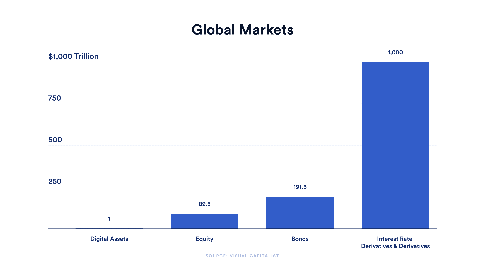
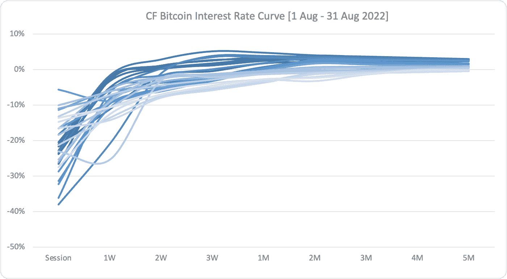
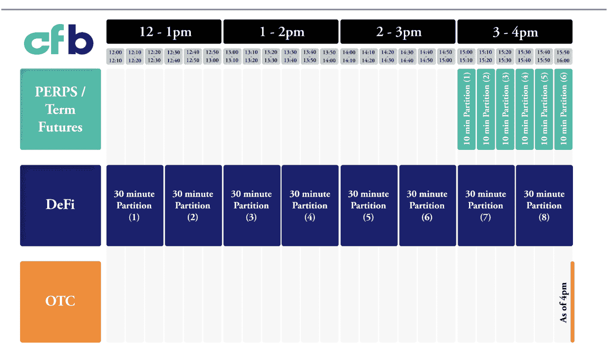

# Chainlink 和 CF 基准推出 CF 比特币利率曲线(CF BIRC)

> 原文：<https://blog.chain.link/cf-bitcoin-interest-rate-curve-cf-birc/>

Web3 经济的增长是非凡的，数字资产 [的总市值首次达到 1 万亿美元](https://coinmarketcap.com/charts/) 这是在这一资产类别诞生十多年后。随着 [分散金融(DeFi)](https://chain.link/use-cases/defi) 的日益普及，以及迎合个人和机构需求的日益复杂的金融产品的兴起，支持智能合约经济的基础设施需要跟上不断增长的需求。

然而，与传统金融相比，数字资产债务市场的规模微不足道。部分原因是缺乏行业范围的基准来帮助参与者做出数据驱动的决策和更好地管理风险。

<figcaption id="caption-attachment-4634" class="wp-caption-text">The size of digital asset markets is small compared to traditional markets. [Source](https://www.visualcapitalist.com/all-of-the-worlds-money-and-markets-in-one-visualization-2020/)</figcaption>

在构建和管理债务产品时，有关利率的信息不对称会导致次优结果。对基准利率缺乏共识会妨碍确定资产估值的能力，并可能导致糟糕的风险分配措施。这也是缺乏高效利率衍生品市场的一个重要因素。这种不确定性对传统金融机构来说是无益的，并阻碍了数字资产市场的采用，直到可以参考基本利率等全市场信息标准。

为了帮助解决这个问题， **Chainlink 和**[T5】CF Benchmarks](https://www.cfbenchmarks.com/)**正在合作推出 Web3 经济中的首款产品:CF 比特币利率曲线——与 Chainlink (CF BIRC)合作。**

CF BIRC 是一个可复制的、具有市场代表性的、抗操纵的基准，提供了一系列到期日的当前和预测比特币利率的标准市场衡量标准:1 天、1 周、2 周、3 周、1 个月、2 个月、3 个月、4 个月和 5 个月，随着债务市场开始对更长的未来风险进行定价，未来版本将覆盖更长的到期日。

<figcaption id="caption-attachment-4533" class="wp-caption-text">CF BIRC interest rate curve. Source: CF Benchmarks/Chainlink</figcaption>

CF BIRC 的引入旨在实现更可预测的借贷、更高的资本效率以及数字资产衍生品市场发展的更坚实基础。重要的是，CF BIRC 还寻求通过提供比特币利率的标准化基准，让金融机构能够参与数字资产市场。

## 利率在经济中的作用

利率是一个富有成效、不断增长的经济的基础。这些经济指标代表借款人向贷款人支付的百分比费用，基于贷款人对他们将收回本金的信心水平。当利率高时，借钱的成本更高，当利率低时，借钱的成本更低。通过债务进入经济的资源可以用来推动生产率的提高和经济增长。利率也显示了参与者对整体经济的信心。但市场如何知道什么才算廉价或昂贵的借贷方式呢？

利率基准——有时称为基本利率——是建立债务市场的基本工具。这些基准被用作一系列期限的利率风险指标，通常从一天到数年不等。利率基准最广为人知的例子是 [【伦敦银行同业拆放利率】](https://www.theice.com/iba/libor) ，它定义了全球银行相互拆借的基准利率。

LIBOR 让市场对什么是好的借贷利率有了明确的认识。如果参与者没有一个基准来衡量他们的利率，那么建立信任和维持经济的长期增长就会变得更加困难。伦敦银行同业拆放利率和其他类似的基准利率——比如它的继任者——担保隔夜融资利率(SOFR)——让人们对银行间拆借利率有了明确的认识，这就是为什么它们对全球借贷市场的增长至关重要。

## CF BIRC:比特币利率的北极星

CF BIRC 是基础金融基础设施，旨在帮助推动[【web 3】](https://chain.link/education/web3)走向下一波应用浪潮。作为比特币债务市场的全市场基准，CF BIRC 允许参与者衡量他们收到的利率，并对冲利率风险。在 CF BIRC 之前，没有行业范围的利率基准，让投资者能够有意义地识别数字资产市场中跨平台的利率风险。如果没有一个好的市场范围的比较，风险就会被误判，资本不会被有效地分配，市场的发展也会受到阻碍。

作为全市场利率基准，CF BIRC 引入了几大好处:

*   **透明度**—贷款人和借款人都有可用的市场基准，并可以在做出市场决策时将其用作基本利率。
*   **一致性**—曲线的标准化方法和每日汇率为数字资产市场的涨落引入了更多的一致性和可预测性。
*   **清晰度**—市场参与者可以根据当前和预测的基准利率，更好地量化使用某些协议和产品的风险。

CF BIRC 的推出对数字资产市场意义重大，因为利率对更广泛的金融市场有着巨大的影响。利率是任何估值模型的核心输入，DeFi 协议将价格风险纳入收益率。然而，如果没有基准可以比较，参与者基本上必须猜测他们的利率风险水平，同时考虑到 [智能合约](https://chain.link/education/smart-contracts) 风险、特定协议的利用风险和其他市场风险。

CF BIRC 背后的方法旨在确保以下指导原则:

*   费率应代表经济现实；
*   结果应可被市场参与者复制；和
*   曲线的计算应该是防篡改的。

CF BIRC 整合了广泛的数据来源，包括场外借贷柜台、DeFi 借贷池和永久期货市场，使曲线反映了整个比特币借贷市场。

<figcaption id="caption-attachment-4534" class="wp-caption-text">The data inputs feeding into the calculation of CF BIRC.</figcaption>

透明度和独立复制利率的能力对于创建行业基准至关重要。基于 Chainlink 提供高质量链上数据的行业标准基础设施和 CF Benchmark 多年来产生可靠基准数据的经验，CF BIRC 是比特币和 DeFi 市场的公共产品，可以在此基础上建立全新的金融产品和服务。

## 参考 CeFi 和 DeFi 的 BIRC 示例用例

作为可靠、透明、可复制的全行业比特币利率基准，CF BIRC 开启了 Web3 经济中企业级金融服务的众多用例。

### 借贷

准确的利率对于创建固定收益工具和标准化风险管理实践至关重要。没有行业特定的利率基准，市场参与者可能会使用 LIBOR 加上任意溢价来计算数字资产市场的利率风险。随着 CF BIRC 的引入，OTC 柜台、金融机构和 DeFi 贷款协议有了一个 Web3 原生基准来整合到他们的模型中。

### 利率互换

利率互换是传统市场中最受欢迎的利率衍生品，因为它们可以实现固定利率风险和浮动利率风险的互换，让参与者有效地对冲利率风险。此外，还有许多基于基本利率的衍生产品，如期权和期货合约。

数字资产市场的大部分利率风险是浮动的或可变的。DeFi 中可用的利率互换使用提供固定风险的协议，而不是由市场参与者设定的单独定义的风险参数。这种没有利率基准的单边风险使得评估利率对冲策略的有效性具有挑战性。

CF BIRC 开启了数字资产利率互换的可能性。一旦利率互换市场具备最佳流动性条件，企业将拥有更有效的工具来降低数字资产市场的利率风险。

### 资产评估

利率是大多数估值模型的关键输入，在确定货币时间价值(TVM)方面发挥着重要作用。全行业利率基准有助于期货和期权交易所以及 [自动做市商(AMM)](https://blog.chain.link/automated-market-maker-amm/) 协议应用更有效的风险管理实践。

## 市场参与者如何使用 CF BIRC？

CF BIRC 作为一个市场范围的基准，数字资产市场参与者有了一个帮助辨别利率风险的工具。但是特定用户如何从参考 CF BIRC 中受益呢？

**场外柜台经理** 可以:

*   CF BIRC 通知的长期贷款合同的报价。
*   在引入个人和机构投资者时，考虑抵押水平和利率风险因素。
*   利用已知的加密数据设定借贷利率，而不是依赖传统的金融基础利率。

**DeFi-native 用户** 可以:

*   利用 CF BIRC 作为经济指标和利率基础利率。
*   根据 CF BIRC 评估 OTC 和 LP 利率进行借贷。
*   在考虑基础利率后，根据收益率发放贷款时，寻找风险因素。

**衍生品交易员** 能:

*   在签订衍生产品合同之前评估利率风险。
*   使用市场利率计算资产估值，尤其是在涉及期限较长的工具时。
*   通过使用 CF BIRC 利率签订利率互换合同来对冲利率风险。

**Web3 建筑商** 能:

*   创建得到广泛认可的利率风险指标，帮助推动机构采用。
*   通过进入一个可以使用基本利率的新兴掉期市场来参与做市。

## 如何开始使用 CF BIRC

CF BIRC 是一个链上交付的链数据馈送，根据与其他链数据馈送相同的安全和防篡改标准构建，这些链数据馈送[有助于在智能合约经济中保护](https://blog.chain.link/chainlink-price-feeds-secure-defi/)数百亿美元的价值。

如果要整合 Chainlink， [设置一个叫](https://chainlinkcommunity.typeform.com/to/lTFQ5fdJ) 的专家。