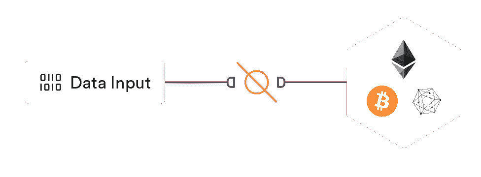
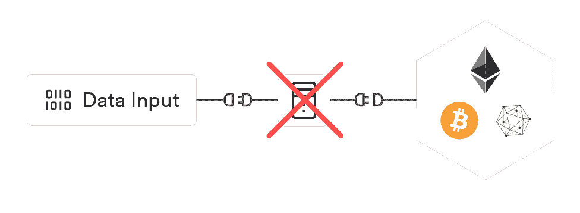
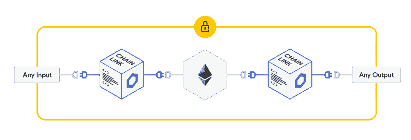
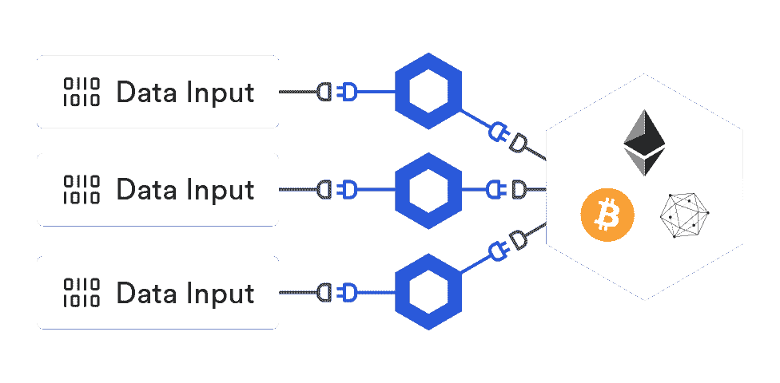
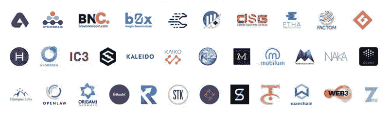
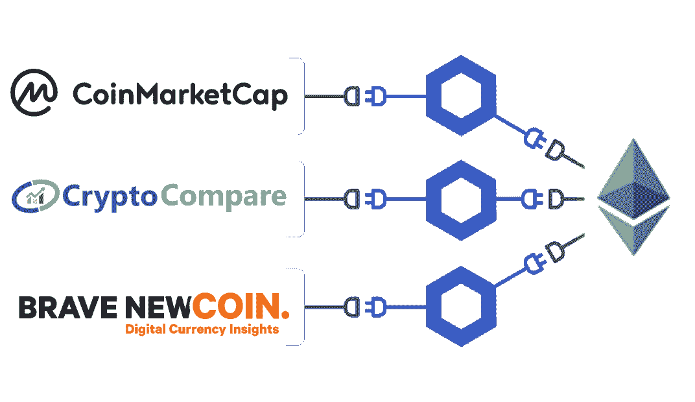
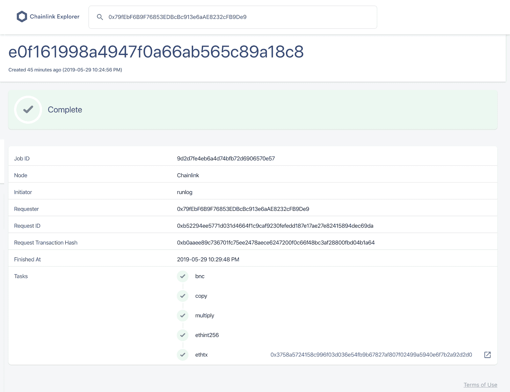
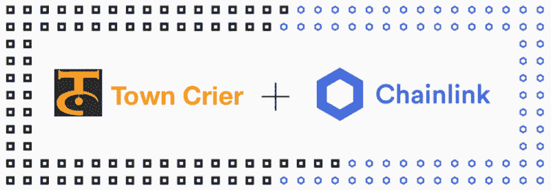
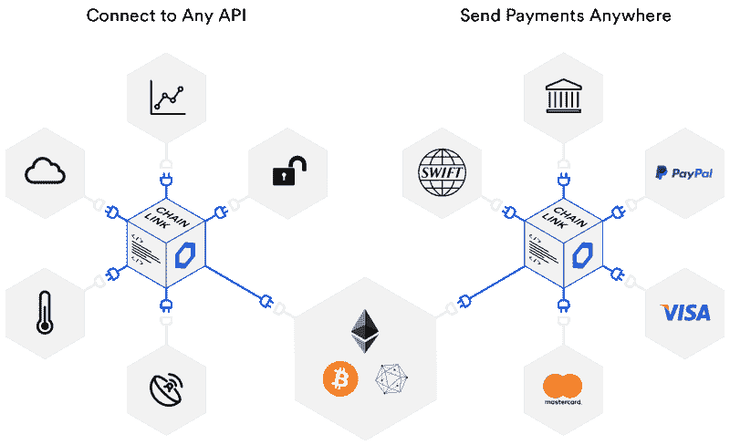

# Chainlink:以太坊互联共识

> 原文：<https://blog.chain.link/chainlink-connected-consensus-on-ethereum/>

首先，我和整个团队要感谢每一个为 Chainlink 的成功贡献了个人时间、努力和优秀代码的人。我们非常感谢我们所有的支持者、社区成员和[节点运营商](https://blog.chain.link/what-is-a-chainlink-node-operator/)，他们都在帮助智能合同实现其全部潜力。

在本帖中，我们将详细介绍我们在以太坊主网上发布的 Chainlink。为了更清楚地说明 Chainlink 的推出对更大的智能合约生态系统可能意味着什么，我们将简要考察我们认为智能合约的独特之处，为什么解决" [oracle 问题](https://blog.chain.link/what-is-the-blockchain-oracle-problem/)"是其发展的关键下一步，以及 Chainlink 如何在今天、近期和长期寻求解决智能合约的这一限制。

## 智能合约的独特价值

一个[智能契约](https://chain.link/education/smart-contracts)是一个数字协议，通过在以太坊这样的防篡改/分散节点网络上运行，它变得非常可靠。

智能合同创造了一种全新的、博弈理论上更优越的协议形式，这种协议是确定性的，并通过加密手段保证其合同条款的正确执行。一个合同的实际结果的能力，例如支付给正确的一方，是由密码学保证的，这是一个全新的社会形成可靠协议的方法。例如，比特币的所有权得到了密码保障，这是其他资产所有权从未得到过的保障。

在一份合同中，你被密码/确定性地(100%)保证收到你所欠的东西，而在另一份合同中，你只有在另一方愿意支付时(X%的情况下)才能收到你所欠的东西，这两者之间的显著区别不能被夸大；因为合同能否按预期发挥作用决定了它是否被签署(例如，新兴国家是否存在农作物保险)，以及合同是否无法防止欺诈会产生重大的个人甚至社会后果(例如，2008 年的金融危机)。

简而言之，智能合约的极端可靠性/确定性使它们能够以全新的价值和可信度发挥作用。我们的目标是在构建和使用智能契约时保持这种极端可靠性/确定性的属性。

## 扩展智能合约的功能

如果我们将这种极端可靠性的概念应用到比特币等资产的所有权和移动之外，我们会发现一种真正可靠的合同订立方法将产生深远的影响。我们可以将智能合同应用于行业中各种容易发生欺诈/失败的协议，如[保险](https://blog.chain.link/blockchain-insurance/)(通常不向保单持有人付款)、国际贸易(通常让供应商延迟付款或从不付款)和金融(存在错误或欺诈性协议，如导致 2008 年危机的各种金融合同)。

一旦我们考虑了智能合约在这些行业中的实际运作方式，我们就会得出一些简单明了的结论，即智能合约需要如何运作:

*   要编写的关于特定合同事件(如货物交付、市场事件或保险事件)的智能合同需要知道事件发生的时间。
*   智能合约需要在对协议履行证据做出反应时保持极高的可靠性，以便保留其极高可靠性的独特价值。
*   **智能合同无法自行访问有关事件的数据馈送**，需要从真实/“链外”世界获得有关合同执行的数据。

这三点说明了当前阻止编写更高级的智能合约的问题，Chainlink 为此提供了一个解决方案。

<figcaption id="caption-attachment-364" class="wp-caption-text">Smart contracts are unable to connect with key external resources like off-chain data and APIs.</figcaption>

当开发人员开始实现他们选择的智能合约时，他们会遇到一个由安全模型造成的问题，该安全模型使他们的智能合约首先是安全的:他们的智能合约无法与关键的外部资源(如链外数据和 API)连接。这种外部连接的缺乏是由于如何围绕区块链的交易数据达成共识，使其成为所有智能合约网络的问题。

<figcaption id="caption-attachment-366" class="wp-caption-text">Using a single oracle destroys the smart contract’s reliability with a “single point of failure.”</figcaption>

一旦我们认识到智能合约不能从任何来源请求任何类型的数据输入，我们就会直觉地想到最初的解决方案，即以单个“oracle”的形式指定一个“单个可信第三方”。在最不可靠/最不安全的设置场景中，该 oracle 甚至可能由交易中涉及的一方运行，从而产生明显的利益冲突。我们很快意识到，拥有完全控制合同的“单一可信第三方”会引入新的同样重要的单点故障，从而破坏智能合同提供的安全性、可靠性和基本价值。

不管被触发的智能合约在其运行的网络方面有多可靠，如果向智能合约提供数据的 oracle 是不可靠的，或者处于交易中一方的单方面控制之下，则整个智能合约不再具有极端的可靠性/确定性。

## 智能合约的端到端可靠性

<figcaption id="caption-attachment-368" class="wp-caption-text">End-to-end reliability is what users seek from smart contracts, even when externally connected.</figcaption>

Chainlink 网络的目标是使智能合同能够连接到它们运行所需的所有外部输入和输出，同时保持使它们独特有用的极端可靠性。在与许多开发人员、Dapp 团队和各种规模的企业合作后，我们观察到，像 smart contracts 这样的技术(它宣传自己非常可靠)的用户不希望 smart contracts 的架构只有一部分是可靠的，而其他部分完全失败。对于向智能合约投入大量价值的用户来说，他们希望控制该价值的各种系统具有“端到端的可靠性”。

<figcaption id="caption-attachment-369" class="wp-caption-text">Using Decentralization, Chainlink seeks to maintain the same type of reliability as smart contracts.</figcaption>

Chainlink 解决“单一可信第三方”问题的方法使用了保护智能合同本身的相同方法:分散计算。链式网络允许多个独立节点在将外部输入写入智能合同之前，对其准确性进行分散计算。一旦我们在区块链中间件/oracle 级别实现了去中心化，我们就可以继续去中心化数据提供者/来源级别，假设有多个来源提供相同的数据，例如加密货币价格。我们的方法是建立一个分散的 oracle 网络，使智能合同输入变得可靠，详情请见[此处](https://link.smartcontract.com/whitepaper)。

<figcaption id="caption-attachment-370" class="wp-caption-text">With multiple announced users, and many more in development, reliable oracles are clearly in demand. Image Credit @TheLinkMarine1</figcaption>

随着 Chainlink 网络在以太坊上线，我们将提供一个由多个独立节点运营商运行的分散式 oracle 网络，以及将这些单独的结果合并到单个智能合同输入/触发器中的分散式计算方法。我们很高兴在本月推出 Chainlink 的初始版本，这基于三个关键因素:我们成功完成了[三项独立的安全审计](https://github.com/smartcontractkit/audits)，完成了内部各种可扩展性和压力测试，以及对高度可靠/分散的 oracle 机制的需求明显增加，该机制是设计和实施各种智能合同/dapp 的关键构建模块。

<figcaption id="caption-attachment-371" class="wp-caption-text">Chainlink’s reference data contract will utilize multiple oracles to provide price data from multiple sources.</figcaption>

可靠的市场价格，特别是加密货币价格，将是以太坊上第一批可用的去中心化 oracle 网络之一。在传统金融行业，市场价格通常被用来决定数万亿美元贷款、[衍生品](https://blog.chain.link/solving-deep-seated-trust-problems-in-derivatives-using-chainlink-enabled-smart-contracts/)和其他金融产品的结果。随着这些金融产品通过越来越受欢迎的[去中心化金融(DeFi)](https://chain.link/education/defi) 运动在链上迁移，它们也将需要消费“链上”市场价格变化作为可靠的触发机制，以确定其适当的结果。由于当今许多分散式金融产品都将加密货币社区作为早期采用者，因此对可靠的加密货币链上价格的需求尤其迫切/必要，这些链上金融产品就是围绕这些价格构建的。

我们从广泛有用的价格数据开始，如 ETH 对美元的兑换率，我们将以完全分散的方式在数据源和区块链中间件/oracle 级别提供这些数据。我们将使用三个独立的数据源通过三个独立的节点操作符来启动这个 oracle 网络。我们计划通过增加四个高质量的价格数据提供者，并最终达到 21 个 Chainlink 节点，来扩大数据来源级别和 oracle 级别的分散化级别。在接触到七个独立的数据源和 21 个经过技术审查和身份验证的节点运营商后，我们将征求社区/用户的反馈，以考虑进一步扩展这一分散的 oracle 网络，同时保持数据源和独立节点运营商的高水平安全性和可靠性。欢迎以太坊主网的所有智能合约/dapp 开始使用我们的市场参考数据合约[这里](https://docs.chain.link/docs/using-chainlink-reference-contracts)，任何人都可以在这里看到正在更新的合约[。](https://explorer.chain.link/job-runs?search=0x79fEbF6B9F76853EDBcBc913e6aAE8232cFB9De9)

我们的团队很高兴能成为正在形成的去中心化金融和智能合同革命的有用的一部分。我们从现有用户和 DeFi 社区中的许多其他人那里听说，他们产品的可靠 oracles 将有助于加快他们的路线图，将我们一直努力实现的激动人心的智能合同驱动的未来变为现实。就像这些团队中的许多人依赖以太坊来确保他们的智能合约的安全性和可靠性一样，我们正在努力提供一种 oracle 机制，这种机制将进一步支持他们正在构建的内容和/或增加他们现有智能合约/Dapp 的安全性。我们鼓励每个人建立一个智能合同或 Dapp，需要可靠的神谕，让我们知道如何通过[电子邮件](/cdn-cgi/l/email-protection#51222421213e232511323930383f7f3d383f3a)、 [Gitter](https://gitter.im/smartcontractkit-chainlink/Lobby) (技术聊天)或[联系请求](https://chainlink.typeform.com/to/gEwrPO)来帮助我们。如果您的智能合同需要具体的价格数据，请在这里告诉我们[。我们将根据社区的要求选择下一步要推出的价格对。](https://chainlinknodes.typeform.com/to/FJ9LZu)

## 成为链环节点操作符

由于 Chainlink 专注于提供可靠的分散式 oracle 网络，我们坚信组成这些网络的各个节点运营商的安全性、可靠性和独立性都是关键的成功因素。即使 Chainlink 的软件被认为是安全的，节点操作员仍有责任在安全的环境中正确运行该软件，并准确表示 oracle 网络中实际受其控制的节点数量。为了平衡智能合同开发商对实时/工作 oracle 网络的需求以及节点运营商的可靠性和独立性，我们确定了两种不同的方式，Chainlink 节点运营商可以在网络的早期阶段为 Chainlink 的用户提供额外的安全性和可靠性保证。

### Sybil 抗性和基础设施审查的重要性

在 Chainlink 网络的初始阶段，我们认为最可靠的 Chainlink 节点将是那些经过 Chainlink 团队(或另一个被认为有能力评估节点运营商基础设施质量的团队)技术审查和可选身份审查的节点，以确保其节点独立于网络中的其他节点。随着越来越多的节点和事务出现在链式网络上，确定节点可靠性的更自动化的方法将变得可能并继续被实现。

我们的文档中详细介绍了技术审查流程，旨在帮助确保节点运营商能够安全可靠地运行链节节点:

*   针对一组测试契约，在 testnet 上成功运行了一个 Chainlink 节点，证明了一个节点操作符可以可靠地运行一个节点。
*   被添加到 Chainlink Explorer 中进行正常运行时间检查，提供关于节点操作符正常运行时间的更多细节。
*   与 Chainlink 团队成员一起进行简短的基础架构审查，检查可靠性和安全性所需的基础架构(备份系统)和安全性(私钥)最佳实践的清单。

我们还打算为节点运营商提供可选的身份审查，旨在保护 oracle 网络的用户免受分散式计算基础设施中最常见的攻击媒介: [sybil 攻击](https://en.wikipedia.org/wiki/Sybil_attack)。一个人隐藏在匿名背后假装自己是多个独立节点的能力可以让他们接管 oracle 网络，而无需克服更复杂的技术或安全障碍。通过在链式网络的早期阶段提供基本级别的身份审查，我们可以采取关键步骤来努力避免 sybil 攻击，从而使链式网络的用户能够进一步确保他们所依赖的节点确实是相互独立的。

当 Chainlink 在以太坊上发布时，我们将在文档中列出多个经过技术审查的 sybil 抗性节点。在接下来的几周和几个月里，我们的目标是通过不断发展/改进的过程来增加更多高质量的节点运营商。不愿意接受全面技术审查或 sybil 抗性/身份验证的节点运营商当然也将包括在 Chainlink 网络中。除了目前由 Chainlink 社区开发的文档之外，还有多个列表服务供用户选择 chain link，我们希望存在多个列表服务，用户可以根据各种可靠性措施选择 chain link。

## Chainlink 的持续发展

链式网络的独特价值在于它能够提供可证明可靠的单个 oracle，这些 Oracle 可以安全有效地组合成不同规模的 Oracle 网络。为了实现这一目标，Chainlink 需要不断改进关键方面，使用户能够选择高质量的单个节点运营商，将这些节点聚合到抗 sybil 的 oracle 网络中，并提供安全保证，使 oracle 网络能够充当可靠的智能合约触发器。

<figcaption id="caption-attachment-373" class="wp-caption-text">The Chainlink Explorer provides detailed information and closely tracks data about the fulfillment of specific oracle requests.</figcaption>

Chainlink 网络将继续努力，通过提供有关节点如何满足其过去和当前请求的数据，允许用户选择高质量的 oracles。Chainlink Explorer 是我们与以太坊主网联合推出的关键初始工具之一。该浏览器旨在深入了解链节节点在两个关键维度上的作用:

*   提供关于链节节点满足用户请求的详细信息。显示节点的链外活动和链上结果，使智能合约开发人员能够深入了解负责触发其合约的系统是如何执行的。
*   汇总有关连接到浏览器的所有 Chainlink 节点操作符的链外活动和链内活动的可靠性和速度的数据。通过收集关于 Chainlink 节点运营商在多个关键维度上的表现的详细数据，我们能够根据真实的交易数据，开始构建一个关于 Chainlink 信誉系统如何工作的知情方法。

随着 Chainlink explorer 功能的扩展，我们希望提供关于单个节点运营商履行其过去承诺的更多信息，这些合同/dapp 使用了特定的 Chainlink(实施信任网络模型),以及关于节点运营商正常运行时间和可靠性的各种指标。随着 Chainlink 网络的真实交易的增长，我们期待着通过向用户提供他们所选择的 Oracle 的性能以及他们可能用来选择未来 Oracle 的度量标准，来增加关于 Oracle 可靠性的可验证证据的数量。

一旦开始出现一个更加数据驱动的框架，用于根据真实世界的交易选择节点操作符，那么这些节点操作符将需要形成 oracle networks，以实现去中心化。为了在高度分散的 oracle 网络中实现这种安全级别的聚合和效率，我们一直忙于改进 Oracle 之间的聚合形式。结合 Chainlink 在以太坊主网上的发布，我们很高兴地展示了一种在 Chainlink 中利用[阈值签名的新方法，它允许我们高效地创建由数百甚至数千个节点组成的高度分散的 oracle 网络。链式门限签名方案的主要优点是，这些先知能够在链上验证他们的签名(一个关键的安全要求),我们认为这种方式比现有方法的效率要高几个数量级。通过使大型分散式 oracle 网络变得足够有效，我们希望一旦有足够大的高质量独立节点运营商集合，这些新的效率水平将使大型分散式 oracle 网络的创建成为向高价值智能合同提供高度可靠输入的首选方法。](https://blog.chain.link/threshold-signatures-in-chainlink/)

除了足够分散的高质量 oracles 之外，Chainlink 还寻求在两个更关键的方面表现出色。

<figcaption id="caption-attachment-377" class="wp-caption-text">Town Crier, the leading production use of TEEs for oracles, was acquired by Chainlink in 2018.</figcaption>

可信执行环境(TEEs)与分散计算的结合为单个节点操作者提供了更高程度的安全性。TEE 的一个主要好处是，节点操作符执行的计算可以对节点操作符自己保密。这降低了任何一个节点操作员篡改计算的可能性，从而提高了 oracle 网络的整体可靠性。我们很高兴去年年底收购了 [Town Crier](https://forbes.com/sites/darrynpollock/2018/11/01/cornells-town-crier-acquired-by-chainlink-to-expand-decentralized-oracle-network/) ,将其纳入 Chainlink 作为我们的 tee 方法，并积极致力于以极大地有利于智能合同的方式合并 tee 和分散式 oracle networks。我们鼓励你在这里阅读更多关于《小镇呐喊》[的内容。](https://eprint.iacr.org/2016/168.pdf)

<figcaption id="caption-attachment-381" class="wp-caption-text">Chainlink seeks to become the largest source of smart contracts inputs and outputs.</figcaption>

Chainlink 试图创造的智能合约开发的未来状态是，智能合约以与 web 应用程序相同的速度构建。与拥有大量市场数据、事件、支付和各种其他可用 API 的 web 开发人员类似，智能合约开发人员应该拥有类似的易于利用的输入和输出集合。Chainlink 积极致力于成为智能合同的目标，以便轻松找到、快速实施大量预制外部输入和输出，并以链上合同的形式安全地与之交互，他们可以轻松安全地向这些合同发出特定请求。

如果您是 smart contract 开发人员，并且需要适当安全的输入或输出以使您的 smart contract 正常运行，[请联系我们](https://chainlink.typeform.com/to/gEwrPO)，因为我们和我们的整个社区都在积极地优先考虑并继续努力使这些输入对您可用。

## 成长链环

整个团队和我都非常感激有一个激动人心的、有洞察力的、真正感兴趣的社区，它看到了我们所构建的东西的长期价值。谢谢你的支持。

我们也很高兴建立了一个分享这种真正兴趣的伟大团队，我们正在慢慢发展，以使下一代智能合同成为现实。如果你是一名对开源社区环境感兴趣的软件工程师，我们欢迎你加入我们的 [Github](https://github.com/smartcontractkit/chainlink) 。我们还计划推出一项研究奖学金/资助计划。如果你想通过工程、产品管理、市场营销、设计、开发者布道或更多途径与我们一起建立 Chainlink，请点击这里查看我们的[职业机会](https://careers.chain.link/)。

我们的整个团队都很高兴能成为建设一个真正去中心化的未来的一部分，如果你也对这个未来感兴趣，我们也很高兴收到你的来信。