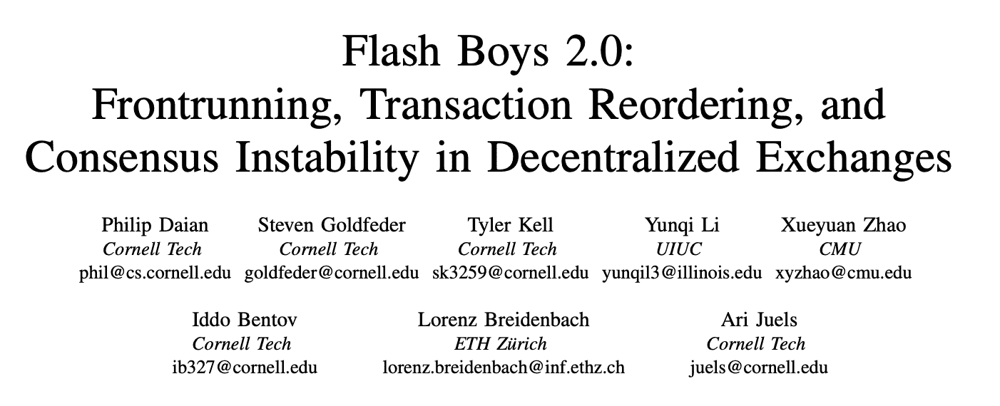

# 公平测序服务:实现可证明公平的 DeFi 生态系统

> 原文：<https://blog.chain.link/chainlink-fair-sequencing-services-enabling-a-provably-fair-defi-ecosystem/>

*chain link Labs 的 Ari Juels、Lorenz Breidenbach 和 Florian Tramèr 开展并撰写的研究*

由于令牌化，然后是 DEXes，现在是 [DeFi](https://chain.link/education/defi) ，以太坊的受欢迎程度持续增加，我们看到网络用户的天然气价格前所未有地持续上涨。虽然这是以太坊巨大成功的标志，但不幸的是，这意味着[更高的交易成本](https://bitinfocharts.com/comparison/ethereum-transactionfees.html#3m)和更长的用户挖掘等待时间。随着事务在内存池中逐渐消失，另一个不良副作用出现了:事务变得更容易被抢先运行。

即使在天然气价格较低的时候，当用户的交易通过 mempool 时，精明的交易者和机器人也会在它们被开采之前先睹为快。这类老练的玩家可以通过策略性地生成自己的交易，从这种形式的高级情报中获利。通过支付比他们利用的交易更高的天然气价格，他们可以确保自己的交易首先得到处理。

这个问题不是假设的。黛安等人(包括本博客的作者)最近的一项研究记录了仅 DeFi 合同的一个子集每年就有数百万美元的此类活动。

今天的领先收益几乎肯定高于黛安等人的论文所显示的。鉴于大多数交易活动发生在集中交易场所，运营商和潜在的其他人有可能抢先交易，这项研究发现的可能只是冰山一角。许多年前，华尔街人士就知道抢先交易的能力是多么有利可图，公司会定期将客户的订单卖给高频交易员。下面的例子说明了这个问题，因为它会影响今天的[智能合约](https://chain.link/education/smart-contracts)。

## DeFi 中的排序问题及其他

DeFi 合同运营商希望为他们的客户带来公平和透明。它们通常包括应对先跑的措施，如气帽。但是这些都不是万无一失的。此外，它们没有提供针对敌对矿商的保护，矿商当然可以根据需要订购交易。oracle 报告的前置运行和其他交易类型也构成了类似的威胁。

黛安等人创造了术语*Miner-Extractable Value*(MEV)来表示通过对抗性交易订单从智能合同系统中提取资金的机会。MEV 这个词有点误导:部分(或大部分)MEV 可以被普通用户提取，而不仅仅是矿工。矿商有无限的权力在一个区块中进行交易，因此 MEV 只是代表了其他类别的对手可以提取的价值的上限。MEV 的出现是因为区块链大部分地区一个肮脏的公开小秘密:他们是*临时集中*，从某种意义上说，单个矿工可以单方面决定如何在每个开采区块订购交易。

最近，出现了创建系统化 MEV 开发服务的提议，有时被称为 [*MEV 拍卖*](https://ethresear.ch/t/mev-auction-auctioning-transaction-ordering-rights-as-a-solution-to-miner-extractable-value/6788) 。虽然有支持和反对 MEV 拍卖的合理论据，但我们认为 MEV 拍卖可能对社区不利。这里[给出了一个令人信服的论证。](https://medium.com/offchainlabs/mev-auctions-considered-harmful-fa72f61a40ea)

像 rollups 这样的新事务处理方法是一个很好的想法，对可伸缩性和事务隐私有很多好处，但不幸的是，它也无助于解决 MEV 问题。汇总将对事务进行排序的权力交给了将其汇总的人。它基本上将 MEV 换成 REV:*roll up-Extractable Value*。

## 介绍公平测序服务(FSS)

当我们思考 Chainlink 路线图的下一阶段时，我们已经在 [Chainlink Labs](https://www.chainlinklabs.com/) 中开发了一个想法，可以帮助在分散(甚至集中)系统中实现公平的交易排序。它可以帮助解决更普遍的汇总和定义中的排序问题。事实上，它同时针对高天然气成本和不公平交易秩序的问题。它叫做*公平测序服务* (FSS)。

FSS 为任何使用它的合同提供好处。合约可以从 FSS *中获益，而无需对它们运行的第一层区块链*做任何改变。

简而言之，FSS 背后的想法是*让 oracle 网络订购发送到特定合同 SC* 的事务，包括用户事务和 oracle 报告。 [Oracle](https://chain.link/education/blockchain-oracles) 节点接收事务，然后就它们的排序达成共识，而不是让一个领导者来发号施令。Oracle 节点然后将事务转发给合同 *SC* 。他们通过附加随机数或序列号或批量发送来对这些事务进行排序。

与 MEV 拍卖一样，FSS 将提取 MEV 的能力与开采区块的能力分离，但与 MEV 拍卖不同，它本身并不鼓励抢先。总的来说，FSS 取消了采矿的临时集中，并分散了交易订购的过程。

但是，考虑到基于 gas 的订购存在的问题，oracle 节点应该使用什么标准来订购用户的事务呢？一个自然的选择是*到达时间*，即按照先来先服务的原则对交易进行排序。但是这到底意味着什么呢？

## 秩序公平

交易应该如何排序的问题并不简单。事实上，这很有深度，也很有挑战性。

事实证明，几十年来对拜占庭容错的研究，也就是对许可系统的共识，忽略了*顺序公平*的问题。大多数 BFT 系统旨在实现*活性*和*一致性*，这意味着事务需要及时处理，并且所有节点需要对它们的排序有相同的看法。但是这些属性*没有说明应该如何对及时结束的事务进行排序*。即使所有节点在 *T2* 之前收到 *T* 1，BFT 系统的通常要求认为在 *T* 1 之前订购 *T2* 是可以接受的。

凯尔卡等人(我们中的一个合著者)最近的作品是第一个在共识中提出了*秩序公平*属性的正式概念。虽然细节很复杂，但总体思路是，如果很大一部分节点在 *T2* 之前收到 *T* 1，那么 *T* 1 就不应该安排在 *T2* 之后。该工作还提出了一系列称为 Aequitas[【2】](https://blog.chain.link/chainlink-fair-sequencing-services-enabling-a-provably-fair-defi-ecosystem/#footnote2)的协议来实现这一特性。这些协议会导致不必要的性能开销，但我们相信未来的发展将很快产生更多实用的变体。

FSS 是一个执行订购政策的框架，Aequitas 就是其中的一个例子。或者，它可以支持更简单的方法，例如直接加密事务，然后 oracle 节点可以在订购后以阈值方式解密事务。它还支持将 oracle 报表插入事务流的各种策略。(如果需要，它甚至可以支持 MEV 拍卖。)

简而言之，FSS 的目标是帮助 DeFi 开发者确保他们的仪器按照他们自己的标准公平对待用户。

## 交易如何到达 FSS？

用户可以直接向 oracle 网络提交交易。为了通过向多个节点提供事务顺序的视角来实现公平排序，用户可以同时向多个节点提交她的事务。[【3】](https://blog.chain.link/chainlink-fair-sequencing-services-enabling-a-provably-fair-defi-ecosystem/#footnote3)

我们正在探索一种变体，其中 oracle 节点监控目标区块链的内存池，并代表依赖契约 SCON 从中提取事务。Oracle 节点通常使用 web 服务作为数据源。但是它们也可以将 mempool 视为数据源，并生成与用户事务相对应的报告。我们在下图中描绘了这个想法。

这样使用内存池是一个强大的想法，有两大好处:

*   *遗留兼容性:用户可以将交易直接传输到区块链。不需要为他们提供与 oracle 网络交互的专用软件。*
*   *更低的天然气成本*:如果让交易进入 mempool 足以确保收据，那么用户就不需要担心开采速度:他们可以以较低的天然气价格发送交易。当这些交易最终被挖掘出来时，它们会提供一个可审计的记录，表明交易没有被审查。[【4】](https://blog.chain.link/chainlink-fair-sequencing-services-enabling-a-provably-fair-defi-ecosystem/#footnote4)Oracle 网络可以将排序后的用户交易重新传输到一个高气价的依赖合同，保证及时处理。但是通过使用分批、累计或任何其他技术，网络可以保持每笔交易的低成本。

<figcaption id="caption-attachment-663" class="wp-caption-text">带内存池监控的公平测序服务。用户向合同 SCON 发送两个事务处理 T1，然后是 T2。oracle 网络观察这两个事务，根据它们到达 mempool 的时间进行排序，然后将它们转发给 SCON。</figcaption>

对等网络是复杂的，拥有许多对等点和快速网络连接的对手可能会领先用户。但是，如果 oracle 节点拥有分布在整个网络中的对等节点，并主动检测到对手的泛滥和其他欺骗性做法，它们可以显著提高抢先尝试的门槛。

此外，oracle 节点还可以应用一些已经提出的技术来直接在智能合约中对抗抢先运行(例如，提交-揭示方案或可验证的延迟函数)。这里的关键优势在于，oracle 节点将实现这些防御措施*离线、*和，以防止在更小的时间范围内抢先运行(在网络延迟的数量级，而不是块间隔)。

公平排序服务还实现了新的、更简单的方法来打击网络级别的抢注。例如，用户可以对发送到 oracle 节点的事务进行*阈值加密，这样，只有在*同意事务排序后，事务内容才会被披露。*[【5】](https://blog.chain.link/chainlink-fair-sequencing-services-enabling-a-provably-fair-defi-ecosystem/#footnote5)*在对交易进行排序之前对交易进行加密是一种简单而强大的方法，可以在 DEXes 和其他基于交易内容*的 DeFi 系统中挫败抢先操作*，但不能防止更微妙形式的仅基于*元数据的抢先操作。*(例如，简单地知道某个用户已经发布了一个交易可能会导致其他用户抢先执行该交易，或者导致串通订购者优先处理该交易。)使用类似于[潜艇发送](https://libsubmarine.org/)的想法，在以太坊中防御这种更强大的抢先形式是可能的，并且是否可以在网络级别部署类似的防御机制是一个有趣的公开问题。**

 *## 结论

广义上的公平现在是，将来也永远是一件难以实现的事情。我们与 FSS 的目标是给 DeFi 开发者他们需要的工具，根据他们选择的原则政策使他们的系统更加公平，同时保持一个熟悉的用户体验的 UX。在我们即将发布的白皮书中，我们将有更多关于 FSS 的内容。然而，我们的希望是，公平的交易秩序可以帮助 DeFi 实现其更加平等的金融体系的承诺——理想的是一个比华尔街更加公平和透明的金融体系。

感谢安德鲁·米勒、丹·莫罗兹、张帆和谢尔盖·纳扎罗夫对这篇博文草稿的评论。

_____________________________________________

1。字面上。冰山露出水面的部分约为 10%。在所有交易所类型中，DEX 交易量约占总交易量的 0.1%。
2。拉丁语的“公平”
3。对于担心审查的用户来说，更慢的直接合同渠道可以与基于 oracle 的提交并行运行。
4。用户可以通过以更高的气费重新发送交易来替换交易。mempool 如何处理被覆盖的事务是一个策略问题。例如，oracle 网络可能只将第一个传输的事务处理视为有效，并要求用户在需要完全可审计性时不要覆盖事务处理。
5。Khalil 等人已经为集中式交换提出了一种 nice 相关的方法。*