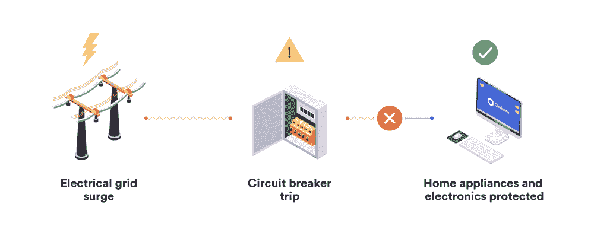

# 链式网络中的断路器和客户多样性

> 原文：<https://blog.chain.link/circuit-breakers-and-client-diversity-within-the-chainlink-network/>

[Chainlink Price Feeds](https://data.chain.link/) 是专门为 DeFi 应用提供最大价格 oracle 安全性、可靠性和 [数据质量](https://blog.chain.link/the-importance-of-data-quality-for-defi/) 而构建的。这些特性是通过关注几个关键的设计特征而产生的:

*   oracle 节点和数据源级别的分散化可防止任何单点故障
*   选择安全的节点运营商和优质数据源，确保每个组件高度可靠
*   通过用户可以独立监控的链上性能指标实现可证明的安全性
*   加密经济激励，以确保价格反馈更新发生，即使在极端区块链网络拥塞和意想不到的硬分叉。

这些强有力的保证导致了 Chainlink Price Feeds 的广泛采用，这种方式现在可以确保用户资金在 [DeFi](https://chain.link/education/defi) 范围内达到数十亿美元。随着 Chainlink 所保护的价值的增长，我们将继续探索开发人员可以进一步保护其智能合同的其他方式。虽然 Chainlink 价格馈送旨在即使在最近的闪贷攻击中也能保证可靠性，但在断路器和 Chainlink 客户端多样性的形式中还有额外的冗余层，这为 Chainlink 价格馈送带来了超高的可靠性，即使在意外的黑天鹅事件中也能保护用户的资金。

## **chain link 价格馈送中的多层冗余**

为了确保最高水平的可靠性和防篡改性，Chainlink Price Feeds 具有三层聚合功能[以过滤掉异常数据并防范黑天鹅事件。](https://blog.chain.link/levels-of-data-aggregation-in-chainlink-price-feeds/)

首先，Chainlink Price 从专业数据聚合器(如 BraveNewCoin)获取源数据，这些聚合器从所有交易环境(链外和链内交易所)获取市场数据，以创建一个单一的、经交易量调整的全市场平均价格。第二，每个 Chainlink oracle 节点从多个数据聚合器提取数据并取中间值，确保每个节点的单独响应不受 API 停机时间的影响，而不仅仅反映单一数据源。第三，智能合约消耗的最终价格代表来自众多独立的、经过安全审查的节点运营商响应的中间值，防止任何单个节点成为故障点。

这些多层聚合已经提供了极高的可靠性。然而，Chainlink 网络还支持两个额外的冗余层，以进一步确保智能合约接收一致的高质量数据流。这包括:

*   **历史断路器**–用于比较最新价格反馈更新的额外价格点，如果两者之间的差异超过预定义的百分比阈值，则会出现一个标记。这种可选的附加安全层提供了一种支持，以防止合同消耗潜在的异常数据，并且可以基于最后一次 Chainlink 价格馈送更新(历史)或单独的用户操作的价格馈送。
*   **客户端的多样性**–Chainlink oracle networks 始终运行多个版本的 chain link Oracle 客户端软件，如果当前版本出现任何意外事件，可自动故障切换到先前的客户端版本。虽然以前没有发生过，但是客户端多样性可以防止节点软件中任何意外的错误。

通过构建多层冗余和可选的安全网， [Chainlink Network](https://chain.link/) 为用户提供了强有力的保证，他们的智能合约将始终以可靠的方式接收高质量和极其安全的数据。为了展示这些用于冗余的关键基础设施，我们将探讨好的和坏的断路器设计以及客户多样性的好处。

## **了解传统和链式断路器**

断路器是一种自动化设备，几乎存在于所有有人居住的建筑物中，用于保护电路免受电流大幅波动造成的损坏。其基本功能是检测和防止电网输出的巨大变化对连接到电路的任何电子设备产生不利影响。断路器每天都在保护您自己的家，但也用于保护关键任务设备，如数据仓库服务器、医院通风机、生命支持系统和其他对正常运行时间敏感的基础设施。本质上，断路器是危险电流到达电子设备之前的最后一道防线。

<figcaption id="caption-attachment-1213" class="wp-caption-text">A typical electrical circuit breaker in someone’s home</figcaption>

断路器的概念也可以在整个传统金融市场中看到，当价格大幅下跌时，它会触发交易的暂时停止。当价格在给定时间内变动超过规定的百分比时，断路器跳闸。例如，标准普尔 500 指数有一个熔断机制，当前一天的收盘价下跌 7%时，该机制会触发交易延迟 15 分钟。它的设计是为了防止恐慌性抛售、连锁平仓和对更广泛市场的非自然偏离。类似于你家中的断路器，这些金融市场断路器是抵御意外损害的最后一道防线。

### 历史链式断路器

历史链式链接断路器是链式链接价格馈送的可选冗余层，如果且当价格馈送的最新更新偏离前一轮或多个过去回合的聚合(例如，过去 5 次价格更新的平均值)的预定义阈值时，触发该断路器。如果检测到异常偏差，就会产生一个标志，触发 dApps 的特定于应用程序的逻辑，例如暂停交易或阻止新抵押贷款的开立。

除了概念简单，Chainlink 的历史断路器设计提供了一个易于集成和气体有效的冗余层。断路器中使用的阈值(例如 10%)是在每价格馈电的基础上定义的，提供了高度的灵活性。例如，与高波动性资产的价格馈送相比，稳定的货币/外汇价格馈送的历史断路器可能具有更严格的偏差，从而允许针对每个项目和用例进行定制调整。

### 用户操作的链式断路器

Chainlink 还可以支持创建自定义断路器，用户可以选择启动 Chainlink [oracle](https://chain.link/education/blockchain-oracles) 节点来创建用户操作的断路器网络，该网络可以与 Chainlink 现有的价格参考源一起使用。这允许项目通过独立运行负责保护协议免受任何黑天鹅事件的断路器，来保留对其智能合同所消费的数据的一些控制。

**请注意:Chainlink 断路器不是用于混合数据的多 oracle 解决方案，因为这会引入大量的******意外攻击媒介，尤其是在削弱 Chainlink Price Feeds 提供的固有高级安全性和数据质量的情况下。当你把醋和酒混在一起时，你不会得到更好的酒。**取而代之的是，Chainlink Price Feeds 作为主要的 oracle 解决方案，为应用程序提供覆盖整个市场的高质量综合价格数据，而可选的断路器只是在检测到较大偏差时发出一个信号并触发后续操作。**

 **### **注意:**避免使用基于 DEX 的断路器

虽然集成安全可靠的断路器可以在最坏的情况下起到保护作用，但设计不佳的断路器实际上会带来一些新的意外风险。特别是，使用基于分散交易所(DEX)的价格馈送作为熔断机制很容易导致在市场波动期间触发假阳性，而这正是最需要熔断机制的时候。

原因在于，使用基于 DEX 的断路器的应用程序将自己暴露于数据操纵攻击或陈旧的价格数据。如果熔断机制代表的是 DEX 现货价格，那么它就变得非常容易受到三明治攻击，在三明治攻击中，一笔大额交易会暂时扭曲 DEX 相对于更广泛市场的报告价格。最近，这种攻击手段通过使用[快速贷款](https://blog.chain.link/flash-loans-and-the-importance-of-tamper-proof-oracles/)越来越多地暴露出来，因此我们绝对不建议将 DEX 现货价格作为断路器。

如果断路器反映了 DEX 时间加权平均价格(TWAP ),用户可以抵抗三明治攻击，但直接代价是价格准确性。这是因为 TWAP 代表了一段时间内的平均价格，导致价格 oracle security 与价格准确性成反比。因此，在高波动情况下，TWAP 断路器通常会报告落后于大盘的陈旧价格，给用户资金带来严重风险。

例如，如果一个分散的货币市场在 50%的市场崩溃期间使用 TWAP 的断路器，TWAP 断路器很容易在很长一段时间内与更广泛的市场不同步。结果，断路器将产生误报，导致清算和/或用户存款被禁用。当 TWAP 熔断机制后来赶上市场价格，并允许清算再次发生时，这种清算将是无利可图的，因为与需要偿还的债务相比，抵押品的价值将下降太多。缺乏激励措施可能导致协议抵押不足，造成破产局面和用户资金的直接损失。

由于陈旧定价数据的风险，我们建议开发人员避免使用基于 TWAP 的断路器，而是使用历史或用户操作的 Chainlink 断路器，因为它们可以提供更准确的数据，并且可以在不牺牲准确性的情况下扩展安全性(通过添加更多 oracle 节点和数据源)。

## **chain link 软件客户端的多样性**

Chainlink oracle 节点运营商始终运行多个不同客户端版本的 [Chainlink Core](https://github.com/smartcontractkit/chainlink) 软件，进一步增强了 Chainlink 网络的超可靠性。这确保了如果一个版本出现故障，节点可以无缝地回退到具有完全不同的代码库的独立客户端，从而允许节点继续为智能合约获取和交付链上的外部数据。为价格参考数据馈送提供动力的 Chainlink 节点通过将[通量监视器](https://news.reputation.link/article/27)作为主 oracle 客户端运行，并将 RunLog 作为备份 oracle 客户端在后台运行，从而使用这种系统设计。

由于节点能够在 oracle 客户端之间独立切换，因此降低了单个错误导致 Chainlink 网络瘫痪的可能性。这种客户端多样性的方法通过额外的冗余来提高网络的活跃度，是由多个关键任务网络(如以太坊)部署的一种成熟且经过验证的策略，以太坊由多个客户端组成，包括 Geth 和 Open Ethereum(以前称为奇偶校验)。

随着 Chainlink 的链外报告功能的推出，节点运营商将拥有额外的第三个 oracle 软件客户端供其使用，从而提供更加多样化的客户端。虽然还没有出现过 Chainlink 节点需要切换到备份 oracle 客户端的情况，但 oracle 节点确实有这种能力，如果一个客户端实施遇到任何问题，它可以作为一个强大的原语来缓解任何类型的黑天鹅事件。

## **结论**

通过使用多层内置的价格反馈聚合以及断路器和客户多样性形式的若干精心构建的可选支持措施，Chainlink 网络提供了一种强大的纵深防御方法，可确保用户拥有市场上最安全可靠的 oracle 解决方案。这使用户能够获得围绕 oracle 安全性、可靠性和数据质量的 Chainlink 价格反馈的所有好处，同时还拥有减轻意外情况的工具，使 DeFi 能够充分受益于 Chainlink 的巨大且不断增长的网络效应。

### 今天就开始用 Chainlink 建造吧

如果您有兴趣为您的分散式应用集成高度可靠的 Chainlink oracle 网络，请点击此处联系我们[，我们将为您的集成过程提供帮助。](/cdn-cgi/l/email-protection#7910170d1c1e0b180d1016170a391a111810175715101712)

如果你是一个 DeFi 项目，并且想推出一个新的 Chainlink Price Feed 或整合现有的一个，请访问[开发者文档](https://docs.chain.link/)或[安排一个电话](https://chainlinkcommunity.typeform.com/to/XcgLVP)来更深入地讨论它。今天，您可以在 mainnet 和 testnets 上轻松集成一个或多个 chain link Oracle networks,为您的智能合同增加更多安全性和功能。**