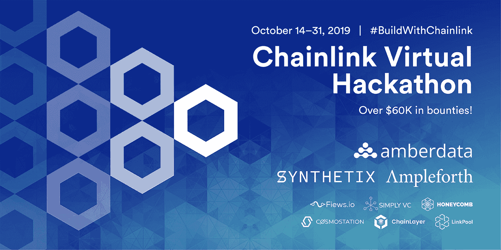
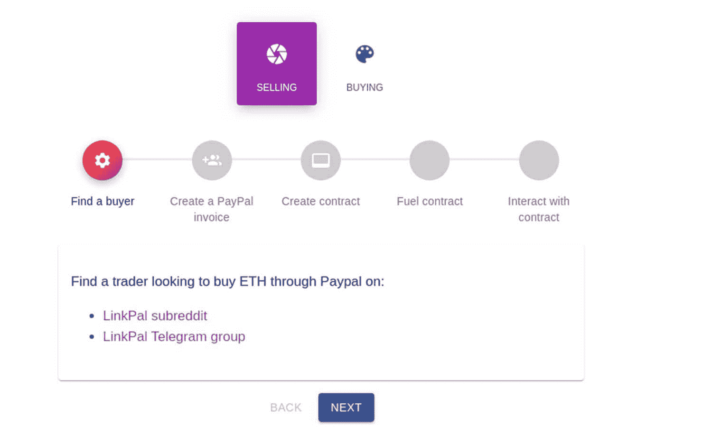
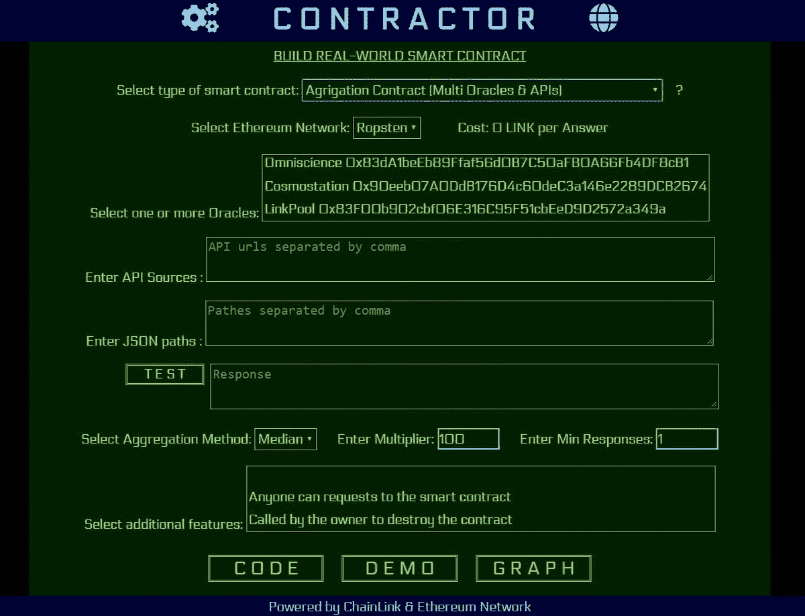
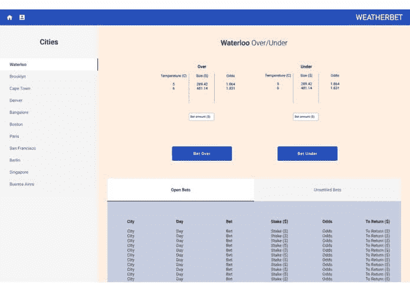

# 从最近的黑客马拉松中探索各种获奖的 Chainlink 应用

> 原文：<https://blog.chain.link/exploring-the-wide-variety-of-winning-chainlink-applications-from-recent-hackathons/>

这是 Chainlink 上繁忙的一个月，随着三个黑客马拉松的结束，得益于安全可靠的链外连接，获奖项目为分散化应用程序提供了大量新功能。我们不仅主办了第一届 [Chainlink 虚拟黑客马拉松](https://blog.chain.link/chainlink-virtual-hackaton-building-real-world-smart-contracts-using-off-chain-resources/)，还参加了 [ETHWaterloo 黑客马拉松](https://ethwaterloo.com/)和 [Kyber DeFi 虚拟黑客马拉松](https://kyber.devpost.com/)并获奖。我们对不同应用的范围和参与者使用互联[智能合同](https://chain.link/education/smart-contracts)所展示的真实世界商业价值的水平印象深刻。

## 链环虚拟黑客马拉松

今年 10 月，我们举办了有史以来第一次 Chainlink 虚拟黑客马拉松，以确定利用外部数据、事件和/或系统的最佳现实应用的项目。我们奖励了前三名的项目，以及六个评委选择奖和一个最具创新性的项目奖。除了我们伟大的导师团队，我们[还举办了几次开发者研讨会](https://www.youtube.com/playlist?list=PLVP9aGDn-X0TSJLU4B_FLHYYGqql26xy_)，并享受了与我们的智能合约开发者社区互动的机会，帮助他们使用 Chainlink 进行构建！

### 第一名

获得令人垂涎的第一名荣誉的是由维塔利·沃洛日诺夫创建的项目 [LinkPal](https://coinlist.co/build/chainlink/projects/21f894e2-84c1-4648-be69-727f3815ea80) 。LinkPal 是一个分散的托管应用程序，它使用智能合约来促进 ETH 和 PayPal 之间的点对点(P2P)交易，而没有交易对手风险或第三方交易所注册。为了确保交易是不可信的，卖家将他们的 ETH 锁定为智能合同中的抵押品，直到买家在 Paypal 上的付款发票得到确认后才会发布。一旦多个 Chainlink oracles 验证已经向卖方开具了智能合同中概述的正确金额和货币的支付发票，锁定的 ETH 将被释放，并通过先前提供的公钥发送给买方。LinkPal 是一个引人注目的真实世界用例的优秀例子，它涉及现有的基础设施，可以通过聚合多个 chain link[Oracle](https://chain.link/education/blockchain-oracles)的响应，以安全分散的方式解决。

<figcaption id="caption-attachment-940" class="wp-caption-text">最初的 LinkPal 仪表盘展示了完成交易的 5 个步骤</figcaption>

### 屈居第二

获得第二名的是来自 Cerebus 钱包公司的黑客米哈伊尔·拉扎雷夫。当用户提交以太坊交易时，Cerebus 钱包通过推送电话通知启用双因素授权，为用户提供了额外的安全保障。每次用户用他们的私钥签署交易时，他们的手机都会收到一个 2FA 代码，必须输入该代码才能完成交易。通过这种设计，用户可以防止恶意黑客访问他们的资金，即使他们的私钥被盗。Cerebus Wallet 使用 Chainlink oracles 验证在指定时间内使用[闹钟 API](https://docs.chain.link/docs/chainlink-alarm-clock) 输入了 2FA 代码，并访问 Cerebus 服务器以确认输入了正确的 2FA 代码。

<figcaption id="caption-attachment-941" class="wp-caption-text">使用 Cerebus 钱包进行交易的基本架构</figcaption>

### 第三名

第三名是开发者罗宾·托马斯提交的作品 [Flyt](https://coinlist.co/build/chainlink/projects/bde41cde-e584-4952-94df-4ebb01d1755b) 。Flyt 是一个分散的航班保险应用程序，它使用户能够以一种不可信和保密的方式获得航班保险单。Flyt 没有信任保险公司来设定公平的费率和结算索赔，而是使用智能合同和由 Chainlink oracles 检索的 web 数据(API)来计算保单保费(使用基于航班和机场评级的加权平均值)并在 24 小时内自动结算索赔(基于航班状态)。

### 最具创新的奖项

获得最具创新奖的是 [Total Return Swap](https://coinlist.co/build/chainlink/projects/3dce286d-79ea-4cf2-b5fc-369a01f899ae) ，这是一个来自 [Secure Data Links 的五人团队，是 Chainlink 生态系统](https://medium.com/secure-data-links/secure-data-links-as-a-chainlink-reviewed-oracle-5a9e4b7243a0)的官方节点运营商。虽然赌注功能尚未最终确定，目前也没有在 mainnet 上上线，[总回报掉期](https://medium.com/secure-data-links/hackathon-link-total-return-swap-24d7a33a105d)是一种 Dapp 设计，允许 Chainlink 节点运营商对冲在节点服务期间作为抵押品的 LINK token 的价格波动。希望降低价格波动风险的节点可以将该风险作为与链接令牌价值相关的合成资产出售给交易对手。节点收取合成令牌贷款的利息，而交易对手获得 LINK 的杠杆合成风险敞口。

### 法官选择奖

[**智能营销活动**](https://coinlist.co/build/chainlink/projects/6106f616-f9d8-4fec-85d7-c9f98bf8bd9e) 使用智能合同和甲骨文，根据 Chainlink 甲骨文关于网站独立访问者数量的证明，自动向营销机构付款。由于营销机构经常与他们的客户就营销活动的投资回报率发生争执，特别是由于难以获得关于其有效性的准确数据指标，智能营销活动通过让 Chainlink oracles 收集易于验证的数据指标(如新/唯一访问者)来解决这一问题，然后将其用作不可信营销服务协议的基础。

[**Steam Trader**](https://coinlist.co/build/chainlink/projects/0a3d71c8-f8e6-46c7-ae7a-a75911d65988) 使用 Chainlink oracles 和 Steam API 在 Steam 游戏平台上实现游戏内资产的安全、分散支付。Steam Trader 是一个有趣且相关的项目，展示了 Chainlink 的功能如何被任何人用来解决我们每天都经历的问题，例如在没有交易对手风险的情况下交易财产。

[**Contractor**](https://coinlist.co/build/chainlink/projects/4d7f84a3-8f93-4262-8281-5691257df35d) 是一个基于用户选择的功能创建完全编码的智能合同的应用程序。这些特性包括选择智能合约的类型、特定的 Oracle、Oracle 数量、API 连接、聚合方法和其他附加选项。Contractor 使非技术人员能够轻松部署智能合同，该合同包含他们成功所需的所有功能。

<figcaption id="caption-attachment-942" class="wp-caption-text">在以太网上创建智能合同的承包商用户界面</figcaption>

**Random World 是一个托管开源且可证明公平的赌博应用程序的平台，如正面或反面和掷骰子，这些应用程序是使用智能合约和随机数生成器构建的。通过整合 RandomWorld】的 [Chainlink 外部适配器，RandomWorld games 可以访问外部的、防篡改的随机性，以此作为赔率的基础，而不是依赖封闭源代码的内部赔率。](https://docs.chain.link/docs/randomorg-chainlink-ethereum-mainnet)**

 **[**菲亚特网关**](https://coinlist.co/build/chainlink/projects/6e5ee972-6e96-45d5-8156-e088ab965e11) 通过在后端使用智能合约进行托管，以及通过安全、分散的 Chainlink oracles 确认交易，使加密货币和法定货币之间的买卖变得更加容易。“做市商”向“接受者”(买方/卖方)提供法定和/或加密流动性，收取做市商费用，所有交易都依赖于确认 WePay 和 PayPal 等网络上各方之间成功法定支付的神谕。

[**反社交挑战**](https://coinlist.co/build/chainlink/projects/6a37ff52-65ed-4c9a-b7f4-a99e73277e8c) 通过一种身临其境的使用方法，激励用户离开社交媒体。为了参与，用户锁定智能合同中的抵押品，只有在他们离开社交媒体一段时间后才能恢复。如果他们产生任何社交媒体活动，这些活动由 Chainlink oracles 跟踪并报告给智能合同，他们就会失去抵押品，并平均分配给在整个挑战过程中抵制诱惑的参与者。

## ETH 滑铁卢

从 11 月 8 日到 10 日，我们参加了在加拿大举行的 ETHWaterloo 活动，开发者倡导者 Dan Forbes 主持了一个关于使用外链资源构建真实世界应用的 Chainlink 开发者研讨会。我们还参加了黑客马拉松，向拥有最佳 Chainlink 智能合同的参与者颁发了三个奖项。

### 第一名

由让·巴普蒂斯特·特拉佐尼、肯德里克·谭、斯内·库尔和马德胡尔·库马尔·夏尔马组成的四人团队赢得了最高荣誉。DeFi-dy 不是将投资者/交易投机局限于象征性的价格变动，而是允许用户对公司的表现进行投机。为了实现这一点，DeFi-dy 发布了基于特定协议的基础进行估价的合成资产。该协议的基本价值，在他们的演示中是[复合](https://compound.finance/)，是基于加权算法计算的，该算法考虑了诸如受欢迎程度、使用率、抵押率、借贷能力、供电能力等指标。Chainlink oracles 离线检索这些数据指标，并将其输入智能合同，以计算合成资产的价格。

[https://www.youtube.com/embed/q3ynkXgJ4Fg?feature=oembed](https://www.youtube.com/embed/q3ynkXgJ4Fg?feature=oembed)

### 屈居第二

由 Jeremías Díaz、Vijay Kandy、Victor Vicente 和 Bilal Alghazi 组成的四人小组 carbon iini 获得了第二名。以太坊这样的工作证明区块链拥有环境密集型共识算法，CarbonGuilt 为以太坊用户提供了抵消碳足迹的选项。carbon infini 使用 Chainlink oracles 从各种能源消耗和碳排放源收集数据，并在链上传递。一旦上线，智能合同将使用这些数据来计算碳消耗足迹，用户可以选择将其作为捐赠支付给值得信赖的组织，以减少世界的碳足迹。

### 第三名

由 Christina Chen、Christian Agnew 和 Jake Munsterberg 组成的三人团队 WeatherBet 赢得了第三名奖金。WeatherBet 允许用户使用 ETH 打赌未来某一天特定地点的天气情况。Chainlink oracles 用于从可信的 API 收集准确的天气数据，并将它们聚合在一起，以确定赌注的结果。

<figcaption id="caption-attachment-944" class="wp-caption-text">韦瑟贝特 UI</figcaption>

## Kyber DeFi 虚拟黑客技术

从 9 月 9 日到 10 月 28 日，我们作为技术合作伙伴参加了 Kyber DeFi 虚拟黑客马拉松，向利用 Chainlink 和 Kyber 的最佳工作 Dapp 颁发一个奖项。

### Chainlink x Kyber 奖

由帕瑞娜·阿南德、尼基尔·亚达夫、西达尔特·巴拉和穆赫辛·侯赛因组成的四人团队获得了 Chainlink 奖金。期权是金融体系的重要组成部分。它们使用户能够通过溢价购买期权合约来对冲资产的价格行为，这允许他们在未来以指定的价格购买特定的资产。EthOptions 是一个分散的期权交易平台，来自世界各地的用户可以在这里购买和出售期权合约，而不是限制复杂方的参与。Chainlink oracles 用于通过我们的 [CoinMarketCap 外部适配器](https://docs.chain.link/docs/coinmarketcap)将期权合同与可靠的市场价格联系起来。这些价格用于确定在合同规定的分配时间框架内行使期权时的支付。

## 不断扩张

我们很高兴能够通过连接到外链资源来实现如此多独特的智能合同设计。随着越来越多的数据提供商、节点运营商、项目集成和外部系统集成到 Chainlink 网络中，并可用于智能合约消费，这只是一切可能的开始。我们期待继续参与各种黑客马拉松，以此促进更多开发者的参与，并继续扩大 Chainlink 生态系统。**