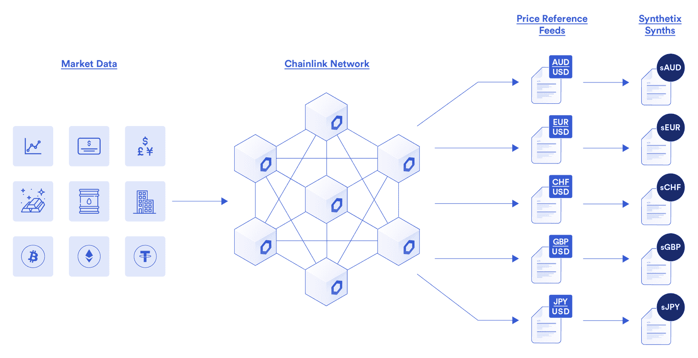
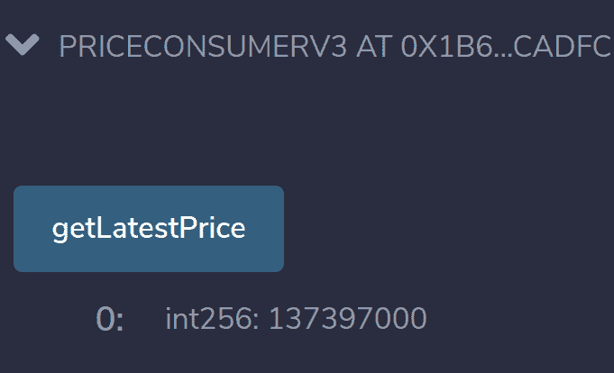

# 在 Solidity 智能合约中获取外汇汇率

> 原文：<https://blog.chain.link/fetch-foreign-exchange-rates-in-solidity-smart-contracts/>

价格数据是各种金融工具的核心，尤其是在分散金融(DeFi)应用中。在创造期权、期货和其他复杂衍生产品的 DeFi 领域，外汇(FX)汇率尤其令人感兴趣。除了获取[安全加密货币价格数据](https://blog.chain.link/fetch-current-crypto-price-data-solidity/)， [Chainlink 价格馈送](https://data.chain.link/)还可用于在您的智能合约中获取高质量的外汇价格数据。

在本技术教程中，我们将介绍如何在您的 Solidity 智能合约中使用 Chainlink FX 价格馈送。首先，让我们快速回顾一下什么是外汇馈送，以及使用它们可以创建什么类型的衍生品。

## 什么是外汇源？

外汇市场是一个全球货币交易市场，日交易量接近 7 万亿美元。这个市场决定每种货币的外汇汇率，包括以当前或确定的价格购买、出售和兑换货币的所有方面。由于外汇市场的高容量和受欢迎程度，许多 DeFi 应用程序使用 Chainlink FX 价格馈送来确保以安全和分散的方式将 FX 数据交付给其衍生品合约，而不会出现任何单点故障。

[Synthetix Exchange](https://synthetix.exchange/) 是一家 DeFi 衍生产品交易所，它使用 Chainlink oracles 提供的几种外汇汇率价格反馈，以确保根据其基础资产的真实市场价格进行防篡改和准确的估值，即使在波动性很高的时候也是如此。




<figcaption id="caption-attachment-1449" class="wp-caption-text">Synthetix Exchange 如何使用 Chainlink oracles 获取各种外汇货币的实时市场数据。</figcaption>


<figcaption>如何使用 Chainlink FX 价馈</figcaption>


Chainlink 价格馈送使用数百个高质量的数据源，并通过一个由[chain link](https://chain.link/)oracles 组成的分散式网络将它们聚合起来，这些 Oracle 将价格数据馈送到参考合同中，结果在聚合器智能合同中再次聚合，作为最新的可信答案。通过使用由分散的节点网络聚集的众多数据源，Chainlink oracles 确保价格数据具有最高质量，并且不会受到[攻击或价格 oracle 攻击](https://blog.chain.link/flash-loans-and-the-importance-of-tamper-proof-oracles/)。

### 创建智能合同

要尝试在您的智能合约中使用 Chainlink FX 价格馈送，首先[让 testnet ETH](https://gitter.im/kovan-testnet/faucet) 在您的智能合约中用作 gas。一旦您有了一些 ETH，开始构建使用 Chainlink FX 价格源的智能合约的最简单方法是部署[价格消费者合约](https://remix.ethereum.org/#version=soljson-v0.6.7+commit.b8d736ae.js&optimize=false&evmVersion=null&gist=0c5928a00094810d2ba01fd8d1083581)。这是一个基本的合同，用于启动链接价格源的请求。首先，我们需要导入 [AggregatorV3Interface](https://github.com/smartcontractkit/chainlink/blob/master/evm-contracts/src/v0.6/interfaces/AggregatorV3Interface.sol) 契约接口，该接口允许我们的智能契约引用 Kovan testnet 上的链上价格提要。然后在局部变量中创建它的一个实例。

```
import "https://github.com/smartcontractkit/chainlink/blob/master/evm-contracts/src/v0.6/interfaces/AggregatorV3Interface.sol";
```

```
AggregatorV3Interface internal priceFeed;
```

在[价格提要引用契约](https://docs.chain.link/docs/ethereum-addresses)的构造函数中，我们可以初始化我们感兴趣的价格提要的地址。通过浏览文档中的[以太坊价格馈送页面](https://docs.chain.link/docs/ethereum-addresses)，我们可以找到 Chainlink 目前提供的所有价格馈送合同地址。导航到页面的 Kovan 部分并选择外汇价格馈送。在这个例子中，我们将选择地址为[0x 28 b 0061 f 44 E6 a 9780224 aa 61 be c8 c 3 fcb 0d 37 de 9](https://kovan.etherscan.io/address/0x28b0061f44E6A9780224AA61BEc8C3Fcb0d37de9)的 [GBP/USD](https://data.chain.link/gbp-usd) 价格提要。

```
priceFeed = AggregatorV3Interface(0x28b0061f44E6A9780224AA61BEc8C3Fcb0d37de9);
```

定义了一个名为 getLatestPrice 的函数，用于从价格提要聚合器契约中获取最新价格，该契约在上面的构造函数中进行了实例化。为此，定义了一个新函数，它从聚合器契约中调用 [latestRoundData](https://docs.chain.link/docs/price-feeds-api-reference#latestrounddata) 函数。这个函数返回聚合器契约的当前状态，在本例中，我们获取当前价格并将其返回到消费函数中。

```
function getLatestPrice() public view returns (int) {
    (
        uint80 roundID,
        int price,
        uint startedAt,
        uint timeStamp,
        uint80 answeredInRound
    ) = priceFeed.latestRoundData();
    return price;
}
```

### 部署和测试智能合约

现在我们已经准备好部署和测试我们的契约了。在 Remix 中编译合同，然后在 deployment 选项卡上，将环境更改为“Injected Web3”，并确保下面的 wallet 地址是您的 MetaMask wallet 中包含一些之前获得的 ETH 的地址，按 deploy 按钮，然后按照步骤操作。最终结果是您将您的[智能合同](https://chain.link/education/smart-contracts)部署到了 Kovan testnet。您应该通过 Remix 控制台中的事务输出注意到部署的契约地址。

部署完成后，我们只需执行“getLatestPrice”函数。结果应该是该函数从英镑/美元聚合器合约返回最新价格，然后可以在我们的智能合约中使用该价格。请注意，我们不需要为请求发送任何链接，我们甚至也没有使用任何 ETH，因为该事务是对链上 GBP-USD 聚合器合同中数据的纯读取。




<figcaption id="caption-attachment-1450" class="wp-caption-text">英镑/美元价格馈送结果</figcaption>


## 摘要

Chainlink 价格馈送为将高质量的外汇价格数据纳入 Solidity smart 合约提供了一种可靠的方式。此外，Chainlink 的 oracle 框架提供了快速、轻松获取股票、加密货币、商品和许多其他资产类型数据的灵活性。

如果您是一名开发人员，并希望快速将您的应用程序连接到 Chainlink 价格参考数据，请访问[开发人员文档](https://docs.chain.link/)，并参加 [Discord](https://discordapp.com/invite/aSK4zew) 中的技术讨论。

### 关于这个话题的更多信息

*   [如何获取以太坊、比特币和其他加密货币的当前价格](https://blog.chain.link/fetch-current-crypto-price-data-solidity/)
*   [智能合同开发者使用 Chainlink 的主要方式](https://blog.chain.link/smart-contract-api-price-random/)
*   [测试 Chainlink 智能合约](https://blog.chain.link/testing-chainlink-smart-contracts/)