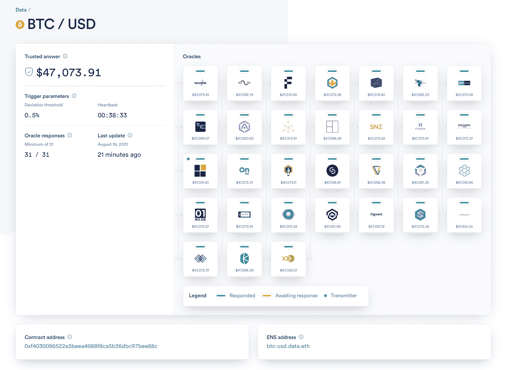
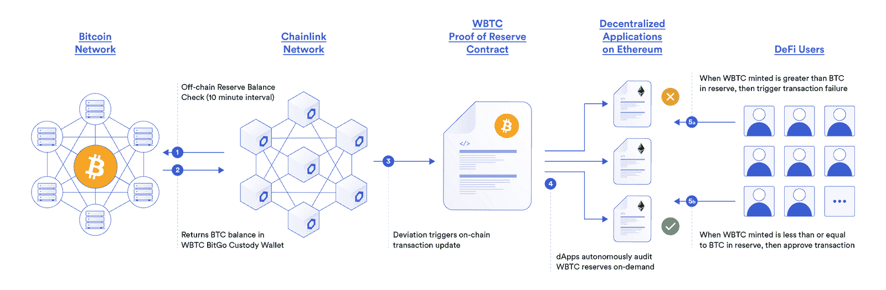
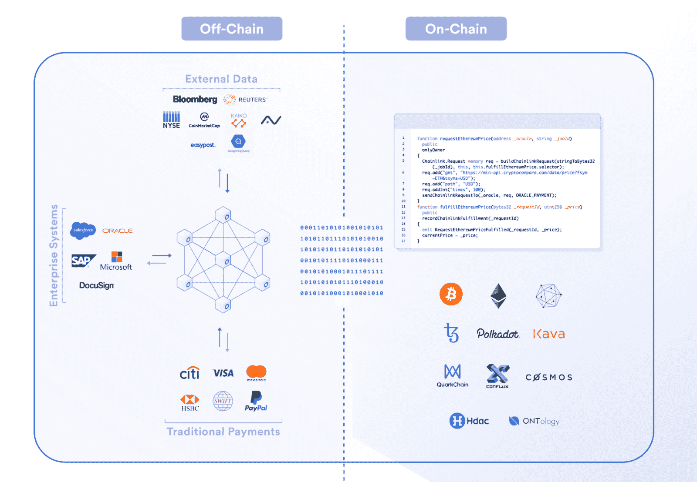
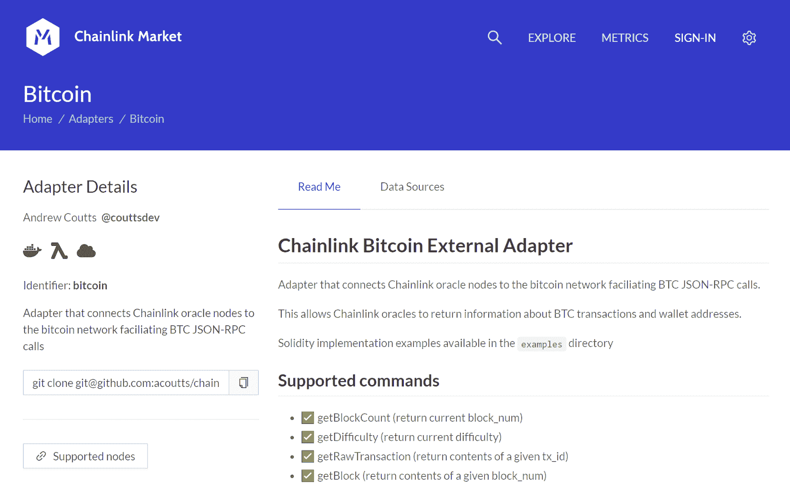

# 使用外部连接的智能合约增加比特币的使用

> 原文：<https://blog.chain.link/growing-bitcoin-adoption-with-externally-connected-smart-contracts/>

自十多年前由中本聪发布以来，比特币作为一种独立于央行发行的传统法定货币的新型去中心化货币资产，已经成为一种全球现象。Chainlink 长期以来一直支持比特币，认为它是一种更可靠的数字货币形式，自 2011 年以来，我们的许多创始人和核心团队成员都参与了比特币的研究和采用。Chainlink 启用使用比特币作为可靠抵押品的 [DeFi](https://chain.link/education/defi) 产品将极大地增加加密货币生态系统内外用户对比特币的需求。

Chainlink 旨在通过扩展其价值主张而不修改其区块链，直接补充比特币的功能，使比特币保持其独特的安全属性。**通过结合 Chainlink、比特币和/或比特币担保的[智能合约](https://chain.link/education/smart-contracts)，可以构建新的创新型分散式应用，利用比特币区块链提供的宝贵属性，特别是作为价值存储、交易媒介、抵押品形式和具有广泛哈希功能的分散式计算网络。**

Chainlink 网络为比特币生态系统提供的一些独特增值包括:

*   提供[链上价格反馈](https://feeds.chain.link/btc-usd)和关于 BTC 和比特币区块链的数据集，最终满足对基于比特币的金融产品(如衍生品和货币市场)日益增长的需求。
*   为智能合约提供关于当前 BTC 储备抵押的按需数据，支持包装比特币的 2B+美元，包括 [WBTC](https://blog.bitgo.com/chainlink-brings-onchain-proof-of-reserve-to-wbtc-fcda00f2815c) 和 [renBTC](https://medium.com/renproject/chainlink-brings-onchain-proof-of-reserve-to-renvm-d5e66839850a) ，作为保护用户免受部分储备做法影响的一种手段。
*   向受比特币保护的智能合约网络提供链外数据和各种其他甲骨文服务，包括 [RSK](https://www.rifos.org/blog/chainlink-integrated-as-part-of-the-rif-gateways-ecosystem-on-rsk) 和[栈](https://blog.blockstack.org/combining-stacks-2-0-and-chainlink-oracle-technology-brings-developers-new-smart-contract-possibilities/)，以便将比特币扩展为一个有条件的结算层。
*   允许任何区块链上的智能合约触发并[跟踪比特币区块链上的支付](https://market.link/adapters/9fc4c399-822d-4408-86eb-b7e566728b8c)，以此作为一种机制，在 BTC 实现从外部区块链网络触发的自动实物结算。

Chainlink 直接增强了以比特币为中心的应用程序的功能，并扩展了外部系统触发比特币区块链操作的能力。让我们更深入地探索比特币生态系统通过 Chainlink 可以获得的一些额外好处。

## 用 Chainlink Oracles 增强比特币生态系统

由于其全球认可、广泛分布和可证明的稀缺供应，比特币通常被视为法定货币的可靠替代品，因为它能够对冲通胀并提供对不相关资产类别的敞口。因此， [MicroStrategy](https://www.bloomberg.com/press-releases/2020-08-11/microstrategy-adopts-bitcoin-as-primary-treasury-reserve-asset) 等机构正将更大比例的美国国债配置为比特币，以对冲宏观经济因素。随着比特币继续被视为可靠的价值储存手段，在基于智能合约的分散金融(DeFi)经济中，将比特币作为一种抵押品或结算手段的需求也在不断增加。

作为一个不偏不倚、不受区块链限制的 oracle 网络，Chainlink 为不同系统之间的数据读写提供了安全的中间件。 **Chainlink 不是区块链，也不与比特币竞争，而是专注于提供为链上比特币金融产品提供价格反馈所需的中间件基础设施，提供关于比特币区块链的关键数据集，从外部网络触发比特币区块链上的交易，并支持基于比特币的智能合约平台及其 oracle 要求。**

### BTC 金融产品的比特币价格和数据供给

无论是分散协议还是集中交易所，越来越多的基于比特币的金融产品正在链上和链下构建，如期货、期权、合成资产、自动化交易策略等。所有这些应用都需要 BTC 价格反馈作为确定金融产品结果的手段。此外，对使用其他比特币数据集(如 BTC 优势、比特币总市值、当前哈希值等)的更奇特衍生产品的需求也在不断增加。

<figcaption>*The Chainlink [BTC/USD Price Feed](https://feeds.chain.link/btc-usd) is decentralized at the oracle and data source level to ensure no single point of failure, with real-time monitoring by anyone via its transparent visualizations as pictured above.*</figcaption>

Chainlink 通过在该领域提供最分散和最广泛使用的[BTC/美元价格馈送](https://feeds.chain.link/btc-usd)作为触发其执行或充当防篡改断路器的手段，促进了基于比特币的金融产品的增长。LTC 美元网络还可以与其他甲骨文网络结合使用，为 BTC 生成新的价格馈送，与其他加密货币(如 ETH 或 LTC)以及法定货币(如英镑或澳元)配对。

此外，Chainlink 越来越多地提供有关比特币区块链的额外数据集，以满足对更高级衍生产品的需求。支持如此广泛的链上和链下比特币金融产品，进一步提高了投资者调整和管理其比特币敞口的能力，最终推动了更多的需求和流动性。

### 包装比特币的储备数据馈送证明

Chainlink 为比特币提供额外价值的另一个值得注意的方式是通过其[储备证明](https://chain.link/solutions/proof-of-reserve)参考数据馈送——去中心化的 oracle 网络，该网络在以太坊网络上持续更新当前包装比特币的 2B 抵押。通过 Chainlink Proof of Reserve 数据馈送跟踪超过 90%的包装比特币，包括 [BitGo 的 WBTC](https://blog.bitgo.com/chainlink-brings-onchain-proof-of-reserve-to-wbtc-fcda00f2815c) 和 [Ren Protocol 的 renBTC](https://medium.com/renproject/chainlink-brings-onchain-proof-of-reserve-to-renvm-d5e66839850a) ，DeFi 应用程序能够按需自主审计这些令牌的储备，以保护用户免受任何潜在的部分储备活动或黑天鹅事件的影响。

<figcaption>The Chainlink WBTC Proof of Reserve Reference Feed</figcaption>

使用包装形式的比特币向 DeFi 应用程序提供额外的安全性和透明度保证，这两种方式都可以自动化，并且成本可以在应用程序之间分摊。这对于使用包装比特币作为抵押品的应用程序(如 Aave、Maker 和 Compound)尤为重要，这些应用程序需要确保平台上的所有贷款总是得到适当的超额抵押。储备证明不仅有利于 DeFi 生态系统，而且由于没有部分储备实践，与比特币作为健全货币的价值主张完全一致。由于信任水平的提高，这将进一步增加跨更多生态系统获取、令牌化和锁定比特币的需求。

### 受比特币保护的智能合约的外部数据

Chainlink 直接为比特币生态系统增加价值的另一种方式是，向在比特币区块链及其全球矿工网络保护的网络上运行的智能合约提供数据馈送和甲骨文服务。Chainlink 的外部数据传输扩展了这些网络上智能合约的功能，并允许需要安全可靠地访问离线数据、事件和支付的高级分散应用程序。在这方面，Chainlink 已经在为 RSK 和区块链的智能合约提供外部数据，这两个平台都由比特币保护。

<figcaption>Smart Contract applications consist of both on-chain and off-chain components</figcaption>

在比特币驱动的智能合约中利用 Chainlink oracles，可以创建先进的分散式应用程序，既获得比特币的安全性，又获得 Chainlink 的连接性。通过外部数据的交付，Chainlink 直接增加了比特币作为全球分散结算层的效用和价值。作为一个与区块链无关的 oracle 网络，Chainlink 将继续支持所有智能合约网络，包括那些直接由比特币区块链保护的网络。

### 从任何区块链触发和跟踪比特币交易

Chainlink 为比特币生态系统增加价值的一个值得注意的方式是，在任何区块链网络上提供智能合约的能力，以触发和/或跟踪比特币区块链的支付。这允许创建比特币原生应用，如去中心化的点对点市场、以比特币结算的透明衍生品等等。特别是，它创造了一个动态，Chainlink 能够在 BTC 从未离开其祖国区块链的情况下，将比特币带到所有区块链网络，极大地提高了比特币作为全球资产和金融结算手段的效用。

<figcaption>The [Chainlink Bitcoin External Adapter](https://market.link/adapters/9fc4c399-822d-4408-86eb-b7e566728b8c) listed on the Chainlink Market</figcaption>

Chainlink 节点能够通过在可信的执行环境(如 [Town Crier](https://blog.chain.link/town-crier-and-chainlink/) )中托管资金来直接触发比特币支付，在可信的执行环境中持有私钥，甚至节点运营商都无法解密它或看到被请求的计算(包括涉及的地址)。这也可能涉及大量 oracle 集合以形成多重签名事务，从而防止任何一个 Oracle 能够操纵或阻止事务发生。

智能合约对比特币支付的后续跟踪通过模块化的[外部适配器](https://market.link/adapters/9fc4c399-822d-4408-86eb-b7e566728b8c)成为可能，该适配器使任何和所有 Chainlink 节点能够验证并向任何其他网络提供关于比特币区块链当前状态的数据。这使得智能合约能够处理和验证跨链支付，并为广泛的比特币服务打开了大门。这也不仅仅是一个概念，因为自 2014 年以来，Chainlink Labs(原 SmartContract.com)一直代表区块链的智能合约在比特币区块链上触发支付。

## 结论

作为领先的不受区块链限制的 oracle 网络，Chainlink 为比特币和支持比特币的智能合约提供了额外的价值和功能。事实上，Chainlink 已经为比特币生态系统提供了大量的附加价值，如链上价格馈送、储备合同证明、比特币安全区块链的 oracle 服务、触发/跟踪比特币交易等。这不仅有利于比特币生态系统，而且从整体上推动了加密货币和智能合约的采用。

如果你是一名开发者，并且有兴趣使用 Chainlink 来提升你基于比特币的智能合约的功能，请联系我们[这里](https://chainlink.typeform.com/to/gEwrPO)。在比特币安全网络上使用 Chainlink 的文档可以在[这里](https://developers.rsk.co/rif/gateways/dataservices/chainlink/architecture/)找到。有关将您的智能合约连接到 mainnet 上的 BTC/美元价格馈送的更多信息，请参考我们的开发人员文档[此处](https://docs.chain.link/docs/using-chainlink-reference-contracts)。

[网站](https://chain.link/) | [推特](https://twitter.com/chainlink)|[|](https://www.reddit.com/r/Chainlink/)[不和](https://discordapp.com/invite/aSK4zew)|[Reddit](https://www.reddit.com/r/Chainlink/)|[YouTube](https://www.youtube.com/channel/UCnjkrlqaWEBSnKZQ71gdyFA)|[电报](https://t.me/chainlinkofficial) | [事件](https://blog.chain.link/tag/events/) | [GitHub](https://github.com/smartcontractkit/chainlink) | [价格供稿](https://feeds.chain.link/) | [DeFi](https://defi.chain.link/)