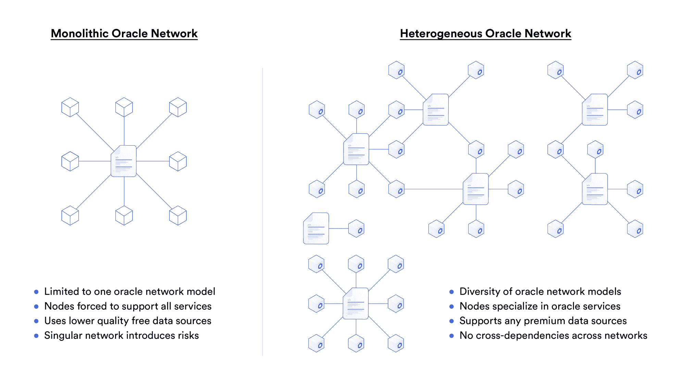
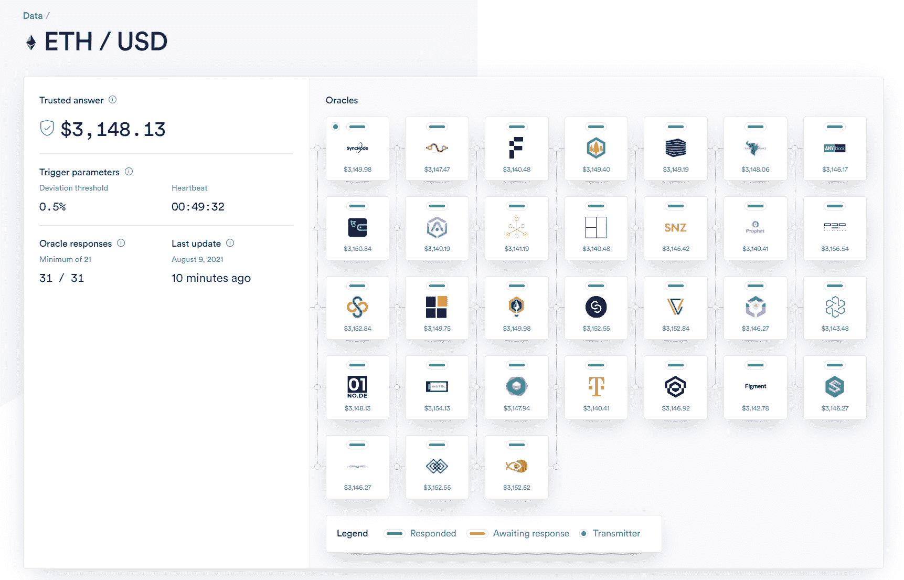

# Chainlink 如何支持任何离线数据资源和计算

> 原文：<https://blog.chain.link/how-chainlink-supports-any-off-chain-data-resource-and-computation/>

*关键要点:*

*   Chainlink 不是一个单一的 oracle 网络，而是一个用于构建无限数量的分散 oracle 网络的通用框架。
*   每个网络并行运行，没有交叉依赖，允许任何链外数据资源和计算连接到智能合同。
*   Chainlink 框架已被用于创建安全的 [oracle](https://chain.link/education/blockchain-oracles) 网络，为智能合约应用程序提供价格馈送、[储备证明](https://chain.link/proof-of-reserve)、可验证的随机性、选举结果等等。

## 介绍

在过去的几年里，[智能合约](https://chain.link/education/smart-contracts)生态系统不仅在锁定的价值总额(总计约 400 亿美元)方面快速增长，而且在用户可用的分散应用的多样性方面也快速增长。这种增长很大程度上可以直接归因于[去中心化甲骨文网络](https://blog.chain.link/what-is-the-blockchain-oracle-problem/)的采用，该网络将智能合同连接到区块链以外的外部数据资源。Oracles 为 [DeFi](https://chain.link/education/defi) 生态系统提供动力，支持新形式的链上抵押品，并从整体上显著扩展智能合约的功能。

然而，不同的智能合约用例需要访问不同的离线数据集和计算，这意味着单一的 oracle 网络设计无法提供高级智能合约应用程序所需的灵活性。合成资产协议可能需要实时价格反馈来铸造与黄金等大宗商品的市场价格挂钩的代币，预测市场可能需要来自官方来源的美国总统选举的最终结果来进行市场结算，而连锁游戏应用程序可能需要针对每一项下降的外部随机性的安全来源。

这些智能合同使用案例中的每一个都有非常不同的 oracle 需求。因此，智能合约生态系统需要一个面向基础架构的框架，允许开发人员连接并构建任何类型的 oracle 网络，并能够自定义节点组成、数据源、更新频率、交付方法、安全参数、聚合方法等。

**根据这种方法，Chainlink 网络为创建 oracle 网络提供了一个通用框架，可以满足智能合同应用程序所需的任何设计规范。**这是通过 Chainlink 的异构网络设计实现的，在该设计中，可以同时并行支持 oracle 网络参数的每种组合。在本文中，我们将探讨 Chainlink 框架的核心优势，开发人员如何定制自己的 oracle 网络，以及利用 Chainlink 高度灵活设计的 oracle 网络的真实示例。

## Chainlink 异构网络设计的优势

分散式网络通常遵循单一的方法，其中单个节点集合一起工作，按照一组预定义的规则提供特定的服务选择。区块链是这种整体设计的最突出的例子，其中网络中的所有节点执行一组标准化的操作，包括验证签名和散列块，以便对一组交易的有效性产生强有力的全球共识。每个区块链节点都执行相同的确定性操作来实现这一共识，主要区别在于操作的规模。

虽然这适用于区块链，但 oracle networks 的目标是就来自不确定性世界的数据达成共识，这通常涉及付费墙和外部数据资源的许可。单一模型不太适合 oracle networks，因为并非所有节点都可以随时访问用户所需的所有外部资源。强迫网络中的每个节点购买用户所需的每个优质数据源的订阅在经济上是不可扩展的。此外，许多数据集只对选定的少数实体可用，如企业的后端数据库。因此，采用整体设计的 oracle networks 通常会将 oracle 服务的选择限制在每个节点都可以执行的范围内，例如查询不提供质量或正常运行时间保证的免费开放 API。

为了避免单一模型的局限性，Chainlink 作为一个异构网络运行，该网络由许多独立的 oracle 网络组成，这些网络并行运行，没有交叉依赖性。一个 oracle 网络的功能不会影响任何其他网络的运行。每个网络都可以专门构建，以满足任何智能合约应用程序的精确外部数据和离线计算要求，为开发人员提供无限的灵活性。使用 Chainlink 框架启动 oracle 网络是没有权限的，这使得 oracle 网络设计中的创新可以并行进行，从而导致 Chainlink 网络作为一个整体的自然发展。

<figcaption id="caption-attachment-1615" class="wp-caption-text">Chainlink is a heterogeneous oracle network that allows for a wide range of flexible oracle designs</figcaption>

这种异构设计的一个主要优点是，Chainlink 节点操作者可以专注于他们提供的 oracle 服务。这是一种更经济的可扩展方法，因为节点只需获得它们参与的特定 oracle 网络所需的外部资源的访问权。例如，为价格反馈网络提供动力的 Chainlink 节点只需要访问金融市场数据，而不需要为体育比分、天气数据或其他外部数据集付费。这降低了进入运行 Chainlink 节点的门槛，进一步分散了整个网络。如果一个 Chainlink 节点希望同时支持许多不同的数据资源，它们也能够做到这一点。

能够访问企业后端、物联网传感器、fiat payment rails 等许可、认证系统的 Chainlink 节点可以立即开始向智能合约销售这种连接，因为它们不受其他 Chainlink 节点能力的限制。这种异构设计是 Chainlink 网络如何本地支持数据提供者操作的 Chainlink 节点，这些节点出售到其 API 的直接连接。

由于这种节点操作符的灵活性，Chainlink 能够将世界上所有的数据带上链，从而大大扩展了开发人员可以创建的智能合约应用程序的类别。

## 使用 Chainlink 框架定制 Oracle 网络

为了支持异构设计，使用 Chainlink 框架构建的 oracle 网络具有广泛的参数，可以对这些参数进行调整以支持特定的用例。一个 oracle 网络的参数不会影响任何其他网络，从而实现了最大的灵活性。这些可定制的参数包括:

*   **节点运营商:**任何选择的 Chainlink 节点都可以组合到一个 oracle 网络中，包括由专业 DevOps 团队、知名数据提供商、传统企业或任何其他实体运营的节点。
*   **数据源:** Chainlink 节点可以从任何选择和数量的数据源获取数据，包括免费开放 API、付费认证 API、许可数据库、硬件传感器和任何其他数据源。
*   **链外计算:** Chainlink 节点不仅提供数据交付能力，还可以执行信任最小化的链外计算，例如生成可验证的随机性、计算保险配额等等。
*   **底层区块链:** Chainlink 是区块链不可知的，支持广泛的链上环境，确保智能合约始终能够访问安全可靠的链外数据和计算来源。
*   **更新频率:** Oracle 网络更新可以基于任何计划进行，例如基于偏差(例如，每 0.1%的差异)、基于心跳(例如，每十分钟)、基于按需以及任何其他所需的计划。
*   **聚合方法:** Oracle networks 可以根据数据类型执行不同形式的聚合，例如采用中位数、平均值、众数或任何其他策略将多个数据点合并为一个数据点。
*   **安全参数:**服务协议可以允许用户形式化他们的安全需求，例如指定 oracles 存放的抵押品的数量、服务时间长度、正常运行时间要求等等。

除此之外，Chainlink oracle networks 还可以支持各种向智能合同链上交付数据的方式。一类智能合同应用程序(如保险智能合同)可能需要在发生特定的真实事件(如自然灾害)时将外部数据推送到 it 部门，而货币市场可能需要定期更新的链上市场数据源，它可以随时从这些数据源中*提取*来验证贷款的抵押情况。这些不同类型的 oracle 网络包括:

*   [**基本请求模型**](https://docs.chain.link/docs/architecture-request-model) **(推送):**通过在一个事务中生成数据请求并提交给 Chainlink oracles，然后在一个单独的事务中及时接收响应，使智能合约能够访问任何外部数据源(开放或经过身份验证的 API)。
*   **[分散数据模型](https://docs.chain.link/docs/architecture-decentralized-model)(拉):**以链上参考契约的形式提供共享数据资源，该契约由多个用户共同出资，并由独立且经过安全审查的 Chainlink 节点网络定期更新，允许智能契约在单个事务中请求和接收外部数据。

虽然基本请求模型非常适合不经常需要的独特数据集，但分散数据模型非常适合经常查询的常见数据集，例如广泛使用的[价格参考源](https://data.chain.link)。DeFi 协议可以随时从这些价格源中获取数据，从而获得安全、可靠、新鲜的金融市场数据来源。这种 oracle 网络模型意味着开发人员不需要构建自己的 oracle 网络，而是可以连接到由许多独立项目共同支持的现有 oracle 网络。

<figcaption id="caption-attachment-2241" class="wp-caption-text">The [ETH/USD Price Feed](https://data.chain.link/eth-usd) is one oracle network that provides DeFi contracts with the market-wide price of Ether</figcaption>

## 由 Chainlink 框架支持的不同 Oracle 网络

通过 Chainlink 高度灵活的 oracle 框架，创建了许多独立的 oracle 网络，为智能合约应用程序提供了对各种外部数据集和离线计算的访问。尽管智能合约应用程序可以使用 Chainlink 框架的方式数不胜数，但以下是一些已构建的不同 oracle 网络的示例:

*   **[价格参考源](https://data.chain.link) :** Chainlink 价格源提供 DeFi 应用，如 Aave 和 Synthetix，访问各种加密货币、稳定货币、外汇、商品、指数、股票等的市场价格。
*   **[准备金证明](https://blog.chain.link/chainlink-proof-of-reserve-bringing-transparency-to-defi-collateral/) :** 关于菲亚特支持的稳定资产和跨链资产的准备金审计在链上公布，因此 DeFi 应用程序可以防止不可预见的部分准备金活动，最大限度地减少用户的损失。
*   **[可验证的随机性](https://blog.chain.link/chainlink-vrf-on-chain-verifiable-randomness/) :** 诸如 PoolTogether 之类的链上游戏 dApps 利用链式 VRF 来访问可验证且防篡改的随机性源，该随机性源可用于确保可证明公平的用户体验。
*   **[自动化](https://chain.link/automation)** **:** 一种分散式交易自动化服务，使智能合约开发人员能够自动调用关键智能合约功能，如执行清算、重置令牌、结算限价单等。
*   **[天气数据](https://arbolmarket.medium.com/businesses-and-farmers-can-now-hedge-weather-risk-through-the-arbol-platform-and-chainlink-data-d6f36506146c) :** 为了向发展中国家的农民提供参数作物保险，Arbol 使用 Chainlink oracles 从 NOAA 获取天气数据，并在恶劣天气条件下立即结算提供资金的合同。
*   **[美国大选数据](https://everipedia.org/blog/everipedia-launches-chainlink-node-to-bring-us-election-results-onto-the-blockchain) :** 通过 Everpedia 运营的 Chainlink 节点，美联社签署的关于 2020 年美国总统大选结果的数据在链上发布，并用于结算链上预测市场。
*   **[数据提供商节点](https://blog.chain.link/easily-sell-your-apis-and-data-to-any-blockchain-via-chainlink/) :** 领先的数据提供商也在使用 Chainlink 框架向区块链多个网络的智能合同提供加密签名的数据集，提供数据来源的明确证据。

作为构建 oracle networks 的通用框架，Chainlink 使智能合约生态系统能够连接到执行所需的任何链外数据资源，从而成倍增加了可创建的分散式应用程序的类别。就像 20 世纪 90 年代初的互联网一样，在去中心化的 oracle 网络如何通过数据驱动的智能合同实现更加信任最小化的经济方面，还有许多机会有待探索。

如果您是一名开发人员，并希望将您的智能合约连接到底层区块链之外的现有数据和基础设施，请在此处联系我们或访问[开发人员文档](https://docs.chain.link)。

### 关于这个话题的更多信息

*   [什么是 Chainlink？](https://blog.chain.link/what-is-chainlink/)
*   [什么是链环节点操作符？](https://blog.chain.link/what-is-a-chainlink-node-operator/)
*   [77 个由 Chainlink 支持的智能合约用例](https://blog.chain.link/44-ways-to-enhance-your-smart-contract-with-chainlink/)